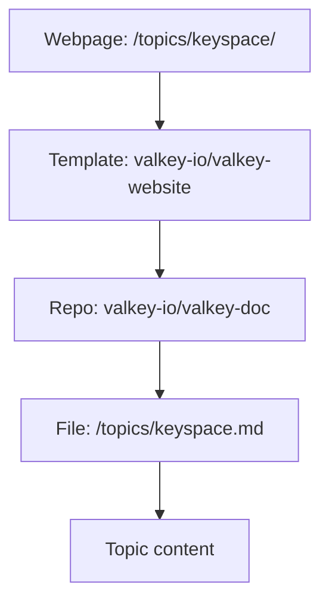
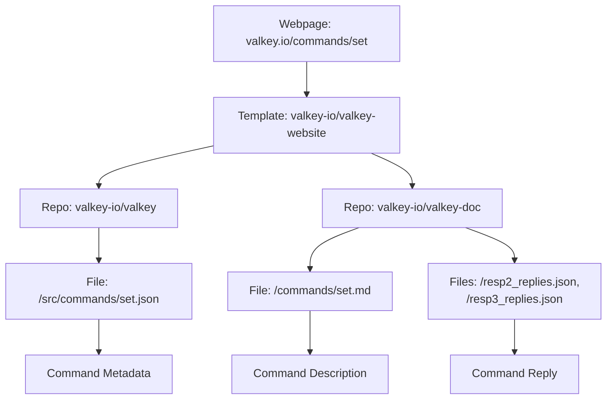

# Valkey.io website

This repo contains the source for the valkey.io website (build scripts, template, blog posts, stylesheets, etc.).
The build integrates content from [`valkey-io/valkey-doc`](https://github.com/valkey-io/valkey-doc) and the commands definitions from [`valkey-io/valkey`](https://github.com/valkey-io/valkey) and [`valkey-io/valkey-bloom`](https://github.com/valkey-io/valkey-bloom) (see [Build Locally](#build-locally) below for more details).

## Contributing

We welcome contributions! Please see our [CONTRIBUTING](CONTRIBUTING.md) page to learn more about how to contribute to the website.

## Security

If you discover potential security issues, see the reporting instructions on our [CONTRIBUTING](CONTRIBUTING.md#security-issue-notifications) page for more information.

## Build Locally

This site is built with [Zola](https://www.getzola.org/).

Follow these steps to build the site locally:

1. [Install Zola](https://www.getzola.org/documentation/getting-started/installation/).
2. Switch to the directory with your fork of this repo.
3. Run `zola serve`

Open your browser to `http://127.0.0.1:1111/`

Zola will automatically rebuild on changes to the template or any content stored in this repo.
Changes to external content (command reference, documentation topics) require a restart of the Zola server process (`ctrl-c` then `zola serve` again, a browser refresh may also be needed).

## Building additional content

**By default, the site will build without documentation topics, command reference, or the clients page.**
The content for documentation topics and the clients page are stored within the `valkey-io/valkey-doc` repo. 
The content for the command reference page is in the `valkey-io/valkey` repo.

If you want to build the site with this content, you'll need to have a local copy of `valkey-io/valkey-doc` and `valkey-io/valkey` _outside_ of this repo.
Then follow the instructions to [build the documentation topics and clients](#building-the-documentation-topics-and-clients-page) and/or [build the command reference](#building-the-command-reference).
The instructions show how to use scripts that create symbolic links to the `valkey-io/valkey-doc` and `valkey-io/valkey` repos as well as create a series of empty stub files that tell Zola to create pages.

### Building the documentation topics and clients page

Documentation 'topics' (i.e. `/topics/keyspace/`, `/topics/encryption/`, `/topics/transactions/`) and the client libraries' data (i.e. `/client-page-clients/nodejs/valkey-glide`, `/client-page-clients/python/valkey-py`) sources content from `valkey-io/valkey-doc`.



Let's say that this repo and your local copy of `valkey-io/valkey-doc` reside in the same directory.
First, stop the `zola serve` process if you're running it.
From the root directory of this repo run:

```shell
# You should only need to run this once or when you add a new topic/client.
./build/init-topics-and-clients.sh ../valkey-doc/topics ../valkey-doc/clients
```

Then, restart Zola.
Point your browser at `http://127.0.0.1:1111/topics/` and you should see the fully populated list of topics and clients.
All files created in this process are ignored by git.
Commit your changes to your local copy of `valkey-io/valkey-doc`.

### Building the command reference

The command reference (i.e. `/commands/set/`, `/commands/get/`, `/commands/lolwut/`) sources information from `valkey-io/valkey`, `valkey-io/valkey-bloom`, and `valkey-io/valkey-doc`.
`valkey-io/valkey` and `valkey-io/valkey-bloom` provides the command metadata (items like computational complexity, version history, arguments, etc) whilst `valkey-io/valkey-doc` provides the command description and the command reply.



Let's say that this repo and your local copy of `valkey-io/valkey-doc`, `valkey-io/valkey-bloom` and `valkey-io/valkey` reside in the same directories.
First, stop the `zola serve` process if you're running it.
From the root directory of this repo run:

```shell
# You should only need to run this once or when you add a new command.
./build/init-commands.sh ../valkey-doc/commands ../valkey/src/commands ../valkey-bloom/src/commands
```

Then, restart Zola.
Point your browser at `http://127.0.0.1:1111/commands/` and you should see the fully populated list of topics.
All files created in this process are ignored by git.
Commit your changes to your local copy of `valkey-io/valkey-doc` for description changes and `valkey-io/valkey` for command JSON changes (if you have any).

## License

This project is licensed under the BSD-3-Clause License.
