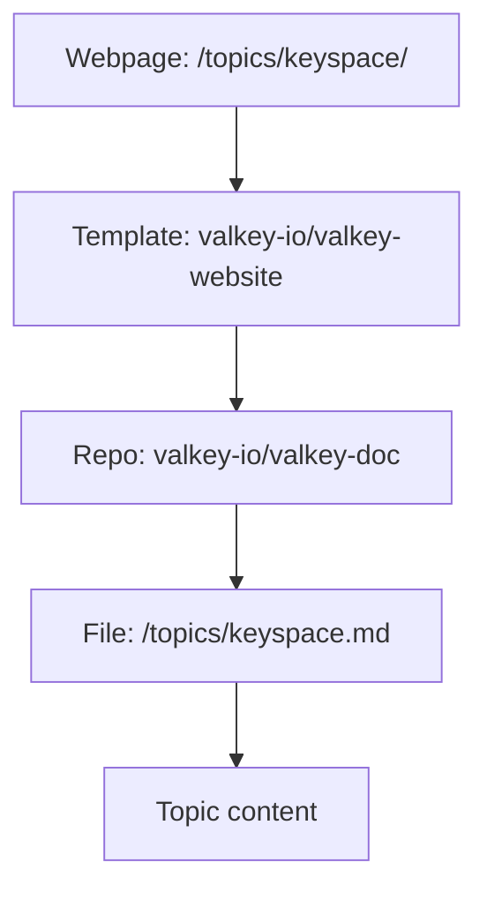
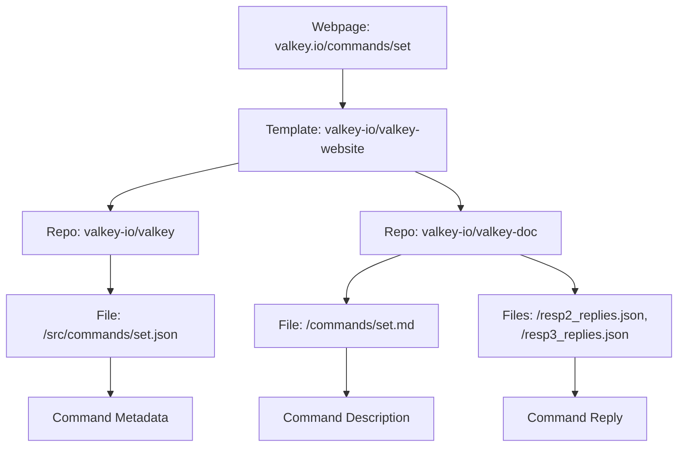

# Valkey.io website

This repo contains the source for the valkey.io website (build scripts, template, blog posts, stylesheets, etc.).
The build integrates content from [`valkey-io/valkey-doc`](https://github.com/valkey-io/valkey-doc) and the commands definitions from [`valkey-io/valkey`](https://github.com/valkey-io/valkey), [`valkey-io/valkey-bloom`](https://github.com/valkey-io/valkey-bloom), and [`valkey-io/valkey-json`](https://github.com/valkey-io/valkey-json) (see [Build Locally](#build-locally) below for more details)

## Contributing

We welcome contributions! Please see our [CONTRIBUTING](CONTRIBUTING.md) page to learn more about how to contribute to the website.

## Security

If you discover potential security issues, see the reporting instructions on our [CONTRIBUTING](CONTRIBUTING.md#security-issue-notifications) page for more information.

## Build Locally

This site is built with [Zola](https://www.getzola.org/).

Follow these steps to build the site locally:

1. [Install Zola](https://www.getzola.org/documentation/getting-started/installation/).
2. Switch to the directory with your fork of this repo.
3. Run `zola serve`

Open your browser to `http://127.0.0.1:1111/`

Zola will automatically rebuild on changes to the template or any content stored in this repo.
Changes to external content (command reference, documentation topics) require a restart of the Zola server process (`ctrl-c` then `zola serve` again, a browser refresh may also be needed).

## Building additional content

**By default, the site will build without documentation topics, command reference, or the clients page.**
The content for documentation topics and the clients page are stored within the `valkey-io/valkey-doc` repo.
The content for the command reference page is in the `valkey-io/valkey` repo.

If you want to build the site with this content, you'll need to have a local copy of `valkey-io/valkey-doc` and `valkey-io/valkey` _outside_ of this repo.
Then follow the instructions to [build the documentation topics and clients](#building-the-documentation-topics-and-clients-page) and/or [build the command reference](#building-the-command-reference).
The instructions show how to use scripts that create symbolic links to the `valkey-io/valkey-doc` and `valkey-io/valkey` repos as well as create a series of empty stub files that tell Zola to create pages.

### Building the documentation topics and clients page

Documentation 'topics' (i.e. `/topics/keyspace/`, `/topics/encryption/`, `/topics/transactions/`) and the client libraries' data (i.e. `/client-page-clients/nodejs/valkey-glide`, `/client-page-clients/python/valkey-py`) sources content from `valkey-io/valkey-doc`.


```mermaid
flowchart TD
    A[Webpage: /topics/keyspace/ ]
    A --> B[Template: valkey-io/valkey-website]
    B --> H[Repo: valkey-io/valkey-doc ] --> I[File: /topics/keyspace.md ] --> Y[Topic content]
```

Let's say that this repo and your local copy of `valkey-io/valkey-doc` reside in the same directory.
First, stop the `zola serve` process if you're running it.
From the root directory of this repo run:

```shell
# You should only need to run this once or when you add a new topic/client.
./build/init-topics-and-clients.sh ../valkey-doc/topics ../valkey-doc/clients
```

Then, restart Zola.
Point your browser at `http://127.0.0.1:1111/topics/` and you should see the fully populated list of topics and clients.
All files created in this process are ignored by git.
Commit your changes to your local copy of `valkey-io/valkey-doc`.

### Building the command reference

The command reference (i.e. `/commands/set/`, `/commands/get/`, `/commands/lolwut/`) sources information from `valkey-io/valkey`, `valkey-io/valkey-bloom`, and `valkey-io/valkey-doc`.
`valkey-io/valkey`, `valkey-io/valkey-bloom`, `valkey-io/valkey-json` and `valkey-io/valkey-search` provides the command metadata (items like computational complexity, version history, arguments, etc)
whilst `valkey-io/valkey-doc` provides the command description and the command reply.


```mermaid
flowchart TD
    A[Webpage: valkey.io/commands/set]
    A --> B[Template: valkey-io/valkey-website]
    B --> F[Repo: valkey-io/valkey ] --> G[File: /src/commands/set.json ] --> X[Command Metadata]
    B --> H[Repo: valkey-io/valkey-doc ] --> I[File: /commands/set.md ] --> Y[Command Description]
    H --> J[Files: /resp2_replies.json,<br/>/resp3_replies.json] --> Z[Command Reply]
```

Let's say that this repo and your local copy of `valkey-io/valkey-doc`, `valkey-io/valkey-bloom`, `valkey-io/valkey-json`, `valkey-io/valkey-search`
and `valkey-io/valkey` reside in the same directories.

First, stop the `zola serve` process if you're running it.
From the root directory of this repo run:

```shell
# You should only need to run this once or when you add a new command.
./build/init-commands.sh ../valkey-doc/commands ../valkey/src/commands \
    ../valkey-bloom/src/commands ../valkey-json/src/commands ../valkey-search/src/commands
```

Then, restart Zola.
Point your browser at `http://127.0.0.1:1111/commands/` and you should see the fully populated list of topics.
All files created in this process are ignored by git.
Commit your changes to your local copy of `valkey-io/valkey-doc` for description changes and `valkey-io/valkey` for command JSON changes (if you have any).

## Search

Site search is powered by [fuse.js](https://www.fusejs.io/) running entirely in the browser against a prebuilt index (`search-index.json`).

The index is not Zola's native search index. Most of this site's documentation (topics, the command reference, and the clients page) is injected at template-render time from the sibling repos described above, so it never appears in the Markdown page body that Zola's `build_search_index` reads. Instead, `build/build-search-index.mjs` walks the rendered HTML in `public/` after a build and extracts the visible page content, capturing everything the site actually renders.

Long pages are indexed as one record per top-level (`h2`) section rather than a single whole-page record, so deep content stays searchable and a result can link straight to the matching section via its heading anchor. Content before the first `h2`, and pages with no `h2`, produce a single page-level record. All records for one page share the same `title` (the page title); the section heading is stored separately and weighted well below the title, so splitting a page into sections does not let a thin section out-rank, or dilute, a page-name match. Because a long page contributes several records that share a base url, the client (`static/assets/js/search.js`) also caps how many sections from the same page appear in the results list.

### Testing search locally

Search does not work under `zola serve`. The dev server builds the site into memory and does not run the post-build indexer, so `search-index.json` is never generated or served and every query returns nothing. This is expected: `zola serve` is fine for editing content with live reload, but it cannot serve search.

To test search, build the site to disk (which also generates the index) and serve the `public/` directory with any static file server. The indexer needs [Node.js](https://nodejs.org/) (18 or newer); install dependencies once with `npm install`, then:

```shell
npm run build                        # zola build + generate search-index.json in public/
python3 -m http.server -d public 8080   # or any static server for public/
```

Open `http://localhost:8080/` and search will work. Any static server works; the only requirement is that it serves the `public/` directory produced by `npm run build`, including `search-index.json`.

The generated `public/search-index.json` is ignored by git; it is always produced fresh at build time. Because both `zola build` and `zola serve` wipe `public/`, re-run `npm run build` after any rebuild to refresh the index. To regenerate only the index against a `public/` that already exists on disk (for example after a plain `zola build`), run `npm run build:search-index`.

To search topics, the command reference, and the clients page locally, first follow [Building additional content](#building-additional-content) so those pages exist to be indexed. Otherwise only the blog, author, download, event, and static pages are searchable.

### Previewing complete results without the sibling repos

If you don't have the sibling repos checked out, you can build an index from a running site (production or a local `zola serve`) via its sitemap:

```shell
node build/build-search-index.mjs --crawl https://valkey.io
```

This is a local convenience for previewing complete results and is not used by the deploy pipeline.

### Automation

The deploy workflow (`.github/workflows/zola-deploy.yml`) regenerates the index on every deploy, after `zola build` and before the site is published, so it always reflects the commit being deployed.

## License

This project is licensed under the BSD-3-Clause License.
