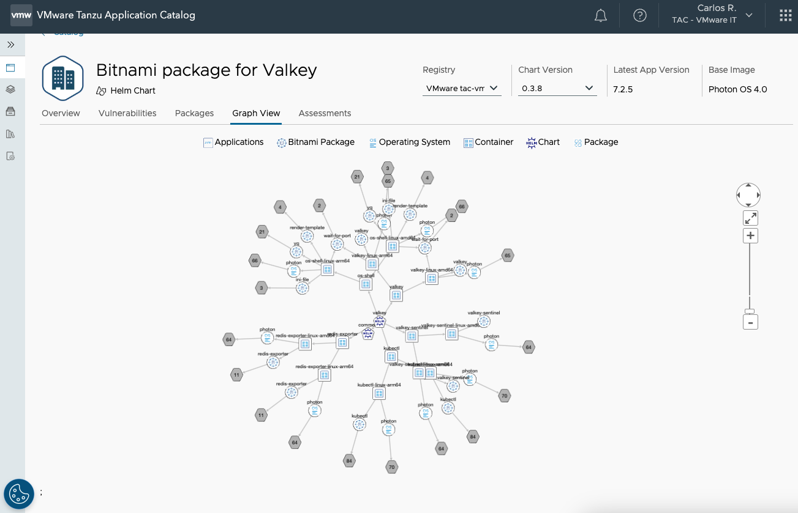
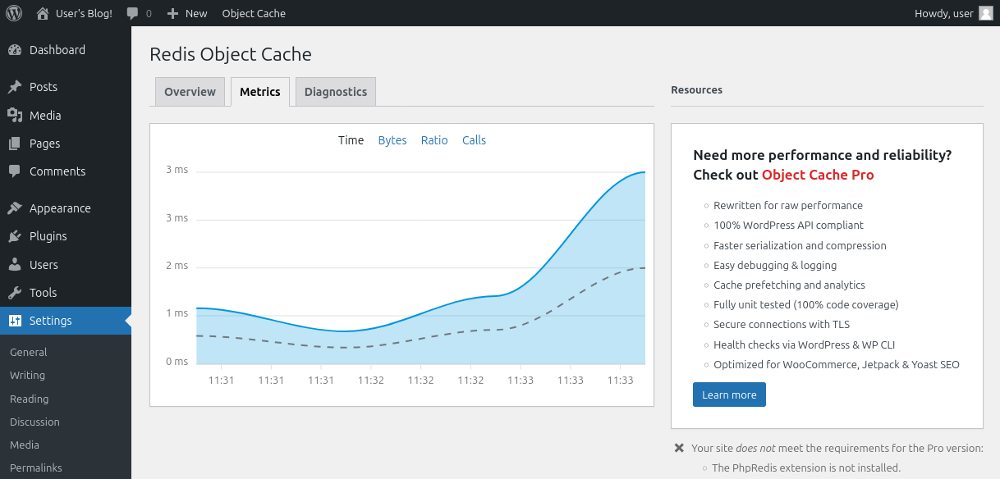

+++
title="Using Bitnami's Valkey chart"
date=2024-07-09 01:01:01
description="An introductory example using Bitnami's Valkey chart"
aliases= [
    "/blog/2024/06/using-bitnami-valkey-chart/"
]
authors=["rafariossaa"]
+++

Valkey is a high-performance key/value datastore that supports workloads such as caching, and message queues, supporting many data types including strings, numbers, hashes, bitmaps, and more. Valkey can run in standalone or cluster mode for replication and high availability.

[Bitnami](https://bitnami.com/) offers a number of secure, up-to-date, and easy to deploy charts for a number of popular open source applications.

This blog will serve as a walk-through on how you can deploy and use the [Bitnami Helm chart for Valkey](https://github.com/bitnami/charts/tree/main/bitnami/valkey).

# Assumptions and prerequisites

Before starting the deployment, make sure that you have the following prerequisites:
- An operational Kubernetes cluster.
- An installed and configured kubectl CLI and Helm v3.x package manager. If you need help with these steps, check our article “[Learn how to install kubectl and Helm v3.x.](https://docs.bitnami.com/kubernetes/get-started-kubernetes#step-3-install-kubectl-command-line)”
- Optional: Access to [VMware Tanzu Application Catalog](https://app-catalog.vmware.com/catalog).

# Deploying the Bitnami package for the Valkey Helm chart

The sections below describe the steps to configure the deployment, get and deploy the Bitnami-package Valkey Helm chart, and obtain its external IP address to access the service.

## Getting and deploying the Bitnami package for Valkey Helm chart

You can deploy the [community](https://github.com/bitnami/charts/blob/main/LICENSE.md) Bitnami-packaged Valkey Helm chart from the open source Bitnami Application Catalog. Alternatively, if you have access to an enterprise Tanzu Application Catalog instance, it can also be deployed from there.

### Deploying the open source version of the chart through Bitnami Application Catalog

To deploy the chart in its namespace, run the following commands:

```bash
$ kubectl create namespace valkey
$ helm install myvalkey oci://registry-1.docker.io/bitnamicharts/valkey --set auth.enabled=true --set auth.password=test_pwd --namespace valkey
```

### Deploying the enterprise version of the chart through Tanzu Application Catalog

The following steps describe navigating the Tanzu Application Catalog and getting the instructions to deploy Valkey in your cluster. This example shows a Valkey chart built using Ubuntu 22 as the base OS image, but feel free to customize the chart depending on your needs.

1. Navigate to [app-catalog.vmware.com](https://app-catalog.vmware.com) and sign in to your catalog with your VMware account.

3. In the My Applications section, search for Valkey and request it for your catalog. It is supported by Photon, Ubuntu, RHEL UBI, and Debian Linux distributions. On the next screen, you will find the instructions for deploying the chart on your cluster. Make sure that your cluster is up and running.
4. Execute **kubectl cluster-info**, then run the commands you will find in the Consume your Helm chart section.




After this, the steps for deploying the chart will be the same as the ones described in the following sections to deploy its community version.

## Obtaining the external IP address and logging into Valkey

Wait for the deployment to complete and check that all *myvalkey* pods are Running.

```bash
$ kubectl get pods,svc -n valkey
NAME                      READY   STATUS    RESTARTS   AGE
pod/myvalkey-master-0     1/1     Running   0          4m41s
pod/myvalkey-replicas-0   1/1     Running   0          4m41s
pod/myvalkey-replicas-1   1/1     Running   0          3m59s
pod/myvalkey-replicas-2   1/1     Running   0          3m32s

NAME                        TYPE        CLUSTER-IP      EXTERNAL-IP   PORT(S)    AGE
service/myvalkey-headless   ClusterIP   None            <none>        6379/TCP   4m41s
service/myvalkey-master     ClusterIP   10.110.225.33   <none>        6379/TCP   4m41s
service/myvalkey-replicas   ClusterIP   10.98.176.69    <none>        6379/TCP   4m41s
```

## Connecting using Valkey’s CLI client

To connect to the server, you can deploy a client pod.

```bash
$ export VALKEY_PASSWORD=test_pwd
$ kubectl run --namespace valkey valkey-client --restart='Never'  --env VALKEY_PASSWORD=$VALKEY_PASSWORD  --image docker.io/bitnami/valkey:7.2.5-debian-12-r5 --command -- sleep infinity
```

You are now ready to attach to the pod and interact with the server using the CLI client.

```bash
$ kubectl exec --tty -i valkey-client --namespace valkey -- bash
$ REDISCLI_AUTH="$VALKEY_PASSWORD" valkey-cli -h myvalkey-master
myvalkey-master:6379> set test_key "test_value"
OK
myvalkey-master:6379> get test_key
"test_value"
```

## Using a Python environment

The next example explains how to connect to Valkey using a Python script. To run the script, first, it is needed to provide a Python environment and install Python’s Redis package.

```bash
$ kubectl run -it  python-redis --image=bitnami/python -- bash
root@python-redis:/app# pip install redis
Collecting redis
Downloading redis-5.0.6-py3-none-any.whl.metadata (9.3 kB)
Downloading redis-5.0.6-py3-none-any.whl (252 kB)
  ━━━━━━━━━━━━━━━━━━━━━━━━━━━━━━━━━━━━━━━━ 252.0/252.0 kB 942.1 kB/s eta 0:00:00
Installing collected packages: redis
Successfully installed redis-5.0.6
```

You are now ready to run the script.

```bash
root@python-redis:/app# python
Python 3.12.4 (main, Jun  7 2024, 04:30:17) [GCC 12.2.0] on linux
Type "help", "copyright", "credits" or "license" for more information.
>>> import redis
>>> creds_provider = redis.UsernamePasswordCredentialProvider("", "test_pwd")
>>> user_connection = redis.Redis(host="myvalkey-master.valkey", port=6379, credential_provider=creds_provider)
>>>
>>> user_connection.ping()
True
>>>
>>> user_connection.set('foo_key', 'bar')
True
>>>
>>> user_connection.get('foo_key')
b'bar'
>>>
>>> user_connection.hset('user-session:123', mapping={
...     'name': 'John',
...     "surname": 'Smith',
...     "company": 'Redis',
...     "age": 29
... })
4
>>>
>>> user_connection.hgetall('user-session:123')
{b'name': b'John', b'surname': b'Smith', b'company': b'Redis', b'age': b'29'}
```

## Using Valkey as a cache for WordPress

Valkey can also work as an object cache for a WordPress deployment. The following steps will show you how to set up this scenario.

First, it is needed to create the configuration for the WordPress deployment, in this case, Valkey’s parameters and the user credential for the site administrator are set.

```bash
$ cat > settings.yaml <<EOF
wordpressPassword: "wp_pwd"
wordpressExtraConfigContent: |
  define( 'WP_REDIS_HOST', 'myvalkey-master.valkey' );
  define( 'WP_REDIS_PORT', 6379 );
  define( 'WP_REDIS_PASSWORD', 'test_pwd' );
  define( 'WP_REDIS_PREFIX', 'wp_redis' );
EOF
```

Once you have the settings parameters, it is time to deploy WordPress in its namespace

```bash
$ kubectl create namespace wordpress
$ helm install mywp bitnami/wordpress -f settings.yaml --namespace wordpress
```

Wait for the deployment to complete and check that the service has been assigned an external IP

```bash
$ kubectl get svc --namespace wordpress
NAME                   TYPE         CLUSTER-IP     EXTERNAL-IP  PORT(S)         AGE
service/mywp-mariadb   ClusterIP    10.106.11.191  <none>       3306/TCP                    74s
service/mywp-wordpress LoadBalancer 10.100.136.181 192.168.49.50   80:31116/TCP,443:31119/TCP   74s
```

Using the external IP, browse to the admin page and log in using the previously set credentials.

You will be able to see the WordPress administrator UI where you can search for `Redis Object Cache` plugin, and then install and activate it. After enabling it, wait for some metrics to appear:



This is only a drop in the bucket of what can be done with Valkey. Thereafter you could easily integrate Valkey into your projects.

# Support and resources

The Bitnami package for Valkey is available in both the community version, through the [Bitnami GitHub repository](https://github.com/bitnami/charts/tree/main/bitnami/valkey/#installing-the-chart), as well as the enterprise version, [Tanzu Application Catalog](https://app-catalog.vmware.com/catalog/f1242d16-218e-4773-8856-adcb2b2006e9/branch/1542f88a-71c4-42ed-b79c-89bd2063ac9a). Learn more about the differences between these two catalogs in this [blog post](https://tanzu.vmware.com/content/blog/open-source-vs-enterprise-edition-of-vmware-bitnami-application-catalog).

To solve the problems you may have with the Bitnami community packages—including deployment support, operational support, and bug fixes—please open an issue in the Bitnami [Helm charts](https://github.com/bitnami/charts) or [containers](https://github.com/bitnami/containers) GitHub repositories. Also, if you want to contribute to the catalog, feel free to send us a [pull request](https://github.com/bitnami/containers/pulls), and the team will check it and guide you in the process for a successful merge.

If you are interested in learning more about the Tanzu Application Catalog in general, check out the [product webpage](https://tanzu.vmware.com/application-catalog).
