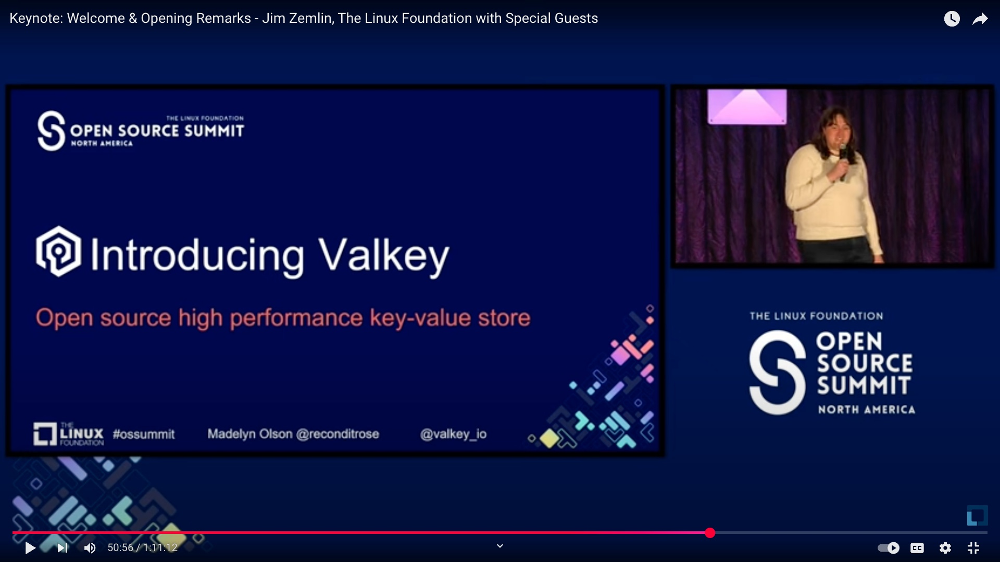
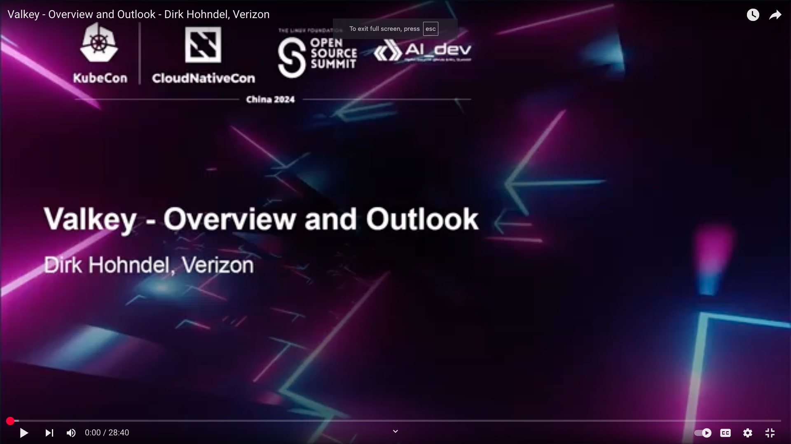

+++
title=  "2024: The Year of Valkey"
description = "The end of the calendar year is a great time to reflect, but for Valkey this particular year-end holds special meaning."
date= 2024-12-20 01:01:01
authors= ["kyledvs"]
+++

The end of the calendar year is a great time to reflect, but for Valkey this particular year-end holds special meaning.
Think about it: this time in 2023, no one had ever heard the name “Valkey” because, well, it didn’t exist.
This seems nearly unbelievable given how much has changed in only a few short months.

Now, at the end of 2024, Valkey has had both a minor and major release as well as a few patches.
Valkey 7.2 primarily introduced the project and new name while carrying over the feature set and performance from before the fork.
Valkey 8.0 made substantial internal changes, bringing higher performance through multi-threaded I/O, better memory efficiency from a rewritten main dictionary, more granular visibility into performance and resource usage, and enhanced reliability in replication and slot migration.
In 2025, the project is looking toward a future with new functionality and a whole boatload of optimizations in both performance and efficiency.

## Beginnings

Getting started with Valkey has changed substantially over the course of the year.
When Valkey first launched at Open Source Summit North America, I recall excitedly telling people that you could build from source, get the binary from the website or even use a container.
Now, you can get Valkey directly from the [package manager in most Linux distributions](https://repology.org/project/valkey/versions) (and more on the way in 2025).
There are multiple options for containerization and operators to fit your needs.
And, for those who want to let *others* run Valkey, it is also available as a service on Aiven, AWS, Google Cloud Platform, NetApp Instaclustr, UpCloud, and several more.

The buzz around Valkey caused no shortage of coverage.
One theme that the initial Valkey coverage focused on was the speed that everything happened: only 8 days after the license change, the project had a release, was a Linux foundation project with supporters from a variety of companies around the industry:

> *An eight day timeline for a project of this size and scope is shocking.
An eight day timeline to announce a project of this scope that includes names like AWS, Google and Oracle of all vendors is an event without any obvious precedent.
Even setting the requisite legal approvals aside, naming and branding take time – as they did in this case, apparently.*

> [Stephen O’Grady](https://redmonk.com/sogrady/2024/07/16/post-valkey-world/)

Over the course of the year, the coverage shifted focus from establishment to velocity:

> *As per GitHub and as of this writing, it’s got roughly 10 times as many contributors and is hundreds of commits ahead of Redis.
It’s like Redis, but with more caffeine, a bigger dev team, and a community that’s suddenly not beholden to keeping requested features stuffed behind a paywall.*

> [Corey Quinn](https://www.lastweekinaws.com/blog/aws-valkey-play-when-a-fork-becomes-a-price-cut/)

## Stories

Beyond seeing this coverage, less than six months after the establishment of the project a report indicated that [63% of respondents were already familiar with Valkey](https://thenewstack.io/redis-users-want-a-change/), so it’s no surprise that there are countless folks already using it.
These specific stories being told in public are a valuable data point for the next wave of migrations.
At Open Source Summit Hong Kong in September, [Dirk Hohndel](https://www.facesofopensource.com/dirk-hohndel/) from Verizon talks about migrating his own app over to Valkey 8.0 release candidate and seeing a 3x performance increase.

On [Marcin Sodkiewicz](https://aws.amazon.com/developer/community/heroes/marcin-sodkiewicz/)’s blog he talks a [little bit about his journey moving to Valkey](https://sodkiewiczm.medium.com/elasticache-serverless-valkey-review-1e3329cfbfa0).
The post is a lot of math about the saving he’s achieving due to the service he’s using having a lower unit cost
What’s perhaps most interesting in this account of migrating to Valkey is what *isn’t* said.
Not once did Marcin talk about changing code, libraries, or commands: it was a “no-brainer” because he just had to update some infrastructure-as-code configuration to move to Valkey.

Given the [strategic relevance of open source software in the financial services industry](https://www.linuxfoundation.org/blog/iwb-2024-state-of-open-source-financial-services), seeing organizations come forward with strong supporting statements about their migration to Valkey in context.
Kailash Nadh, CTO of [Zerodha](http://zerodha.com/), an [Indian online brokerage and financial services company](https://en.wikipedia.org/wiki/Zerodha) provided the following quote:

>*We recently adopted Valkey following the unexpected changes with Redis.
Valkey is a crucial project for the ecosystem, and we’re closely monitoring its progress with the ultimate aim of fully migrating to it.
We are excited to support the project!*

Similarly, Linux distributions have [widely adopted Valkey in their package managers](https://repology.org/project/valkey/versions).
The latest version of Fedora, version 41, goes beyond just packaging Valkey: [it obsoletes Redis in lieu of Valkey](https://fedoraproject.org/wiki/Changes/Replace_Redis_With_Valkey#Upgrade/compatibility_impact).
Functionally, this means that if you upgraded to Fedora 41 and consumed Redis packaged by Fedora, you were automatically migrated to Valkey and all future attempts to install Redis from the package manager gives you Valkey.

[AlmaLinux, “the forever-free, Enterprise OS”](https://almalinux.org/) provides Valkey to it’s users but also is a user of Valkey in their mirroring system.
In an interview with Jonathan Wright, Lead for the infrastructure special interest group at AlmaLinux, he described how the mirror list system within AlmaLinux handles “millions and millions of requests per day” for systems requesting package updates.
The information is not simple: geolocation, subnet, and ASN matching means that querying a relational database directly was not an option: it would just be too inefficient and too slow.
The system, which originally ran on Redis, takes the total request time from “2-3 seconds per request” down to just 50 milliseconds.
On Alma’s migration to Valkey he said:

> *...it was seamless ... you can yank out Redis, drop in Valkey and just keep on running, you don’t have to change anything.*

## Forward to 2025

Valkey has grown immensely in 2024.
2025 will definitely hold new challenges but it’s sure to carry forward the growth and excitement about the project while still delivering performance, efficiency, and drama-free installation & migrations to users.
