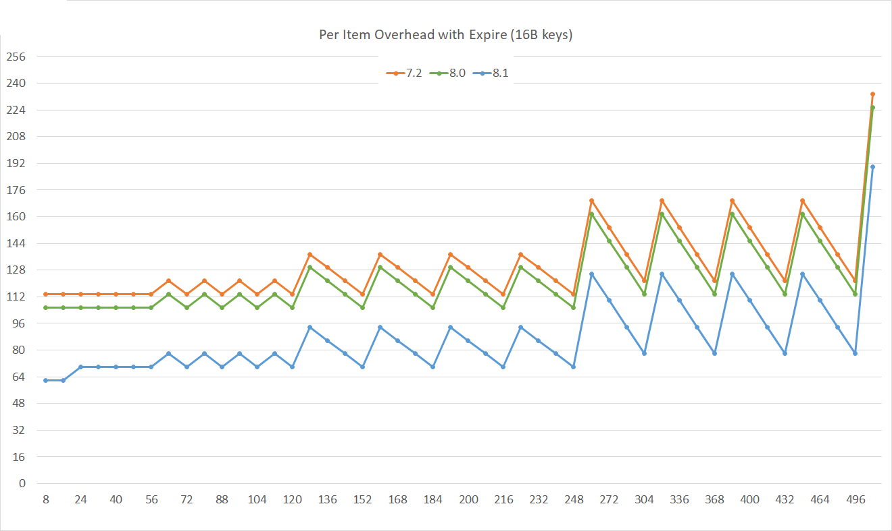

+++
title= "A new hash table"
date= 2025-03-28 00:00:00
description= "Designing a state-of-the art hash table"
authors= ["zuiderkwast"]
+++

Many workloads are bound on storing data. Being able to store more data using
less memory allows you to reduce the size of your clusters.

In Valkey, keys and values are stored in what's called a hash table. A hash
table works by chopping a key into a number of seemingly random bits. These bits
are shaped into a memory address, pointing to where the value is supposed to be
stored. It's a very fast way of jumping directly to the right place in memory
without scanning through all the keys.

For the 8.1 release, we looked into improving the performance and memory usage,
so that users can store more data using less memory. This work led us to the
design of a new hash table, but first, let's take a look at the hash table that
was used in Valkey until now.

The dict
--------

The hash table used Valkey until now, called "dict", has the following memory
layout:

The dict has two tables, called "table 0" and "table 1". Usually only one
exists, but both are used when incremental rehashing is in progress.

It's a chained hash table, so if multiple keys are hashed to the same slot in
the table, their key-value entries form a linked list. That's what the "next"
pointer in the `dictEntry` is for.

To lookup a key "FOO" and access the value "BAR", Valkey still has to read from
memory four times. If there is a hash collision, it has to follow two more
pointers for each hash collision and thus read twice more from memory (the key
and the next pointer).

Minimize memory accesses
------------------------

One of the slower operations when looking up a key-value pair is reading from
the main RAM memory. A key point is therefore to make sure we have as few memory
accesses as possible. Ideally, the memory we want to access should already be
loaded in the CPU cache, which is a smaller but much faster memory belonging to
the CPU.

Optimizing for memory usage, we also want to minimize the number of distinct
memory allocations and the number of pointers between them, because storing a
pointer needs 8 bytes in a 64-bit system. If we can save one pointer per
key-value pair, for 100 million keys that's almost a gigabyte.

When the CPU loads some data from the main memory into the CPU cache, it does so
in fixed size blocks called cache lines. The cache-line size is 64 bytes on
almost all modern hardware. Recent work on hash tables, such as [Swiss
tables](https://abseil.io/about/design/swisstables), are highly optimized to
store and access data within a single cache line. If the key you're not looking
for isn't found where you first look for it (due to a hash collision), then it
should ideally be found within the same cache line. If it is, then it's found
very fast once this cache line has been loaded into the CPU cache.

Required features
-----------------

Why not use an open-source state-of-the-art hash table implementation such as
Swiss tables? The answer is that we require some specific features, apart from
the basic operations like add, lookup, replace and delete:

* Incremental rehashing, so that when the hashtable is full, we don't freeze the
  server while the table is being resized.

* Scan, a way to iterate over the hash table even if the hash table is resized
  between the iterations. This is important to keep supporting the
  [SCAN](/commands/scan/) command.

* Random element sampling, for commands like [RANDOMKEY](/commands/randomkey/).

These aren't standard features, so we couldn't simply pick an off-the-shelf hash
table. We had to design one ourselves.

Design
------

In the new hash table designed for Valkey 8.1, the table consists of buckets of
64 bytes, one cache line. Each bucket can store up to seven elements. Keys that
map to the same bucket are all stored in the same bucket. The bucket also
contains a metadata section, marked "m" in the figures. The bucket layout
including the metadata section is explained in more detail below.

We've eliminated the `dictEntry` and instead embed key and value in the
`serverObject`, along with other data for the key.

Assuming the `hashtable` structure is already in the CPU cache, looking up
key-value entry now requires only two memory lookups: The bucket and the
`serverObject`. If there is a hash collision, the object we're looking for is
most likely in the same bucket, so no extra memory access is required.

If a bucket becomes full, the last element slot in the bucket is replaced by a
pointer to a child bucket. A child bucket has the same layout as a regular
bucket, but it's a separate allocation. The lengths of these bucket chains are
not bounded, but long chains are very rare as long as keys are well distributed
by the hashing function. Most of the keys are stored in top-level buckets.

The elements in the same bucket, or bucket chain, are stored without any
internal ordering. When inserting a new entry into the bucket, any of the free
slots can be used.

As mentioned earlier, each bucket also contains a metadata section. The bucket
metadata consists of eight bytes of which one bit indicates whether the bucket
has a child bucket or not. The next seven bits, one bit for each of the seven
element slots, indicates whether that slot is filled, i.e. whether it contains
an element or not. The remaining seven bytes are used for storing a one byte
secondary hash for each of the entries stored in the bucket.

The secondary hash is made up of hash bits that are not used when looking up the
bucket. Out of a 64 bits hash, we need not more than 56 bits for looking up the
bucket and we use the remaining 8 bits as the secondary hash. These hash bits
are used for quickly eliminating mismatching entries when looking up a key
without comparing the keys. Comparing the keys of each entry in the bucket would
require an extra memory access per entry. If the secondary hash mismatches the
key we're looking for, we can immediately skip that entry. The chance of a false
positive, meaning an entry for which the secondary hash is matching although the
entry doesn't match the key were looking for, is one in 256, so this eliminates
99.6% of the false positives.

Results
-------

By replacing the hash table with a different implementation, we've managed to
reduce the memory usage by roughly 20 bytes per key-value pair.

The graph below shows the memory overhead for different value sizes. The
overhead is the memory usage excluding the key and the value itself. Lower is
better. (The zigzag pattern is because of unused memory resulting from the memory
allocator's discrete allocation sizes.)

For keys with an [expire time](/commands/expire/) (time-to-live, TTL) the memory
usage is down even more, roughly 30 bytes per key-value pair.

In some workloads, such as when storing very small objects and when pipelining
is used extensively, the latency and CPU usage are also improved. In most cases
though this is negligible in practice. The key takeaway appears to be reduced
memory usage.

Hashes, sets and sorted sets
----------------------------

The nested data types Hashes, Sets and Sorted sets also make use of the new hash
table when they contain a sufficiently large number of elements. The memory
usage is down by roughly 10-20 bytes per element for these types of keys.

Special thanks to Rain Valentine for the graphs and for the help with
integrating this hash table into Valkey.
