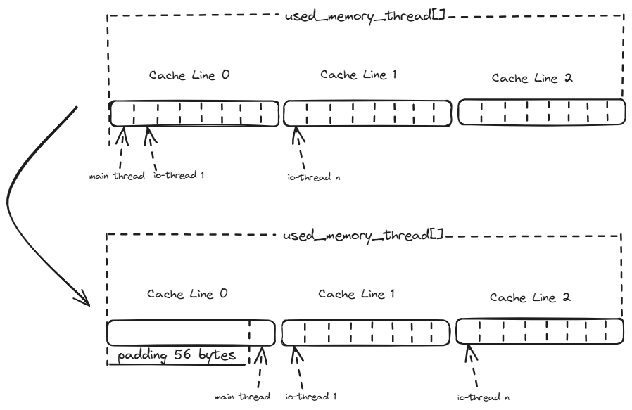

+++
title= "Performance Optimization Methodology for Valkey - Part 1"
date= 2025-05-27 00:00:00
description= "Performance Optimization Methodology for Valkey"
authors= ["lipzhu", "guowangy"]

[extra]
categories= "performance"
featured = true
featured_image = "/assets/media/featured/random-04.webp"
+++

Performance optimization is a multifaceted domain, particularly for high-performance systems like Valkey. While overall system performance depends on numerous factors including hardware specifications, OS configurations, network conditions, and deployment architectures, our work focuses specifically on optimizing Valkey's performance at the CPU level.

## Introduction

When examining software CPU optimization approaches, two fundamental strategies are generally recognized:

### Strategy 1: Maximizing Parallelism

This strategy involves redesigning software architecture to fully leverage multiple CPU cores. By effectively distributing workloads across available computing resources, applications can achieve significant throughput improvements—a critical advantage as processor core counts continue to increase.

The I/O threading model in Valkey exemplifies this approach. As described in the Valkey blog post ["Unlock 1 Million RPS: Experience Triple the Speed with Valkey"](https://valkey.io/blog/unlock-one-million-rps/), this architecture enables Valkey to offload operations to dedicated threads, allowing better utilization of available CPU cores. Rather than handling all operations in a single thread, this model intelligently delegates tasks to multiple threads, reducing bottlenecks and improving throughput. This enhancement has demonstrated impressive scalability, enabling near-linear performance scaling with additional cores.

### Strategy 2: Enhancing CPU Efficiency

This strategy focuses on maximizing performance within limited CPU resources through two complementary approaches:

1. **Reducing Instruction Count**: Eliminating redundant code and unnecessary operations to decrease the total work the CPU must perform.

2. **Improving IPC**: Optimizing how efficiently the processor executes instructions by addressing microarchitectural bottlenecks like cache misses, branch mispredictions, and memory access patterns.

Through our analysis and optimization efforts, we've identified several key methodologies that deliver significant performance improvements: eliminating redundant code, reducing lock contention, and addressing false sharing. We've also explored other techniques including asynchronous processing, batch operations, and leveraging CPU-specific instructions such as SIMD vectorization.

While parallelism allows us to "use more resources efficiently," efficiency optimizations enable us to "do more with the same resources." Both approaches are essential in a comprehensive optimization strategy, particularly for mission-critical systems like Valkey.

This article focuses primarily on the second strategy, exploring methodical approaches to improving CPU efficiency with concrete examples from our contributions to the Valkey codebase.

## Benchmarking: The Foundation for Reliable Performance Optimization

Reliable performance optimization requires consistent, reproducible measurements to evaluate whether code changes actually improve performance. Without methodical benchmarking in a controlled environment, it's impossible to accurately quantify improvements or determine if optimizations introduce regressions in other areas.

To isolate CPU performance factors and eliminate variables that might affect measurements, we've implemented the following constraints:

1. **Bare-metal servers** rather than virtual machines to eliminate hypervisor overhead and contention,
2. **Process pinning** using taskset to pin Valkey to specific cores, preventing thread migration overhead,
3. **Local network interfaces** (loopback) for client-server communication to minimize network variability,
4. **High CPU utilization** benchmark parameters to ensure we're measuring true CPU performance limits.

This controlled environment allows us to accurately attribute improvements to specific code optimizations, providing reliable measurements of throughput and latency improvements. For each optimization attempt, we establish baseline performance metrics, implement changes in isolation, and then re-measure to quantify the impact. This disciplined approach ensures that our optimizations deliver genuine benefits rather than illusory improvements that might disappear in production environments.

## Optimization Methodology

In the following sections, we'll share practical examples of optimization techniques applied to Valkey. These insights represent our modest contributions that might be helpful for others working on similar performance challenges.

### 1. Eliminating Redundant Code

Simplifying execution paths by removing redundant operations is a straightforward optimization approach, though identifying truly unnecessary code requires careful analysis.

#### How to Identify Redundant Code

The key to finding redundant code lies in having:

1. **Representative Workloads**: Test workloads that reflect real-world usage patterns,
2. **Proper Profiling Tools**: Tools like `perf` and [Intel® VTune™ Profiler](https://www.intel.com/content/www/us/en/developer/tools/oneapi/vtune-profiler.html) to identify hot code paths,
3. **Systematic Code Review**: Manual inspection of hot paths to find redundancies that automated tools might miss,
4. **Trace-based Analysis**: Execution traces that highlight repeated operations.

#### Real-World Examples

Through detailed CPU cycle hotspot analysis, we identified redundant logic in how Valkey prepares client connections for write operations. By analyzing execution patterns during high-throughput benchmarks, we discovered opportunities to eliminate unnecessary function calls in critical paths.

**Example 1: Optimizing Client Write Preparation**

In [PR #670](https://github.com/valkey-io/valkey/pull/670), we found redundant calls to `prepareClientToWrite()` when multiple `addReply` operations were performed consecutively. By restructuring the code to call this function only when necessary, we eliminated redundant operations in a hot path.

**Example 2: Improving List Command Efficiency**

Similarly, in [PR #860](https://github.com/valkey-io/valkey/pull/860), we moved the `prepareClientToWrite()` call outside of a loop in the `lrange` command, preventing it from being called repeatedly for each list element.

These relatively simple code changes yielded measurable performance improvements because they affected code paths executed extremely frequently during normal operation.

### 2. Reduce Lock Contention

When discussing lock overhead, we consider two aspects:

1. **Protected code scope**: The cost of operations within critical sections,
2. **Lock implementation overhead**: The cost of the synchronization mechanism itself.

Due to Valkey's single main thread design, there aren't many complex mutex-protected critical sections. Therefore, we focus on the overhead of synchronization primitives themselves, which becomes significant when the protected work is minimal.

In Valkey, atomic operations are used to update global variables and shared data. While atomic operations are faster than mutex locks, they still introduce considerable overhead compared to non-atomic operations—particularly in high-throughput scenarios where these operations occur millions of times per second.

#### Real-World Examples

**Thread-local Storage for Memory Tracking**

In [PR #674](https://github.com/valkey-io/valkey/pull/674), we introduced thread-local storage variables to optimize memory tracking. Previously, Valkey used atomic operations to update the global `used_memory` variable tracking memory allocation across all threads.

Our profiling identified that most operations on this variable were writes occurring within the same thread, with the system only occasionally reading the total memory usage across threads.

By implementing thread-local variables for each thread to track its own memory usage, we eliminated atomic operations during frequent writes. Each thread now updates its local counter using regular (non-atomic) operations, with the global value computed only when needed by summing thread-local values.

This optimization pattern is particularly effective when:
1. Most operations occur within a single thread,
2. Values are written frequently but read infrequently,
3. Synchronization overhead is significant compared to the work being protected.

### 3. Eliminating False Sharing

False sharing occurs when different threads access different variables located within the same CPU cache line (typically 64 bytes). Even though threads work with different variables, the hardware treats these accesses as conflicts because they share the same cache line.

When one thread modifies its variable, the entire cache line is invalidated for all other cores, forcing them to reload the cache line even though their own variables haven't changed. This creates unnecessary cache coherence traffic and can significantly degrade performance.

#### Identifying False Sharing

False sharing can be difficult to detect because it doesn't cause functional issues. Signs include:

1. **Unexplained Performance Scaling Issues**: Poor scaling despite threads working independently,
2. **High Cache Coherence Traffic**: Monitoring shows high rates of cache line invalidations,
3. **Thread-dependent Performance Variations**: Unusual performance patterns with different thread counts.

Tools that help identify false sharing include:
- `perf c2c` - A Linux performance tool specifically designed for detecting cache line contention,
- [Intel® VTune™ Profiler](https://www.intel.com/content/www/us/en/developer/tools/oneapi/vtune-profiler.html) with Memory Access Analysis,
- Performance counter monitoring tools tracking cache coherence events.

These tools have transformed false sharing from a difficult-to-diagnose problem into one that can be efficiently located and addressed.

#### Mitigation Strategies

When addressing false sharing, several approaches are available:

1. **Data Structure Padding**: Adding padding between variables accessed by different threads,
2. **Cache Line Alignment**: Aligning thread-specific data to cache line boundaries,
3. **Thread-local Storage**: Using thread-local variables instead of shared arrays,
4. **Data Structure Redesign**: Reorganizing data structures to group thread-specific data.

#### Real-World Examples

**Strategic False Sharing Mitigation**

In [PR #1179](https://github.com/valkey-io/valkey/pull/1179), we encountered false sharing in memory tracking counters used by both the main thread and I/O threads.

Instead of completely eliminating all false sharing (which would have degraded performance in some scenarios), we implemented a nuanced solution:

> "The reason we didn't take the struct padding way is the performance degradation. Because when calling functions like zmalloc_used_memory() (called in main thread mostly), the main thread will cost more cycles to fetch more cache lines (3 vs 16 cache lines). Per our benchmarking, it will have a ~3% performance degradation depending on the specific benchmark."

Our solution focused on eliminating false sharing between the main thread and I/O threads while allowing it to remain among I/O threads:

> "We did some tradeoff, just fixing the false sharing between main thread and io-threads, while keeping the false sharing in the io-threads for memory aggregation, because the resource of main thread is the bottleneck but resources of io-threads can be scaled."

This example illustrates that performance optimization isn't always about finding a theoretically perfect solution, but rather making intelligent tradeoffs based on real-world constraints and priorities. By focusing on the system's actual bottleneck (the main thread), we achieved better overall performance despite leaving some false sharing in place.

## Conclusion

The methodologies presented here demonstrate that effective performance optimization requires both systematic analysis and thoughtful implementation. By focusing on eliminating redundancy, reducing synchronization overhead, and addressing false sharing, we've achieved meaningful improvements in Valkey's performance.

These optimizations demonstrate that even in mature, well-engineered systems, there are opportunities for performance improvement when guided by careful measurement and analysis. The key lesson is that understanding hardware characteristics and system bottlenecks enables targeted optimizations with substantial impact, even when implementation changes are relatively small.
