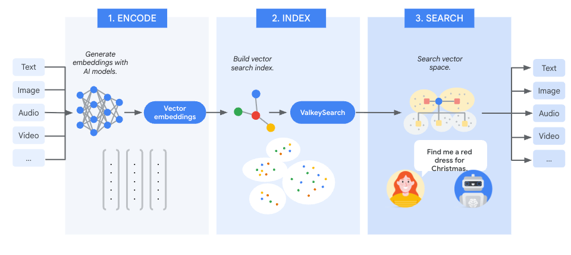
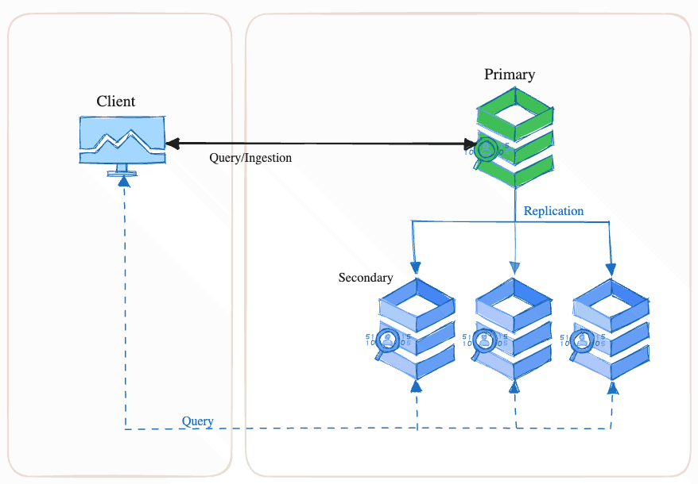
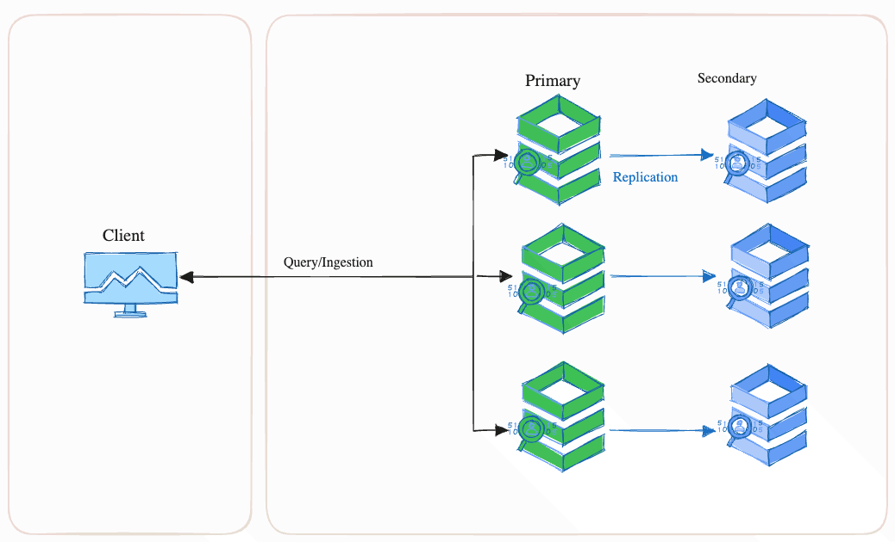

+++
title= "Introducing Vector Search To Valkey" 
description = "Learn how to use valkey-search to search through billions of vectors with single-digit millisecond latencies and greater than 99% recall." 
date= 2025-06-13 01:01:01 
authors= ["yairgott", "allenss"] 

[extra]
featured = false
featured_image = "/assets/media/featured/random-08.webp"
+++

The Valkey project is introducing vector similarity search capabilities through [valkey-search](https://github.com/valkey-io/valkey-search) (BSD-3-Clause licensed), an official Valkey module compatible with Valkey versions 8.1.1 and above. 

With valkey-search you can easily create indexes to search through billions of vectors stored within your Valkey instances. Whether you're building semantic search, fraud detection systems, or conversational AI experiences, valkey-search offers a flexible foundation for your application.

In this blog, you'll learn how valkey-search works, explore key use cases it supports, understand its architecture and indexing model, and see how to integrate it into your own applications. You'll also gain insight into how it scales, ensures high availability, and supports hybrid queries that combine vector similarity with structured filtering.

## Semantic Search

The ability of AI models to extract semantic meaning enables new classes of searching algorithms, collectively known as semantic search. An AI model can process an input and convert it into a single high-dimension numeric vector – known as an embedding. Inputs with similar meaning will have similar embeddings. Semantic search is the process of converting a query into its embedding and searching a database of embeddings to find the embeddings that are most alike. 

The semantic search process can be divided into three phases:

* **Encode**:  First, convert your input data into searchable units known as chunks. Chunking strategies are data-type specific. For example, with text one well-known chunking algorithm is to make each sentence be a chunk. Then use an AI model to  generate an embedding for each chunk. The specific AI model used for encoding depends on the data type and specific use case. Many AI models are available as a service, such as Google Cloud’s [VertexAI](https://cloud.google.com/vertex-ai) or AWS’ [Bedrock](https://aws.amazon.com/bedrock/), simplifying the embedding generation process.

* **Index**: Store the generated embeddings along with any associated metadata in valkey-search. Each stored item is indexed with a primary key and a set of attributes spanning multiple modalities, for example, tags (categories),  numbers (pricing), etc.
* **Search**: The query is converted into an embedding using the same AI model as was used in the **Encode** step above. This embedding is used with the vector search capability of valley-search to locate the most similar vectors. The located vectors correspond to chunks of the original input that have the most similar meaning to the query.

## Use-Cases Where valkey-search Shines

Valkey-search’s ability to search billions of vectors with millisecond latencies makes it ideal for real-time applications such as:

* **Personalized Recommendations** – Deliver instant, highly relevant recommendations based on real-time user interactions.
* **Fraud Detection & Security** – Identify anomalies and suspicious activity with ultra-fast similarity matching.
* **Conversational AI & Chatbots** – Enhance response accuracy and relevance by leveraging rapid vector-based retrieval.
* **Image & Video Search** – Enable multimedia search through real-time similarity detection.
* **GenAI & Semantic Search** – Power advanced AI applications with efficient vector retrieval for natural language understanding.

## Valkey-Search Architecture Overview

Valkey-search allows the creation of any number of named indexes. A valkey-search index can be thought of like a relational database table where a row is a Valkey key and a column is an attribute (field) within that key. Each index is defined to cover a portion of the Valkey keyspace and some list of attributes within those keys. Any mutation of a key within the scope of an index synchronously updates that index before that mutation command is acknowledged. Query operations can be performed on a single index, returning the located key names and optionally their contents.

Indexes can be constructed over HASH or JSON keys. For HASH keys, the indexable attributes of the keys are just the hash fields. For JSON keys, the indexable attributes are identified using the JSON path notation. Regardless of key type, an index can have any number of attributes. Each attribute of an index is declared with a type and sometimes type-specific modifiers. Currently, three index attribute types are supported: Vector, Numeric and Tag. 

### Index Creation

The `FT.CREATE` command is used to define a new index which is created empty. This causes the system to automatically initiate an asynchronous background process to scan the keyspace for keys that belong in the index – backfilling. The backfill process runs until the entire keyspace has been scanned for the index. The `backfill_in_progress` and `backfill_complete_percent` fields of the `FT.INFO` command result can be used to monitor the progress of the backfill. Once the backfill is complete it need not be executed against the index again.

Note that during the backfill process, query and ingestion operations proceed normally. Queries will be executed against the current state of the index. Newly mutated data will be placed into the index as usual and remain unaffected by the backfill process. Thus after the creation of an index – while it is backfilling – the application can be certain that queries will contain the results of all data that has been ingested *after* the creation of the index and *some *of the data ingested *before*. Once the backfill has completed then queries will consider all data covered by the index.

In cluster mode, the `FT.CREATE` command can be sent to any primary shard of the cluster and the system will automatically distribute the new index definition to all cluster members. The distribution is done using a combination of the cluster bus and direct gRPC communication between nodes. In the rare case where the distribution machinery detects an inconsistency between nodes, a last-writer-wins (LWW) collision resolution protocol is invoked to enable eventual cluster-wide consistency. 

## Valkey-search Capabilities

### Query Pipeline

#### Vector Search Algorithms

Valkey-search supports K Nearest Neighbor (KNN) searching. Applications provide a reference vector and request that the system locate the K vectors which are closest to a supplied reference vector using the selected distance function (L2, IP or cosine). KNN searching is a classic problem which lacks an efficient exact ideal solution. Valkey-search addresses this problem by providing two different algorithms that the developer can select from:

The first algorithm performs an exhaustive linear search, providing exactly correct answers but with a run-time that may be intolerable on large data sets.

The second algorithm addresses this problem by compromising on accuracy in exchange for superior run-times. In other words, it runs very fast but may not deliver exactly the correct answer. This type of algorithm is often known as Approximate Nearest Neighbor (ANN). The term "recall" is used to measure the quality of an ANN algorithm result and is expressed as the ratio (or percentage) of the found answers to the correct answers, e.g., a recall of 0.95 (or 95%) means that for a search with K = 100, 95 of the correct answers were found. There is a tradeoff between the recall of an ANN algorithm and its time/space resource consumption.

Valkey-search supports the [Hierarchical Navigable Small Worlds](https://en.wikipedia.org/wiki/Hierarchical_navigable_small_world) (HNSW) ANN algorithm as it provides the best performance at the highest levels of recall demanded by real-time applications. The HNSW algorithm has O(log N) time complexity and offers three parameters to which provide the developer some control over the CPU and memory consumption vs recall. The relationship between these parameters and the resulting operation latency and recall is complex and data dependent. It is recommended that developers test with data that closely approximates production environments.

#### Hybrid Query Support

Valkey-search query operations are not limited to just vector searching. Documents can contain additional metadata that can be used to enhance searches. Two types of metadata are currently supported: Numeric and Tag. Numeric metadata supports range queries, i.e., you can include or exclude documents with metadata in the particular range. Tag metadata is an enumerated list of words. Tag searches can be done with an exact word match or a prefix match (trailing wild card).

Hybrid queries are vector query operations which have been augmented with a filter, constructed from the numeric and tag searching operators combined with the usual logical operators `AND`, `OR`, and `NOT.` 

Hybrid queries are particularly powerful for real-world applications, where a mix of vector and non-vector attributes defines the relevance of results. For example, a numeric field could be used as a timestamp, meaning that search operations could be automatically confined to a particular period of time. Another example would be to use a tag field to indicate a language.

##### Query Execution

There are multiple strategies for executing hybrid queries, each suited to different use cases. Valkey-search automatically selects from two strategies as part of the query execution planning phase. This is done by breaking down the query filter into predicates and estimating the selectivity of each predicate to estimate the least expensive execution strategy. 

**Pre-filtering:** This algorithm has two sequential steps:
* First, a temporary dataset is created using only the documents which pass the filter expression. 
* Second, a linear `KNN` similarity search of the temporary dataset is performed.

Pre-filtering is particularly effective for high selectivity queries, i.e., the filter significantly narrows down the dataset

**Inline-filtering:** In this algorithm, filtering is done *during *the vector search itself. As the HNSW search graph is traversed, each candidate document is tested against the filter criteria before being added to the result set. This method is best suited for cases where the filter isn’t highly selective, i.e., the filter matches a large amount of the dataset. 

### High Availability

Valkey-search is built on top of Valkey, leveraging its primary/replica-based architecture to provide high availability (HA). Diagram #2 shows a typical configuration of one primary and three replicas. In the event of a primary node failure, the system automatically promotes one of the replicas to become the new primary.

Clients must send data mutation (write) commands to the primary node which are executed and then automatically asynchronously transmitted to each replica. Clients can send data read operations to any node in the cluster, recognizing that reading from a replica delivers a result reflecting a historical point in time.

When Valkey-search is used, each node, whether a primary or a replica, builds and maintains its own indexes. No additional traffic on the replication channel is generated for index maintenance. Search query operations sent to a replica will be executed against its indexes, reflecting the historical point in time of the data within that node.

### Scaling

Valkey-search supports all three methods of scaling: horizontal, vertical and replicas. When scaling for capacity, valkey-search behaves just like regular Valkey, i.e., increasing the memory of individual nodes (vertical scaling) or increasing the number of shards (horizontal scaling) will increase the overall capacity.

However, from a performance perspective, valkey-search behaves very differently from regular Valkey. The multi-threaded implementation of valkey-search means that additional CPUs yield up to linear increases in both query and ingestion throughput. Horizontal scaling (CME) yields linear increases in ingestion throughput but may provide little to no benefit on query throughput. If additional query throughput is required, scaling through replicas or additional CPUs is required.

### Snapshots

Valkey’s point-in-time RDB snapshotting mechanism is a key component for maintaining high availability, zero downtime, and minimal operational overhead. Beyond persistence and loading from disk snapshots, RDB plays a crucial role in full-sync operations, where a primary node synchronizes its in-memory data with a replica node in an HA setup. Full-sync is commonly triggered when a new replica joins the cluster but may also occur if a secondary falls too far behind due to prolonged lag.

valkey-search enhances Valkey snapshotting mechanism to include index definitions and vector indexes and is built for resilience and efficiency:

**Fast Turn-up:** New nodes must become fully operational in minimal time. While rebuilding an index on startup is an option, ingesting a large volume of vectors can be prohibitively slow, delaying system readiness. A snapshot captures not only the index metadata but also the vector index content which significantly reduces downtime and operational burden.

**Backward/Forward Compatibility:** Cluster upgrades or downgrades often result in a temporary mix of node versions. valkey-search seamlessly handles such scenarios with a serialization format based on Protocol Buffers (Protobuf), ensuring both backward and forward compatibility. This simplifies version transitions and reduces the chance of costly re-indexing.

## RediSearch API Compatibility

Valkey-search implements a subset of RediSearch’s functionality, with compatibility across key vector search APIs. This enables integration with most existing RediSearch client libraries, allowing you to continue using familiar tools. Developers already experienced with RediSearch can adopt valkey-search with minimal changes, as the API remains largely consistent. This compatibility helps reduce adoption friction for teams and organizations building on Redis OSS-based solutions.

## Performance & Low Latency

Valkey-search is designed as an in-memory secondary index, achieving exceptional performance. A multi-threaded architecture optimizes query and mutation processing with minimal thread contention, enabling near-linear vertical scalability.

At its core, valkey-search’s threading architecture follows a common design pattern: a worker thread pool combined with task queues. It employs advanced synchronization mechanisms to maintain index consistency while minimizing contention among worker threads. By time-slicing CPU access between read and write operations, the system enables an almost lock-free read path, delivering high performance and consistently low search latency. 

Valley-search’s HNSW implementation is based on the OSS project [HNSWLib](https://github.com/nmslib/hnswlib). While HNSWLib is well-regarded for its speed, we have enhanced its performance and efficiency for our use case. These improvements include better `SIMD` utilization, promotion of CPU cache efficiency, memory utilization and more.

## Future Enhancements

This first release of valkey-search focuses on vector search, but it is designed as a general-purpose indexing subsystem. Future releases will extend both the available data types as well as provide post-query data processing facilities.

## Get Involved

Valkey-search is open source and ready for you to explore. Whether you're building cutting-edge AI applications or integrating vector search into existing systems, we invite you to try it out. The easiest way to get started is by visiting the [GitHub repository](https://github.com/valkey-io/valkey-search), where you'll find setup instructions, documentation, and examples.

We welcome contributions of all kinds - code, documentation, testing, and feedback. Join the community, file issues, open pull requests, or suggest improvements. Your involvement helps make valkey-search better for everyone.

Ready to dive in? Clone the repo, fire up the [dev container](https://hub.docker.com/r/valkey/valkey-extensions), and start building high-performance vector search with valkey-search.
