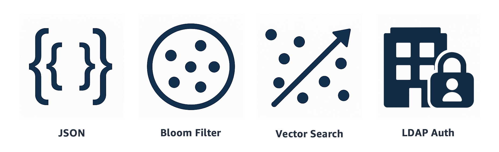

+++
title= "valkey-bundle: One stop shop for real-time applications" 
description = "Introducing valkey-bundle a single-container solution that combines Valkey with JSON, Bloom filters, Vector Similarity Search, and LDAP authentication capabilities to power development of real-time applications" 
date= 2025-06-23 00:00:01 
authors= ["rlunar"] 

[extra]
featured = false
featured_image = "/assets/media/featured/random-02.webp"
+++



Are you looking to build low-latency, high-performance, feature-rich applications without the hassle of managing multiple dependencies? Meet *valkey-bundle* your new best friend in the world of modern application development!

*valkey-bundle* enhances developer productivity by providing easy access to four tools in addition to the Valkey 8.1.1 through one container: [Valkey JSON](https://github.com/valkey-io/valkey-json), [Valkey Bloom](https://github.com/valkey-io/valkey-bloom), [Valkey Search](https://github.com/valkey-io/valkey-search), and [Valkey LDAP](https://github.com/valkey-io/valkey-ldap). *valkey-bundle* enables teams to leverage native JSON support for reliable document data handling, while implementing efficient data filtering using bloom, vector similarity search and handling authentication through LDAP. You have all these modules to pick from, mix and match for your requirements.

*valkey-bundle* provides a simplified development experience that eliminates dependency conflicts and reduces setup time with a single container deployment, teams can simplify their CI/CD pipelines while maintaining consistency across development and production environments.

From a security perspective, *valkey-bundle* integrates enterprise grade authentication through Valkey LDAP, enabling cohesive integration with existing identity providers while maintaining strict access controls. This built-in security layer on top of existing Valkey Access Control Lists ([ACL](https://valkey.io/topics/acl/)) ensures that your data remains protected without sacrificing performance or adding complexity to your architecture.

Besides the technical capabilities that *valkey-bundle* provides my favorite thing about this new solution is to see the Valkey community working together releasing modules catering to different use cases driven by Valkey users requests in an open forum in the discussions section of the project for example: [Implement JSON and search](https://github.com/orgs/valkey-io/discussions/212), [FEATURE: JSON/ReJSON](https://github.com/orgs/valkey-io/discussions/119), [Modules](https://github.com/orgs/valkey-io/discussions/108), and [FEATURE: Bloom Filters](https://github.com/orgs/valkey-io/discussions/215).

In this blog post, we go over on how to get started with the new single container to deploy *valkey-bundle*, understand the different modules included within, and we will dive into a real-life use case with a simple Ad Platform.

## Getting Started with *valkey-bundle*

*valkey-bundle* is generally available as version 8.1 includes Valkey 8.1, valkey-json 1.0, valkey-bloom 1.0, valkey-search 1.0 and valkey-ldap 1.0 out of the box in a single container, you have the ability to deploy the container as standalone valkey or in cluster mode.

Start your *valkey-bundle* instance:

1. Get the latest version of the container image
```bash
> docker pull valkey/valkey-bundle
```

2. Run a standalone valkey using the default port
```bash
> docker run --name my-valkey-bundle \
    -p 6379:6379 \
    -d valkey/valkey-bundle
```

3. Connect to the same container we have previously created using the built-in `valkey-cli`:
```bash
> docker exec -it my-valkey-bundle \
    valkey-cli -h localhost -p 6379 -3
```

List the available modules using the [`INFO`](https://valkey.io/commands/info/) command.

```
my-valkey-bundle:6379> INFO modules
# Modules
module:name=bf,ver=10000,api=1,filters=0,usedby=[],using=[],options=[]
module:name=search,ver=10000,api=1,filters=0,usedby=[],using=[],options=[handle-io-errors|handle-repl-async-load|no-implicit-signal-modified]
module:name=json,ver=10010,api=1,filters=0,usedby=[],using=[],options=[handle-io-errors]
module:name=ldap,ver=16777471,api=1,filters=0,usedby=[],using=[],options=[]
```

## *valkey-bundle* Features and CLI Examples

Each module in *valkey-bundle* addresses specific challenges for modern applications with low latency requirements that currently use Valkey and would like to add the functionality of JSON, VSS Search, Bloom filters, and LDAP. In this section, we explore each module currently included in *valkey-bundle* 8.1.1, understand the technical capabilities and constraints by CLI examples.

### JSON Document Storage and Querying

[Valkey JSON](https://github.com/valkey-io/valkey-json) brings native [JSON](https://en.wikipedia.org/wiki/JSON) support to your applications, eliminating the need to serialize/deserialize data or maintain complex object-relational mappings. It implements the [RFC7159](https://datatracker.ietf.org/doc/html/rfc7159.html) and [ECMA-404](https://ecma-international.org/publications-and-standards/standards/ecma-404/) JSON standards, providing a foundation for storing and querying structured data. With support for [JSONPath](https://en.wikipedia.org/wiki/JSONPath) queries, you can perform complex query operations on nested data structures without writing custom parsing logic.

**Key Capabilities and Constraints:**

* **Document Size**: Configurable maximum document size (default: no limit) via `json.max-document-size`
* **Nesting Depth**: Maximum nesting level of 128 for objects/arrays (configurable via `json.max-path-limit`)
* **Path Syntax**: Supports both enhanced JSONPath and restricted syntax
    * Enhanced syntax includes recursive descent (`..`), wildcards (`*`), array slices (`[start:end:step]`), and complex filters
    * Filter expressions support comparisons (`==`, `!=`, `>`, `>=`, `<`, `<=`) and logical operators (`&&`, `||`)
* **Performance**: O(1) for direct path operations, scaling to O(N) for recursive or filtered queries
* **Memory Monitoring**: Use [`JSON.DEBUG`](https://valkey.io/commands/json.debug/)` MEMORY <key>` or [`MEMORY USAGE`](https://valkey.io/commands/memory-usage/) <key> to track memory usage
* **Performance Tip**: Use specific paths in `JSON.GET` for better performance.

Let's now explore a few commands using an example for a user profile, with a few attributes and nested elements.

Sample document for key `user:6379`

```json
{
    "name": "Val Key",
    "address": {
        "city": "New York",
        "zip": "10001"
    },
    "orders": [
        {"id": "ord1", "total": 99.99},
        {"id": "ord2", "total": 150.50}
    ]
}
```

Store and retrieve JSON document with nested elements and arrays using `valkey-cli` with the [`JSON.SET`](https://valkey.io/commands/json.set/) command.

```
> JSON.SET user:6379 $ '{"name": "Val Key","address": {"city": "New York","zip": "10001"},"orders": [{"id": "ord1", "total": 99.99},{"id": "ord2", "total": 150.50}]}'
OK
```

Complex query with filters to retrieve orders where total is over 100 from within the array in the document for the given user, we'll use [`JSON.GET`](https://valkey.io/commands/json.get/) command.

```
> JSON.GET user:6379 '$.orders[?(@.total > 100)]'
"[{\"id\":\"ord2\",\"total\":150.50}]"
```

Perform *Array* operations by inserting an item to the orders list using [`JSON.ARRAPPEND`](https://valkey.io/commands/json.arrappend/) command.

```
> JSON.ARRAPPEND user:6379 $.orders '{"id": "ord3","total": 75.25}'
1) (integer) 3
```

[Valkey JSON](https://github.com/valkey-io/valkey-json) version [1.0.0](https://github.com/valkey-io/valkey-json/releases/tag/1.0.0) included in *valkey-bundle* was released on Tuesday April 1st 2025. If you would like to dive deeper see more details in the [Valkey JSON Documentation](https://valkey.io/topics/valkey-json/) and explore the list of [commands](https://valkey.io/commands/#json) included.

### Efficient Data Filtering with Bloom Filters

[Valkey Bloom](https://github.com/valkey-io/valkey-bloom) implements space-efficient probabilistic data structures that allow membership testing. Use cases are de-duplication, filtering, and avoid one-hit-wonders in caching (data that is accessed exactly once and then never requested again). [Bloom filters](https://en.wikipedia.org/wiki/Bloom_filter) can reduce memory usage by up to 98% compared to the `SET` data structure while maintaining fast lookup times.

**Key Capabilities and Constraints**

* **Memory Efficiency**
    * Default memory limit of 128MB per filter (configurable via [`BF.BLOOM-MEMORY-USAGE-LIMIT`](https://valkey.io/topics/bloomfilters/))
    * Example: With 0.01 (1%) error rate, can probabilistic-ally track 112M items within 128MB.
    * Achieves 93-98% memory savings compared to the `SET` data structure for items using UUIDs for uniqueness.
* **Scaling Options**
    * **Non-scaling filters**: Fixed capacity for better performance.
    * **Scaling filters**: Dynamic growth with configurable expansion rate.
* **Performance Characteristics**
    * **Time complexity**: Bloom filter operations take **O(k)** time because you must compute k different hash functions and access k different bit positions in the array for every insert or lookup operation. The time complexity is independent of the number of items stored or the size of the bit array - it only depends on the number of hash functions configured for the filter.
* **Performance Tip:** Start with larger initial capacities to avoid scaling.
* **Accuracy Control**
    * Configurable false positive rate (default: 0.01 or 1%) a tradeoff between time and space for accuracy.
    * No false negatives guaranteed.
    * Tightening ratio for maintaining accuracy during scale-out.

Create a non-scaling (fixed memory) filter with specific parameters with [`BF.RESERVE`](https://valkey.io/commands/bf.reserve/):

```
> BF.RESERVE non_scaling_filter 0.001 1000000 NONSCALING
OK
```

Create a scaling filter with custom expansion using [`BF.INSERT`](https://valkey.io/commands/bf.insert/):

```
> BF.INSERT scaling_filter EXPANSION 4 ITEMS item1 item2
1) (integer) 1
2) (integer) 1
```

Check filter capacity and stats using [`BF.INFO`](https://valkey.io/commands/bf.info/) for fixed filter

```
> BF.INFO non_scaling_filter CAPACITY
(integer) 1000000
```

Check filter capacity and stats for scaling filter

```
> BF.INFO scaling_filter MAXSCALEDCAPACITY
(integer) 34952500
```

Bulk operations, use [`BF.MADD`](https://valkey.io/commands/bf.madd/) to track multiple elements at once:

```
> BF.MADD non_scaling_filter item1 item2 item3
1) (integer) 1
2) (integer) 1
3) (integer) 1
```

Check for multiple items in a single roundtrip using [`BF.MEXISTS`](https://valkey.io/commands/bf.mexists/), if we try to get an item that does not exist (item4), we get a Zero as response.

```
> BF.MEXISTS non_scaling_filter item1 item2 item4
1) (integer) 1
2) (integer) 1
3) (integer) 0
```

[Valkey Bloom](https://github.com/valkey-io/valkey-bloom) version [1.0.0](https://github.com/valkey-io/valkey-bloom/releases/tag/1.0.0) included in *valkey-bundle* was released on Tuesday April 1st 2025. If you would like to learn more details, commands and examples see the [Valkey Bloom Documentation](https://valkey.io/topics/bloomfilters/) and the blog [Introducing Bloom Filters for Valkey](https://valkey.io/blog/introducing-bloom-filters/).

### High-Performance Vector Similarity Search

[Valkey Search](https://github.com/valkey-io/valkey-search) provides your application with high performance vector similarity search capabilities, essential for modern AI-driven applications. It delivers millisecond latency even with billions of vectors through optimized implementations of Approximate Nearest Neighbor ([ANN](https://en.wikipedia.org/wiki/Nearest_neighbor_search#Approximation_methods)) search with Hierarchical navigable small world ([HNSW](https://en.wikipedia.org/wiki/Hierarchical_navigable_small_world)) and exact matching using K-Nearest Neighbors ([KNN](https://en.wikipedia.org/wiki/Nearest_neighbor_search#Approximation_methods)) algorithms.

**Key Capabilities and Constraints**

* **Vector Specifications**
    * Supports `FLOAT32` vectors
    * Multiple distance metrics: `L2` (Euclidean), `IP` (Inner Product), `Cosine`
    * HNSW parameters for performance tuning
        * `M`: Maximum outgoing edges (default: 16, max: 512)
        * `EF_CONSTRUCTION`: Build-time accuracy (default: 200, max: 4,096)
        * `EF_RUNTIME`: Query-time accuracy (default: 10, max: 4,906)
* **Hybrid Query Support**
    * Tag indexes for exact matching
        * Case-insensitive by default, 
        * Configurable separators (default: comma)
        * Prefix and exact matching supported
    * Numeric indexes for range queries
        * Supports inclusive/exclusive ranges
        * Infinite bounds using `-inf` and `+inf`
* **Performance Optimization**
    * Automatic query planning between pre-filtering and inline-filtering
    * Configurable block size for memory allocation (`--hnsw-block-size`)
    * Linear scaling with CPU cores for both queries and ingestion
* **Resource Management**
    * Configurable thread pools for readers and writers
    * Default: matches physical CPU core count
    * Cluster mode support for horizontal scaling

Create an index with HNSW configuration with [`FT.CREATE`](https://valkey.io/commands/ft.create/):

```
> FT.CREATE productIndex \
    ON JSON PREFIX 1 product: \
    SCHEMA $.vector AS vector \
    VECTOR HNSW 10 \
        TYPE FLOAT32 \
        DIM 20 \
        DISTANCE_METRIC COSINE \
        M 4 \
        EF_CONSTRUCTION 100 \
            $.category AS category TAG \
            $.price AS price NUMERIC
OK
```

Perform Hybrid query combining vector similarity with filters using [`FT.SEARCH`](https://valkey.io/commands/ft.search/)` index query`:

```
> FT.SEARCH productIndex "*=>[KNN 5 @vector $query_vector] @category:{electronics} @price:[100 500]" \
    PARAMS 2 query_vector "$encoded_vector"
```

[Valkey Search](https://github.com/valkey-io/valkey-search) version [1.0.1](https://github.com/valkey-io/valkey-search/releases/tag/1.0.1) included in *valkey-bundle* was released on Wednesday June 11th 2025. If you would like to learn more about the capabilities and opportunities this module provides see the [Valkey Search Documentation](https://valkey.io/topics/search/).

### Enhanced Security with existing Mechanisms with LDAP

[Valkey LDAP](https://github.com/valkey-io/valkey-ldap) integrates with your existing identity management infrastructure, providing robust authentication without requiring additional user management systems. It supports both simple *bind* and *search+bind* modes, making it compatible with various LDAP directory structures. This flexibility ensures that you can maintain enterprise security standards while leveraging the power of *valkey-bundle*.

**Key Features**

1. **Authentication Modes**
    1. **Bind Mode**: Fast, direct authentication when usernames match DN patterns
    2. **Search+Bind Mode**: Flexible authentication for complex directory structures
2. **Security Features**
    1. TLS/SSL support
    2. Connection pooling
    3. High availability with multiple LDAP servers
    4. Integration with the Valkey ACL system

**Basic configuration**

Simple bind mode setup to our imaginary LDAP server:
```
> CONFIG SET ldap.servers "ldap://ldap.valkey.io:389"
OK

> CONFIG SET ldap.bind_dn_prefix "cn="
OK

> CONFIG SET ldap.bind_dn_suffix ",ou=users,dc=valkey,dc=io"
OK
```

Enable TLS:
```
> CONFIG SET ldap.use_starttls yes
OK

> CONFIG SET ldap.tls_ca_cert_path "/path/to/ca.crt"
OK
```

**User Management**

Create LDAP-authenticated user
```
> ACL SETUSER valkey on resetpass +@all
OK
```

Authenticate
```
> AUTH valkey "ldap_password"
OK
```

**Performance Tips:**

* Use bind mode when possible (faster)
* Adjust connection pool size for high traffic:

```
> CONFIG SET ldap.connection_pool_size 5
OK
```

* Configure multiple LDAP servers for reliability

```
> CONFIG SET ldap.servers "ldap://main:389,ldap://backup:389"
OK
```

[Valkey LDAP](https://github.com/valkey-io/valkey-ldap) version [1.0.0](https://github.com/valkey-io/valkey-ldap/releases/tag/1.0.0) included in *valkey-bundle* was released on Sunday June 13th 2025. If you would like to learn more details about the capabilities read the [LDAP Authentication Documentation](https://valkey.io/topics/ldap/).

## Getting Ready for Production Deployment

Deploying *valkey-bundle* in production requires careful consideration of persistence, configuration, monitoring, and security. These foundational elements ensure your application maintains data integrity, performs optimally, and scales reliably under production workloads.

For example:

```bash
docker run --name my-valkey-bundle \
    -d valkey/valkey-bundle \
    valkey-server --save 60 1
```

### Custom Configuration

A well-structured configuration file is essential for production deployments as it provides centralized control over all module settings, security parameters, and performance tuning options. The configuration below demonstrates a production-ready setup that balances performance, security, and resource utilization across all *valkey-bundle* modules.

This sample configuration file includes optimized settings for:

* JSON module with reasonable document size limits and nesting depth controls
* Bloom filters with production-appropriate memory limits and false positive rates  
* Search module with thread pools sized for typical server hardware
* LDAP integration with TLS security and connection pooling
* Valkey settings for memory management and persistence

Note: This is not an official nor recommended configuration is only for demonstration purposes of the module settings.

```
# Valkey settings
port 6379
bind 127.0.0.1
protected-mode yes
requirepass "strong_password"

################################## JSON Module ###################################
# Maximum document size (in bytes, 0 = unlimited)
json.max-document-size 1048576

# Maximum nesting depth for JSON documents
json.max-path-limit 32

################################## Bloom Module #################################
# Default initial capacity for new bloom filters
bf.bloom-capacity 100000

# Default false positive rate
bf.bloom-fp-rate 0.01

# Memory usage limit per bloom filter (in bytes)
bf.bloom-memory-usage-limit 134217728  # 128MB

# Default expansion rate for scaling filters
bf.bloom-expansion 2

################################## Search Module ###############################
# Thread configuration for search operations
search.reader-threads 8
search.writer-threads 4

# HNSW graph configuration
search.hnsw-block-size 10000

# Enable cluster mode
search.use-coordinator no

# Log level (debug, verbose, notice, warning)
search.log-level notice

################################## LDAP Module #################################
# LDAP server configuration
ldap.servers "ldap://primary:389,ldap://backup:389"
ldap.auth_mode "search+bind"

# TLS configuration
ldap.use_starttls yes
ldap.tls_ca_cert_path "/path/to/ca.crt"
ldap.tls_cert_path "/path/to/client.crt"
ldap.tls_key_path "/path/to/client.key"

# Search+bind mode settings
ldap.search_base "ou=users,dc=valkey,dc=io"
ldap.search_filter "objectClass=person"
ldap.search_attribute "uid"
ldap.search_bind_dn "cn=readonly,dc=valkey,dc=io"
ldap.search_bind_passwd "readonly_password"

# Performance tuning
ldap.connection_pool_size 5
ldap.timeout_connection 5
ldap.timeout_ldap_operation 3
ldap.failure_detector_interval 1

################################## Common Settings #############################
# Memory and performance
maxmemory 4gb
maxmemory-policy allkeys-lru

# Persistence
save 900 1
save 300 10
save 60 10000

# Logging
loglevel notice
logfile "/var/log/valkey/valkey.log"
```

Load the file as follows:

```bash
docker run -v /valkey/my-valkey-bundle.conf:/usr/local/etc/valkey \
    --name my-valkey-bundle \
    valkey/valkey-bundle
```

## Real-World Example: Personalized Ad Platform

Consider a typical scenario: you're building a recommendation engine for an ad platform that needs to process JSON data, perform similarity searches, and efficiently track user interactions. Traditionally, this would require integrating and maintaining multiple services, each with its own configuration, deployment, and scaling considerations. With *valkey-bundle*, these capabilities are available out-of-the-box, all through a unified interface.

Let's explore how we would go about creating a system that could handle complex user profiles, deliver personalized recommendations, prevent ad fatigue, and maintain enterprise grade security.

### Managing Rich User Profiles with Valkey JSON

First, we needed a flexible way to store user profiles. Valkey JSON proved perfect for this with its native JSON support. Here's what our sample user profile might look like:

```json
{
  "user_id": "u123456",
  "personal": {
    "name": "Val Key",
    "email": "valkey@valkey.io"
  },
  "preferences": {
    "categories": ["electronics", "sports"],
    "brands": ["nike", "apple"]
  },
  "embedding": [0.23, 0.45, 0.67]
}
```

The beauty of using Valkey JSON is how easily we can update specific fields for user with id `u123456`.

```
> JSON.SET user:u123456 . '{"user_id": "u123456","personal": {"name": "Val Key","email": "valkey@valkey.io"},"preferences": {"categories": ["electronics", "sports"],"brands": ["nike", "apple"]},"embedding": [0.23, 0.45, 0.67]}'
OK 
```

Update user preferences by adding the automotive category.

```
> JSON.ARRAPPEND user:u123456 $.preferences.categories '"automotive"'
1) (integer) 3
```

### Smart Recommendations with Vector Search

Here's where things get interesting. We use Valkey Search to implement vector similarity matching for product recommendations. Each product and user preference is represented as a high-dimensional vector, allowing us to find similar items quickly.

Create a vector similarity index.

```
> FT.CREATE product_idx ON JSON 
  PREFIX 1 product: 
  SCHEMA 
    $.embedding AS embedding VECTOR HNSW 6 
      TYPE FLOAT32 
      DIM 128 
      DISTANCE_METRIC COSINE 
    $.category AS category TAG
OK
```

This setup allows us to find similar products while applying business rules like category filters and price ranges. The HNSW algorithm ensures we get results in milliseconds, even with millions of products.

Here's how we can fetch similar products based on user preferences:

Get user's preference vector
```console
> SET user_vector `JSON.GET user:u123456 $.embedding`
OK
```

Find similar products in the same category
```console
> FT.SEARCH product_idx "*=>[KNN 5 @embedding $user_vector] @category:{electronics}" 
    PARAMS 2 user_vector "$user_vector"
```

This query combines vector similarity search with category filtering, ensuring recommendations are both relevant and contextual.

### Preventing Ad Fatigue with Bloom Filters

Nobody likes seeing the same ad repeatedly. We use Valkey Bloom to efficiently track which user each ad has been shown. The beauty of Bloom filters is their space efficiency, we can track millions of impressions using minimal memory.

Track ad impressions by the Ad Id
```console
> BF.RESERVE ad:a789012 0.01 10000000
OK

> BF.ADD ad:a789012 "user:u123456"
(integer) 1
```

Quick check before showing an ad
```console
> BF.EXISTS ad:a789012 "user:u123456"
(integer) 1
```

Try a different user for the same Ad Id.
```console
> BF.EXISTS ad:a789012 "user:u234567"
(integer) 0
```

With a false positive rate of just 1%, we maintain accuracy while using about 93% less memory compared to the `SET` data structure.

### Securing It All with LDAP Authentication

Our Ad Platform needs to support multiple teams with different access levels - from account managers and content creators to data analysts and administrators. Valkey LDAP allows us to leverage existing corporate directories while implementing fine-grained access control.

#### Directory Structure and Role Mapping

First, let's set up our LDAP integration to map organizational roles:

Configure LDAP connection with out imaginary Valkey LDAP
```console
> CONFIG SET ldap.servers "ldaps://ldap.valkey.io:636"
OK

> CONFIG SET ldap.search_base "ou=employees,dc=valkey,dc=io"
OK

> CONFIG SET ldap.search_filter "(objectClass=user)"
OK

> CONFIG SET ldap.search_attribute "uid"
OK
```

Enable TLS for secure communication
```console
> CONFIG SET ldap.use_starttls yes
OK

> CONFIG SET ldap.tls_ca_cert_path "/etc/valkey/certs/ca.crt"
OK
```

#### Role-Based Access Control

We'll create different access levels using Valkey ACLs that map to LDAP groups:

Account Managers - Can view and modify client campaigns
```console 
> ACL SETUSER account_manager on resetpass +@read +@write -@admin >client_secret
    ~campaign:* 
    ~client:* 
    ~analytics:*
OK
```

Content Creators - Can manage ad content and view basic analytics
```console
> ACL SETUSER content_creator on resetpass +@read +@write -@admin >content_secret
    ~ad:* 
    ~content:* 
    &analytics:basic:*
OK
```

Data Analysts - Read-only access to all analytics data
```console
> ACL SETUSER data_analyst on resetpass +@read -@write -@admin >analyst_secret
    ~analytics:* 
    &campaign:*
OK
```

System Administrators - Full access
```console
> ACL SETUSER admin on resetpass +@all >admin_secret
OK
```

## Conclusion

*valkey-bundle* enables modern application development of latency-sensitive and high-throughput workloads by combining essential tools in a single, maintainable container. Whether you're building a startup MVP or scaling enterprise applications, *valkey-bundle* provides the foundation for efficient, reliable, and maintainable systems.

Ready to get started? Here's how you can begin using *valkey-bundle* today:

**Quick Start:**

1. Pull the latest valkey-bundle container: `docker pull valkey/valkey-bundle`
2. Run your first instance: `docker run --name my-valkey-bundle -p 6379:6379 -d valkey/valkey-bundle`
3. Connect and explore: `docker exec -it my-valkey-bundle valkey-cli`

**Next Steps:**

* **Experiment**: Try the JSON, Bloom, Search, and LDAP examples from this guide
* **Learn More**: Visit the [Valkey Documentation](https://valkey.io/docs) for comprehensive guides
* **Get Support**: Join the [Valkey Community](https://github.com/valkey-io/valkey/discussions) for questions and discussions
* **Contribute**: Help improve *valkey-bundle* by reporting issues or contributing features on [GitHub](https://github.com/valkey-io/valkey-bundle)

Start building your next low-latency, high-performance application with *valkey-bundle* your one-stop shop for modern data infrastructure needs.
