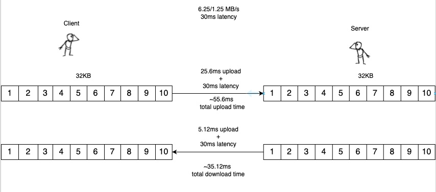
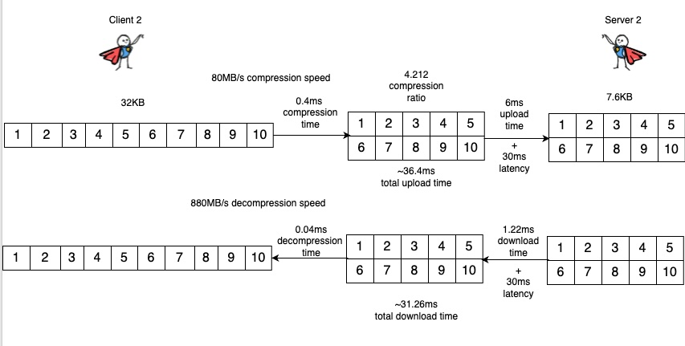

+++
title= "Compression Improves Everything"
date= 2025-07-01 01:01:01
description= "In this post we’ll explore how compression reduces your data size to \\“improve everything\\”, reducing costs and boosting performance with virtually no tradeoffs."
authors= ["dknowles"]

[extra]
featured_image = "/assets/media/featured/random-03.webp"
+++

Rising data volumes include rising costs, and in this post we’ll explore how compression reduces your data size to “improve everything”, reducing costs and boosting performance with virtually no tradeoffs. Valkey’s cost and performance as a cache depends on several factors: network load, storage capacity, and retrieval time. As data volumes continue to grow exponentially across industries, the ability to efficiently store and retrieve information becomes increasingly critical to application performance and user experience. In this blog post, we’ll show how you can potentially reduce storage costs by 4x without compromising on client performance.

### Why Compress?
Compression reduces data size, which directly decreases network load and increases storage capacity. This translates to storing and transferring more for the same cost. The benefits extend beyond just storage efficiency — compressed data means fewer bytes traversing your network infrastructure, reducing congestion and improving overall system responsiveness. For globally distributed applications, compression can significantly reduce cross-region data transfer costs, which are often among the highest infrastructure expenses. Even for data that might seem small individually (like session tokens or user preferences), the cumulative effect of compression across millions of operations can yield substantial savings. If your application’s clients are mobile devices, reduced network load can be especially beneficial due to the low bandwidth of mobile networks.

Are these performance gains free? While compression and decompression do create some overhead, offloading this work to the client maintains cache performance, making it essentially ‘free’ from Valkey’s perspective. The CPU cost of compression has decreased dramatically over the years while network bandwidth improvements have been more modest, especially in mobile and emerging markets. This widening gap means the tradeoff increasingly favors compression. For caching workloads where data is typically write-once-read-many this is especially true as decompression is many times faster than compression. For client performance, gains in network transfer speed offset the compression/decompression overhead entirely assuming your data is compressible. 

### When To Compress?
What determines whether or not your data is compressible? This blog post will focus on non-binary data.

Most non-binary data can generally compress effectively as most common encodings like Unicode and ASCII tend to have repeated byte patterns. Some encodings, such as base64, do not compress effectively and should be avoided. Encryption also diminishes the effectiveness of compression. You will want to compress before encryption if possible as this will maximize the compression ratio. Here are some examples of common non-binary data formats that lend themselves to effective compression:

1. **JSON**
2. **HTML**
3. **XML**
4. **Javascript**

Assuming your data is in one of the above formats or a similar format, there are many algorithms available to effectively compress that data. 

### Modern Compression Algorithms
Let’s examine the performance of [Zstd](https://github.com/facebook/zstd), an open-source compression library released by Meta (dual-licensed under BSD/GPL-2.0). Zstd offers several advantages: 

1. **High default compression ratio**: 2.896 
2. **Effective multi-core scaling**: Can take advantage of unused CPU cores to accelerate the compression workload
3. **Dictionary training**: Allows even small data to compress effectively by learning on repetition in the training set

Zstd’s [benchmarks](https://github.com/facebook/zstd?tab=readme-ov-file#benchmarks) report compression speeds of **510 MB/s** and decompression speeds of **1550 MB/s** on a **Core i7-9700K CPU @ 4.9GHz** at the default **2.896** compression ratio. 

These numbers can improve to an eye-watering **9.921** compression ratio, **778 MB/s** compression speed, and **2722 MB/s** decompression speed when [using a pre-trained dictionary](https://github.com/facebook/zstd?tab=readme-ov-file#the-case-for-small-data-compression) with a training set of 10k records at ~1KB each. Dictionary training works by identifying common patterns in your specific data type, allowing the algorithm to replace these patterns with shorter codes. This is particularly effective for domain-specific data such as JSON API responses or HTML fragments that contain repeated structures.

Zstd isn’t the only option available. Other notable compression algorithms include:

1. [LZ4](https://github.com/lz4/lz4): Prioritizes speed over compression ratio, making it ideal for latency-sensitive applications. It achieves compression ratios around **2.100**, **675 MB/s** compression speed, and **3850 MB/s** decompression speed.
2. [Brotli](https://github.com/google/brotli): Developed by Google, it excels at compressing web content and achieves better compression ratios than Zstd under certain conditions at the cost of compression speed
3. [gzip](https://www.gzip.org/): A ubiquitous standard. While not as fast as newer algorithms, its widespread usage and compatibility makes it a safe choice

For servers running in a modern data center, multi-core CPUs are the norm, but even today’s budget mobile devices offer 8 core CPUs that can parallelize compression and decompression effectively. These advancements in CPU hardware and compression software vastly outpace existing improvements in networking data transmission which is inherently limited by serial constraints. Compression algorithms like Zstd can operate at **>500 MB/s**, compared to **6.25 MB/s** for the global average internet connection. Even an algorithm like Lz4 has a default compression ratio of **2.1**, reducing network data transfer requirements by that same factor. 

Hardware acceleration for compression is becoming increasingly common in modern CPUs and specialized chips, further tilting the balance in favor of compression as a performance optimization. What might have been computationally expensive a decade ago is now trivial, while bandwidth constraints remain significant, especially in mobile contexts. Though compression/decompression add processing overhead, this is practically negligible compared to network transfer time. The math is straightforward: if your compression ratio is **>2** and your compression/decompression operates at **>2x** your network transfer speed, there will be a decrease in overall transfer times for the client in addition to the storage cost savings.

### Practical Example
In this example, we’ll demonstrate how a cache storing webpages can increase storage efficiency by **>4x** and increase client responsiveness. Consider a workload that caches generated webpages in Valkey. For this example, we’ll use a [Valkey blog post](https://valkey.io/blog/az-affinity-strategy/) as our sample webpage, ignoring the fact that it is static for the purpose of the example. Excluding assets, the HTML payload contains **~32KB** of data. Our example user is on a mobile device with a **6.25 MB/s** download speed, **1.25 MB/s** upload speed, and **30ms** network latency. Here is what our user’s latencies look like for uploading and retrieving the HTML payload:

We observe **55.6ms/35.12ms** upload/download times. Network latency represents the majority of the time spent in both cases.

Here is the same scenario using Zstd compression with a pretrained dictionary. [Benchmarked speeds are based on an ARMv8 Cortex-A72 4-Core](https://openbenchmarking.org/test/pts/compress-zstd&eval=70652e33eea4a6199eeb3e6c8850b98a3e9d9fb7#metrics) (mobile CPU from 2016) and a compression ratio achieved by training a dictionary on all of the Valkey blogs except for the sample payload:

We now observe **36.4ms/31.26ms** upload/download times. Both cases observe speed increases, with upload times seeing a much more significant uptick in speed. Additionally, the cache only needs to store **7.6KB** instead of **32KB**, A **4.2x** reduction of the data as compared to the first case. This means that for the same cost, we are now able to store **>4x** as much data!

### Use Cases
The example above was chosen for simplicity and to highlight the degree to which compression can benefit even low-spec device use cases, but it may not match your workload. Here are some other examples of use cases that still benefit from compression:

1. **User Preferences**
    * If you are storing user preferences inside JSON objects, you can see compression ratios **>5** due to the large amount of redundancy in field names, formatting, and potential redundancy in the field values.
2. **Log Storage**
    * Logs often include large amounts of redundancy in the timestamp formatting, repeated message patterns and log levels, and other forms of repeating data.
3. **JSON API Responses**
    * This is another use case based on the high compressibility of JSON. If your API fetches a list of products or items based on a search query and you cache these responses, you will see large compression ratios that can reduce your storage costs by a factor of **5** or more.

### Getting Started
If your application is a traditional web application that generates and serves cached content to end users, you can consider using something like the [Chromium Compression Streams API](https://developer.chrome.com/blog/compression-streams-api) to remove the need for an additional dependency in your application. You can compress and decompress data directly in your user’s browser with only a few additional lines of code. 

If your application instead runs as a server in the cloud or natively on a user’s mobile device, you can still easily include an off-the-shelf compression library like Zstd in only a few lines of code in a number of popular languages such as [C](https://github.com/facebook/zstd/blob/dev/examples/simple_compression.c), [Java](https://github.com/luben/zstd-jni), and [Python](https://pypi.org/project/zstd/).

### Conclusion
If your caching system isn’t currently utilizing compression, you’re likely missing out on significant storage and network efficiency gains. By reducing the size of cached objects by some compression ratio C, more data can be stored in the same amount of memory, effectively increasing the cache’s capacity by a factor of C without additional cost. Smaller objects also reduce network bandwidth requirements, lowering data transfer volume and associated costs while reducing client download times. 

Implementing compression doesn’t require a complete system overhaul — it can be introduced incrementally. Many programming languages offer excellent compression libraries with simple APIs that can be integrated with minimal code changes. The evolution of hardware and software has shifted the calculus decidedly in favor of compression as a default strategy rather than a special optimization.

For teams looking to maximize their Valkey investment, compression should be one of the first optimizations considered. The combination of reduced costs, improved performance, and improved user experience makes it a rare win-win-win optimization with no downsides in use cases that meet the requirements for compression.

In the world of caching, compression really does improve everything.