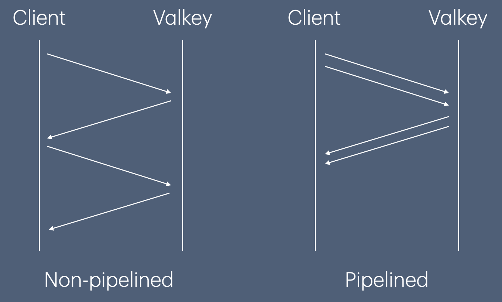

+++
title= "Introducing valkey-swift, the Swift client for Valkey"
description = "The new Swift client for Valkey is now in preview. Learn about its features and how it brings the performance of Valkey to the Swift language."
date= 2025-08-04 12:00:00
authors= [ "adamfowler"]

[extra]
featured = true
featured_image = "/assets/media/featured/random-04.webp"
+++
We are excited to introduce the preview release of [valkey-swift](https://github.com/valkey-io/valkey-swift), a new [Swift](https://swift.org) based client library for Valkey.

## The Client

Valkey-swift is a modern swift client built with Swift concurrency in mind. Using Valkey from Swift lets you take advantage of a strongly typed API, Swift's memory and data race safety guarantees, as well as maintaining a very light memory footprint. The API uses structured concurrency; a paradigm designed to bring clarity to concurrent programming by using the structure of your code to define the lifetimes of tasks and associated resources. This allows you to reason about your code locally. The client includes the following features:

### Connection Pool

The client includes a persistent connection pool. Instead of establishing a new connection for every request, it leases a connection from a pool of existing connections. This minimizes the time and resources required to get a connection to your Valkey server. 

### Commands

The project uses code generation to generate all of Valkey's command set. This ensures that all of Valkey's features are available, and includes the string, list, set, sorted set, stream, hash, geospatial, hyperloglog, and pub/sub commands. Using code generation has the added bonus of allowing us to easily keep up to date with the latest Valkey command changes. All the Valkey commands are available directly from `ValkeyClient`. 

```swift
try await valkeyClient.set("Key1", value: "Test")
let value = try await valkeyClient.get("Key1")
```

Each call to a command using `ValkeyClient` leases a connection from the connection pool to run that single command, so we provide an alternative where you can lease a single connection to run multiple commands as follows:

```swift
try await valkeyClient.withConnection { connection in
    try await connection.set("Key1", value: "Test")
    let value = try await connection.get("Key1")
}
```

When exiting the closure the connection is auto-released, avoiding the potential user error of forgetting to return the connection to the connection pool.

### Pipelining

Valkey Pipelining is a technique for improving performance. It sends multiple commands at the same time without waiting for the response of each individual command. It avoids the round trip time between each command, and removes the relation between receiving the response from a request and sending the next request.



Valkey-swift provides support for pipelining in a couple of different ways.
First, you can do this using the `execute(_:)` function available from both `ValkeyClient` and `ValkeyConnection`.
This sends all the commands off at the same time and receives a tuple of responses.
Swift allows this client to present a strongly typed API, ensuring it both accepts the correct types for multiple commands and returns the correct types for responses.

```swift
let (lpushResult, rpopResult) = await valkeyClient.execute(
    LPUSH("Key2", elements: ["entry1", "entry2"]),
    RPOP("Key2")
)
let count = try lpushResult.get()  // 2
let value = try rpopResult.get()  // ByteBuffer containing "entry1" string
```

The second way to take advantage of pipelining is to use [Swift Concurrency](https://docs.swift.org/swift-book/documentation/the-swift-programming-language/concurrency/). Because the `ValkeyConnection` type is a Swift [actor](https://docs.swift.org/swift-book/documentation/the-swift-programming-language/concurrency#Actors) it can be used across concurrent tasks without concern for data race issues. 

Unlike the `execute(_:)` function the commands will be sent individually but the sending of a command is not dependent on a previous command returning a response.

```swift
try await valkeyClient.withConnection { connection in
    try await withThrowingTaskGroup(of: Void.self) { group in
        // run LPUSH and RPUSH concurrently 
        group.addTask {
            try await connection.lpush(key: "foo1", element: ["bar"])
        }
        group.addTask {
            try await connection.rpush(key: "foo2", element: ["baz"])
        }
    }
}
```

### Pub/Sub

Valkey can be used as a message broker using its publish/subscribe messaging model. A subscription is a stream of messages from a channel. The easiest way to model this is with a Swift `AsyncSequence`. The valkey-swift subscription API provides a simple way to manage subscriptions with a single function call that automatically subscribes and unsubscribes from channels as needed. You provide it with a closure, it calls `SUBSCRIBE` on the channels you specified, and provides an `AsyncSequence` of messages from those channels. When you exit the closure, the connection sends the relevant `UNSUBSCRIBE` commands. This avoids the common user error of forgetting to unsubscribe from a channel once it is no longer needed.

```swift
try await valkeyClient.subscribe(channels: ["channel1"]) { subscription in
    for try await message in subscription {
        print(String(buffer: message.message))
    }
}
```

### Valkey Cluster

Valkey scales horizontally with a deployment called Valkey Cluster. Data is sharded across multiple Valkey servers based on the hash of the key being accessed. It also provides a level of availability, using replicas. You can continue operations even when a node fails or is unable to communicate.

Swift-valkey includes a cluster client `ValkeyClusterClient`. This includes support for:
1. Election based cluster topology discovery and maintenance.
2. Command routing to the appropriate node based on key hashslots.
3. Handling of MOVED errors for proper cluster resharding.
4. Connection pooling and failover.
5. Circuit breaking during cluster disruptions.

The following example shows how to create a cluster client that uses `ValkeyStaticNodeDiscovery` to find the first node in the cluster. From there the client discovers the remains of the cluster topology.
```swift
let clusterClient = ValkeyClusterClient(
    clientConfiguration: clientConfiguration,
    nodeDiscovery: ValkeyStaticNodeDiscovery([
        .init(host: "127.0.0.1", port: 9000, useTLS: true)
    ]),
    logger: logger
)
```

All the standard Valkey commands are available to the cluster client. The only requirement is that if a command references two of more keys, they all come from the same shard in the cluster.

```swift
try await clusterClient.xread(
    milliseconds: 10000, 
    streams: .init(key: ["events"], id: ["0-0"])
)
```

## Try it out

If you don't already have Swift installed you can find install instructions on the [swift.org](https://www.swift.org/install/) site.

Start a new project...

```bash
mkdir try-valkey-swift
cd try-valkey-swift
swift package init --type executable
swift package add-dependency https://github.com/valkey-io/valkey-swift --branch main
swift package add-target-dependency Valkey try-valkey-swift --package valkey-swift
```

If you are running on macOS, edit the generated `Package.swift` to add a minimum required platform
```swift
let package = Package(
    name: "try-valkey-swift",
    platforms: [.macOS(.v15)],
    ...
```

Open up `Sources/main.swift` and replace its contents with

```swift
import Logging
import Valkey

let logger = Logger(label: "Valkey")
let valkeyClient = ValkeyClient(.hostname("127.0.0.1", port: 6379), logger: logger)
try await withThrowingTaskGroup { group in
    group.addTask {
        // run connection manager background process
        await valkeyClient.run()
    }
    try await testValkey(valkeyClient, logger: logger)
    group.cancelAll()
}

/// Lets test valkey-swift.
func testValkey(_ valkeyClient: ValkeyClient, logger: Logger) async throws {
    try await valkeyClient.set("foo", value: "bar")
    let foo = try await valkeyClient.get("foo")
    if let foo {
        logger.info("foo = \(String(buffer: foo))")
    } else {
        logger.info("foo is empty")
    }
}
```

The code above creates a client. The client needs a background process to manage its connection pool so it sets up a `TaskGroup` which runs the connection pool background process concurrently with the `testValkey` function. The code in the `testValkey` function sets the value of key "foo" to "bar" and then gets the value of key "foo". If it returns a value it is printed to the log.

To run your code use on the command line:
```
swift run
```

## Get Involved

We'd love you to try the client out and get your feedback.
1. How does the public API work for you?
2. We know some features are not yet available, for example reading from replicas and Sentinel, but what other features do you think are needed?
3. Performance has been a major focus during development, but how is the client working out in your production environment?

### Connect with us

If you want to discuss any of the above, want to report a bug or want to contribute please reach out to us on [GitHub](https://github.com/valkey-io/valkey-swift/) or talk to us in the `#valkey-swift` channel on the [Valkey Slack](https://valkey-oss-developer.slack.com/join/shared_invite/zt-2nxs51chx-EB9hu9Qdch3GMfRcztTSkQ#/shared-invite/email).