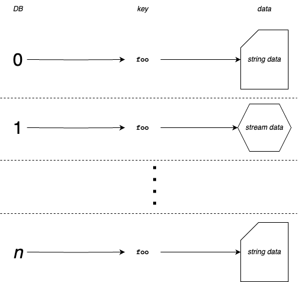
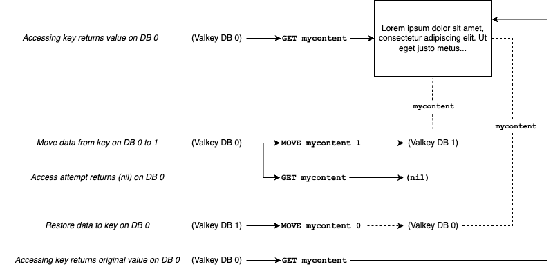
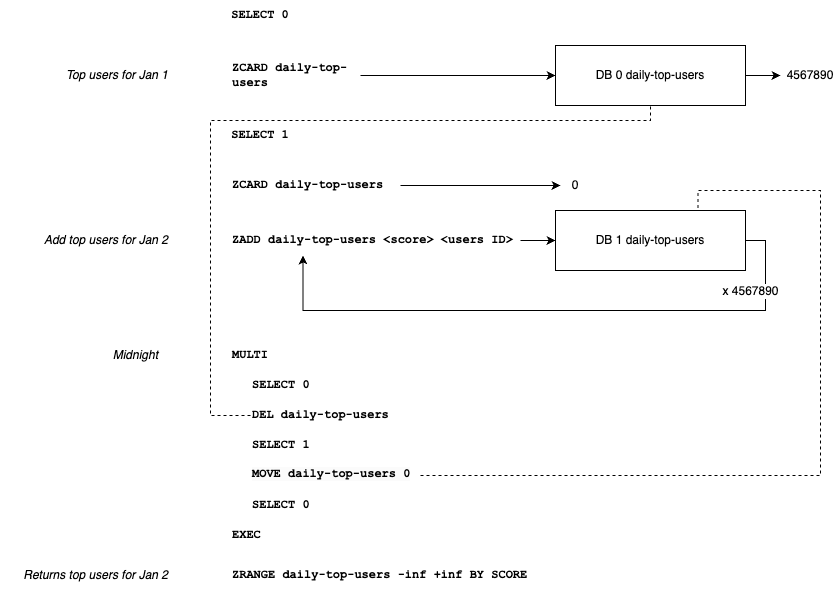

+++
title= "Numbered “Databases” in Valkey 9.0"
description = "Valkey 9.0 brings new namespacing abilities to cluster mode. In this blog you'll learn about numbered databases, how they've changed in the recent release, limitations, and how you can use them to efficiently solve a variety of otherwise challenging problems."
date= 2025-09-10 00:00:00
authors= [ "kyledvs"]

[extra]
featured = true
featured_image = "/blog/numbered-databases/images/move-db.drawio.png"
+++


If you explore Valkey’s documentation you might run across a tantalizing feature called ‘numbered databases’ which allows you to separate the keyspace into (by default) 16 different databases. This has been around for more than 15 years in the preceding project. But, also, if you’ve done more research on numbered databases in the past you might have heard a advice like “don’t use them,” “they don’t scale,” and “they’re a bad idea.” Well, the forthcoming Valkey 9.0 changes many things with numbered databases and you’ll see in this post that advice definitely needs some updating.

Today, a common way to conceptualize Valkey is that your keys represent a unique name for pointers to data in memory across a cluster of nodes. So, key `foo`  is unique and deterministically linked to a specific node and on that node there is a memory address where the value resides. However, this misses one important detail: the database number. The reality is that key names belong to a specific numbered database and *aren’t unique* on a given instance of Valkey. To put this another way, Valkey can have the key `foo` as many times as there are numbered databases with each one pointing to different data.



Historically, before Valkey’s preceding project had the ability to cluster (before version 3.0.0), using multiple numbered databases was fully supported. However, when clustering was implemented numbered databases weren’t included: a cluster had one database (DB 0) that spanned across the entire cluster. In a world where using numbered databases in your application locked you into never going to a cluster, the early advice made sense, however Valkey 9.0 adds the ability to have numbered databases on a cluster, changing everything about that advice.

Why bring this feature to cluster mode in Valkey 9.0? In the intervening years since numbered databases were left out of the cluster spec, users have found a number of very handy patterns that were unfortunately limited without numbered databases. However, numbered databases aren't a panacea: read on to find out when you should stick to DB 0 and when to go for a numbered database.

## Clustering and numbered databases

As mentioned earlier, the key name dictates where the key lives in the cluster and this doesn’t change for numbered databases. As a refresher, [Valkey clustering](https://valkey.io/topics/cluster-tutorial/) takes the key name as a string, runs that through a CRC-16 function, then does a modulo of 16,384 which determines the ‘slot’. Each of these slots belong to a node in the cluster. For a numbered database, each slot contains all the numbered databases, so, carrying forward the idea that you can have the same key name in each database on a single instance, in Valkey 9.0 you can have the same key multiple times in a given slot, each in their own database. In other words, numbered databases do not affect clustering: the key is still the determinate factor in calculating slots.

You can see this directly with [`CLUSTER KEYSLOT`](https://valkey.io/commands/cluster-keyslot/) and [`SELECT`](https://valkey.io/commands/select/). Take the following example:

```
> SELECT 0
OK
> SET somekey hi
OK
> CLUSTER KEYSLOT somekey
(integer) 11058
> SELECT 5
OK
> SET somekey hello
OK
> CLUSTER KEYSLOT somekey
(integer) 11058
```

Here the key `somekey` was set to two different values: ‘hi’ on database 0, and ‘hello’ on database 5, with `SELECT` altering the selected database. `CLUSTER KEYSLOT` was called twice: each one yielding the same slot number meaning this key will be assigned to the same node in the cluster, no matter which database is selected.

## What are numbered databases and limits

If you take away one thing from this blog it should be this: **numbered databases are a form of namespacing**. Consequently, they do not provide any form of resource isolation nor do they change the properties of how a Valkey cluster works.

It's tempting to point a bunch of applications to a single Valkey cluster with each application taking it's own database. While this certainly *can* work, it works without resource isolation and this setup can suffer from classic noisy neighbour problems: busy applications will affect the others using the same cluster. Most of the time you'll be better off just having distinct clusters for each application if you're worried about resources.

In a cluster, the keyspace of each database is still split amongst all the nodes. As a consequence, operations that need to span the entire keyspace will to be run on each node:

* [`FLUSHDB`](https://valkey.io/commands/flushdb/) will flush the keys in the current database *on the connected node*
* [`SCAN`](https://valkey.io/commands/scan/) will iteratively return keys in the current database *on the connected node.*
* [`DBSIZE`](https://valkey.io/commands/dbsize/) will return the number of keys in the current database *on the connected node.*

You get the picture: if a command previously said it did something for the entire database, in cluster mode it really means for the connected node’s portion of the database. These are especially important to understand if you're planning to move an application built for non-clustered, numbered databases to a cluster.

## Where to use numbered databases

The most straight forward use case of numbered databases is when you need to separate your data logically and you can tolerate the effects of resource sharing (see above). This might be something like keeping customer data separated from one another or combining applications on to a single cluster when resources are unlikely to be an issue. In a similar manner, multiple databases are a useful debugging tool. When you’re building an application it can be difficult to see what happens inside Valkey when you make a change. If you have multiple databases you can run your original code on one database and the changed version on a different database then you can more easily see changes in how data looks in Valkey by just the connection swapping between databases. This is also a useful pattern during a migration when you want your old data to stick around while your new data is populated.

An entirely different use of numbered databases is related to the [`MOVE`](https://valkey.io/commands/move/) command. `MOVE` allows you to change a key from one database to another *without copying the data,* meaning it uses very little resources and it’s an `O(1)` operation. This allows a couple of things: 1) you can effectively make data inaccessible from a database whilst keeping it on the same cluster node, and 2) you can replace a complex key atomically.

Looking at the first use of `MOVE`: imagine you have some content, maybe a user submitted post, that is stored at the key “mycontent.” At some point this content gets flagged as needing to be reviewed. You might not want to *delete* this content but you also don’t want it accessible. In this case you take the content and `MOVE` it to a different database. Once it’s reviewed (or edited!) you can `MOVE` it back. Never does the data actually leave the node nor get copied. Whilst your use-case might not be the same as this, the pattern illustrates an operation useful in a variety of contexts.



The second use of `MOVE` is similar to the first except it revolves around complex keys that contain many elements. Take, for example, a large sorted set. It’s not unusual for these keys to be quite large because the key contains thousands or millions of smaller elements. If you need to replace this key with one that contains different elements then you’d have to first `DEL` the original key, then `ZADD` thousands of elements. Doing this in a transaction would be expensive and monopolize the node, and without a transaction, it would reveal a (potentially undesirable) partial state. Instead, with multiple databases, you build up new a complex key on a different database (under no urgency) and do a much simpler `MULTI` / `EXEC` transaction of of `DEL` followed by `MOVE` to atomically make the new complex key available to the database being used to serve commands without the chance of a partial state.



This is really a form of temporal namespacing: you're taking advantage of the namespace to have two active keys under the same name both of which can be read and manipulated. You can apply this pattern to other cases: anyplace you want to make a key inaccessible for a period of time.

> **How is key prefixing different than numbered databases?** Some of the patterns in this blog can be achieved without numbered databases and instead with key prefixing (e.g. `app0:...`, `app1:...`). Key prefixing has a few downsides when compared to numbered databases:
> * Prefixes add up at scale. Millions of keys each with repeated prefixes over the span of the whole cluster means less RAM for data. While each database does have a memory overhead it is linear relative to the number of databases used, not keys. For a deeper look a how numbered database memory overhead works, including using 10 million databases, read the comments on [valkey-io/valkey#1609](https://github.com/valkey-io/valkey/pull/1609#issuecomment-2616366819).
> * Databases are transparent to your application. To support prefixing, either your application or your client library has to be able to interpolate the prefix into each key. With numbered databases, the changes can be as simple as a number in the connection URI, not to each key name.
> * Databases avoid pattern-based iterations. Having all your keys in DB 0 then needing to iterate over the entire keyspace to affect a specific pattern is expensive and complicated. If your keys are separated into databases, this both subsets that iteration and enables some database wide commands (i.e. `FLUSHDB` instead of trying to delete keys by a pattern).

## Gotchas and future work

Aside from the aforementioned lack of resource isolation, numbered databases in clustered Valkey have a few places that you need to look out for today. First, right now numbered databases don’t have a lot of dedicated metrics, so it can be hard to gain insights into per-database resource usage. Second, the ACL system doesn’t currently address numbered databases, so you can’t meaningfully restrict access to databases (at time of writing, there is an [open pull request that addresses this](https://github.com/valkey-io/valkey/pull/2309)). Unlike in the previous project, databases are an active area of work for the Valkey project and the database abstraction holds potential as a way to implement new features.

Finally, while numbered databases are well supported in client libraries there are rough edges:

* Some client libraries artificially restrict usage to a single database in cluster mode,
* Pooled clients may naively manage the selected database, so a client returned to the pool after running `SELECT` might retain the database number in subsequent usage. A similar sitauation is possible for multiplexed clients.

In general, watch out for three assumptions: 1) the selected database is always 0, 2) their is only one database in cluster mode, and 3) if there is multiple databases in use it isn’t in cluster mode. None of these are true in Valkey 9.0.

With this in mind, Valkey 9.0 gives you the ability to divvy up that keyspace into nice neat numbered databases and spread them out over a whatever cluster you have. So, get rid of that old, outdated advice and start using them, seeing how they scale, and what a good idea number databases actually are for Valkey 9.0.
