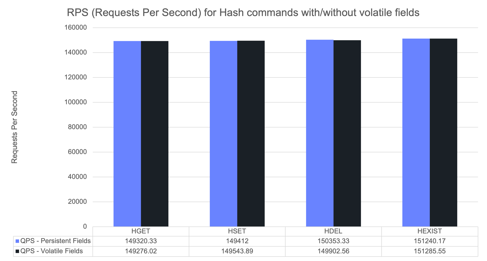

+++
title= "Introducing Hash Field Expirations"
date= 2025-09-15 00:00:00
description= "Support for volatile fields in Valkey hash objects"
authors= ["ranshid"]
[extra]
featured = true
featured_image = "/assets/media/featured/random-08.webp"
+++

One of the great strengths of Valkey has always been its built-in ability to expire keys. 
This simple but powerful mechanism lets developers keep their datasets fresh, automatically clear caches, or enforce session lifetimes without additional logic. 
But there has always been one limitation: expiration worked at the level of whole keys. 
If you stored multiple fields in a hash, you could set a TTL for the hash itself, but you couldn’t say 
“this field should live for 10 seconds while another field should stick around for 10 minutes.”

That limitation forced developers into awkward choices.

Imagine you’re running a feature flag system. You want to store all of a customer’s feature toggles inside one hash:

* Some flags are short-lived experiments, meant to turn off automatically after a few seconds or minutes.

* Others are long-term rollouts, where the toggle might remain valid for days or weeks.

If you only had key-level expirations, you were forced to compromise.
You could put all flags for a customer into a single hash, but then they would all share one expiration time.
Or, you could store each flag in its own key so that each could expire independently — but this would explode the number of keys your system has to manage, 
hurting memory efficiency and increasing overhead for operations.

The inability to set different TTLs per field meant developers either built complex cleanup processes outside of Valkey, or gave up flexibility in how expirations were handled.

### Technical Challenges and Design Alternatives
-----------------------------------------------

At first glance, adding field expirations might sound like a simple matter of storing timestamps per field.
In order to understand the problem, it’s important to understand how expiration is normally handled in Valkey today.

Valkey uses two complementary mechanisms to reclaim expired keys:

* Lazy expiration – A key is deleted only when accessed. 
  If you try to read or write an expired key, Valkey notices it has passed its TTL and deletes it immediately. 
  This is cheap, but untouched keys can linger indefinitely and waste memory.

* Active expiration – A background cron job runs 10 times per second, sampling a small set of keys with expiration. 
  Expired keys are deleted until a time budget is reached, ensuring memory is reclaimed proactively without introducing latency spikes.

For hash fields, we made a key design choice: we did not implement lazy expiration. 
Adding expiration checks to every HGET, HSET, or HDEL would have complicated the hot path of hash commands and risked performance regressions. 
Instead, we extended the active expiration job so that it can now also scan field-level expiration buckets, alongside top-level keys.

This approach keeps expiration logic unified, predictable, and free from new latency cliffs. 
But it also introduced a challenge: 
how do we efficiently track and clean up expired fields inside hashes that may contain thousands (or millions) of entries, 
when only a small subset are volatile — and an even smaller fraction are expired at any given time?
 
The challenge is balancing three conflicting goals:

* Keep memory usage small. Hashes can grow to millions of fields, so metadata overhead must be minimal.

* Maintain fast lookups and updates. Most hash commands run in O(1) time, and expiration tracking can’t change that.

* Reclaim memory efficiently. The active expiration job is time-bounded, so we need to minimize wasted CPU cycles spent scanning unexpired fields.

#### Alternatives We Considered
-------------------------------

We explored several approaches:

#### 1. Secondary hashtable per field expiration

This seemed simple: build a secondary hashtable in each Hash object which maps only volatile fields.


This is actually the way volatile generic keys are being tracked. Per each database, Valkey manage a secondary map mapping volatile keys.
During active expiration process the existing job scan the secondary map and each key found to pass it's assigned TTL is expired and it's memory is reclaimed.
The problem with this design option is the potential inefficiency introduced while scanning many items which should not expire.

#### 2. Radix Tree-based index

Using a radix tree to hold field names plus expirations provides sorted access for free. 


This is also not a new concept in Valkey. In fact this exact structure is being used to manage client connections blocked on key operations 
like `BLPOP`(/commands/blpop/) and `XREAD`(/commands/xread/).

But the memory overhead per node was high. During experiments we measured more than 54 bytes overhead per each hash field when using this type of index.

#### 3. Global sorted structure

We wanted to have the ability to efficiently scan over fields which are already expired. A good way to achieve this is by using a sorted index.
Using a radix tree was possible, but the memory overhead was high. Instead we could use a more lightweight data structure like a skip list, which memory consumption is more bounded
and is not governed by the data atrophy.


However, This would give O(log N) access to the index which did not work well with our target to keep hash operations constant time complexity.


### Coarse Buckets with Adaptive Encoding
-----------------------------------------

Instead of tracking every field’s expiration individually, we designed a coarse bucket system. 
Each field’s timestamp is mapped into a time bucket, represented by a shared “end timestamp.”


This solution introduces a semi-sorted data structure which we named 'vset' (stands for "volatile set").
The vset manages buckets in different time window resolutions and alternating encodings. 
Buckets can split if too many expirations cluster in one interval. 
This adaptability keeps the number of buckets small while ensuring they’re fine-grained enough for efficient cleanup.

When a new field with TTL is added, the vset either places it into an existing bucket or creates a new one. 
If a bucket grows too large, it is narrowed into smaller time windows to keep expiration scans efficient. 
For example: scanning 1,000 items in a single 10-second bucket may result in mostly misses, while spreading them across 10 smaller buckets avoids wasted work.
Why not always use a very small time window (e.g few milliseconds) for each bucket? The reason is memory.
Recall that the buckets are managed in a Radix-Tree which introduces a high overhead per each item. 
When many buckets are used, the memory overhead can be high and we might end up with the same memory overhead introduced by using a Radix-Tree index.

the 'vset' also uses different bucket encoding based on the number of items in the bucket.
A bucket with only a single element would require just a single pointer size of bytes.
A bucket of small amount of items would be encoded as a vector of item pointers, and when the bucket contains many items we will use 
the [Valkey hashtable](/blog/new-hash-table) structure to map the relevant items.
By leveraging data structures we already know how to optimize, we can further improve memory usage and performance with techniques like SIMD acceleration and memory prefetching.

A hash object that contains volatile fields now also carries a secondary vset index. 
At the database level, we maintain a global map of hashes with volatile fields. 
The active expiration cron job scans both regular keys and these hashes, but only iterates over vset buckets whose end time has passed. 
This ensures that CPU time is spent only on fields that are truly ready to expire.

On the storage side, expiration metadata is stored compactly, inlined alongside the hash’s key-value entries. 
If an expired field is accessed before the cron job has removed it, Valkey treats it as if it doesn’t exist (with a few well-documented exceptions).

#### Known limitations

To deliver hash field expirations in a way that is simple, performant, and memory-efficient, we made some deliberate trade-offs in the initial implementation.
As a result, there are a few limitations today that we plan to revisit in future releases:

1. Expired fields are treated as if they don’t exist when accessed through commands like [HGET](/commands/hget/) or [HGETALL](/commands/hgetall/).
   However, [HLEN](/commands/hlen/) provides an exception for this logic. 
   Because [HLEN](/commands/hlen/) is optimized to read only the metadata tracking the total number of fields in a hash, it may still count expired fields that haven’t yet been cleaned up by the background expiration job.
   This means that until cleanup occurs, [HLEN](/commands/hlen/) might temporarily report a higher count than the number of “live” fields.
2. The [HRANDFIELD](/commands/hrandfield/) command selects fields at random from the underlying hash object.
   If a hash contains many expired fields awaiting deletion, the selection process may frequently land on those expired entries.
   In practice, this can result in [HRANDFIELD](/commands/hrandfield/) returning an empty reply more often than expected, and it reduces the fairness of field sampling.
3. Valkey normally uses a highly compact representation for small hashes, which saves significant memory.
   To simplify the expiration design in Valkey 9.0, we chose to disable this compact encoding when a hash contains volatile fields (i.e., fields with TTLs).
   The impact is limited: only small hashes with field expirations are affected, but in those cases memory usage will be slightly higher than the fully compacted representation.

### Benchmarking our solution
-------------------------

Validating the new design meant benchmarking across several dimensions: memory overhead, command performance, and expiration efficiency.

#### Memory Overhead

We first measured the per-field memory overhead when setting TTLs.
The raw expiration time itself requires a constant 8 bytes (though this could be reduced in the future 
by storing only a delta relative to a reference timestamp, such as server start time).
On top of that, extra memory is needed for tracking within the vset.

The actual overhead depends on both how many fields have expirations and how spread out their expiration times are.
This is because the bucket encoding chosen by the vset adapts to the data distribution.
In practice, the overhead ranged between 16 and 29 bytes per field.


The higher end of this range primarily affects small hashes, where compact encodings 
like listpack are avoided when volatile fields are present.

#### Command Performance

Next, we benchmarked common hash commands both with and without field expirations.
The results showed no measurable performance regression and throughput remained stable when expirations were added.



We also benchmarked the new expiration-aware commands (e.g., HSETEX), confirming that their performance is on par with traditional hash operations.


#### Active Expiration Efficiency

The design goal of the vset was to enable efficient background deletion of expired fields.
To test this, we preloaded 10 million fields with TTLs.
We distributed these fields across varying numbers of hash objects to see how object size influences expiration.
During the load phase, we disabled the expiration job using the [DEBUG](/commands/debug/), then re-enabled it once all fields had expired.

The following chart shows the time it took the expiration cron job complete the full deletion of all the 10M fields.


The results revealed that expiration time depends not just on the number of fields, but also on how they are distributed across objects.
Smaller hashes tend to fit into CPU caches, so random field deletions remain cache-friendly.
Very large hashes, however, cannot fit entirely in cache, which means more expensive memory lookups during expiration.

We also simulated a more realistic scenario: *expiring data during continuous ingestion.*
Using the 'valkey-benchmark' executing the new [HSETEX](/commands/hsetex) command, we continuously 
inserted 10 million fields with 10-second TTLs, while the active expiration job ran in the background.

This setup maintained a constant pool of fields at different stages of their lifecycle — some fresh, some nearing expiration, some ready to be reclaimed.
We then tracked memory usage over a 5-minute period.


The results aligned with our theoretical expectation:

```
Memory = (Injection Throughput) x (AVG TTL) x (AVG Item memory)
```

In our experiment:

* Injection rate: 300K commands/sec

* Average TTL: 10 seconds

* Base item size: ~61 bytes

* Additional expiration overhead: ~19 bytes

This yields an expected memory footprint of ~230MB:

```
300K × 10 × 80B = 230MB
```

The observed memory matched this estimate closely, demonstrating that the active expiration mechanism 
is able to keep up with load and prevent memory from spiking unexpectedly.

### Conclusion
--------------

The benchmarks demonstrate that field-level expirations can be added to Valkey without compromising performance or stability.
The memory overhead remains modest and predictable, command throughput is unaffected, and the shared active expiration job efficiently reclaims memory even under heavy ingestion workloads.
Together, these results validate that the coarse-bucket design with adaptive encoding delivers the right balance of efficiency, scalability, and correctness, while preserving Valkey’s reputation for high performance and low latency.
