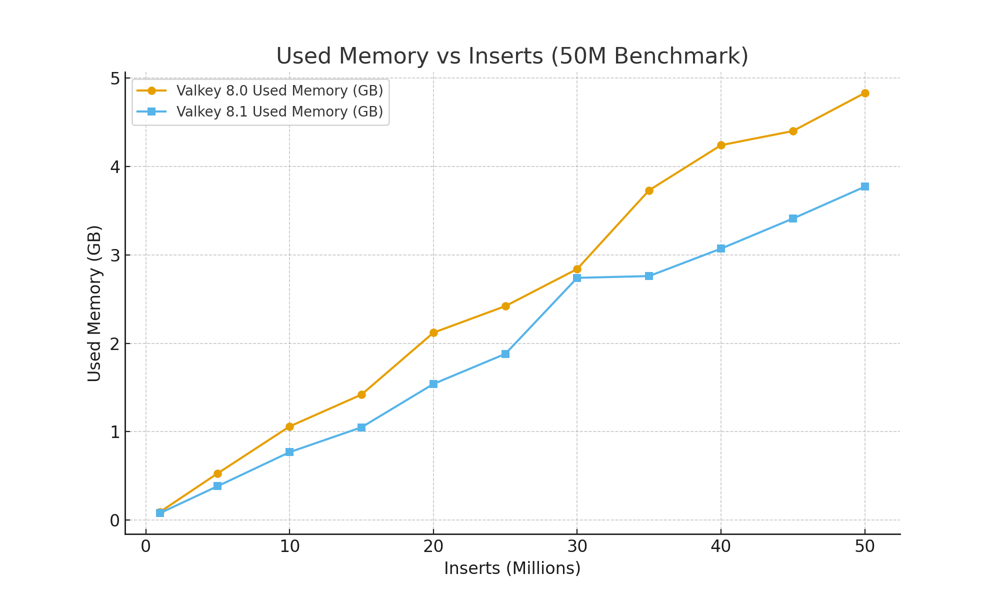

+++
title="How Valkey 8.1 Handles 50 Million Sorted Set Inserts"
date=2025-10-02 00:00:01
description= """ 
    hi
    """
authors= ["khawaja"]
[extra]
featured = true
featured_image = "/assets/media/featured/random-08.webp"
+++

When you run infrastructure at scale, the smallest efficiencies compound into massive savings. Sorted sets (ZSETs) are the backing data structure for far more than leaderboards. They're used for time‑ordered feeds, priority queues, recommendation rankings and more. Each entry carries per‑key overhead; when you're inserting tens of millions of items, those bytes accumulate into gigabytes. The latest Valkey 8.1 release introduces a [redesigned hash table](https://valkey.io/blog/valkey-8-1-0-ga/) and other optimizations that promise lower memory usage and higher throughput. In this post, we put Valkey 8.1 under pressure by benchmarking it against Valkey 8.0, inserting 50 million members into a sorted set and measuring memory consumption and throughput along the way.

## About Momento and Raider.IO

Momento builds enterprise‑grade real‑time data infrastructure. Our flagship service, [Momento Cache](https://gomomento.com), allows developers to focus on innovation rather than maintaining complex back‑ends. Behind the curtains, Valkey is one of the primary storage engines we operate. Its memory efficiency and predictable performance make it an ideal choice for mission‑critical workloads. By building on Valkey, we can deliver caching experiences that are fast, reliable, and cost‑effective.

One such workload is [Raider.IO](https://raider.io), the most popular companion site for World of Warcraft players. Raider.IO maintains leaderboards that track millions of characters and guilds, updating instantly whenever a player clears a dungeon or raid. That translates into hundreds of millions of sorted set operations every day. In this environment, downtime or latency isn't acceptable. Memory efficiency and throughput directly shape the player experience. Running Valkey at hyperscale for workloads like Raider.IO means that improvements in Valkey 8.1 immediately impact both infrastructure cost and the ability to absorb peak traffic without breaking a sweat.

## Benchmark Setup

To provide a fair comparison, both Valkey 8.0 and Valkey 8.1.1 were run on the same hardware:

* AWS c8g.2xl instance (Graviton4, 8 vCPU, 16 GB RAM)
* Identical settings for persistence, I/O threads and memory limits
* 50 million members inserted into a ZSET via pipelined ZADD commands (score=i, member=m:{i})
* 250,000 item batch size per pipeline
* Metrics collected every 1,000,000 inserts (flush between runs)

The benchmark code is open sourced and straightforward to reproduce: it connects to both servers, flushes the test key, performs batched inserts, and records `used_memory`, `used_memory_rss`, total elapsed time, and throughput after each million inserts. This repeatability mirrors the ethos of Valkey's community - every optimization is measurable, and anyone can verify the results.

## Memory Usage – 8.1 vs 8.0

Valkey 8.1's redesigned dictionary structure cuts [roughly 20–30 bytes per key](/blog/valkey-8-1-0-ga), and those savings compound with scale. The figure below charts `used_memory` during the benchmark for both versions:

At 1 million inserts, Valkey 8.0 used ~95 MB while Valkey 8.1 used ~81 MB. As the ZSET grew, the gap widened. By 10 million inserts, 8.0 consumed 1.06 GB versus 0.77 GB for 8.1 - **a 27% reduction**. At the end of the run (50 million inserts), 8.1 used 3.77 GB compared to 4.83 GB on 8.0, saving 1.06 GB (≈22 %).

These numbers align with the release notes. Valkey's 8.1 announcement highlights lower per‑key overheads and improved data structure handling; Linuxiac notes that 8.1's architectural changes can reduce memory footprints by [up to 20% while improving throughput](https://linuxiac.com/valkey-8-1-in-memory-data-store-unleashes-10-faster-throughput). Our results confirm those claims on a large ZSET workload.

## Throughput and Total Time

Memory isn't the only metric that matters. Throughput determines how quickly you can fill or update a set. Although Valkey 8.0 started strong with about 661k inserts per second at the 1M mark, its throughput gradually declined as the data set grew. Valkey 8.1 maintained higher and more consistent throughput, finishing the benchmark at 573k/s compared with 532k/s for 8.0. Overall time to insert 50 million members dropped from 94 seconds on 8.0 to 87 seconds on 8.1, a 7% improvement.

The smoother throughput curve is just as important as the raw peak. Spiky performance complicates capacity planning, especially when running close to memory limits. By contrast, Valkey 8.1's combination of improved hash‑table implementation and I/O thread optimizations delivers predictable scaling.

## Why These Gains Matter

For Raider.IO and similar workloads, these improvements translate directly into better economics and user experience:

* Lower infrastructure cost - Saving over a gigabyte per 50 M members means fewer nodes are needed to support the same dataset. At hyperscale, this compounds into significant cost reductions.
* More headroom during peaks - Efficiency gains provide a buffer during seasonal events like game expansions or esports tournaments. When leaderboards surge, there's less risk of hitting memory ceilings.
* Predictable scaling - A smoother memory growth curve and stable throughput make it easier to forecast when capacity needs to be added and to automate scaling policies.

These benefits don't just apply to leaderboards. Time‑ordered feeds (such as activity streams), job scheduling queues, recommendation rankings, rate‑limiting windows and search scoring all rely on sorted sets. In every case, per‑entry overhead multiplied by millions of entries determines whether you can do more with less. As the Linux Foundation explained, upgrading to Valkey 8.1 can reduce memory footprints for common workloads by up to 20%, helping enterprises scale while keeping costs in check.

## Closing Thoughts

As an operator who lives and breathes real‑time data systems, I'm continually amazed by the pace of innovation in the Valkey community. We didn't tune any configuration knobs to achieve these results - Valkey 8.1's efficiency is built in, and the improvements materialized instantly once we upgraded. On a 50 million‑entry benchmark, the new release used 27% less memory while delivering about 8% higher throughput, and completed the workload seven seconds faster than its predecessor. Those deltas may seem small in isolation, but at hyperscale they compound into transformative savings and more resilient services.

If you're running sorted set heavy workloads - whether leaderboards, feeds, queues or scoring engines - I encourage you to upgrade to Valkey 8.1 and run this benchmark yourself. Interested in how Valkey 8.1 stacked up to its competitors? [So were we](#)!

Our code is [open source](https://github.com/momentohq/sorted-set-benchmark) and available to run on your own hardware. I think you'll be pleasantly surprised by how much headroom you gain and how effortlessly Valkey handles pressure. The power of open source and community‑driven engineering continues to shine through in every release.
