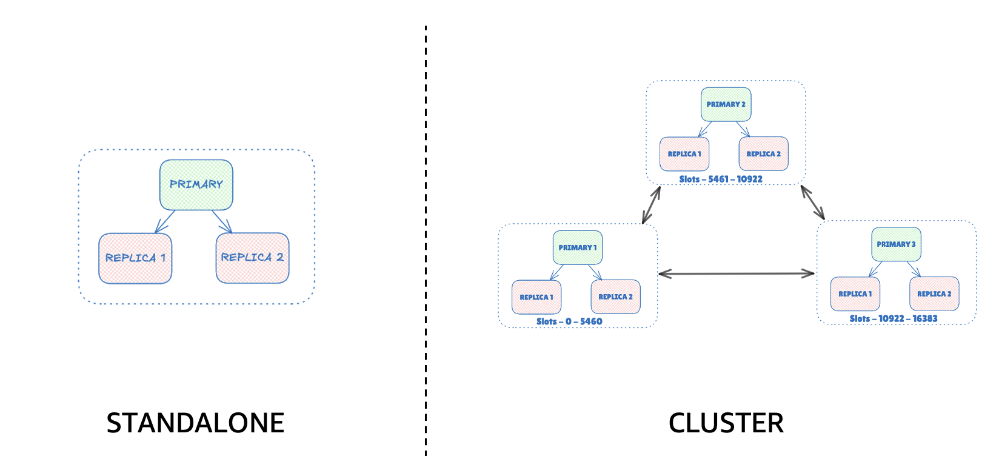
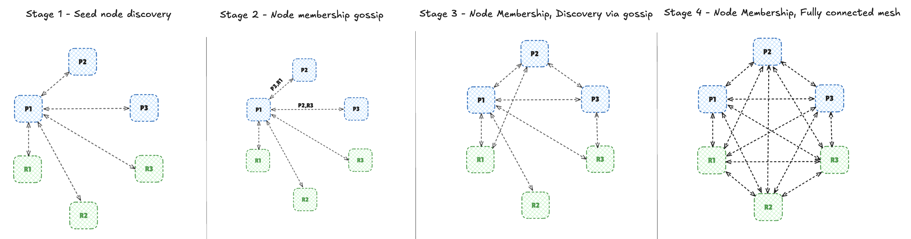
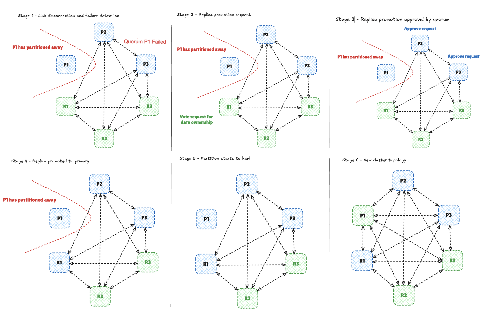
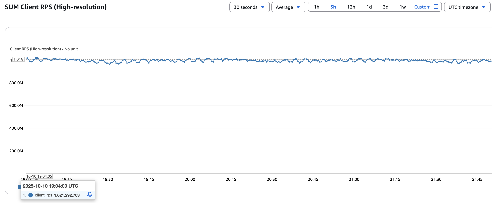
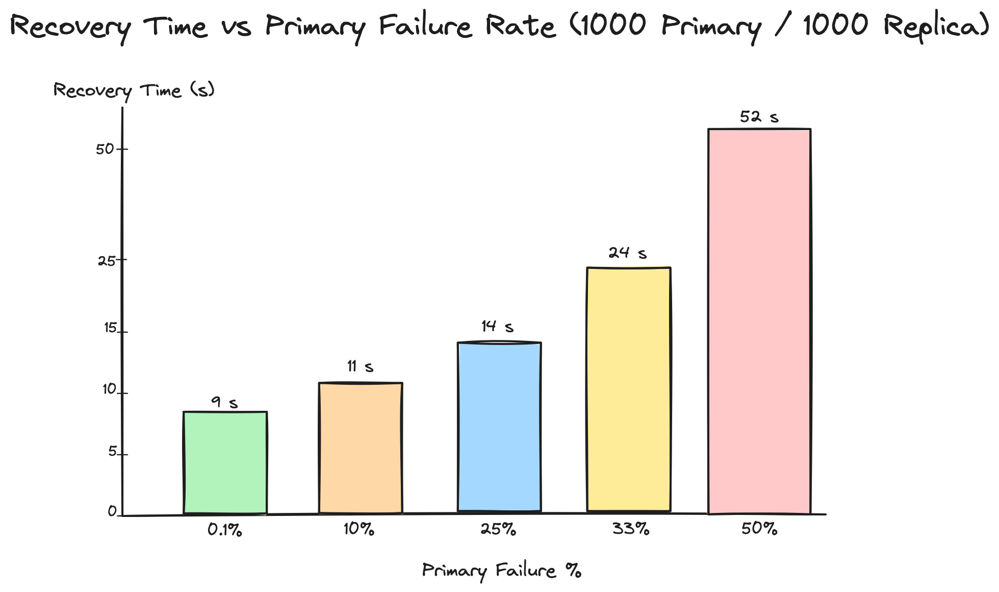

+++
title= "Scaling Valkey Cluster to 1 Billion RPS"
date= 2025-10-20 00:00:00
description= "Learn about the internal workings of cluster mode and the improvements which helped to scale to 1 Billion RPS with the latest Valkey 9.0 release"
authors= ["hpatro", "maheshcherukumilli", "sarthakaggarwal97", "sungming2"]
[extra]
featured = true
featured_image = "/assets/media/featured/random-04.webp"
+++

Valkey’s standalone configuration is a single server setup with optional replicas for availability, but all writes flow to one primary. It is one process, one dataset, zero coordination, blazing fast and simple to operate when a single machine’s CPU, memory, and NIC can carry the load. Valkey at scale moves past single node limits.

Valkey’s cluster mode shards the keyspace into **16,384 hash slots** (`CRC16(key) % 16384`) and spreads them across multiple primaries with replicas for redundancy. Clients are cluster aware: they route commands directly to the node owning the slot and follow redirections during resharding or failover. The result is horizontal scalability, balanced throughput, and built in fault tolerance without a central coordinator. Behind the scenes, the cluster bus keeps this distributed system coherent, coordinating membership, gossip, and failover.


## Cluster Bus Overview

Under the hood, nodes coordinate over the cluster bus a persistent TCP mesh with a lightweight, gossip-based protocol. It handles MEET (discovery), PING/PONG heartbeats with piggybacked cluster topology, quorum-based FAIL decisions, replica promotion elections, and epoch-based conflict resolution so the cluster converges cleanly after partitions. Since membership, health, and slot ownership flow through gossip, it allows Valkey to scale to large node counts while remaining resilient to node and network failures.

### Membership Discovery and Information Dissemination (Gossip)

Nodes join a Valkey cluster by sending a MEET message to any existing member (a seed). From there, the cluster bus, a mesh of persistent TCP links which spreads membership and topology using lightweight gossip of peers piggybacked on periodic PING/PONG heartbeats. This peer-to-peer exchange quickly converges every node on who’s in the cluster and which slots each primary owns, without any central coordinator.



### Cluster Bus - Failure Detection, Failover, and Epoch Update

When a node misses heartbeats beyond the configurable node-timeout, peers mark it potentially failed (**PFAIL** - suspect). If a quorum of primaries observes the timeout, they declare **FAIL** and initiate failover: replica(s) of the failed primary become candidate to take over the ownership of the shard and send vote requests to all the primaries. Primaries respond and the winner is promoted to serve the affected slots. Clients that hit the old owner receive `MOVED/ASK` and transparently retry against the new primary.



## Major improvements to scale Cluster Bus in Valkey

Across multiple major/minor versions, the community has improved cluster stability a lot and have made multiple changes to handle various failure scenarios to heal the system in a steady manner and avoid any manual intervention. Here are few of the interesting ones.

* **Multiple primary failures** Failover operation across cluster is serialized. Hence, only one shard can undergo failover at a given point in time. When there are multiple primary outage across the cluster, it used to lead to collision of vote request from replica candidate of impacted shards. Due to the collision, the votes would get split and the cluster won’t reach to consensus of promoting a replica in a given cycle. With large number of primary failing, the cluster won’t heal automatically and further an operator needed to manual intervene. 
This problem was tackled by [Binbin Zhu](https://github.com/enjoy-binbin) in Valkey 8.1 by introducing a [ranking mechanism](https://github.com/valkey-io/valkey/pull/1018)  to each shard based on lexicographic order of shard id. With the ranking algorithm, the shard with highest ranking would go sooner and the one with lower ranking would add additional delay to start the election for the given shard. This helped to get a consistent recovery time with multiple primary outage.
* **Reconnection attempt storm to unavailable nodes** During profiling of the cluster with multiple node failures, we observed that a chunk of compute goes into attempting to reconnect with the already failed nodes. Each node attempts to reconnect to all the failed nodes every hundred milliseconds. This lead to significant compute usage when there are 100s of failed nodes in the cluster. In order to prevent the cluster from getting overwhelmed, [Sarthak Aggarwal](https://github.com/sarthakaggarwal97) implemented a [throttling mechanism](https://github.com/valkey-io/valkey/pull/2154) which allows enough reconnect attempts within a configured cluster node timeout, while ensuring server node is not overwhelmed.
* **Optimized failure report tracking** In our experiments we observed that when hundreds of nodes fail simultaneously, the surviving nodes spend a significant amount of time processing and cleaning up redundant failure reports. For example, after 499 out of 2000 nodes were killed, the remaining 1501 nodes continued to gossip about each failed node and exchange reports, even after those nodes had already been marked as failed. [Seungmin Lee](https://github.com/sungming2) optimized the [addition / removal of failure report](https://github.com/valkey-io/valkey/pull/2277) by using a radix tree to store the information rounded to every second and group multiple report together. This helps with cleaning up expired failure report efficiently as well. Further optimization were also made to avoid duplicate failure report processing and save CPU cycles.
* **Pub/Sub System** Cluster bus system is also used for [pub/sub operations](https://valkey.io/topics/pubsub/) to provide a simplified interface for a client to connect to any node to publish data and subscribers connected on any node would receive the data. The data is transported via the cluster bus. This is quite an interesting usage of the cluster bus. However, the metadata overhead of each packet is roughly 2 KB which is quite large for small pub/sub messages. The observation was the packet header was large due to the slot ownership information (16384 bits = 2048 bytes). And that information was irrelevant for a pub/sub message. Hence, [Roshan Khatri](https://github.com/roshkhatri) introduced a [light weight message header](https://github.com/valkey-io/valkey/pull/654) (~30 bytes) to be used for efficient message transfer across nodes. This allowed pub/sub to scale better with large clusters.
We also have a sharded pub/sub system which keeps the data traffic of shard channels to a given shard which is an major improvement over the global pub/sub system in cluster mode. This was also onboarded to the light weight message header. 

We have plenty of other improvements to increase the overall stability of the clustering system. All these enhancements allowed us to scale to 2000 nodes with bounded recovery time during network partitions and below we have documented our setup and the throughput we were able to attain with the setup.

## Benchmarking

In order to scale the Valkey cluster scale upto 1B RPS for write command, we decided to choose a SET type command to accurately reflect the scale. We have seen previous experiments where a single instance was able to achieve more than [1M RPS](/blog/unlock-one-million-rps) so our goal was to reach 1B RPS with a 2000 node cluster, where each shard has 1 primary and 1 replica. A replica is added to each shard for better availability.

**Hardware Configuration**
For this experiment, we performed our experiments with AWS `r7g.2xlarge`, which is a memory optimized instance, featuring 8 cores and 64 GB memory on an ARM-based (`aarch64`) architecture. In order to generate enough traffic across all the slots, we used 750 instances of AWS `c7g.16xlarge`. 

**System Configuration**

Note: The core assignments used in this guide are examples. Optimal core selection may vary depending on your specific system configuration and workload.

Each of our valkey server nodes had 8 cores, so we decided to pin 2 cores to ensure interrupt affinity.

```
# identify the network interface, in our case, it was ens5
IFACE=$(ip route | awk '/default/ {{print $5; exit}}')

# expose two combined Rx/Tx queues
sudo ethtool -L "$IFACE" combined 2

# grab exactly the two IRQ numbers that belong to those queues
IRQS=($(grep -w "$IFACE" /proc/interrupts | awk '{{gsub(":","",$1); print $1}}'))
IRQ0=${{IRQS[0]}}
IRQ1=${{IRQS[1]}}

# pin queue-0 interrupt to CPU0
echo 0 | sudo tee /proc/irq/$IRQ0/smp_affinity_list   # bind IRQ0 → CPU 0
echo 1 | sudo tee /proc/irq/$IRQ1/smp_affinity_list   # bind IRQ1 → CPU 1
sudo systemctl stop irqbalance
```

We increased the default limit of file descriptors of the instance so that the node is able to handle connections from the valkey cluster nodes and the clients. 

```
# increase max conn
ulimit -n 1048544
```

With, 6 cores left on the node, we decided to assign all the remaining cores to the `valkey-server`, so that the 6 `io-threads` (including the `main thread`) can leverage the most from the instance.


```
# pin 6 cores to valkey-server
CPUSET=2-7
sudo cset shield --cpu=$CPUSET --kthread=on
sudo cset shield --exec taskset -- -c $CPUSET ./valkey-server valkey-cluster.conf --daemonize yes
```

**Server Configuration**

We launched each of Valkey process with minimal changes to the default configurations.

```
cluster-enabled yes
cluster-config-file nodes.conf
protected-mode no
cluster-require-full-coverage no
cluster-allow-reads-when-down yes
save ""
io-threads 6
maxmemory 50gb
```

Cluster mode was enabled via `cluster-enabled` set to `yes` with a cluster config file `nodes.conf` to persist the topology information int it. To prioritize availability, `cluster-require-full-coverage` was set to `no` and `cluster-allow-reads-when-down` was set to `yes` to ensure reads and partial operations continue even under slot loss or reconfiguration. Periodic snapshotting was disabled with `save ""`, and high concurrency is sustained via utilizing `io-threads` which was set to `6`. Each node is provisioned with `maxmemory 50gb` to control dataset and prevent node from being out of memory while benchmarking.

**Benchmark Configurations**

We ran the `valkey-benchmark` from 750 client instances to generate the required traffic. We used the following parameters for each of those instances.

* Number of requests (-n): `100M`
* Number of clients (-c): `1000`
* Test (-t): `SET`
* Data Size (-d): `512`
* Threads: `20` 



Overall observation has been that the throughput grows almost linearly with the overall count of primaries and cluster bus has a minimal overhead with the default node timeout.

### Recovery

In the same environment, we tested recovery time of cluster when multiple primary node goes down. We picked upto 50% of the primaries and killed them and let the automatic failover process to heal the write outage for a given shard. To simulate primary node failures, we sent SIGKILL to hard-stop the valkey process, and let the replica take over through automated failovers. The recovery time measured here is from the moment any of the nodes discovered a primary in a PFAIL state until the cluster reported ok and all slots were covered again. 


## Closing thoughts

With all these improvements made in Valkey, a cluster can now scale to 1B RPS / 2000 nodes which is quite a remarkable feat to achieve. However, there is plenty of room to improve further. The steady state CPU utilization overhead from the cluster bus message transfer/processing can be reduced further by incorporating [SWIM protocol](https://en.wikipedia.org/wiki/SWIM_Protocol) or move it off the main thread into an independent separate thread. The failover logic can be made smarter as well by incorporating the AZ placement of nodes. We would also like to introduce more observability metrics/logs into the system for better manageability of it. All of these are being linked under [Support Large Cluster](https://github.com/valkey-io/valkey/issues/2281) issue. Feel free to check it out and add in your suggestions.
