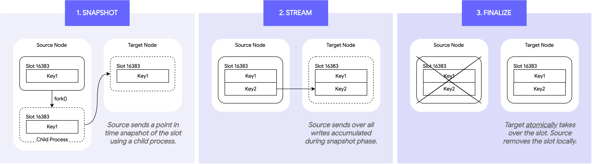
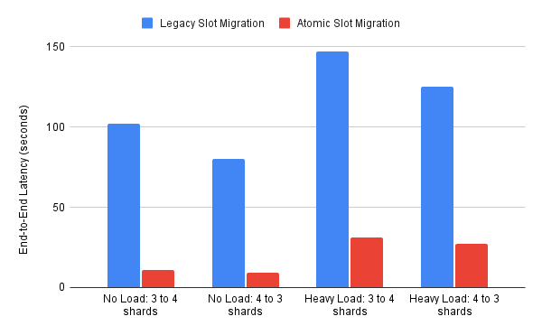
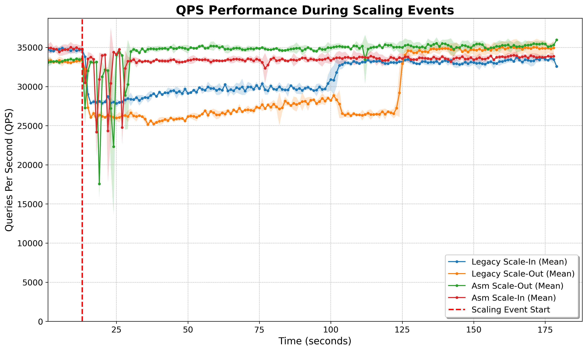
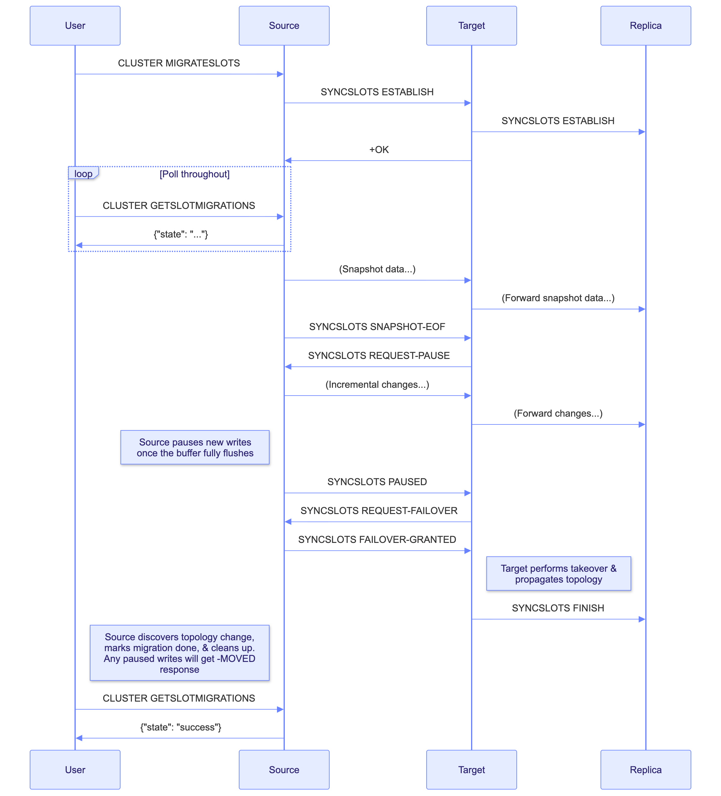

+++
title= "Resharding, Reimagined: Introducing Atomic Slot Migration"
date= 2025-10-29 00:00:00
description= "Learn about the benefits of Atomic Slot Migration and how it works."
authors= ["murphyjacob4"]
[extra]
featured = true
featured_image = "/assets/media/featured/random-05.webp"
+++

Managing the topology of a distributed database is one of the most critical and
challenging tasks for any operator. For a high-performance system like Valkey,
moving data slots between nodes—a process known as resharding—needs to be fast,
reliable, and easy.

Clustered Valkey has historically supported resharding through a process known
as slot migration, where one or more of the 16384 slots is moved from one shard
to another. This slot migration process has historically led to many operational
headaches. To address this, we’ve introduced a powerful new feature that
fundamentally improves this process: **Atomic Slot Migration**.

Atomic Slot Migration includes many benefits that we hope will make resharding
painless. This includes:

- A simpler, one-shot command interface supporting multiple slot ranges in a
  single migration.
- Built-in cancellation support and automated rollback on failure
- Improved large key handling
- Up to 9x faster slot migrations
- Greatly reduced client impact during migrations

Let's dive into how it works and what it means for you.

## Background: The Legacy Slot Migration Process

Prior to Valkey 9.0, a slot migration from a source node to a target node was
performed through the following steps:

1. Send `<target>`: `CLUSTER SETSLOT <slot> IMPORTING <source>`
2. Send `<source>`: `CLUSTER SETSLOT <slot> MIGRATING <target>`
3. Send `<source>`: `CLUSTER GETKEYSINSLOT <slot> <count>`
4. Send `<source>`: `MIGRATE ...` for each key in the result of step 3
5. Repeat 3 & 4 until no keys are left in the slot on `<source>`
6. Send `<target>`: `CLUSTER SETSLOT <slot> NODE <target>`
7. Send `<source>`: `CLUSTER SETSLOT <slot> NODE <target>`

This was subject to the following problems:

- **Higher latency for client operations**: All client writes and reads to keys
  in the migrating hash slot were subject to redirections through a special
  `-ASK` error response, which required re-execution of the command on the
  target node. Redirected responses meant unexpected latency spikes during
  migrations.
- **Multi-key operation unavailability**: Commands like `MGET` and `MSET` which
  supply multiple keys could not always be served by a single node when slots
  were migrating. When this happened, clients would receive error responses and
  were expected to retry.
- **Problems with large keys/collections**: Since the migration was performed
  one key at a time, large keys (e.g. collections with many elements) needed to
  be sent as a single command. Serialization of a large key required a large
  contiguous memory chunk on the source node and import of that payload required
  a similar large memory chunk and a large CPU burst on the target node. In some
  cases, the memory consumption was enough to trigger out-of-memory conditions
  on either side, or the CPU burst could be large enough to cause a failover on
  the target shard due to health probes not being served.
- **Slot migration latency**: The overall latency of the slot migration was
  bounded by how quickly the operator could send the `CLUSTER GETKEYSINSLOT` and
  `MIGRATE` commands. Each batch of keys required a full round-trip-time between
  the operator's machine and the cluster, leaving a lot of waiting time that
  could be used to do data migration.
- **Lack of resilience to failure**: If a failure condition was encountered, for
  example, the hash slot will not fit on the target node, undoing the slot
  migration is not well supported and requires replaying the listed steps in
  reverse. In some cases, the hash slot may have grown while the migration was
  underway, and may not fit on either the source or target node.

## The Core Idea: Migration via Replication

At its heart, the new atomic slot migration process closely resembles the
concepts of replication and failover which serve as the backbone for high
availability within Valkey. When atomic slot migration is requested, data is
asynchronously sent from the old owner (the source node) to the new owner (the
target node). Once all data is transferred and the target is completely caught
up, the ownership is atomically transferred to the target node.

This gets logically broken down into three phases:

1. **Snapshot Phase**: The source node first sends a point-in-time snapshot of
   all the data in the migrating slots to the target node. The snapshot is done
   asynchronously through a child process, allowing the parent process to
   continue serving requests. The snapshot is formatted as a stream of commands
   which the target node and its replica can consume verbatim.
2. **Streaming Phase**: While the snapshot is ongoing, the source node will keep
   track of all new mutations made to the migrating slots. Once the snapshotting
   completes, the source node streams all incremental changes for those slots to
   the target.
3. **Finalization Phase**: Once the stream of changes has been sent to the
   target, the source node briefly pauses mutations. Only once the target has
   fully processed these changes does it acquire ownership of the migrating
   slots and broadcast ownership to the cluster. When the source node discovers
   this, it knows it can delete the contents of those slots and redirect any
   paused clients to the new owner **atomically**.

## Why is this better?

By replicating the slot contents and atomically transferring ownership, Atomic
Slot Migration provides many desirable properties over the previous mechanism:

- **Clients are unaware**: Since the entire hash slot is replicated before any
  cleanup is done on the source node, clients are completely unaware of the slot
  migration, and no longer need to follow `ASK` redirections and retry errors
  for multi-key operations.
- **Keys no longer need to be atomically moved**: Collections are moved as
  chunks of elements that are replayed as commands, preventing the reliability
  problems previously encountered when dumping and restoring a large collection.
- **A migration can easily be rolled back on cancellation or failure**: Since
  the hash slots are placed in a staging area, we can easily wipe them
  independently of the rest of the database. Since this state is not broadcasted
  to the cluster, ending the migration is as simple as cleaning up the staging
  area and marking the migration as cancelled. Many failures, like
  out-of-memory, failover, or network partition can be handled completely by the
  engine.
- **Greatly improved slot migration latency**: Valkey is highly-optimized for
  replication. By batching the slot migrations and using this replication-like
  process, the end-to-end migration latency can improve by as much as 9x when
  compared to legacy slot migration through `valkey-cli`.

## How to use Atomic Slot Migration

A new family of `CLUSTER` commands gives you full control over the migration
lifecycle.

- `CLUSTER MIGRATESLOTS SLOTSRANGE <start> <end> ... NODE <node-id>`
  - This command kicks off the migration. You can specify one or more slot
    ranges and the target node ID to begin pushing data.
- `CLUSTER CANCELSLOTMIGRATIONS`
  - Use this command to safely cancel all ongoing slot migrations originating
    from the node.
- `CLUSTER GETSLOTMIGRATIONS`
  - This gives you an observable log of recent and active migrations, allowing
    you to monitor the status, duration, and outcome of each job. Slot migration
    jobs are stored in memory, allowing for simple programmatic access and error
    handling.

## Legacy vs. Atomic: Head-to-Head Results

To show just how much of an improvement atomic slot migration is, we conducted
some head-to-head experiments.

### Test Setup

To make things reproducible, the test setup is outlined below:

- Valkey cluster nodes are `c4-standard-8` GCE VMs spread across GCP’s
  us-central1 region running Valkey 9.0.0
- Client machine is a separate `c4-standard-8` GCE VM in us-central1-f
- Rebalancing is done with the `valkey-cli --cluster rebalance` command, with
  all parameters defaulted. The only exception is when we run scale in, we use
  `--cluster-weight` to set the weights to only allocate to 3 shards.
- The cluster is filled with 40 GB of data consisting of 16KB string valued keys

### Slot Migration Latency: Who's Faster?

We did two tests: one with no load and one with heavy read/write load. The heavy
load is simulated using memtier-benchmark with a 1:10 set/get ratio on the
client machine specified above.

<table>
  <tr>
    <th>Test Case</th>
    <th>Legacy Slot Migration</th>
    <th>Atomic Slot Migration</th>
    <th>Speedup</th>
  </tr>
  <tr>
    <td>No Load: 3 to 4 shards</td>
    <td>1m42.089s</td>
    <td>0m10.723s</td>
    <td style="background-color:#228b22;">9.52x</td>
  </tr>
  <tr>
    <td>No Load: 4 to 3 shards</td>
    <td>1m20.270s</td>
    <td>0m9.507s</td>
    <td style="background-color:#36a336;">8.44x</td>
  </tr>
  <tr>
    <td>Heavy Load: 3 to 4 shards</td>
    <td>2m27.276s</td>
    <td>0m30.995s</td>
    <td style="background-color:#7fd37f;">4.75x</td>
  </tr>
  <tr>
    <td>Heavy Load: 4 to 3 shards</td>
    <td>2m5.328s</td>
    <td>0m27.105s</td>
    <td style="background-color:#86d686;">4.62x</td>
  </tr>
</table>

The main culprit here is unnecessary network round trips (RTTs) in legacy slot
migration. Each slot requires:

- 2 RTTs to call SETSLOT and begin the migration
- Each batch of keys in a slot requires:
  - 1 RTT for CLUSTER GETKEYSINSLOT
  - 1 RTT for MIGRATE 1 round trip for the actual migration of the key batch
    from source to target node.
- 2 RTTs to call SETSLOT and end the migration

Those round trip times add up. For our cluster where we are moving an average of
160 keys in each slot and using `valkey-cli`'s default batch size of 10, we
would expect an average of 52 round trips per slot. Since we need to move 4096
slots, that’s 212,992 round trips. We would spend over a minute just waiting for
network round trips with just a 300 microsecond average round trip time.

By removing this overhead, atomic slot migration is now only bounded by the
speed that one node can push data to another, achieving much faster end-to-end
latency.

### Client Impact: How Would Applications Respond?

We measured the throughput of a simulated
[valkey-py](https://github.com/valkey-io/valkey-py) workload with 1:10 set/get
ratio while doing each scaling event. We conducted three trials, and averages
are shown below.

Despite atomic slot migration causing a more acute throughput hit, you can see
the recovery of the client application is much faster due to far fewer topology
changes and an overall lower end-to-end latency. Each topology change needs to
be handled by the Valkey client, so the quicker the topology changes are made,
the sooner the impact ends. By collapsing the topology changes and performing
atomic handover, atomic slot migration leads to less client impact overall than
legacy slot migration.

## Under the Hood: State Machines and Control Commands

To coordinate the complex dance between the two nodes, a new internal command,
`CLUSTER SYNCSLOTS`, is introduced. This command orchestrates the state machine
with the following sub-commands:

- `CLUSTER SYNCSLOTS ESTABLISH SOURCE <source-node-id> NAME <unique-migration-name> SLOTSRANGE <start> <end> ...`
  - Informs the target node of an in progress slot migration and begins tracking
    the current connection as a slot migration link.
- `CLUSTER SYNCSLOTS SNAPSHOT-EOF`
  - Used as a marker to inform the target the full snapshot of the hash slot
    contents have been sent.
- `CLUSTER SYNCSLOTS REQUEST-PAUSE`
  - Informs the source node that the target has received all of the snapshot and
    is ready to proceed.
- `CLUSTER SYNCSLOTS PAUSED`
  - Used as a marker to inform the target no more mutations should occur as the
    source has paused mutations.
- `CLUSTER SYNCSLOTS REQUEST-FAILOVER`
  - Informs the source node that the target is fully caught up and ready to take
    over the hash slots.
- `CLUSTER SYNCSLOTS FAILOVER-GRANTED`
  - Informs the target node that the source node is still paused and takeover
    can be safely performed.
- `CLUSTER SYNCSLOTS FINISH`
  - Inform the replica of the target node that a migration is completed (or
    failed).
- `CLUSTER SYNCSLOTS CAPA`
  - Reserved command allowing capability negotiation.

The diagram below shows how CLUSTER SYNCSLOTS is used internally to drive a slot
migration from start to finish:

## Get Started Today!

This new Atomic slot migration is a massive step forward for Valkey cluster
management. It provides a faster, more reliable, and overall easier mechanism
for resharding your data.

We encourage you to download Valkey 9.0 and try Atomic Slot Migration for
yourself! A huge thank you to everyone in the community who contributed to the
design and implementation.
