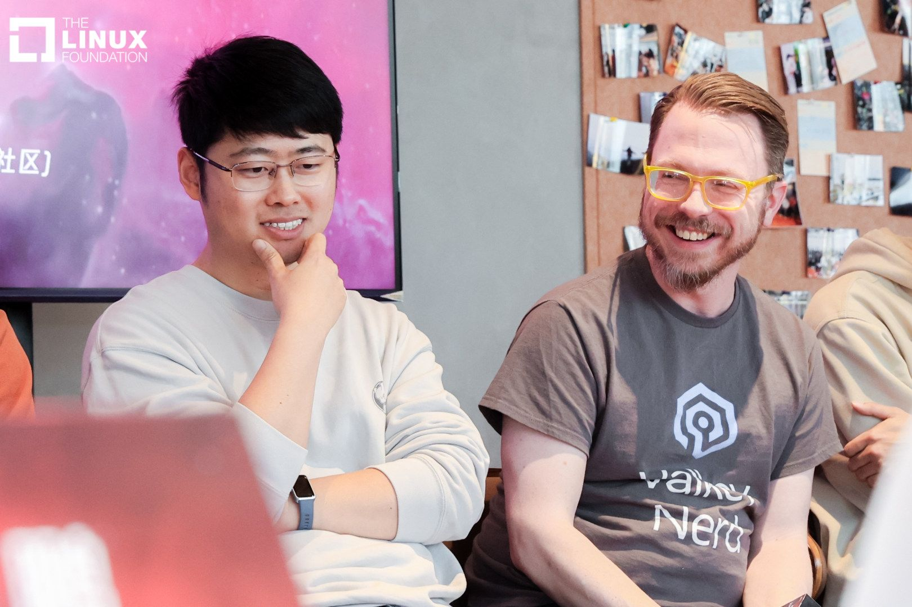
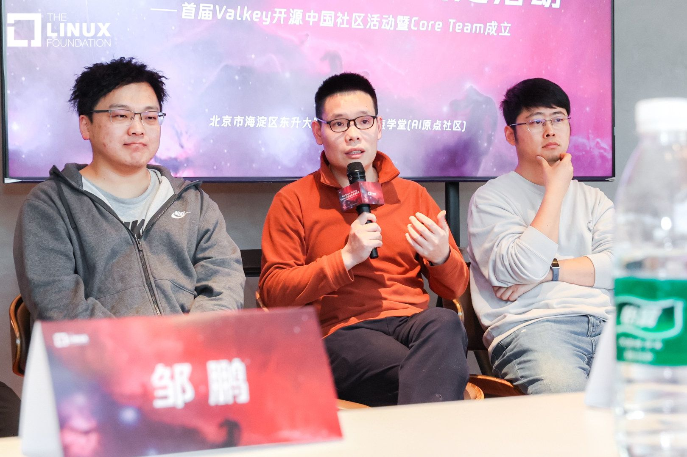
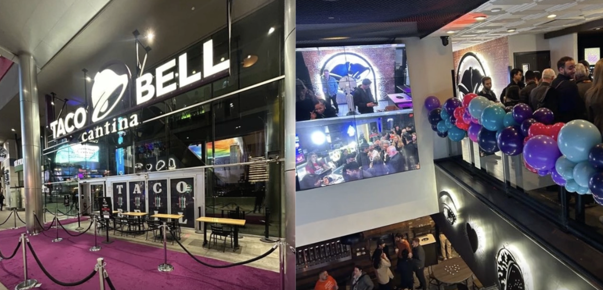

+++
title = "Valkey 2025 Year-End Review: Reflecting on Progress and Looking Ahead"
date = 2026-01-20
description = "This past year marked an important chapter for Valkey, one defined by growth, collaboration, and a shared commitment to building an open, high-performance key-value store for everyone."
authors= ["madolson"], ["kyledvs"], ["crystalpham"]
+++

As we kick off 2026, it’s a great moment to pause, reflect, and celebrate what the Valkey project and its community has accomplished together. This past year marked an important chapter for Valkey, one defined by growth, collaboration, and a shared commitment to building an open, high-performance key-value store for everyone.
## 2025 Key Milestones
This past year brought meaningful progress across the Valkey ecosystem. Some highlights include:
* [Valkey bundle](https://valkey.io/blog/valkey-bundle-one-stop-shop-for-low-latency-modern-applications/)
    * JSON
    * Bloom
    * Vector Search
    * LDAP
* [Valkey 8.1 release](https://valkey.io/blog/valkey-8-1-0-ga/)
* [Valkey 9.0 release](https://valkey.io/blog/introducing-valkey-9/)
Valkey 9.0 brings innovation, long-requested features, and improvements to classic features updated with 1 billion+ RPS clusters, 40% higher throughput, and major feature launches including:
    * Hash field expiration — fine-grained TTLs that automatically free memory
    * Atomic slot migration — seamless, zero-error resharding with no downtime
    * Multiple databases in cluster mode — isolate workloads within a single cluster
* Technical milestones
    * [Try Valkey](https://valkey.io/try-valkey/)
    * [Valkey Glide](https://valkey.io/blog/az-affinity-strategy/) 
    * [Helm Chart ](https://valkey.io/blog/valkey-helm-chart/) 
    * [Performance Dashboards ](https://valkey.io/performance/)
    * [Valkey swift](https://valkey.io/blog/valkey-swift/)
## Community Growth
### 2025 events recap
We hosted our first Valkey conferences, [Keyspace Amsterdam](https://events.linuxfoundation.org/keyspace/) and [Keyspace Beijing](https://valkey.io/events/keyspace-beijing-2025/)! At Keyspace Amsterdam, Sr. Developer Advocate Roberto Luna Rojas presented [“Valkey‑bundle: One‑stop shop for real‑time applications."](https://bit.ly/4qlG1M1) You can revisit KeySpace Amsterdam content anytime through the session playlist [here](https://www.youtube.com/watch?v=5jko_JMQVpg&list=PLAV1X7hxH2HtZWc2YNQRMQe9FT9XTWemE).

While in Beijing, some of the Valkey community members joined a panel to share insights on Valkey and real‑world adoption. More than 65+ in-person and 1,000+ on-stream consisting of developers, SREs, and DevOps professionals came together to exchange ideas, share best practices, and explore new use cases powered by Valkey. 

At [AWS re:Invent](https://reinvent.awsevents.com/) in Las Vegas, Valkey took over the Strip’s iconic Taco Bell Cantina for the three-floor House of Valkey, turning the conference into a true party hub. Attendees enjoyed deep technical conversations, live performers, giveaways, and exclusive swag. 

At [Open Source Summit Japan](https://www.youtube.com/watch?v=8-trRjBr81I&list=PLbzoR-pLrL6pRN6kobVnmu0rY2RLLczAj), Madelyn Olson of the Valkey Technical Steering Committee and Roberto Luna Rojas, Sr. Developer Advocate, presented sessions on open source governance, Linux packaging, community transitions, and GitHub best practices. [Watch the session here.](https://www.youtube.com/watch?v=eW3uLjIj69g)

Beyond those key highlights, the Valkey team and community stayed active throughout the year, showing up at many events around the world. [SymfonyCon Amsterdam](https://live.symfony.com/2025-amsterdam-con/) added a playful splash to the calendar as the Symfony community marked its 20th anniversary with bouncy balls, ball pits, and cake. Valkey also made its mark at [NDC London](https://ndcconferences.com/), where attendees met Sr. OSS Developer Advocate, Nigel Brown and stocked up on Valkey beanies and stickers. Valkey’s presence extended even further across [PyCon Africa](https://za.pycon.org/), [PyCon Australia](https://2025.pycon.org.au/), [Laracon](https://laracon.us/), [Aspara](https://www.alibabacloud.com/en/apsara-conference?_p_lc=1), and more continuing to build meaningful connections and celebrate the growing global Valkey community.

## Where to next for the Valkey community
In 2026, Valkey will be on the road again, with appearances planned at the [Unlocked conference](https://unlocked.gomomento.com/) and [Laracon India 2026](https://laracon.in/) from January 31st - February 1st, with even more events to be announced as the year unfolds.
## Valkey contributors (2025) 
In 2025, the Valkey project had 346 active contributors which are individuals who performed activities such as commits, issues, or pull requests during the selected time period. Source: [LFX analytics](https://insights.linuxfoundation.org/project/valkey?timeRange=past365days&start=2025-01-15&end=2026-01-15)
    * 60 active organizations: Organizations that had at least one active contributor during the selected period. *Source: LFX analytics

## Valkey in the news
* DBTA: [Valkey 9.0 Offers Performance and Resiliency for Real-Time Workloads](https://www.dbta.com/Editorial/News-Flashes/Valkey-90-Offers-Performance-and-Resiliency-for-Real-Time-Workloads-172148.aspx)
* diginomica: [Valkey 9.0 – open-source velocity and the pursuit of real-time resilience](https://diginomica.com/valkey-90-open-source-velocity-and-pursuit-real-time-resilience)
* It's FOSS: [Valkey 9.0 Adds Multi-Database Clusters, Supports 1 Billion Requests Per Second](https://news.itsfoss.com/valkey-9-release/)
* Runtime: [Datadog answers a burning question; IaC has a new player](https://www.runtime.news/datadog-answers-a-burning-question-iac-has-a-new-player/)
* The New Stack: [How the Team Behind Valkey Knew It Was Time to Fork](https://thenewstack.io/how-the-team-behind-valkey-knew-it-was-time-to-fork/)
* The New Stack: [Open Source: Inside 2025's 4 Biggest Trends - The New Stack](https://thenewstack.io/open-source-inside-2025s-4-biggest-trends/)

## 2026 Valkey Community Goals
Looking ahead into 2026, the Valkey Project and its community will focus on:
* Making Valkey easier to [run](https://github.com/valkey-io/valkey-operator), scale ([1](https://github.com/valkey-io/valkey/issues/2392), [2](https://github.com/valkey-io/valkey/issues/2392), [3](https://github.com/valkey-io/valkey/issues/2957), [4](https://github.com/valkey-io/valkey/issues/2878)), [manage, and observe](https://github.com/valkey-io/valkey-admin)
* Better utilizing existing infrastructure to take advantage of modern CPUs with multi-threading and higher performance ([1](https://github.com/valkey-io/valkey/pull/2470), [2](https://github.com/valkey-io/valkey/issues/2022), [3](https://github.com/valkey-io/valkey/issues/1483)) , and squeezing out more memory efficiency ([1](https://github.com/valkey-io/valkey/pull/2516), [2](https://github.com/valkey-io/valkey/pull/2508), [3](https://github.com/valkey-io/valkey/pull/2867), [4](https://github.com/valkey-io/valkey/issues/2618)),
* Building deeper connections to other open source projects to be optimized for Valkey,
* Providing a wider network of local groups of Valkey enthusiast.

We’re excited about what’s ahead and committed to evolving Valkey project in ways that serve both current community members and future adopters.

## Thank You
Thank you to everyone who contributed code, tested releases, filed issues, shared feedback, or adopted Valkey in production. Your continued involvement strengthens and advances the Valkey project.

## Get Involved
To learn more and explore ways to get involved in the community:
* If you would like to contribute to the mission, please consider joining the [Valkey community here](https://valkey.io/community/), where community members contribute and shape the future of the Valkey project.
* Follow along on our social channels for the latest Valkey community news, event recaps, and project developments ([LinkedIn](https://www.linkedin.com/company/valkey/), [X](https://x.com/valkey_io), and [BlueSky](https://bsky.app/profile/valkeyio.bsky.social)).