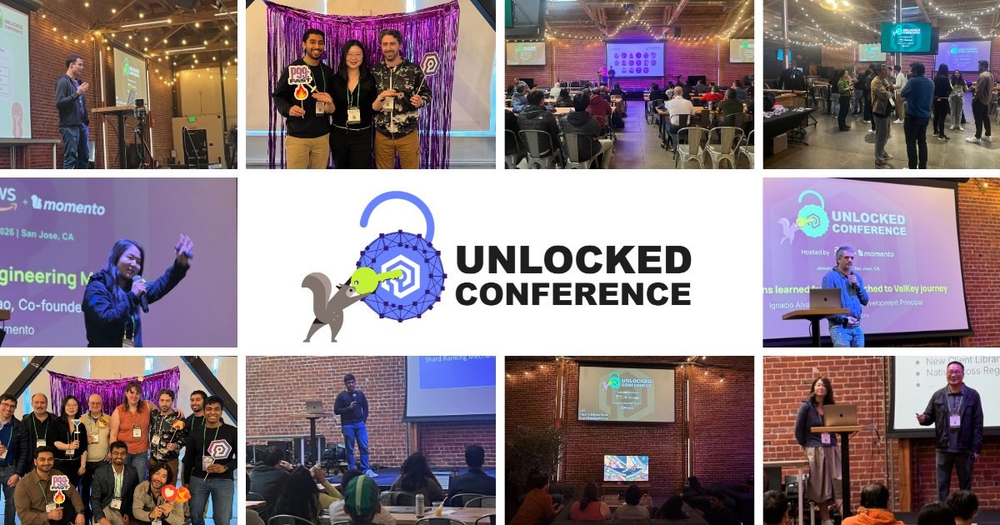
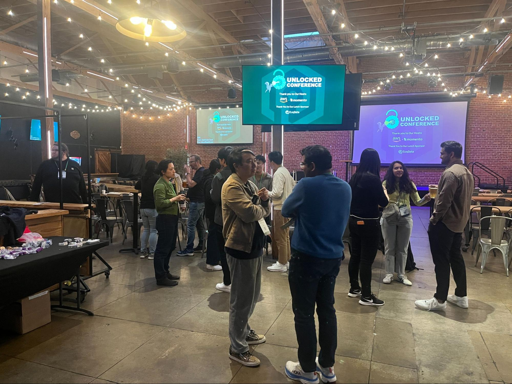

+++
title = "Performance Engineering Lessons from the Unlocked Conference"
date = 2026-02-02
description = "Production lessons on tail latency, migrations, and scale from performance engineers at Unlocked Conference San Jose."
authors = ["allenhelton", "mikecallahan"]
+++

[Unlocked Conference](https://unlocked.gomomento.com/) was designed to bring attendees the most meaningful lessons in performance engineering and Valkey (the open source future for [the community](https://valkey.io/community/)). What happens when traffic patterns change, when data sizes drift, or when a dependency behaves just a little differently than expected? These topics rarely make it into blog posts or videos because they’re discovered while trying to keep things running.

The conference created a space for those lessons. It provided a room where engineers operating large, performance-sensitive systems could talk openly about what they’ve seen in production, what surprised them, and what they’d do differently next time. The audience for this conference was engineers already living with these systems every day and those searching for a new way to achieve their goals.

## The Venue & Atmosphere
The inaugural Unlocked Conference was held on January 22 at Guildhouse in San Jose, California. It’s a venue built for competitive gaming and live events, and it was a perfect place to talk about high performance computing. Most importantly, it was a space that encouraged people to stay engaged between sessions instead of disappearing.

Momento CEO [Khawaja Shams](https://www.linkedin.com/in/kshams/) opened the conference with an inspiring talk about how the performance community keeps showing up for each other, how recent improvements in Valkey have fundamentally changed caching, and how exciting the future is with our increased understanding of how all these systems work. 

That framing set the tone for the rest of the day. Talks were technical, experience-driven, and aimed at people building and operating production systems at scale.

## Recurring Patterns
Several ideas kept resurfacing across the talks and our conversations. Tail latency came up repeatedly as a leading indicator that makes a system feel stable or unpredictable. Several speakers walked through scenarios where a small change in the client’s request shape or request mechanics had a significant impact on the systems’ performance at scale.

There was also a recurring focus on interaction effects. Meaning multiple systems behaving correctly in isolation while producing unexpected behavior together, problems that only become obvious after running real workloads in production.

Many sessions, like [Ignacio Alvarez’s](https://www.linkedin.com/in/ignacioalvarez79/) on moving from Memcached to Redis to Valkey, described personal experiences: what broke, how it was diagnosed, and what actually improved things. Audience questions reflected that same depth. They came from engineers who had clearly run into similar situations and were comparing notes and looking for solutions.

## Hallway Conversations
Between sessions, the hallway track picked up right where the talks left off. Small groups formed around shared pain points: performance regressions, migration challenges, and edge cases that felt familiar across companies. More than once, conversations turned into quiet moments of recognition where someone described a problem and others nodded along because they’d seen it too. 

One of the things we overheard was infrastructure leaders sharing that the event gave them the confidence to accelerate their own migrations to Valkey. They shared that watching industry leaders like Apple, Uber, and Snap solve hard performance problems with Valkey gave them the confidence that the project is ready.

These conversations were exactly the reason we put Unlocked together. The ability to talk through a problem in real time, sketch an architecture on a notepad, or compare approaches with someone who’s been there accelerates learning in a way that’s hard to replicate elsewhere.

## By the Numbers
Registration-to-Attendance Ratio: 90%
Companies represented: 23 
Sessions delivered: 15

We will continue to grow the Unlocked Conference as a place for engineers to share lessons learned under real operating conditions. For those who weren’t able to attend in person, the sessions were recorded and will be available to watch soon. [Join us at the next Unlocked Conference](https://unlocked.gomomento.com/) in early May 2026! More information coming soon - subscribe to the [Valkey Community newsletter](https://hubs.la/Q03-LC830) to get the latest updates.

## Until Next Time
Thanks are due to the speakers who were willing to share hard-earned lessons, the attendees who brought thoughtful questions, and everyone who helped make the event happen. Compressing years of operational learning into a single day only works when people are willing to be open about their experiences.

The inaugural Unlocked Conference was a strong start, and it’s clear there’s real momentum behind continuing these conversations.

Thank you to everyone at [Momento](https://www.gomomento.com/) and [AWS](https://aws.amazon.com/) who hosted such a wonderful event. And special thanks to the lunch sponsor, [EloqData](https://www.eloqdata.com/) 💚