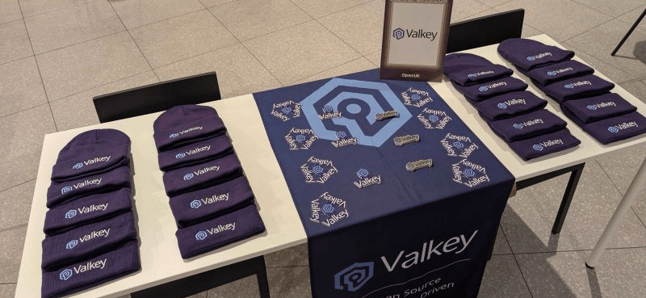

+++
title = "Don’t Miss What’s Next in Valkey — Subscribe Now"
date = 2026-02-04
description = "Valkey is moving fast — and the easiest way to stay ahead is to subscribe to the official Valkey newsletter. From new releases and roadmap milestones to community highlights and upcoming events, our newsletter is your single source of truth for everything happening across the Valkey ecosystem."
authors = ["crystalpham"]
+++

Valkey is moving fast and the easiest way to stay ahead is to [subscribe](/blog/valkey-newsletter-new/#email-signup) to the official Valkey newsletter.
From new releases and roadmap milestones to community highlights and upcoming events, our newsletter is your single source of truth for everything happening across the Valkey ecosystem. No digging, no second-guessing — just the updates that matter, delivered straight to you.

When you subscribe, you’ll get:
* Breaking updates on new releases, features, and project announcements.
* Early visibility into events and opportunities to present, plus key takeaways if you couldn’t attend.
* Real stories from the community, shared by the people building and using Valkey.
* Clear ways to get involved, whether you want to contribute, collaborate, or get started faster.

If you care about Valkey — or rely on it — this is how you stay in the loop.
👉 [Subscribe](/blog/valkey-newsletter-new/#email-signup) now and stay connected.
Subscription is open to everyone, so invite a teammate, a collaborator, or any open source enthusiast who doesn’t want to miss what’s coming next.

Valkey is growing! Make sure you’re part of the conversation.
