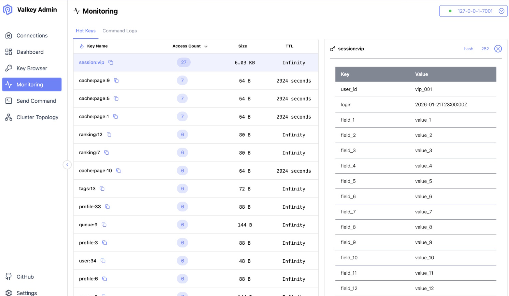

+++
title= "Introducing Valkey Admin: Visual Cluster Management for Valkey"
description = "Valkey Admin is an open-source desktop application that provides visual cluster topology, hot key detection, performance diagnostics, and interactive key management for Valkey clusters without piecing together CLI commands. Now in preview!"
date= 2026-02-25 00:00:00
authors= [ "allenhelton", "arsenykostenko"]

[extra]
featured = true
featured_image = "/blog/introducing-valkey-admin/images/hero.jpg"
+++

Do you ever wonder why we still manage Valkey the same way we always have? The honest answer is that it works. And once something works, it tends to stick around.

You spin up a Valkey cluster. Maybe it's three nodes. Maybe it's thirty. You need to inspect a key, so you open a terminal, start `valkey-cli`, connect, run a command, read the output, then do it again. If you need to understand what's happening across the cluster, that usually means opening more terminals. More SSH sessions. More mental bookkeeping.

At some point, you're carrying around a model of the cluster that only exists in your head or maybe on a napkin next to your desk. It's easy to check a key on one node and assume it looks the same everywhere else. It's also an easy way to make mistakes.

This is how many of us learned to work with Valkey, and it's still how a lot of day-to-day debugging happens today. Familiarity, though, doesn't always mean efficiency. In practice, it often means friction we've just learned to tolerate.

Enter Valkey Admin.

Much of this thinking was shared recently by [Rong Zhang](https://www.linkedin.com/in/rongzhangrz/) at the [Unlocked Conference](https://unlocked.gomomento.com/), where several Valkey team members walked through real workflows that led to the tool: understanding cluster topology, diagnosing performance issues, and making everyday operational tasks easier to reason about without stitching everything together by hand.

## What is Valkey Admin?
Valkey Admin is an application that gives you a direct, visual interface to your Valkey clusters.

Immediately upon connecting, you can see the shape of the cluster itself: which nodes are primaries, which are replicas, and how individual nodes are behaving. From there, you can drill into node dashboards, view key metrics, and understand what's happening without reconstructing the picture manually.

Key management is a first-class workflow. You can browse keys interactively, inspect values, check TTLs, look at sizes and data structures, modify or remove keys, and search or filter by prefix. All Valkey data types are supported, and the goal is to make inspection and troubleshooting as straightforward as possible.

Valkey Admin also includes tools for diagnosing performance problems. It can identify hot keys using low-overhead analysis when LFU is enabled, or fall back to configurable sampling when it isn't. Command logs surface slow commands, large requests, and large replies, making it easier to understand why latency changes instead of just noticing that it did.

The application also embeds the `valkey-cli`. You run the same commands you already know, but with added context, including the ability to diff results between runs, so changes in state are highly visible.

This isn't meant to replace a full monitoring stack, and it's not trying to be a wall of dashboards. If you already have Grafana and alerting in place, Valkey Admin lives somewhere between ad-hoc CLI usage and long-term metrics. It's the tool you reach for when you need to understand what's happening right now.

This type of admin tooling is part of the operational surface of a datastore. For systems that run critical workloads, the tooling must be inspectable, extensible, and governed by the same open principles as the system itself. Rather than relying on a black-box admin interface with opaque trade-offs and closed roadmaps, Valkey Admin is built to be something the community can understand and evolve over time.

## When things go wrong
If you've ever debugged a cache issue late at night, you know how quickly context switching becomes the real problem. The issue itself is already stressful. The last thing you want at 2am is to double-check which node you're connected to or mentally reconstruct slot ownership across a cluster.

The same friction shows up during development. Verifying cache behavior often means writing a throwaway script, running a handful of commands, or re-learning `SCAN` syntax just to confirm that something worked. Most of us already have at least one of those scripts lying around. Writing another one every time isn't a great use of time or effort.

Valkey Admin isn't an attempt to replace the command line. It's an acknowledgment that some workflows are easier, faster, and less error-prone when you can see what's happening instead of inferring it.

## Early design choices
One of the key technical decisions in Valkey Admin is the use of [Valkey GLIDE](https://github.com/valkey-io/valkey-glide) for the client layer. GLIDE provides a shared, high-performance core with thin language bindings, avoiding the need to re-implement protocol handling, clustering logic, and connection management independently in every language.

GLIDE's architecture is a [strong fit for admin and observability workloads](https://aws.amazon.com/about-aws/whats-new/2025/06/valkey-glide-2-0-go-opentelemetry-pipeline-batching) that involve fan-out access patterns and high concurrency. It provides more predictable behavior, tighter alignment with Valkey's internals, and a simpler foundation for building production-grade tooling at scale.

These same considerations shaped how Valkey Admin is delivered. It is built with [React](https://react.dev/) and [TypeScript](https://www.typescriptlang.org/), and runs as an [Electron](https://www.electronjs.org/) application on macOS and Linux, with support for Windows via WSL. That choice allows the tool to remain fast, responsive, and close to the developer's workflow, without requiring a separate deployment or service to get started.

The project is fully open source, and contributions are encouraged both to improve the tool itself and to adapt it to the different environments Valkey runs in.

## Where it's headed
Valkey Admin focuses on reducing day-to-day overhead of operating cache clusters, not trying to be an all-encompassing admin platform. During the Unlocked talk, Zhang was careful not to over-promise a long-term roadmap, instead pointing to areas the community is actively exploring.

> *"Valkey Admin is about solving the day-to-day problems Valkey users face understanding cluster topology, identifying performance bottlenecks, and managing keys without having to piece everything together by hand."*
> Rong Zhang, Product Manager, AWS (Unlocked Conference)

Based on early feedback, the focus areas include deeper analysis of large keys, improved visualization for complex data types, stronger auth and access control, and a web-native version for Kubernetes or Docker Compose. According to Zhang, there's also interest in AI-assisted observability that explains what changed and why, assisting operators at an entirely new level.

## Getting started
Valkey Admin is currently in preview, but you can try it today by cloning the [repository](https://github.com/valkey-io/valkey-admin) and running `./quickstart.sh`. The script installs dependencies, builds the application, and spins up a local Valkey cluster so there's something to connect to immediately. A few minutes later, you have a working desktop app.

From there, you add a connection to your own Valkey instance and start working. There's no lengthy setup process and no configuration file you need to get exactly right before the tool becomes useful.

There's also a web version available via `./quickstart-web.sh`. It doesn't include some Electron-specific features, such as hot key tracking and command logs, but it's useful for quick inspection during development.

Most of us would rather spend time building systems than managing infrastructure details by hand. If Valkey Admin helps reduce that overhead, then it's doing its job.

If you manage Valkey clusters and find yourself bouncing between terminals more than you'd like, it's worth trying. And if something feels awkward or incomplete, [opening an issue](https://github.com/valkey-io/valkey-admin/issues) or contributing back is part of how the tool improves.
