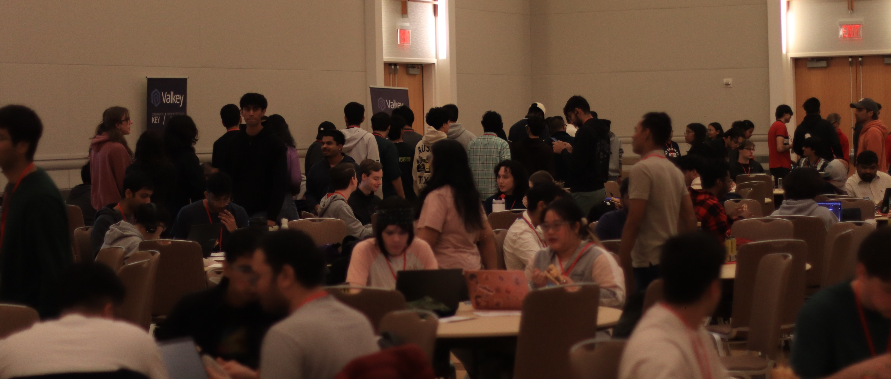
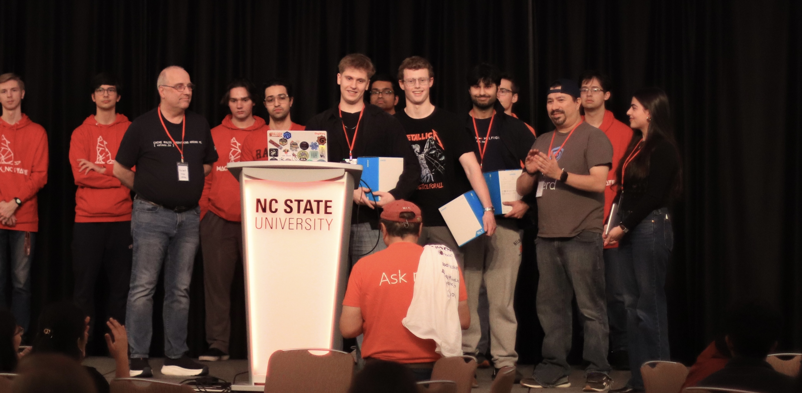
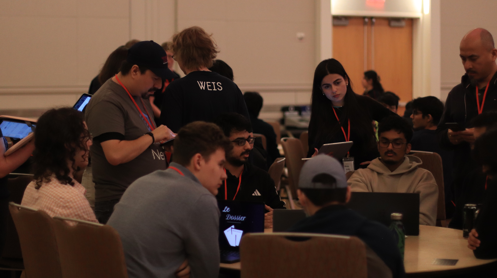

+++
title= "Valkey at Hack NC State 2026: 15 Innovative Projects Built in 24 Hours" 
description = "Hackathons are a stress test - not just for the people participating, but for the tools they choose. When a team has 24 hours to go from a blank repo to a working demo, every technology choice gets pressure-tested in ways that months of careful planning never quite replicate. You find out fast what's intuitive, what breaks, and what delivers when it matters." 
date= 2026-02-28 19:38:01 
authors= ["mtuteja", "rlunar"]

[extra]
featured = false
featured_image = "/blog/valkey-at-hack-nc-state-2026-15-innovative-projects-built-in-24-hours/images/valkey-at-hack-nc-state-2026-01.jpg"
+++

Hackathons are a stress test - not just for the people participating, but for the tools they choose. When a team has 24 hours to go from a blank repo to a working demo, every technology choice gets pressure-tested in ways that months of careful planning never quite replicate. You find out fast what's intuitive, what breaks, and what delivers when it matters.

On February 14-15, 2026, Valkey participated in [Hack NC State 2026](https://hackncstate.org/), North Carolina State University's premier hackathon. The event brought together 371 attendees organized into 96 teams for an intense 24-hour coding competition at the Talley Student Union on NC State's main campus.

## **The Valkey API Challenge**

Valkey hosted a dedicated API challenge encouraging teams to leverage Valkey as a cache, session store, message queue, or primary database including vector database use cases. The Valkey team provided hands-on mentorship throughout the event, helping teams with project scoping, technical depth, and deployment feasibility.

We were thrilled to see 15 teams participate in the Valkey API challenge, with many more incorporating Valkey into their projects. The quality and creativity of submissions made judging incredibly difficult, as teams tackled real-world problems with inventive solutions.

### **Challenge Winners**

**Winner: Catphish** - Multi-Layer Voice Verification

Team: [Tristan Curtis](https://www.linkedin.com/in/tristan-curtis-baabba304/), [Rameez Malik](https://www.linkedin.com/in/rameez-malik-ncsu/), [Ahmed Salem](https://www.linkedin.com/in/ahmed-salem-38228642/), and [Nolan Witt](https://www.linkedin.com/in/nolan-witt/) see their [LinkedIn post](https://www.linkedin.com/posts/nolan-witt_hackncstate2026-hackathon-valkey-activity-7429286795252600832-RyNL/).

**Runner-up: Privasee** - Signup Privacy Insights Extension

**Runner-up: GuardRock AI** - Video Manipulation Detection

## **Project Highlights**

The diversity of projects demonstrated Valkey's versatility across multiple domains. Here are the standout implementations:

### **Fighting AI-Generated Content**

A dominant theme emerged around combating harmful AI-generated content, with multiple teams building detection and verification systems:

[**Catphish**](https://github.com/AhmedOHassan/catphish) (Winner) built a voice-based identity verification API with a 4-layer defense system against AI voice cloning attacks. Using Valkey as its primary database, the system stores voice profiles as hashes with JSON-encoded embeddings, implements sliding window rate limiting with sorted sets, and maintains comprehensive audit trails. Voice profile operations execute in under 5ms, with security checks completing in under 1ms.

[**Fresh Internet Theory**](https://github.com/shambu2k/FreshInternetTheory) created a Chrome extension for Facebook Reels that combines crowd intelligence with AI analysis. The system uses Valkey for reel state management with hashes, tracks voter reliability in sorted sets, and leverages Valkey Streams for processing queue management. The hybrid verdict algorithm achieves 95% AI-crowd agreement with cache hit rates around 70% for popular reels.

[**Deporia**](https://github.com/regulad/Hack_NCState2026) built a browser extension for detecting AI-generated images through community-driven reputation scoring. Using Valkey's async Python client, the system stores image reputation scores keyed by SHA-256 hashes, enabling real-time lookups as images load with sub-millisecond async operations.

[**UNewz**](https://github.com/sumeetkhillare/HackNc26) developed a YouTube news credibility analyzer that provides credibility scores, clickbait meters, and fact-checked claims. The system uses Valkey for comprehensive video analysis caching across seven different key types, with read operations completing in under 2ms for summaries and under 10ms for complete analysis retrieval.

[**PostPolice**](https://github.com/Rutvik2598/PostPolice) implemented a sophisticated dual-layer caching system for real-time claim verification. The first layer uses SHA-256 hashes for exact match caching, while the second layer stores 384-dimensional vector embeddings for semantic matching at 95% cosine similarity. This architecture eliminates 70-80% of AI API calls and reduces latency by 90%.

### **Financial Technology & Security**

[**Blackvault**](https://github.com/archig97/blackvault-ncstate-26) built a real-time financial risk intelligence platform using Valkey as its critical data layer. The system leverages Valkey Streams for transaction ingestion, hashes for account state, sorted sets for risk ranking, and sets for graph-based relationships. The graph-based risk propagation engine detects network-level fraud patterns like mule account chains with sub-millisecond latency.

[**CryptoKnight**](https://github.com/adityapai18/HackNCState26) created a trustless AI trading platform using Account Abstraction [ERC-4337](https://docs.erc4337.io/index.html). Valkey stores trade details as hashes, maintains timelines as sorted sets, and tracks performance metrics with atomic operations. The system enables instant dashboard updates with sub-millisecond writes and O(log N) timeline queries.

[**Bluenote**](https://github.com/isaiahemvi/bluenote) developed an AI-powered credit card optimizer that recommends which card to use and how to maximize cashback. Using Valkey as its primary data store, account lookups execute in under 1ms, while the AI chatbot retrieves complete financial context in under 5ms.

### **Privacy & Security Tools**

[**Privasee**](https://github.com/Hack-NC-State-2026/privasee) (Runner-up) surfaces privacy risks at signup by analyzing Privacy Policies and Terms of Service. The system uses a sophisticated multi-pattern Valkey architecture: a global attribute severity map as Hash, per-domain attributes in sorted sets, and full policy analysis cached as JSON strings. RDB persistence ensures expensive AI analysis results survive restarts.

[**WUFScan**](https://github.com/mahek390/WUFScan) built an intelligent document leak prevention system that detects sensitive information before files are shared. Using Valkey for caching scan results with SHA-256 hashes as keys, the system dramatically reduces AI API calls by returning cached results in under 10ms.

[**GuardRock AI**](https://github.com/avleenmehal/guardrock-ai) (Runner-up) identifies deceptive patterns in short-form videos using two independent Valkey instances as message queues. The decoupled architecture achieves sub-millisecond queue operations and handles over 1000 videos per second.

## **Technical Patterns & Performance**

Across all projects, several common patterns emerged that showcase Valkey's strengths:

- **Sub-millisecond latency**: Critical for real-time user experiences

- **Atomic operations**: Ensuring consistency under high concurrency

- **Flexible data structures**: Hashes, sets, sorted sets, lists, and streams used creatively

- **TTL support**: Automatic data expiration for caching and session management

- **Valkey Streams**: Message queue patterns for decoupled architectures

- **Vector embeddings**: Semantic caching and similarity matching

- **Rate limiting**: Sliding window implementations with sorted sets

|   |   |
|---|---|
|**Use Case**|**Latency**|
|Voice verification|<5ms profile operations, <1ms security checks|
|Cache lookups|<1ms for account data, <10ms for complex analysis|
|Queue operations|Sub-millisecond with 1000+ ops/sec throughput|
|Semantic matching|95% similarity threshold without external API calls|

## **Community Impact**

What impressed us most was not just the technical sophistication; it was the focus on solving real-world problems that affect everyday people. From protecting users against AI voice cloning and deepfakes to helping users make informed privacy decisions and detect financial fraud, these projects demonstrate the power of combining innovative technology with social impact.

The level of architectural maturity achieved in just 24 hours was remarkable. Teams didn't just build functional prototypes, they implemented thoughtful architectures with proper caching strategies, rate limiting, audit trails, and performance optimization.

## **Thank You**

We want to thank all participants who chose Valkey for their projects. The event was organized by NC students who made this free event possible for all participants.

## **Explore the Projects**

All project repositories and detailed technical documentation are available:

- [Catphish](https://github.com/AhmedOHassan/catphish) - [Documentation](https://catphish.vercel.app/documentation)

- [Privasee](https://github.com/Hack-NC-State-2026/privasee)

- [GuardRock AI](https://github.com/avleenmehal/guardrock-ai)

- [Blackvault](https://github.com/archig97/blackvault-ncstate-26)

- [WUFScan](https://github.com/mahek390/WUFScan)

- [Deporia](https://github.com/regulad/Hack_NCState2026)

- [CryptoKnight](https://github.com/adityapai18/HackNCState26)

- [Bluenote](https://github.com/isaiahemvi/bluenote)

- [PostPolice](https://github.com/Rutvik2598/PostPolice)

- [Fresh Internet Theory](https://github.com/shambu2k/FreshInternetTheory)

- [UNewz](https://github.com/sumeetkhillare/HackNc26)

Visit [hackncstate.org](https://hackncstate.org/) to learn more about the event.

_Interested in using Valkey for your next project? Check out our_ [_documentation_](https://valkey.io/docs/) _and join our_ [_community_](https://valkey.io/community/)_._