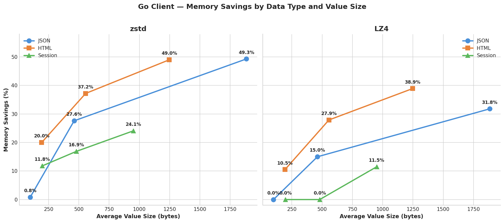
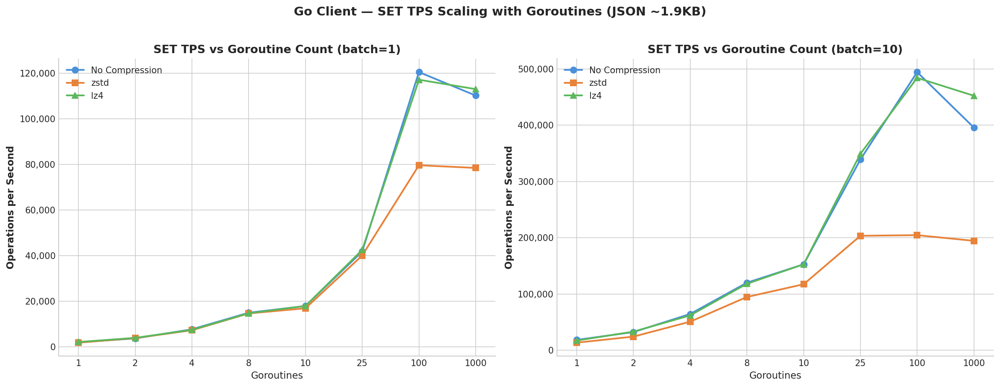
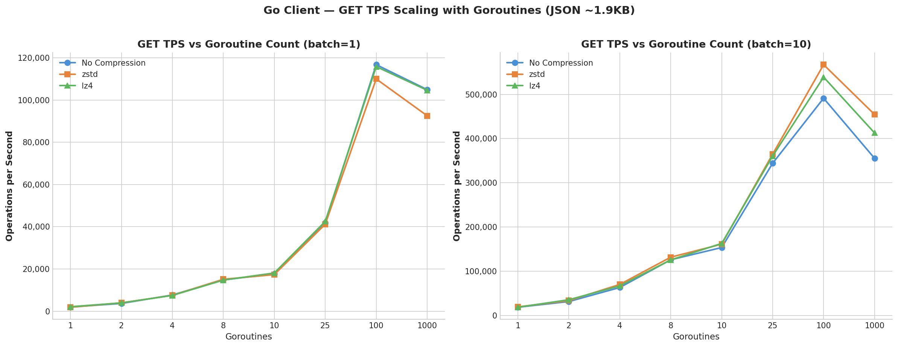
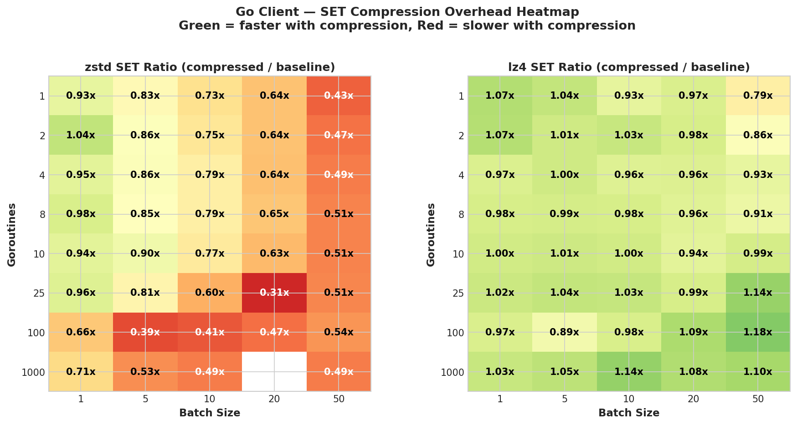
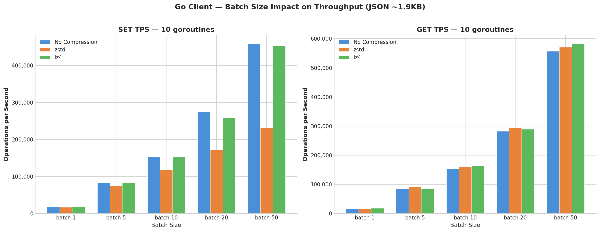
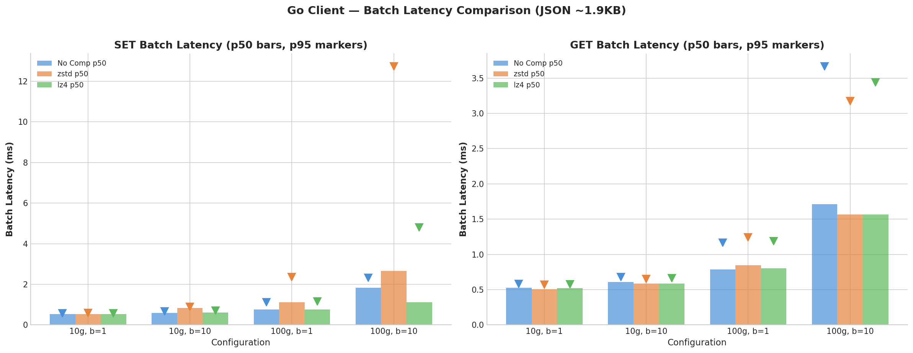
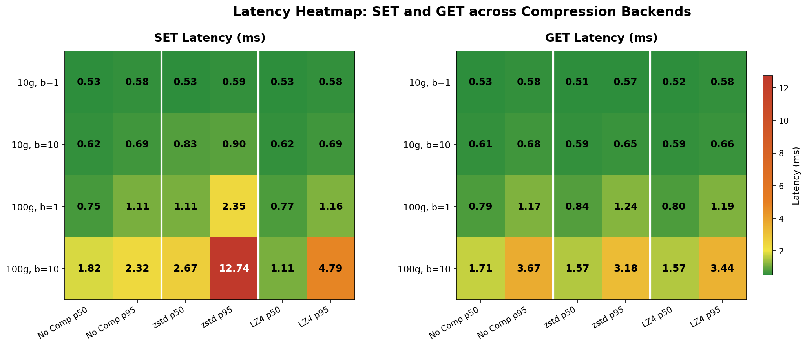

+++
title= "Transparent Compression in Valkey GLIDE: Reduce Memory With a Single Line of Code"
description= "Learn how to enable automatic compression in Valkey GLIDE to reduce memory usage by up to 49% without modifying your application code."
date= 2025-07-01 01:01:01
authors= ["dknowles"]

[extra]
featured = false
featured_image = "/assets/media/featured/random-03.webp"
+++

If you're caching JSON API responses, storing user sessions, or buffering HTML fragments in Valkey, there's a good chance your data is highly compressible while you're still paying full price for every byte. At scale, redundant data adds up fast. ~1KB JSON payloads across millions of keys means gigabytes of memory that could be reclaimed without losing a single field. Even if your overall cache footprint is small, availability zone and cross-region data transfer fees can still drive up your costs. In this blog, we'll demonstrate how to configure the Valkey GLIDE using the Go client for transparent client-side compression and explore performance benchmarks to evaluate the effectiveness and guide recommendations for usage.

Transparent compression in [Valkey GLIDE](https://github.com/valkey-io/valkey-glide) offers a seamless solution to this problem. When you write data with a `SET` command, GLIDE compresses it before sending it to the server. When you read it back with `GET`, GLIDE decompresses it automatically. Your application code doesn't change — you just flip a switch in the client configuration:

```go
import (
    glide "github.com/valkey-io/valkey-glide/go/v2"
    "github.com/valkey-io/valkey-glide/go/v2/config"
)

cfg := config.NewClientConfiguration().
    WithAddress(&config.NodeAddress{Host: "localhost", Port: 6379}).
    WithCompressionConfiguration(
        config.NewCompressionConfiguration(), // That's it.
    )

client, err := glide.NewClient(cfg)

// Everything else stays exactly the same
client.Set(ctx, "user:1001:profile", string(userDataJSON))
result, _ := client.Get(ctx, "user:1001:profile")
```

This single configuration change delivers 28–49% memory savings depending on algorithm choice and data shape, with LZ4 showing near-zero throughput impact and Zstandard (zstd) nearly halving memory usage at a moderate write throughput and latency cost.

## How It Works

When you execute a `SET` command with compression enabled, GLIDE runs through a short decision path on the client side:

1. Is the value larger than the minimum size threshold (default: 64 bytes)? If not, send it uncompressed — the 5-byte header overhead would negate any savings and small values are unlikely to be compressible.
2. Compress the value using the configured algorithm (zstd or LZ4).
3. Is the compressed result actually smaller than the original? If not, send the original instead.
4. Prepend a 5-byte header that identifies the data as GLIDE-compressed, and send it to the server.

On the read path, the process reverses. GLIDE checks for the header, decompresses if present, and returns the original value. If the header isn't there, the value is returned as-is. This allows compression-enabled clients to seamlessly read uncompressed data written by older clients.

GLIDE uses a 5-byte header (`[Magic Prefix: 3 bytes][Version: 1 byte][Backend ID: 1 byte]`) to tag compressed values. You can identify compressed entries when inspecting raw data in Valkey by looking for this header. The backend ID means a zstd-configured client can read LZ4-compressed data and vice versa. All GLIDE language bindings (Python, Node.js, Java, Go, C#) share the same header format, so compressed data written from one language can be read from another.

A few safety-by-default choices keep compression from ever getting in the way: if compression fails for any reason, GLIDE silently falls back to uncompressed data. Data that already carries the GLIDE header won't be double-compressed. And after compressing, GLIDE compares sizes — if compression didn't help, the original goes through unchanged.

### Important Note:
Compression is NOT compatible with commands that manipulate string data on the server, because the client handles the compression, the server is unable to mutate the string data and will corrupt the data.

**Unsupported Commands:**

* APPEND, GETRANGE, SETRANGE, STRLEN, LCS

* INCR, INCRBY, INCRBYFLOAT, DECR, DECRBY

* GETBIT, SETBIT, BITCOUNT, BITPOS, BITFIELD, BITFIELD_RO, BITOP

You can replicate these commands on the client-side, but it will come at a performance cost. If you rely on these commands, you may not find compression suitable for your workload.


## Memory Savings

The headline memory savings figures are the result of compressing 10,000 ~2KB JSON payloads and measuring Valkey's used_memory metric:

| Backend | Server Memory | Reduction |
|---------|--------------|-----------|
| No compression | 21.4 MB | — |
| zstd (level 3) | 10.9 MB | 49.3% |
| LZ4 (level 0) | 15.5 MB | 27.8% |

Zstd saves nearly twice as much memory as LZ4 on this JSON workload. But ~2KB JSON payloads are just one scenario and not representative of the typical size of data you might be working with. In practice, you're caching all kinds of data at all kinds of sizes. Below are the results for three common data types — JSON, HTML, and session data — across a variety of value sizes to show what savings look like across representative synthetic workloads.

### Memory Savings by Data Type and Value Size

| Data Type | Avg Bytes | zstd Savings | LZ4 Savings |
|-----------|-----------|-------------|------------|
| JSON | 98 | 0.8% | 0.0% |
| JSON | 461 | 27.6% | 15.0% |
| JSON | 1,884 | 49.3% | 31.8% |
| HTML | 193 | 20.0% | 10.5% |
| HTML | 556 | 37.2% | 27.9% |
| HTML | 1,247 | 49.0% | 38.9% |
| Session | 198 | 11.8% | 0.0% |
| Session | 480 | 16.9% | 0.0% |
| Session | 951 | 24.1% | 11.5% |

A few patterns jump out:

**Value size matters more than data type.** Below ~100 bytes, neither algorithm saves meaningful memory — the 5-byte header overhead and Valkey's per-key metadata dominate. Above ~500 bytes, both algorithms deliver substantial savings across all data types.

**HTML compresses well.** Repeated tags, attributes, and structural patterns give both algorithms plenty to work with. Even small HTML fragments (~193 bytes) see 10–20% savings, and large fragments hit 39–49%.

**Session data is the toughest.** Session payloads tend to be more random — UUIDs, tokens, timestamps — with less structural repetition. zstd still manages 12–24% savings, but LZ4 struggles with smaller session values (0% savings at ~200 and ~480 bytes) because the compressed output isn't smaller than the original after accounting for the header.

**zstd consistently beats LZ4 on compression ratio.** Across every data type and size, zstd saves more memory. The gap is widest on highly compressible data and narrowest on small or low-redundancy data.



## The Core Tradeoff: Memory vs Throughput

Benchmarks were generated using the Go GLIDE client on Amazon EC2 r7g.2xlarge instances (8 vCPUs, 64 GB RAM, AWS Graviton3) with the client and Valkey 8.0 server running on separate hosts in the same AWS VPC. The test corpus was JSON payloads averaging ~1,884 bytes per value. This value size was chosen to drive compression to its limits by giving the compression algorithms enough data to work with while still being sensibly-sized. A benchmark script swept a matrix of 80 configurations across goroutine counts (1, 2, 4, 8, 10, 25, 100, 1000) and pipeline batch sizes (1, 5, 10, 20, 50).

Here's how throughput scales with goroutines for batch sizes 1 and 10 for SET and GET operations:




The two algorithms represent a clear tradeoff:

- **LZ4** delivers 27.8% memory savings with minimal throughput impact. Across all 40 LZ4 configurations in our sweep, SET throughput ratio vs uncompressed ranged from 0.87x to 1.07x, with most configurations falling between 0.95x and 1.07x. Some configurations were actually *faster* with LZ4 because smaller payloads reduced network transfer time. Peak throughput with LZ4: 592K SET TPS / 811K GET TPS — matching or exceeding the uncompressed baseline.

- **Zstd** delivers 49.3% memory savings with a moderate CPU cost. SET throughput ratios ranged from 0.41x to 0.97x. The cost is proportional to throughput: at low throughput, zstd costs only 3–7%. At high throughput with batching, the cost grows as compression becomes a larger fraction of total per-operation time.

The heatmap below shows the full picture — SET throughput ratio (compressed / baseline) across every goroutine count and batch size combination tested. Green cells mean compression added no meaningful overhead or was actually faster; red cells indicate where compression CPU cost dominated. LZ4 is green almost everywhere, while zstd shows a clear gradient: low overhead at small batch sizes (where network latency dominates) and increasing cost as batching pushes throughput higher.



## Batching Is the Real Throughput Lever

Going from batch size 1 to 50 at 10 goroutines takes baseline SET throughput from 18K to 491K TPS — a 27x improvement that dwarfs any compression effect. Even with zstd compression, batched operations at batch=50 (232K TPS) outperform unbatched uncompressed operations (18K TPS) by 13x. Optimize your batching strategy first, then choose your compression backend.



## Latency

At batch=1 (no pipelining), all three backends show similar p50 SET latency — around 0.53ms at 10 goroutines. LZ4 adds essentially nothing. At higher batch sizes, total batch latency — the time a client actually waits for a response — grows for all backends. At batch=10 with 10 goroutines, baseline batch latency rises to ~0.62ms, zstd to ~0.83ms, and LZ4 stays at ~0.62ms. The cost of zstd scales with the number of values compressed per batch, while LZ4 remains close to baseline throughout.




## Choosing the Right Configuration

**Start with LZ4** if latency matters. Switch to zstd if you need maximum memory savings and can take a slight hit to latency. The savings you'll see depend heavily on your data type and value size — HTML compresses best, session data compresses least, and anything under 100 bytes isn't worth compressing. Skip compression entirely for already-compressed data (images, video, pre-compressed content).

**Throughput** can be recovered when using zstd by investing in more compute. Scale your application horizontally or vertically and you can bring zstd throughput up to par with your previously uncompressed workload. While this increases your application's compute costs, the storage savings can completely offset this depending on your throughput vs. storage needs. As an example using on-demand pricing in us-east-1 as of mid-2025: consider a 250GB caching workload running on an AWS r7g.16xlarge ($3.427/hour) served by an application running on a c7g.4xlarge ($0.5781/hour). If zstd can cut your storage requirements by ~40%, you can downgrade your cache instance to an r7g.8xlarge ($1.714/hour) and upgrade your application to a c7g.8xlarge ($1.1562/hour) to make up for the zstd throughput hit for a net savings of $1.1349/hour or a ~28% cost reduction overall.

For value sizes:
- **Under 100 bytes**: Skip compression. Neither algorithm saves meaningful memory at this size — the 5-byte header overhead and Valkey's per-key metadata dominate.
- **100–500 bytes**: Savings vary by data type. HTML compresses well even at ~193 bytes (20% zstd / 10.5% LZ4). Worth enabling with zstd; test with LZ4.
- **500–1,000 bytes**: Solid savings across all data types. Expect 17–49% with zstd and 0–39% with LZ4 depending on data type.
- **Over 1,000 bytes**: Strongly recommended. Expect 24–50% with zstd and 12–39% with LZ4.


Here's a complete configuration example:

```go
import (
    glide "github.com/valkey-io/valkey-glide/go/v2"
    "github.com/valkey-io/valkey-glide/go/v2/config"
)

cfg := config.NewClientConfiguration().
    WithAddress(&config.NodeAddress{Host: "localhost", Port: 6379}).
    WithCompressionConfiguration(
        config.NewCompressionConfiguration().
            WithBackend(config.LZ4).          // or config.ZSTD
            WithCompressionLevel(0).          // 0 is the default for both; higher = better ratio, more CPU
            WithMinCompressionSize(100),       // Skip values smaller than 100 bytes
    )

client, err := glide.NewClient(cfg)
```

Compression works identically with `ClusterClient` — just pass the same compression configuration to your cluster config. Compression and decompression happen entirely on the client side, so there is no difference in behavior between standalone and cluster modes.

## Gradual Rollout

One of the most practical aspects of GLIDE's compression design is that you don't need to plan a migration. Compression-enabled clients read uncompressed data transparently. Clients configured with zstd can read LZ4-compressed data and vice versa. This means you can roll out incrementally: deploy your application clients with compression enabled, and as keys expire or get updated through normal application flow, data naturally migrates to compressed format — no migration scripts, no downtime.

## Conclusion

Transparent compression gives you a meaningful reduction in memory usage with minimal effort. LZ4 is effectively free at 28% savings; zstd nearly halves memory at a moderate write throughput cost. The feature is available today across all GLIDE language bindings and requires only a single configuration change.

We'd love to hear about your experience with compression — what data types you're compressing, what savings you're seeing, and what would make the feature more useful. Join the conversation on [GitHub Discussions](https://github.com/valkey-io/valkey-glide/discussions).

To get started:
- [Valkey GLIDE GitHub Repository](https://github.com/valkey-io/valkey-glide)
- [Valkey GLIDE Go Client Documentation](https://github.com/valkey-io/valkey-glide/tree/main/go)
- [Compression Configuration API Reference](https://pkg.go.dev/github.com/valkey-io/valkey-glide/go/v2/config)


## Appendix: Sample Data from the Benchmark Corpus

The following are representative values from the data corpus used in the benchmarks above. Each sample corresponds to a row in the [Memory Savings by Data Type and Value Size](#memory-savings-by-data-type-and-value-size) table.

### JSON — Medium (462 bytes)

A database proxy configuration object, typical of application config cached in Valkey:

```json
{
  "config_id": "CONFIG-2024-002",
  "service": "database-proxy",
  "environment": "production",
  "version": "1.8.2",
  "updated_at": "2024-03-14T15:30:00Z",
  "updated_by": "EMP-2024-004",
  "settings": {
    "pool_size": 100,
    "connection_timeout_seconds": 10,
    "idle_timeout_seconds": 300,
    "max_lifetime_seconds": 3600,
    "enable_ssl": true,
    "read_replica_enabled": true,
    "read_write_split": true,
    "query_timeout_seconds": 30,
    "slow_query_threshold_ms": 1000,
    "log_level": "WARN"
  }
}
```

### HTML — Small (193 bytes)

A compact product-card snippet, the kind of HTML fragment commonly cached for storefront rendering:

```html
<div class="product-card">
  <h3 class="title">External SSD 1TB Fast</h3>
  <span class="price">$109.99</span>
  <p class="desc">High speed storage</p>
  <button class="btn-cart">Add to Cart</button>
</div>
```

### HTML — Large (1,245 bytes)

A fully-decorated product card with badges, image overlays, ratings, pricing, and stock metadata:

```html
<div class="product-card" data-id="prod-10023" data-category="cables"
     data-brand="ConnectPro">
  <div class="product-badge">
    <span class="badge-sale">Sale</span>
    <span class="badge-shipping">Free Shipping</span>
  </div>
  <div class="product-image">
    
    <div class="image-overlay">
      <button class="btn-quickview" data-modal="quickview">Quick View</button>
      <button class="btn-wishlist" data-action="wishlist">
        <i class="icon-heart"></i>
      </button>
    </div>
  </div>
  <div class="product-info">
    <h3 class="title">
      <a href="/products/hdmi-cable">HDMI Cable 4K 6ft</a>
    </h3>
    <div class="rating">
      <span class="stars">★★★★☆</span>
      <span class="rating-value">4.6</span>
      <span class="count">(3,234 reviews)</span>
    </div>
    <div class="price-container">
      <span class="price">$14.99</span>
      <span class="original-price">$24.99</span>
      <span class="discount">-40%</span>
    </div>
    <p class="desc">High bandwidth video with gold plated connectors
      and braided nylon jacket</p>
    <div class="product-meta">
      <span class="stock in-stock">In Stock</span>
      <span class="sku">SKU: HC-10023</span>
    </div>
    <button class="btn-cart" data-action="add"
            data-product="prod-10023">Add to Cart</button>
  </div>
</div>
```

### Session — Medium (480 bytes)

A user session object with preferences, shopping cart, browsing history, and a JWT token:

```json
{
  "uid": "u_9d4e3f2a",
  "sid": "sess_8a5b0c3d2e4f6b9c",
  "ts": 1706284821,
  "exp": 1706371221,
  "ip": "192.168.8.45",
  "ua": "Mozilla/5.0 (iPhone; CPU iPhone OS 16_7 like Mac OS X) AppleWebKit",
  "role": "user",
  "prefs": {
    "theme": "dark",
    "lang": "cs",
    "tz": "Europe/Prague",
    "notify": false
  },
  "cart": [
    { "id": 56, "qty": 1, "price": 244.99 },
    { "id": 12, "qty": 2, "price": 42.99 }
  ],
  "last": "/account/addresses/add",
  "history": ["/acct", "/addr", "/add"],
  "token": "eyJhbGciOiJIUzI1NiIsInR5cCI6IkpXVCJ9.eyJzdWIiOiI5OTAwMTEyMjMzIn0"
}
```