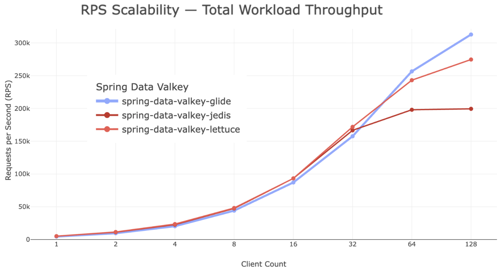
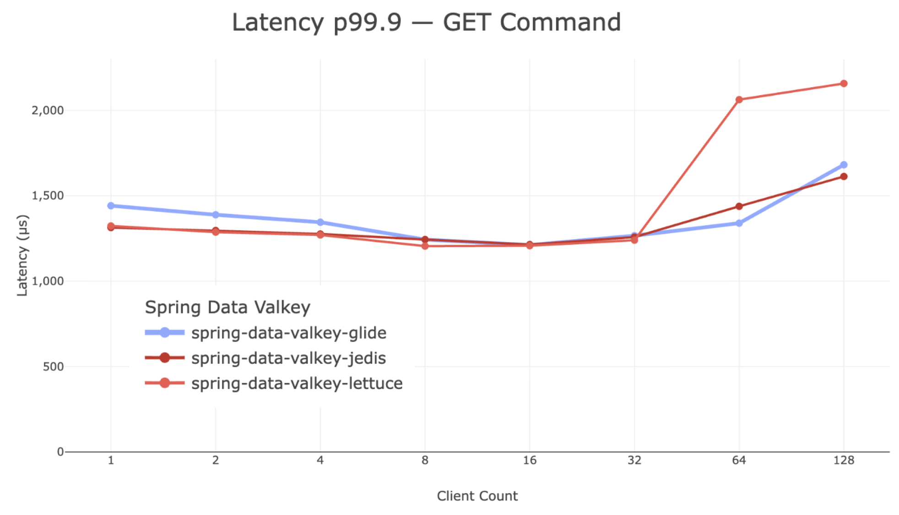

+++
title= "Announcing Spring Data Valkey: A New Season for High-Performance Spring Applications"
description = "Introducing Spring Data Valkey, a new open source Spring Data module that provides first-class integration between Valkey and the Spring ecosystem."
date= 2026-04-01 00:00:00
authors= ["makubo-aws"]

[extra]
featured = false
+++

With the winter months winding down, it's a fitting time to introduce the general availability of Spring Data Valkey, a new open source Spring Data module that provides first-class integration between Valkey and the Spring ecosystem.
Valkey adoption has expanded rapidly across cloud providers, Linux distributions, and enterprise environments.
As organizations standardize on Valkey for caching, session management, and real-time data workloads, demand has grown for native integrations with the frameworks developers already use.
For the Java ecosystem, that means Spring and Spring Data.

Spring Data Valkey was built to meet that need.
It allows Spring applications to use Valkey through familiar Spring Data abstractions.
The programming model remains the same.
The templates and repositories remain the same.
What changes is the foundation underneath.
Spring Data Valkey is officially supported by the Valkey project and can optionally be used with [Valkey GLIDE](https://github.com/valkey-io/valkey-glide), one of Valkey's official client libraries, that brings new operational-excellence capabilities to Spring applications.
When enabled, GLIDE adds cluster awareness, intelligent routing, automatic failover handling, and production-grade reliability — extending the operational capabilities of Spring Data Valkey while preserving the existing developer experience.

In this blog, we'll walk through the key capabilities of Spring Data Valkey, explain how it integrates with Valkey and Valkey GLIDE, outline common real-world application patterns, and show how to get started.
Whether you're migrating an existing application or building something new, you'll see how Spring Data Valkey provides a seamless path to adopting Valkey within the Spring ecosystem.

## Spring Data Redis Compatible

Spring Data Valkey was built to align closely with the established Spring Data programming model while supporting Valkey's Redis-compatible protocol and data structures.
Spring Data Valkey is designed to make it as easy as possible to migrate from Spring Data Redis — your existing code and configuration patterns work as-is.
If your application already relies on Spring Data templates, repository-based data access, Spring's cache abstraction (such as `@Cacheable` and `@CacheEvict`), or Spring Boot auto-configuration, you can seamlessly move to Valkey while continuing to use those same abstractions.
The core programming model does not change, data access patterns remain consistent, and your application architecture remains intact.

To move your existing Spring Data applications to use Spring Data Valkey, simply update a few dependencies, switch to Valkey-specific package namespaces, and adjust configuration property names; after that, your application continues to operate using the same Spring Data APIs and behaviors it always has.
For a step-by-step guide, you can refer to the [Spring Data Valkey migration guide](https://spring.valkey.io/commons/migration/).

Spring Data Valkey is available through standard Maven repositories, so you can manage it using your existing dependency management workflows and align versions with the broader Spring ecosystem.

## The Valkey Advantage

Spring Data Valkey continues to support existing client libraries such as Lettuce and Jedis, enabling teams to adopt Valkey while keeping their current integrations.
In addition, it introduces first-class support for [Valkey GLIDE](https://github.com/valkey-io/valkey-glide), one of Valkey's official client libraries.

- **Replica selection and availability-zone–aware routing** (when supported by your deployment) – Enables smarter read distribution and improved resilience by directing traffic to appropriate replicas across availability zones, while helping reduce inter-AZ network traffic and associated data transfer costs.
- **Resilient Pub/Sub support** – Automatically restores Pub/Sub subscriptions after disconnections, failovers, or topology changes so applications continue receiving messages without custom resubscription logic.
- **OpenTelemetry integration** – Provides built-in observability hooks that emit tracing and metrics data, enabling teams to monitor Valkey interactions using standard OpenTelemetry-compatible tooling.

Together, these capabilities shift distributed systems complexity out of your application code and into the client layer where it belongs.
With Spring Data Valkey and GLIDE, cluster changes, failovers, reconnections, observability, and cross-AZ traffic optimization are handled transparently, allowing teams to focus on business logic instead of infrastructure edge cases.
The result is a Spring-native development experience backed by a client designed for resilient, production-grade operation in modern distributed environments.

You can learn more about GLIDE here: [https://github.com/valkey-io/valkey-glide](https://github.com/valkey-io/valkey-glide)

## Performance Characteristics with Valkey GLIDE

Spring Data Valkey using the GLIDE client delivers the performance needed for caching and real-time data workloads.
We benchmarked Spring Data Valkey using GLIDE compared to Jedis and Lettuce.
Overall, all three clients perform similarly across all dimensions measured, although where Valkey GLIDE shined was in higher throughput at large client counts.
Let's take a closer look.

### Throughput

The first graph shows total throughput measured in requests per second (RPS) as the number of concurrent clients increases.

At lower client counts, all three clients deliver similar performance.
As concurrency increases, GLIDE maintains competitive throughput and begins to scale particularly well beyond roughly 64 concurrent clients, sustaining high request rates while maintaining stable latency characteristics.

### Tail Latency

Tail latency is often the most important indicator for user-facing workloads, since it reflects the worst-case response times experienced by applications.
Across the test range, Spring Data Valkey with GLIDE maintains tail latency comparable to both Lettuce and Jedis.
Even as client counts increase, latency remains stable, indicating that the client and server interaction continues to operate efficiently under load.

## Value-add for Real-World Use Cases

Let's explore how the new capabilities introduced through Valkey GLIDE integration with Spring Data Valkey solve real-world problems in real-world use cases.

### High-Availability Caching in Microservices

In modern microservices architectures, caches are often deployed in clustered, multi-AZ environments.
The operational challenge is not implementing `@Cacheable` — it's ensuring the cache remains available and correctly routed during node failures, scaling events, or topology changes.

With GLIDE, Spring Data Valkey automatically discovers cluster topology, routes requests to the correct primary or replica node, and adapts to slot remapping or primary promotions without application restarts.
In multi-AZ deployments, availability-zone–aware routing can reduce unnecessary cross-AZ traffic, improving resilience while also lowering inter-AZ data transfer costs.
These capabilities allow teams to scale cache clusters or handle infrastructure events without adding custom retry logic or topology management code.

### Event-Driven Systems and Pub/Sub Messaging

Real-time messaging systems depend on stable subscriptions.
In long-running services, dropped connections or topology changes can silently break Pub/Sub consumers unless resubscription logic is carefully implemented.

GLIDE provides resilient Pub/Sub support by automatically restoring subscriptions after disconnections, failovers, or cluster changes.
Combined with cluster-aware routing, this reduces the operational burden of maintaining reliable messaging pipelines and allows Spring-based services to continue receiving events even as the underlying Valkey cluster evolves.

### Real-Time Analytics, Counters, and Rate Limiting

Workloads such as rate limiting, distributed counters, and leaderboards often operate under sustained traffic and must tolerate node restarts or scaling operations without impacting user-facing latency.

GLIDE's intelligent routing and native cluster-mode integration ensure that commands are sent to the correct shard as the cluster topology changes.
Automatic reconnection handling reduces error surfaces during network interruptions, while built-in OpenTelemetry integration provides standardized tracing and metrics for datastore interactions — allowing teams to observe latency patterns, detect failover events, and troubleshoot distributed behavior using familiar observability tooling.

Across these use cases, the core theme is consistent: Spring Data Valkey preserves the developer experience, while GLIDE strengthens the operational layer.
Cluster awareness, failover transparency, resilient messaging, cost-aware routing, and observability are handled in the client — so application code can remain simple even as infrastructure grows more complex.

## A New Season for Spring and Valkey

Spring Data Valkey makes leveraging Valkey in Spring applications simple.
You keep the familiar Spring Data programming model — templates, repositories, cache annotations, and Spring Boot workflows — while benefiting from a modern, cluster-aware client with built-in resilience, intelligent routing, and observability via the optional Valkey GLIDE integration, all without requiring changes to how your Spring applications are written.
Fully compatible with Spring Data Redis, migrating is seamless and straightforward — just a dependency update and a few configuration changes.

Valkey is rapidly becoming the default high-performance caching engine across cloud providers and enterprise environments, and Spring Data Valkey provides a clear path for Spring developers to adopt it.
We are excited for the community to try it out and welcome all feedback — whether it's feature suggestions, bug reports, or contributions to the project.
To get started, explore the project on [GitHub](https://github.com/valkey-io/spring-data-valkey).
For documentation and a step-by-step migration guide from Spring Data Redis, visit [spring.valkey.io](https://spring.valkey.io/overview/).
