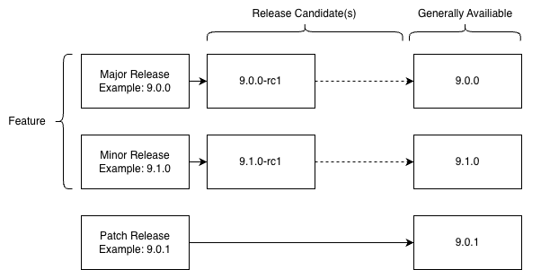

+++
title = "On release candidates"
date = 2026-04-09
description = "A release candidate just came out for Valkey. You’ve likely heard of the term before but do you know what it really means?"
authors = ["kyledvs"]
[extra]
featured = true
featured_image = "/assets/media/featured/random-05.webp"
+++

A *release candidate* (RC) just came out for Valkey. You’ve likely heard of the term before but do you know what it *really* means, especially in terms of Valkey? And do you know if you should care about this release? If any of those questions pique your interest, read on.

Before pulling apart the specific reasons to use a release candidate, it’s important to talk about generally available (GA) releases in Valkey. Valkey broadly follows the SemVer spec so there are two types of GA releases in Valkey: *feature* and *patch*. Valkey has two types of *feature* releases: major release (N.0.0: for example 8.0.0, 9.0.0, etc.) and minor release (X.N.0: 8.1.0, 9.1.0, etc.). Alternately, *patch* releases are patches (X.X.N: 7.2.6, 8.0.1, 8.1.1, etc.). 

For each feature release, there is at least one release candidate. A release candidate is a trial release for the GA : the release *should* include all user-surfaced features and changes of planned for the GA. ‘Should’ in the previous sentence is doing a lot of heavy lifting: because the RC is a trial it doesn’t mean it’s perfect. Indeed, a great time to have a release oopsy is during a release candidate, not the GA. The other component is that *internal* changes may not make it to the first release candidate known as ‘rc1’. After the first release there may be subsequent release candidates in sequential order: ‘rc2’, ‘rc3’, and so on. There are as many release candidates as needed but typically expect 2 or 3 release candidates per GA version. After the final release candidate there is the GA release of the version with the delta between the final RC and GA intended to be small. Patche releases typically don’t have release candidates as they are designed to only fix bugs and consequently the scope is more limited.



## Who should and shouldn’t use a release candidate?

Release candidates are intended for testing, so if you have a need to try out Valkey before the generally available release, then *maybe* a release candidate is something you should take for a spin. Release candidates are a great opportunity to provide feedback on changes, especially if whatever you build has an impact beyond just your own project. If you build tools, frameworks, platforms, integrations, packages, hardware, or modules you probably want to test out at least the first RC and pay attention to the release notes of the later RCs to understand if you need to test further.

Valkey has a very strict interpretation of compatibility and goes to great lengths to make sure the the API just doesn’t break. So, if you’re concerned about the Valkey API continuing to be compatible with your bespoke software, it’s probably not necessary to try out every release candidate and you can just adopt at the generally available stage. Also, keep in mind that a release candidate is never intended for a production system: it could have bugs or exploits that aren’t clearly disclosed later.

However, beyond testing, release candidates gives you a little bit of lead time for building against the stabilized API. Say, for example, you want to adopt a new command. You can wait until the version of Valkey goes GA then start development *or* you can throw the release candidate on a development machine and start writing code for it. Keep in mind that your client library may not have this new command yet if you’re very early (or the client library itself may also have an RC process).

## Getting a release candidate

Release candidates aren’t made available with a lot of hoopla: no big press releases, no social media notices, (typically) no blog post, and (usually) not on package managers or standalone packages. Valkey releases candidates are [published on GitHub](https://github.com/valkey-io/valkey/releases) (also as a [feed](https://github.com/valkey-io/valkey/releases.atom)) with a link to the source code, from here you can download and build the software yourself. Personally, I don’t download the software but rather grab the commit ID from the release page then do everything via git. In this example, the commit ID for the Valkey 9.1.0-rc1 is `6b85ca4` and I have a remote called ‘upstream’ pointed at [`github.com/valkey-io/valkey`](https://github.com/valkey-io/valkey)

```shell
$ git fetch upstream
...
$ git checkout 6b85ca4
...
$ make all
```

Alternately, Valkey publishes release candidates on Docker Hub as a [tag on the container](https://hub.docker.com/r/valkey/valkey/#user-content-release-candidates), avoiding the need to build the software.

Once you have a built version of the RC, you’ll be able to start `valkey-server` and other tools as normal. If you run the `INFO` command against a RC version, you’ll notice a specific value for the `valkey_release_stage` property indicating which RC version is running.

```shell
127.0.0.1:6379> info
# Server
redis_version:7.2.4
server_name:valkey
valkey_version:9.1.0
valkey_release_stage:rc1
```

## Feedback and next steps

When you test a release candidate, it’s important to report bugs promptly. While each individual feature is tested, your unique environment and use-case may reveal corner cases that are yet unknown. The best way to report feedback is via an issue on GitHub. Make sure when you report issues you clearly indicate that you’re using a release candidate.

While the project values feedback of all forms, if you find out during a release candidate that you don’t like or agree with a new API, return values, or if you think something is missing or doesn’t belong, it *may be too late* to have any real impact. While not impossible, it would be unlikely for a release candidate to trigger a large change in these areas. Primarily release candidates help validate stability, compatibility, and performance.

Evaluating and providing feedback on release candidates is a great way to contribute to the project. So, no matter if it is this release candidate or one in the future: blaze the trail and do your part to get that feedback in and make the Valkey GA release rock solid.