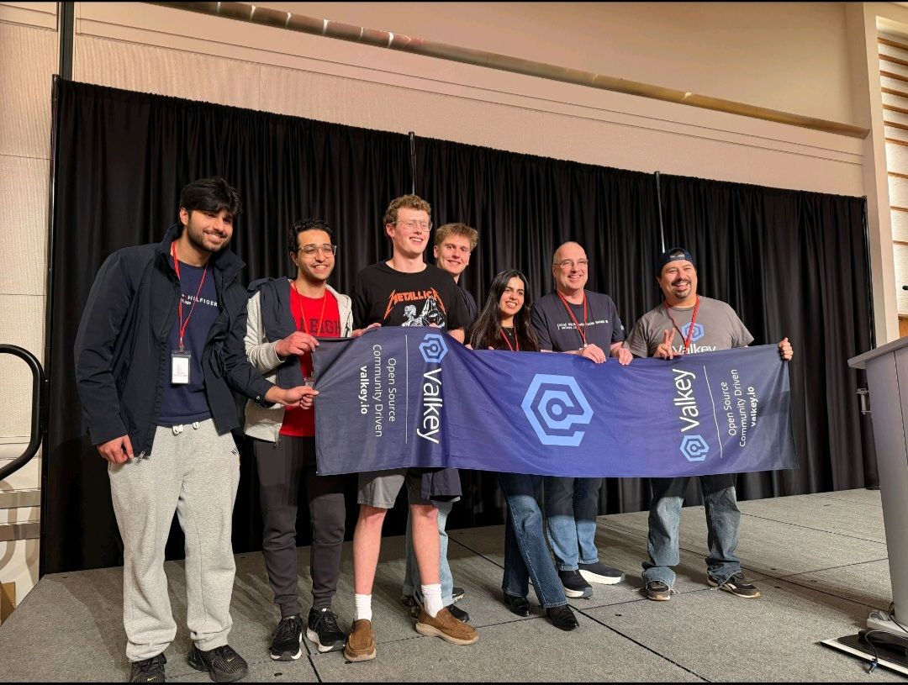

+++
title = "Victory at HackNC State: Innovating for the Telecom Industry with Valkey"
date = 2026-04-14
description = "HackNCState hackathon experience by the winning team" 
authors =  ["ahassan","nwitt","rmalik","tristancurtis"]
[extra]
featured = true
featured_image = "/assets/media/featured/valkey-helm.webp"
+++

The telecommunications industry is facing growing trust challenges as communication networks become targets for increasingly sophisticated fraud.

On February 14-15, 2026, 371 students and 15 teams came together at [HackNC State 2026](https://hackncstate.org/) to tackle this challenge within 24 hours. The Valkey project, under [The Linux Foundation](https://www.linuxfoundation.org/), invited the participants to compete in an API challenge choosing from the proposed topics or design a novel use case for an ultra fast in-memory, open source database. 

Among many impressive teams, Team Catphish rose to the occasion. They earned the “Best Use of Valkey API” award for developing a voice identity layer to help telecom providers detect and prevent fraud. 

# Insights from the Winners: The-24 Hour sprint

The following reflections were authored by Team Catphish winners: *Ahmed Hassan, Nolan Witt, Rameez Malik, Tristan Curtis*

## **The Problem the Team Chose and Why**

The idea for Catphish started with a simple observation: voice cloning technology has become remarkably convincing. Modern tools such as ElevenLabs can reproduce human speech patterns so accurately that distinguishing between a real voice and a synthetic one is becoming increasingly difficult.

During the team’s initial brainstorming session, the discussion quickly turned to the growing number of scams involving cloned voices. One scenario stood out. Imagine receiving a phone call that sounds exactly like a family member asking for urgent help, when in reality the voice has been generated by AI. Incidents like this are no longer hypothetical. AI-powered voice scams have already caused millions of dollars in losses as attackers impersonate relatives, executives, or banking customers.

Traditional voice authentication systems attempt to answer a single question: “Does this voice match the registered user?” However, this approach leaves a major vulnerability. If an attacker can generate a convincing voice clone, the system may still accept it as legitimate.

The team realized that most systems focus on verifying the sound of the voice but rarely verify whether the speaker actually understands what they are saying. Humans naturally interpret instructions and respond to them, while many text-to-speech systems simply read the text they are given.

This insight led to the core idea behind Catphish. Instead of only verifying who is speaking, the system also verifies how they respond to dynamic prompts. By testing a user’s cognitive response rather than only their vocal characteristics, the system can better distinguish between a real human speaker and an AI-generated voice.

## **The 24 Hour Strategy**

Building with Valkey (Technical Decisions, Architecture, and API Usage)
Hackathons move quickly, so within the first few hours, the team began defining the system architecture and development plan.

Ahmed mapped out the overall user flow and created lo-fi wireframes so the team could visualize the MVP and understand how users would interact with the authentication process.

Around the same time, Tristan suggested using Valkey for storage. Initially, there were some doubts, since many hackathon teams default to traditional relational databases. After testing Valkey locally, however, the advantages quickly became clear. Its in-memory architecture allowed voice data and session information to be retrieved almost instantly, which is critical for real-time authentication systems.

With the infrastructure decision made, development moved quickly. Nolan researched existing voice authentication approaches and explored how they could be implemented within the scope of a 24-hour project. That research helped shape the system’s two-layer authentication model.

The first layer verifies the speaker’s identity using voice embeddings generated from recorded audio. These embeddings capture unique vocal characteristics that can be compared against previously enrolled samples.
The second layer verifies cognitive understanding using dynamic prompts. Instead of asking users to read a fixed phrase such as “The sky is blue,” the system generates instructions like “Count from one to five.” A human naturally responds with the sequence of numbers, while a text-to-speech system often reads the instruction itself word-for-word. This behavioral difference helps the system detect AI-generated voices.
To support the system, Valkey was used to store several types of data, including voice embeddings for enrolled users, session data for authentication attempts, time-limited challenge prompts, API keys for tenant authentication, and rate-limiting counters.

Because Valkey is a key-value store, development was extremely fast. The team did not need to design schemas or run database migrations, which allowed them to focus on implementing the core authentication logic.
Valkey’s low-latency access also ensured that retrieving voice embeddings occurred in milliseconds. For a pipeline that includes audio recording, AI processing, and verification scoring, minimizing database latency was critical for maintaining a responsive user experience.

As the core system began to take shape, the team also considered how organizations might deploy the technology. Rameez proposed positioning Catphish as a B2B API service using a redirect-based flow similar to authentication or payment links used by companies like Stripe. Instead of verifying identity through a traditional two-factor authentication code sent by SMS or an authenticator app, users would be redirected to a voice verification page. First-time users enroll their voice, and future logins compare the recorded voice with the stored embedding while also verifying the cognitive prompt response.

## **Challenges the Team Faced**

One of the biggest challenges was designing prompts that could reliably distinguish between human responses and AI-generated speech.

The team experimented with several prompt formats during development. Some prompts were too simple and could easily be reproduced by text-to-speech systems, while others were overly complex and risked frustrating legitimate users. Accessibility was also an important consideration since prompts needed to remain understandable for a wide range of users.

Eventually, the team converged on multi-step cognitive prompts that are simple for humans but difficult for AI systems to interpret. These prompts combine small tasks such as saying a number, spelling a word, or responding to a short instruction. This approach became the system’s strongest signal for detecting synthetic voices.

Another challenge involved balancing security and usability. Voice verification relies on similarity scoring between embeddings, and selecting the right threshold is critical. If the threshold is too strict, legitimate users may be rejected. If it is too permissive, attackers may succeed. After testing several configurations, the team settled on an approximate similarity threshold of 85 percent.

Maintaining real-time performance was another challenge. The authentication pipeline includes several processing steps, including audio capture, embedding generation, speech analysis, database lookups, and verification scoring. Each step needed to be optimized to prevent noticeable delays during login. Valkey’s fast in-memory access played a key role in keeping the system responsive. 

## **Demo Time and Lessons Learned**

By the final hours of the hackathon, the team had a working demonstration of the Catphish system. The demo simulated a banking login environment.
When users attempted to sign in, they were redirected to the Catphish verification page, where they recorded their voice and responded to a dynamic prompt.
If the voice embedding matched the enrolled user and the prompt was answered correctly, authentication succeeded. If the system detected either a mismatched voice or an AI-generated response, the login attempt was rejected.
The demonstration helped illustrate the potential real-world applications of the system. Industries such as banking, healthcare, telecommunications, and enterprise software could integrate voice verification as an additional authentication factor to help prevent identity fraud.
The hackathon also produced several important lessons. First, infrastructure choices matter. Using Valkey significantly reduced development friction and allowed the team to build a real-time system without spending time configuring complex databases. Second, AI can help detect AI-generated content. Models trained to analyze speech patterns can identify subtle signals that may not be obvious to humans. Finally, identity verification is evolving. Traditional methods such as two-factor authentication codes sent via SMS or generated by authenticator apps are increasingly vulnerable, and approaches that combine voice authentication with behavioral analysis may become an important component of future security systems.

# Get Involved

To learn more and explore ways to get involved in the community:
If you would like to contribute to the mission, please consider joining the [Valkey community here](https://valkey.io/community/), where community members contribute and shape the future of the Valkey project.
Valkey is moving fast and the easiest way to stay ahead is to [subscribe to the official Valkey newsletter](https://valkey.io/blog/valkey-newsletter-new/#email-signup). You can also follow along on Valkey social channels for the latest Valkey community news, event recaps, and project developments ([LinkedIn](https://www.linkedin.com/company/valkey/), [X](https://x.com/valkey_io), and [BlueSky](https://bsky.app/profile/valkeyio.bsky.social)).