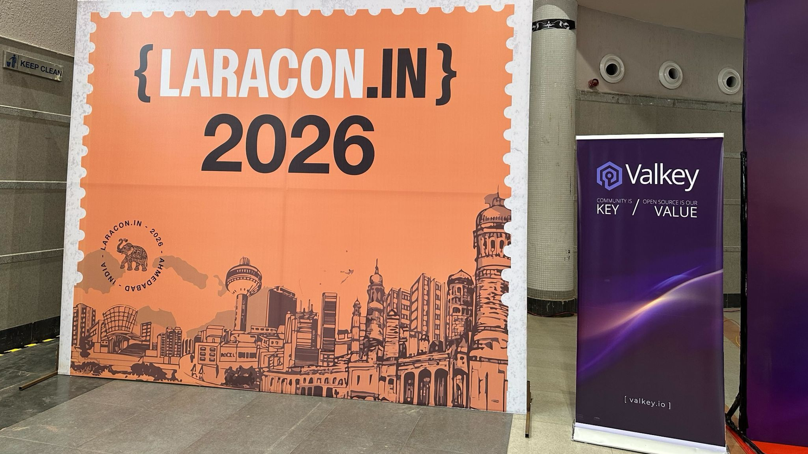
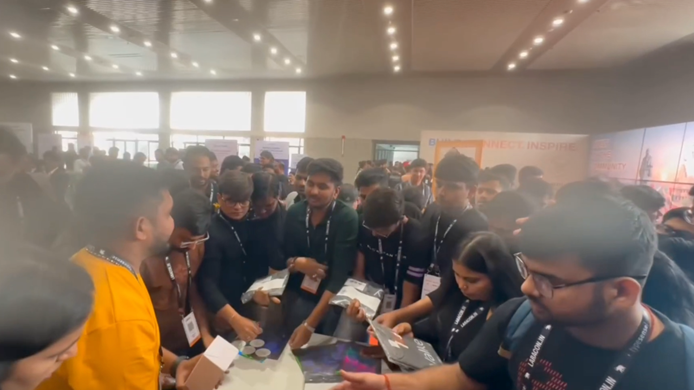

+++
title = "Valkey Meets Laravel: Bridging Open Source Communities at Laracon India 2026"
description = "Valkey participated as a sponsor at Laracon India 2026, connecting with 900 attendees and demonstrating how Valkey can power Laravel applications with zero vendor lock-in and zero code changes."
date = "2026-04-23 01:01:01"
authors = ["rlunar", "Shirkulk007"]

[taxonomies]
blog_type = ["Community Highlight"]

[extra]
featured = false
featured_image = "/assets/media/featured/random-02.webp"
+++

The Laravel community gathered in Ahmedabad, India, on January 31–February 1, 2026, for [Laracon India](https://laracon.in/) one of the most anticipated PHP conferences in the region.

Valkey was proud to participate as a sponsor, connecting with 900 attendees passionate about building fast, scalable, and modern web applications on open source foundations.

For those who couldn't attend in person, you can watch the full session recording here: **[Valkey session @ Laracon India 2026](https://www.youtube.com/watch?v=IqCIXSbN1ag)**



## Why Laracon India?

[Laravel](https://github.com/laravel/laravel) is one of the most widely adopted PHP frameworks in the world, and its community is deeply rooted in open source values community-driven development, transparent governance, and a commitment to developer freedom.

These same principles define Valkey.

As an open source, high-performance key-value datastore stewarded by the Linux Foundation, Valkey is built by a diverse, global community of contributors.

Laracon India provided the perfect opportunity to connect with developers who share these values and demonstrate how Valkey can power their Laravel applications with zero vendor lock-in and zero code changes.

## 100+ Conversations at the Booth

Over the two-day event, we had the privilege of speaking with more than 100 developers, architects, and engineering leaders at the Valkey booth.

A few questions came up repeatedly:

* **"Is Valkey really a drop-in replacement for Redis OSS?"** — Yes. Valkey is fully protocol-compatible with Redis OSS 7.2, meaning existing Laravel applications work seamlessly without any code changes.
* **"What's the story behind Valkey?"** — Valkey was created to ensure the community always has access to a truly open source, permissively licensed (BSD 3-Clause) key-value store. It is governed by the Linux Foundation and maintained by contributors from a wide range of organizations worldwide.
* **"Can I run Valkey anywhere?"** — Absolutely. Valkey runs on premises, in any cloud environment, or in hybrid deployments. You control where your data lives.
* **"What about performance?"** — Valkey 8.x delivers up to **230% performance improvement** over Valkey 7.2, supporting up to **1.2 million operations per second per server** and up to **1 billion operations per second per cluster** in version 9.0, all with sub-millisecond latency.

The energy at the booth was a clear signal: developers want open-source software they can trust, inspect, and run anywhere; and Valkey delivers exactly that.



## Session Recap: Zero Code Changes, Maximum Performance

The highlight of the event was a technical session walking attendees through how Valkey can seamlessly replace Redis OSS in Laravel applications.

### Performance That Scales

Valkey 8.x introduced a groundbreaking **multi-threaded I/O architecture**, offloading I/O operations to multiple threads for dramatically improved throughput:

* [**230% performance improvement**](/blog/valkey-8-0-0-rc1/#performance) over Valkey 7.2
* [**Up to 1.2 million operations per second**](/blog/unlock-one-million-rps/) per physical server
* **Sub-millisecond latency** even under high-throughput workloads

For high-traffic Laravel applications, this means handling more users with fewer resources — improving user experience while reducing infrastructure overhead.

### Memory Efficiency

Valkey 8.x also brings significant memory optimizations through a redesigned internal hash table data structure:

* [**19.7% memory savings**](/blog/valkey-memory-efficiency-8-0/) in Valkey 8.0
* [**An additional 27% memory savings**](/blog/valkey-8-1-0-ga/) in Valkey 8.1
* **Up to 41% total memory savings** for small key-value pairs (~16 bytes each)

Store more data in the same infrastructure or reduce costs by right-sizing your deployment.

### Enhanced resiliency and efficiency

Valkey 9.0 brings Atomic Slot Migrations, Hash Field Expirations and Numbered Databases in Cluster Mode.

* [**Up to 1 billion operations per second**](/blog/1-billion-rps/) per cluster

### Laravel + Valkey: Zero Code Changes

Because Valkey is protocol-compatible with Redis OSS, switching a Laravel application to Valkey requires a single change updating the endpoint in your `.env` file:

```bash
# Before
REDIS_HOST=redis.example.com

# After
REDIS_HOST=valkey.example.com
```

That's it. You are on Valkey.

No code refactoring. No compatibility issues.

Your existing Laravel configuration for cache, sessions, queues, and broadcasting continues to work exactly as before.

## Key Use Cases for Laravel Developers

### Caching

Valkey serves cached data from memory with sub-millisecond latency, dramatically reducing database load.

Laravel's cache system works out of the box, with existing `redis` store but if you'd like to define a `valkey` specific store you can do so:

```php
// config/cache.php
'default' => env('CACHE_STORE', 'valkey'),
'stores' => [
    'valkey' => [
        'driver' => 'redis',
        'connection' => 'cache',
    ],
],

// Usage
Cache::remember('users', 3600, function() {
    return User::all();
});
```

### Session Storage

For distributed Laravel applications running across multiple servers, Valkey provides fast, reliable, horizontally scalable session storage, handling auth state, flash messages, and user sessions with ease.

Simply set `SESSION_DRIVER=redis` in your `.env` and point `REDIS_HOST` to your Valkey instance, all session operations work automatically.

```php
// config/session.php
'driver' => env('SESSION_DRIVER', 'redis'),
'connection' => 'default',

// config/database.php
'redis' => [
    'default' => [
        'host' => env('REDIS_HOST', 'valkey.example.com'),
        'port' => env('REDIS_POST', 6379),
    ],
],

// Usage
session(['key' => 'value']);
```

### Queue Workers

Valkey provides reliable background job processing as a Laravel queue backend.

Jobs are persisted, retried on failure, and processed in order.

**Laravel Horizon** works seamlessly with Valkey, giving you full visibility into your queue workers.

```php
// config/queue.php
'default' => env('QUEUE_CONNECTION', 'redis'),
'connections' => [
    'redis' => [
        'driver' => 'redis',
        'connection' => 'default',
        'queue' => 'default',
    ],
],

// Usage
ProcessPodcast::dispatch($podcast);
```

### Real-Time Broadcasting

Valkey's pub/sub system integrates seamlessly with **Laravel Echo**, **Laravel Reverb**, and **Socket.IO** for real-time notifications, chat, and live updates.

Events are distributed to all connected clients with minimal latency, coordinating across multiple application instances.

```php
// config/queue.php
'default' => env('BROADCAST_CONNECTION', 'redis'),
'connections' => [
    'redis' => [
        'driver' => 'redis',
        'connection' => 'default',
    ],
],

// Usage
event(new OrderShipped($orded));
```

## The Open Source Advantage

It would be easy to frame Valkey purely as a performance story, and the numbers are genuinely impressive. But the deeper story is about what open source software means for the developer community. When a project is governed by a neutral foundation, licensed permissively, and built by contributors who aren't beholden to a single commercial interest, developers can build on it with confidence. They know the rules won't change. They know the community has a voice. They know their contributions matter. That's what Valkey represents, and it's why the response at Laracon India was so enthusiastic. The Laravel community has always understood the value of open-source software. Valkey fits right in.

## Join the Valkey Community

Valkey is built by the community, for the community.

Whether you're adopting Valkey in your next project, contributing to the codebase, or simply curious to learn more, here's how to get involved:

* **GitHub**: [github.com/valkey-io/valkey](https://github.com/valkey-io/valkey) — Star the repo, open issues, and contribute
* **Website**: [valkey.io](https://valkey.io/) — Documentation, release notes, and community resources
* If you would like to contribute to the mission, please consider joining the [Valkey community](https://valkey.io/community/), where community members contribute and shape the future of the Valkey project.
* Valkey is moving fast and the easiest way to stay ahead is to [subscribe](https://valkey.io/blog/valkey-newsletter-new/#email-signup) to the official Valkey newsletter. You can also follow along on Valkey social channels for the latest Valkey community news, event recaps, and project developments ([LinkedIn](https://www.linkedin.com/company/valkey/), [X](https://x.com/valkey_io), and [BlueSky](https://bsky.app/profile/valkeyio.bsky.social)).

## Closing Thoughts

Laracon India 2026 was a powerful reminder of what makes open-source special.

When developers gather around shared tools and shared values: transparency, collaboration, and freedom; the result is software that serves the entire community.

Valkey is a drop-in replacement for Redis OSS in Laravel applications, delivering enhanced performance, memory efficiency, and the confidence that comes from true open-source governance.

With zero code changes required and a thriving global community behind it, Valkey is ready to power the next generation of Laravel applications.
