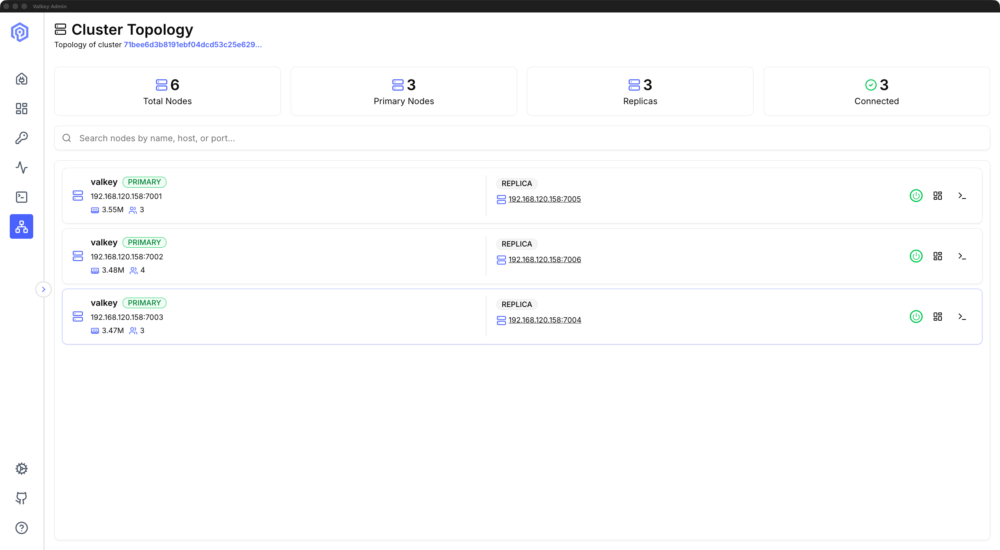
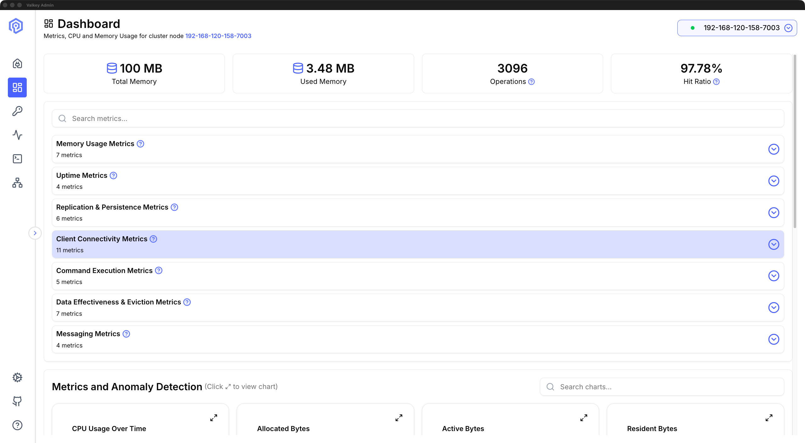
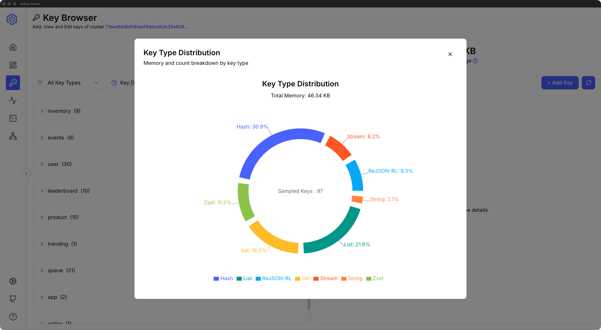
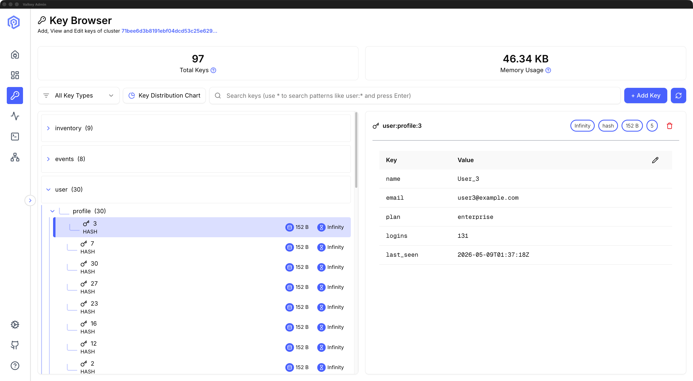
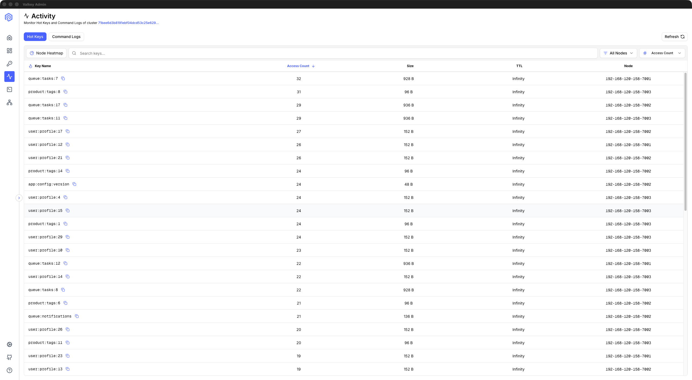
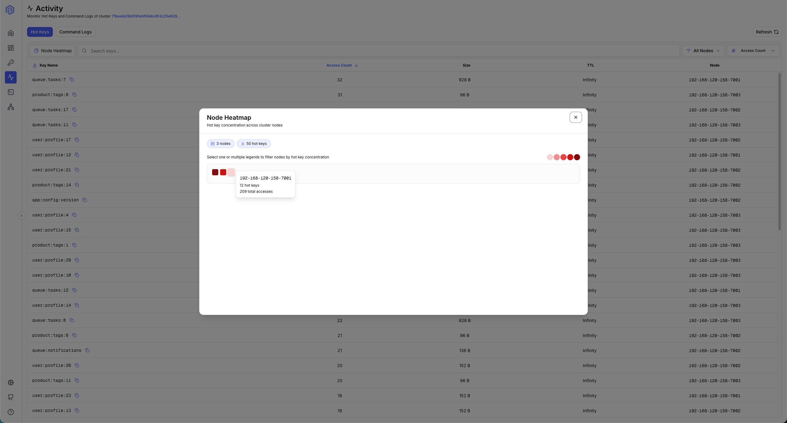

+++
title= "Introducing Valkey Admin 1.0: Visual Cluster Management for Valkey"
description = "Valkey Admin is a new open source observability and management tool from the Valkey project that brings cluster visibility, data inspection, and troubleshooting into a single view. It ships as a native desktop application for macOS and Linux, and as a containerized web deployment on Docker and Kubernetes."
date= 2026-05-12 00:00:00
authors= ["bblan0803", "arsenykostenko"]

[taxonomies]
blog_type = ["Announcements"]
[extra]
featured = true
+++

[Valkey Admin](https://github.com/valkey-io/valkey-admin) is a new open source observability and management tool from the Valkey project that brings cluster visibility, data inspection, and troubleshooting into a single view. It ships as a native desktop application for macOS and Linux, and as a containerized web deployment on Docker and Kubernetes. Valkey Admin provides real-time cluster dashboards, topology visualization with per-node detail, a key browser, hot key identification, and aggregated command logs across the cluster.

Valkey users today have a mix of trusted tools: `valkey-cli` for direct inspection, Prometheus and Grafana for metrics, and community GUIs for key browsing and visualization. Each is mature and well-suited to its scope, and combining them is common practice. Putting together a cluster-wide picture still often takes work across shards, dashboards, and terminals. Valkey Admin adds a cluster-wide layer that pulls these signals into one place, designed to complement the tools users already use rather than replace them.

In this post, we'll walk through what Valkey Admin does, how it detects hot keys, where you can run it, and how to get started.

## What Valkey Admin does

Valkey Admin organizes its capabilities around three user workflows: observability, inspection, and troubleshooting.

**Observability.** The dashboard shows real-time metrics including memory usage, CPU utilization, hit ratio, and command throughput, streamed over WebSocket, so the view reflects real-time changes without manual refresh. The cluster topology view renders a visual map of shards, primaries, and replicas, showing each node's role, host, and connection status. A disconnected replica or a node that cannot be reached will surface immediately on the map.





**Inspection and interaction.** The key browser lets you browse, search, inspect, and edit keys across seven data types: String, Hash, List, Set, Sorted Set, Stream, and JSON. The browser lets you search by pattern or exact key name, with results capped for responsiveness on large keyspaces. This covers the common tasks of verifying key contents during incident response, checking TTLs, and confirming that application writes landed correctly. The send command panel lets you run any Valkey command with formatted response output and a searchable command history for the current session, for quick command execution and debugging.





**Troubleshooting.** Hot key detection identifies frequently accessed keys across the cluster (more on this in the next section). Command logs surface slow commands, large requests, and large replies aggregated across the cluster with node attribution, so you can trace latency spikes back to specific shards. Under the hood, Command logs analyze `COMMANDLOG` output, a Valkey 8.1 feature that tracks slow commands, large requests, and large replies in a single log. A typical triage path: dashboard for anomalies, command logs for the problematic commands, hot key detection to confirm the issue.



These six features (dashboard, cluster topology, key browser, send command, hot key detection, command logs) ship in Valkey Admin 1.0. We welcome feedback on what to build next.

## Finding hot keys without slowing down your cluster

Hot key detection in Valkey often involves manual steps: knowing which commands to run (`CLUSTER SLOT-STATS`, `MONITOR`, `OBJECT FREQ`), connecting to the right nodes, parsing the output, and correlating results across shards. Valkey Admin picks the lowest-overhead detection method your cluster supports, so you get hot key visibility with minimal load on your cluster. It selects automatically based on server configuration to keep diagnostic load bounded.

The default approach avoids `MONITOR`, which intercepts commands processed by the server and streams them back to the client. On a cluster already under pressure, that overhead can make the situation worse.

**Hot slots (default when available).** When `CLUSTER SLOT-STATS` is available (Valkey 8.0+ with LFU eviction and cluster mode), Valkey Admin uses it as the low-overhead default. This method identifies hot slots by CPU usage. Because `CLUSTER SLOT-STATS` reads server-side counters, it has minimal performance impact on your cluster. Valkey Admin then resolves keys within the hot slots and retrieves their access frequency via `OBJECT FREQ <key>`, which reports the LFU logarithmic access frequency counter.

To use hot slots, your cluster needs: Valkey 8.0 or later, cluster mode, `cluster-slot-stats-enabled=yes` in your server configuration, and an LFU eviction policy (`allkeys-lfu` or `volatile-lfu`). Under the hood, the query Valkey Admin runs looks like this:

```
CLUSTER SLOT-STATS ORDERBY CPU-USEC LIMIT 50
```

This returns the fifty slots consuming the most CPU time, in descending order. Valkey Admin visualizes these results, resolves the keys in each slot, and ranks them by access frequency, turning a multi-step CLI workflow into a single view.



**Monitor-based detection.** For any deployment where hot slots are not available, Valkey Admin uses the `MONITOR` command. It samples commands in real time across all monitored nodes, with configurable sampling duration and interval, then aggregates the results to surface the most frequently accessed keys.

Monitor-based detection works with any Valkey or Redis OSS version, in both standalone and cluster modes. The tradeoff is that `MONITOR` does add overhead while sampling is active, so Valkey Admin uses short, configurable sampling windows rather than continuous capture. Before switching to the higher-overhead `MONITOR`, the settings UI shows the performance warning, so the tradeoff is explicit.

## Run it where you run Valkey

Valkey Admin ships as a desktop application and as a containerized web deployment. Downloads for both live on the GitHub releases page: macOS users can choose the `.dmg` installer; Linux users can choose between AppImage and `.deb`.

Docker images are published to three registries:

- **GitHub Container Registry:** `ghcr.io/valkey-io/valkey-admin`
- **Docker Hub:** `valkey/valkey-admin`
- **Amazon ECR Public Gallery:** `public.ecr.aws/valkey/valkey-admin`

Valkey Admin connects to standalone instances and cluster mode deployments. TLS is supported via the `VALKEY_TLS` environment variable, password authentication is supported, and IAM authentication is available for managed services that use AWS IAM, via `VALKEY_AUTH_TYPE=iam`. For managed services that restrict certain administrative commands, Valkey Admin uses unrestricted alternatives where possible, so users get the same diagnostic signal without requiring elevated permissions.

The tool works with Valkey 7.2+ and 8.x. The hot slots feature requires Valkey 8.0 or later for `CLUSTER SLOT-STATS` support; Command Logs requires 8.1+, all other features work across both major versions.

For Kubernetes deployments, metrics servers run as sidecars on each Valkey primary pod. This architecture keeps the main Valkey Admin deployment small (approximately 1 GB RAM) while distributing metrics collection across the cluster. Pre-release validation ran Valkey Admin against clusters with up to 276 nodes. Resource sizing is modest overall: a cluster with 1 to 5 primaries runs comfortably on 2 vCPU and 2 GB RAM. The sizing formula scales linearly: RAM is `(primary nodes x 150 MB) + 1 GB`, and disk is `(primary nodes x 50 MB) + 1 GB`.

### Docker deployment

Pull the image and point it at your cluster:

```bash
docker pull valkey/valkey-admin:latest
# See examples/aws, examples/docker-example, examples/k8s in the repo
```

To pre-configure metrics collection at startup, set these environment variables:

- `VALKEY_HOST`: your Valkey host or cluster endpoint
- `VALKEY_PORT`: defaults to `6379`
- `VALKEY_TLS`: set to `true` for TLS connections (defaults to `false`)
- `VALKEY_AUTH_TYPE`: `password` or `iam` (defaults to `password`)

The `examples/` directory in the repo contains deployment guides for Docker, Kubernetes, and IAM authentication. Valkey Admin does not include built-in authentication for its web interface. In Docker and Kubernetes deployments, run it behind a reverse proxy or an auth layer such as an OAuth proxy, Cognito, or your identity provider. Metrics are captured per primary node. Replica observability is not independent; you see replica status through the cluster topology view, but metrics collection targets primaries.

## Join the community

Valkey Admin gives Valkey users a unified tool for monitoring, inspecting, and troubleshooting Valkey clusters, whether you're running a three-node development cluster or a production deployment at scale. We invite you to try it out.

The project lives at [github.com/valkey-io/valkey-admin](https://github.com/valkey-io/valkey-admin) under the Apache 2.0 license. To propose new features or significant changes, open a GitHub Issue with the `[RFC]` prefix; the maintainers review RFCs and guide them through design and implementation. Bug reports, documentation improvements, and pull requests of all sizes are welcome.

We want to acknowledge the maintainers who have built Valkey Admin to 1.0: [@arseny-kostenko](https://github.com/arseny-kostenko), [@ravjotbrar](https://github.com/ravjotbrar), [@ArgusLi](https://github.com/ArgusLi), and [@nassery318](https://github.com/nassery318). The community made them stronger at every step. [@NormB](https://github.com/NormB) identified and fixed three password-handling bugs in the desktop connection flow, making authentication more reliable. [@nfunke](https://github.com/nfunke), [@maravisk](https://github.com/maravisk), [@rlunar](https://github.com/rlunar), [@Shirkulk007](https://github.com/Shirkulk007) tested pre-release builds and surfaced issues before GA. Valkey Admin would not have reached 1.0 without everyone who filed issues, tested builds, and submitted patches.

The roadmap beyond 1.0 is open and community-driven. Big key detection, slot heat maps that visualize hot-slot distribution across the cluster, and Prometheus integration for the broader observability stack are options we are exploring, and we look forward to building them together.
