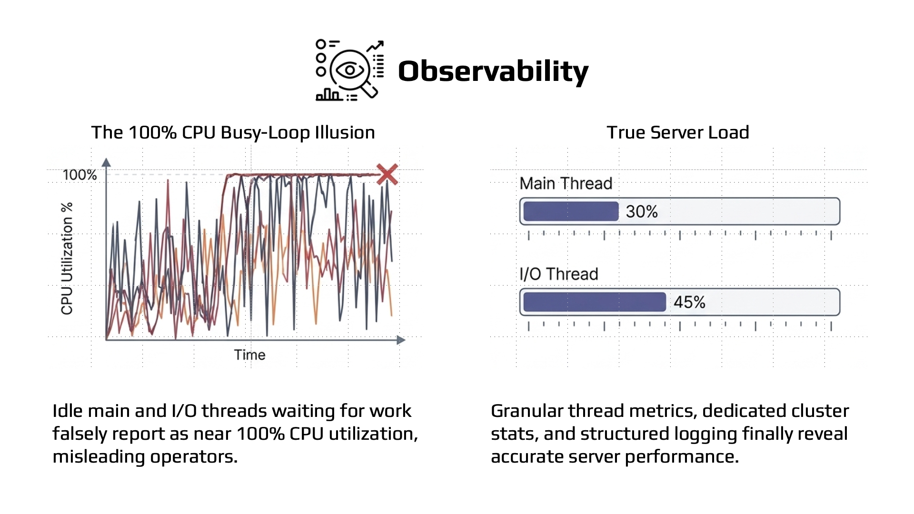
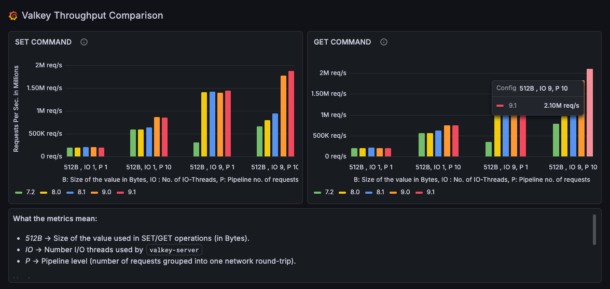
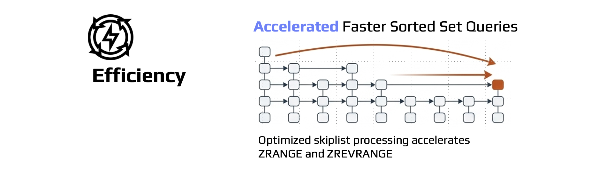

+++
title= "Valkey 9.1 delivers improvements in security, performance, and more"
description = "The Valkey community is excited to announce Valkey version 9.1. This latest release includes new functionality and improvements for security, observability, performance, efficiency, and tooling from over eighty contributors. Let's take a look at a few of the highlights in this release."
date= 2026-05-19 00:00:00
authors= ["jaduffy", "rlunar"]

[taxonomies]
blog_type = ["Announcements"]
[extra]
featured = true
featured_image = "/assets/media/featured/Valkey-Release.svg"
+++

The Valkey community is excited to announce Valkey version 9.1. This latest release includes new functionality and improvements for security, observability, performance, efficiency, and tooling from over eighty contributors. Let's take a look at a few of the highlights in this release.

## Security

Release 9.1 strengthens Valkey's security capabilities with several important enhancements:

**Database-level Access Control:** Valkey now supports database-level access control, allowing administrators to restrict which commands a user may execute with per-database granularity. Previously, ACL rules could control which commands a user could execute and which keys they could access, but that access applied to any database. With database-level ACLs, administrators and operators can now scope user permissions to specific databases, enabling stronger multi-tenant isolation and more granular security policies.

As an example, we can create a user and limit their access to databases 0 and 1:
```bash
> ACL SETUSER app-user on >secretpass +@all ~* db=0,1
```

After authenticating, that user can interact with database 0:
```bash
> SELECT 0
OK
 > SET mykey "hello"
OK
```

But not database 2:
```bash
> SELECT 2
(error) NOPERM No permissions to access database
```

**Lua Moved to a Module:** Valkey 9.1 moves the Lua scripting engine into its own module, decoupling it from the core server. By extracting Lua into a module, Valkey reduces its security surface area and gives operators the option to disable Lua entirely if it is not required. To make it easier to understand which scripting engines are loaded, the  [`INFO`](https://valkey.io/commands/info/) command has a new section named `Scripting Engines`.

**TLS Improvements:** Valkey now displays TLS certificate expiration dates via the [`INFO`](https://valkey.io/commands/info/) command, making it easier to detect and avoid outages caused by expired TLS certificates. 9.1 also includes automatic background reloading of TLS certificates to enable rotation without downtime and support for TLS authentication using certificate Subject Alternate Name (SAN) URIs for easier mTLS integration.

## Observability



New observability features in Valkey 9.1 make it easier to understand how your server is performing:

**Main and I/O Thread Usage Metrics:** CPU usage metrics alone don’t provide enough insight into how loaded a Valkey server is, as the main thread and I/O threads will wait for work in a busy loop that can appear as near 100% CPU utilization, even if the threads are relatively idle. New cumulative metrics for main and I/O thread usage make it easier to monitor your server’s true load and tune accordingly.

**JSON Logging :** Valkey can now emit server logs in JSON format with the `log-format json` configuration directive. To emit logs in JSON format, add the following configuration to valkey.conf: 
`log-format json`

Previously on plain text:
```text
14082:M 14 May 2026 14:12:43.508 * oO0OoO0OoO0Oo Valkey is starting oO0OoO0OoO0Oo
14082:M 14 May 2026 14:12:43.510 * Valkey version=255.255.255, bits=64, commit=6c329dfe, modified=0, pid=14082, just started
14082:M 14 May 2026 14:12:43.512 * Configuration loaded
14082:M 14 May 2026 14:12:43.515 * Increased maximum number of open files to 10032 (it was originally set to 2560).
14082:M 14 May 2026 14:12:43.517 * monotonic clock: ARM CNTVCT @ 24 ticks/us
14082:M 14 May 2026 14:12:43.519 # Failed to write PID file: Permission denied
14082:M 14 May 2026 14:12:43.521 * Running mode=standalone, port=6379.
14082:M 14 May 2026 14:12:43.522 # WARNING: The TCP backlog setting of 511 cannot be enforced because kern.ipc.somaxconn is set to the lower value of 128.
14082:M 14 May 2026 14:12:43.555 * Module 'lua' loaded from libvalkeylua.so
14082:M 14 May 2026 14:12:43.556 * Server initialized
14082:M 14 May 2026 14:12:43.557 * Ready to accept connections tcp
```

Each log line is a single JSON object:
```json
{"pid":14500,"role":"primary","timestamp":"14 May 2026 14:13:02.921","level":"notice","message":"oO0OoO0OoO0Oo Valkey is starting oO0OoO0OoO0Oo"}
{"pid":14500,"role":"primary","timestamp":"14 May 2026 14:13:02.922","level":"notice","message":"Valkey version=255.255.255, bits=64, commit=6c329dfe, modified=0, pid=14500, just started"}
{"pid":14500,"role":"primary","timestamp":"14 May 2026 14:13:02.923","level":"notice","message":"Configuration loaded"}
{"pid":14500,"role":"primary","timestamp":"14 May 2026 14:13:02.924","level":"notice","message":"Increased maximum number of open files to 10032 (it was originally set to 2560)."}
{"pid":14500,"role":"primary","timestamp":"14 May 2026 14:13:02.925","level":"notice","message":"monotonic clock: ARM CNTVCT @ 24 ticks/us"}
{"pid":14500,"role":"primary","timestamp":"14 May 2026 14:13:02.925","level":"warning","message":"Failed to write PID file: Permission denied"}
{"pid":14500,"role":"primary","timestamp":"14 May 2026 14:13:02.926","level":"notice","message":"Running mode=standalone, port=6379."}
{"pid":14500,"role":"primary","timestamp":"14 May 2026 14:13:02.927","level":"warning","message":"WARNING: The TCP backlog setting of 511 cannot be enforced because kern.ipc.somaxconn is set to the lower value of 128."}
{"pid":14500,"role":"primary","timestamp":"14 May 2026 14:13:02.928","level":"notice","message":"Module 'lua' loaded from libvalkeylua.so"}
{"pid":14500,"role":"primary","timestamp":"14 May 2026 14:13:02.929","level":"notice","message":"Server initialized"}
{"pid":14500,"role":"primary","timestamp":"14 May 2026 14:13:02.930","level":"notice","message":"Ready to accept connections tcp"}
```


## Performance



Valkey 9.1 pushes single-instance throughput to 2.1 million requests per second using 512-byte payloads, 9 IO threads, and a pipeline depth of 10 commands. You can explore the full results and compare across versions on the [Valkey Performance Dashboards](https://valkey.io/performance/).

Notable performance enhancements in 9.1 include:

**New IO threading model**: A redesign of the IO threading communication model improves throughput by up to 17% for a variety of workload types.

**Faster Stream Operations**: The [`XRANGE`](https://valkey.io/commands/xrange/) and [`XREVRANGE`](https://valkey.io/commands/xrevrange/) commands are up to 30% faster thanks to [streams range hot path optimizations](https://github.com/valkey-io/valkey/pull/3002).

**Higher throughput GETs**:  Raising the string embedding size threshold delivers up to 30% higher throughput for string GET commands.

**Faster Sorted Set Queries**: Improvements to skiplist query processing makes sorted set operations like [`ZRANGEBYSCORE`](https://valkey.io/commands/zrangebyscore/) and [`ZRANGEBYLEX`](https://valkey.io/commands/zrangebylex/) faster.

**Cached COMMAND responses**: [`COMMAND`](https://valkey.io/commands/command/) responses are now cached. This may reduce connection establishment time for some clients which use this command as part of client initialization.

**Enable Hardware Clock by default**: Valkey now enables hardware clock use by default, reducing the overhead of time-related system calls and improving GET and SET performance by up to 3% overall.


## Efficiency



9.1 continues Valkey’s focus on memory efficiency and faster internal operations:

**Reduced Memory Usage for Strings**: Internal pointer optimizations bring up to a 20% memory reduction for strings under 128 bytes, delivering significant memory usage reduction for common use cases that store many small string values.

**Reduced Memory Usage for Sorted Sets**: Skiplist optimizations reduce sorted set memory usage by up to 10%.

**Improved Rehashing Performance**: Valkey 9.1 optimizes internal hash table rehashing (often triggered by keyspace growth) to reduce latency impact during rehashing operations.

**Faster Bulk Delete Operations**: Valkey now pauses internal hash table resizing during bulk delete operations like [`SREM`](https://valkey.io/commands/srem/), [`ZREM`](https://valkey.io/commands/zrem/), and [`HDEL`](https://valkey.io/commands/hdel/) to avoid unnecessary rehashing operations and improve bulk deletion performance.

**More Efficient Replica Creation**: Replica creation with AOF enabled now reuses the received RDB file instead of generating a new snapshot for the initial AOF base file.


## New Commands

### HGETDEL

The new [`HGETDEL`](https://valkey.io/commands/hgetdel/) command atomically retrieves and deletes one or more fields from a hash. This is useful for queue-like patterns where you need to consume and remove data in a single operation, eliminating the need to use a transaction with [`HGET`](https://valkey.io/commands/hget/) followed by an [`HDEL`](https://valkey.io/commands/hdel/).

Let's see a practical example showing a job hash where `status` and `payload` fields are atomically retrieved and removed in one call, leaving only the `retries` field behind.

```bash
> HSET job:42 status "pending" payload '{"action":"send_email"}' retries "3"
(integer) 3
> HGETDEL job:42 FIELDS 2 status payload
1) "pending"
2) "{\"action\":\"send_email\"}"
> HGETALL job:42
1) "retries"
2) "3"
```

### MSETEX

The new [`MSETEX`](https://valkey.io/commands/msetex/) command allows you to set multiple keys with a shared expiration time in a single command. Previously, setting multiple keys with the same TTL required either multiple [`SETEX`](https://valkey.io/commands/setex/) calls or a pipeline of [`SET`](https://valkey.io/commands/set/) and [`EXPIRE`](https://valkey.io/commands/expire/) commands. [`MSETEX`](https://valkey.io/commands/msetex/) simplifies this common pattern and reduces round trips.

Let's see three examples:

1. Set 3 session keys that all expire in 3600 seconds
```bash
> MSETEX 3 session:abc "user:1" session:def "user:2" session:ghi "user:3" EX 3600
OK
> TTL session:abc
(integer) 3600
> GET session:def
"user:2"
```

2. Use NX to only set keys that do not already exist
```bash
> MSETEX 2 session:abc "user:99" session:xyz "user:4" NX EX 3600
OK
> GET session:abc
"user:1"
> GET session:xyz
"user:4"
```

3. Use PX for millisecond precision expiration
```bash
> MSETEX 2 cache:page1 "<html>..." cache:page2 "<html>..." PX 500
OK
```

### CLUSTERSCAN

The new [`CLUSTERSCAN`](https://valkey.io/commands/clusterscan/) command enables cluster-wide key scanning across nodes. Previously, scanning all keys in a cluster required clients to independently [`SCAN`](https://valkey.io/commands/scan/) each node and merge results. [`CLUSTERSCAN`](https://valkey.io/commands/clusterscan/) provides a unified interface for iterating over keys across the entire cluster, simplifying client implementations and operational tooling.

Let's explore some examples:

1. Iterate over all keys in the cluster
```bash
> CLUSTERSCAN 0
1) "3"
2) 1) "user:1001"
   2) "user:1002"
   3) "session:abc"
```

2. Continue scanning with the returned cursor until it returns 0
```bash
> CLUSTERSCAN 3
1) "7"
2) 1) "cache:page1"
   2) "order:5001"
```

3. Filter by pattern to find all session keys across the cluster
```bash
> CLUSTERSCAN 0 MATCH "session:*"
1) "12"
2) 1) "session:abc"
   2) "session:def"
```

4. Filter by key type
```bash
> CLUSTERSCAN 0 TYPE hash
1) "5"
2) 1) "user:profile:1001"
   2) "job:42"
```

5. Scan keys in a specific slot
```bash
> CLUSTERSCAN 0 SLOT 7638
1) "0"
2) 1) "user:1001"
```


## Tooling

Tooling improvements in 9.1 include: 

**CLI Support for Atomic Slot Migration**: The Valkey CLI tool now supports atomic slot migration by providing the `--cluster-use-atomic-slot-migration` parameter when performing `--cluster rebalance` and  `--cluster reshard` operations. 

**Benchmark Improvements:** The `valkey-benchmark` tool now includes RPS distribution in the output and new `--warmup` and `--duration` parameters, giving users more control over benchmarking runs and more detailed performance analysis.


## Thank You to Our Contributors

Over eighty individual contributors made Valkey 9.1 possible. For the full list of changes, see the release notes on GitHub [9.1.0-rc1](https://github.com/valkey-io/valkey/releases/tag/9.1.0-rc1) and [9.1.0-rc2](https://github.com/valkey-io/valkey/releases/tag/9.1.0-rc2). Thank you to everyone who contributed code, reported issues, reviewed pull requests, and helped make this release possible. Valkey continues to get better because you helped make it that way. 

We encourage you to try Valkey 9.1 and share your feedback on [GitHub](https://github.com/valkey-io/valkey) and in the [Valkey community](https://valkey.io/community/).

