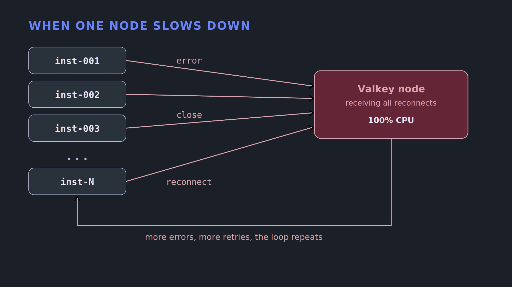
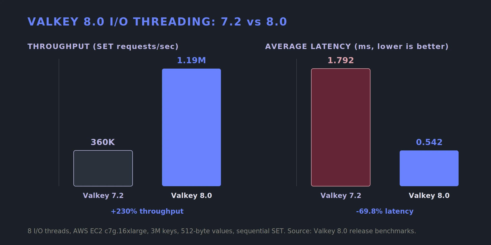

+++
title = "Managing Connection Storms in Valkey at Scale"
description = "When Valkey metrics look fine but your app is failing, the problem is often connection storms, retry floods, and fleet-wide coordination."
date = 2026-05-28
authors = ["allenhelton"]
[taxonomies]
blog_type = ["Technical Deep Dive"]
[extra]
featured = true
featured_image = "/assets/media/featured/random-04.webp"
+++

The alerts are firing. Users cannot complete requests. The cache dashboard shows CPU normal, memory normal, hit rate normal, p99 within SLA. The Valkey node metrics are all green. The cluster topology has not changed. Yet the application is still failing.

This is one of the more disorienting situations in distributed systems. The component everyone assumes is the culprit is behaving perfectly, and the system is broken anyway. The failure is not in the cache itself. It is in how the cache interacts with everything around it: the clients, the connection pools, the proxies, and the retry logic baked into client libraries that were never designed to account for a fleet of thousands of service instances all responding to the same transient error at the same millisecond.

At extreme scale, the hardest failures rarely come from a single component breaking. They come from *thousands of systems reacting to the same failure at the same moment*.

At [Unlocked San Jose](https://unlockedconf.io) earlier this year, [Yang Yang](https://www.linkedin.com/in/yang-yang-b32703162/) and [Shawn Wang](https://www.linkedin.com/in/chipkernel/) from Uber and [Ovais Khan](https://www.linkedin.com/in/ovaiskhan/) from Snap each walked through what operating cache infrastructure at extreme scale teaches you. Uber runs roughly 1 billion RPS across 2,000 clusters. Snap recently completed a migration of 350 cache clusters off a long-lived Redis fork to Valkey. Neither talk was primarily about throughput. Both were about the failure modes that benchmarks never surface, and the safety mechanisms they use to prevent outages.

## Benchmarks do not model your retry behavior

There is a specific failure mode called a [connection storm](https://www.gomomento.com/blog/understanding-the-nxm-problem-in-distributed-caches/). It's a classic example of a system doing exactly what it was designed to do and making everything worse.

Uber's microservices run many instances, each using a client with a connection pool per Valkey node. Under normal conditions this is efficient and fast. Then a node becomes briefly unavailable due to a network hiccup, a host reboot, or a momentary resource spike. The client detects the I/O error, closes the connection, and creates a new one. That is correct behavior for a single client.

The problem is that this happens across hundreds or thousands of instances simultaneously. Every instance that touched that node in the last few hundred milliseconds sees the same error. Every one of them closes its connection and immediately sends new connection requests to the already-stressed node. TCP handshakes, TLS negotiation, and authentication all land at once. The node, which might have recovered in seconds, instead hits 100% CPU and stops responding.



The retry behavior that protects a single client destroys the cluster at fleet scale. Benchmarks never capture this because they do not model thousands of clients responding to shared state simultaneously.

Uber's immediate fix was to use [`iptables` rules](https://www.digitalocean.com/community/tutorials/how-to-set-up-a-firewall-using-iptables-on-ubuntu-14-04) to cut traffic to the impacted node before the feedback loop completed. Stopping the amplification gives the node space to recover without a continuing flood of new connection attempts.

The longer-term fix was structural. Upgrading their client from Go Redis v8 to v9 removed the aggressive connection reaping behavior that made the storm so severe. Adding per-node client-side rate limiters and circuit breakers meant that even if a node degraded, the client fleet could no longer amplify that degradation into an outage.

## How Valkey responds to connection storms

This is where Valkey's architecture becomes directly relevant to the connection storm failure mode. The problem during a storm is that TLS handshakes and socket polling are expensive operations that compete with command execution on the main thread.

Valkey 8.0 significantly [overhauled I/O threading](https://valkey.io/blog/valkey-8-0-0-rc1/#performance), allowing the main thread and I/O threads to operate concurrently. I/O threads handle reading and parsing commands, writing responses, polling for I/O events via `epoll_wait`, and memory deallocation. Previously, `epoll_wait` alone consumed more than [20% of main thread time](https://valkey.io/blog/unlock-one-million-rps/#high-level-design). Offloading it frees the main thread to spend more cycles executing commands rather than managing I/O.

The payoff showed up directly in the benchmarks. Against Valkey 7.2, throughput rose roughly 230% and average latency dropped 69.8%, measured with sequential [`SET`](https://valkey.io/commands/set/) commands on a single large instance.



The main thread is the bottleneck during a storm, which is exactly what this threading work frees up. Valkey 8.1 went further, [offloading TLS negotiation to I/O threads](https://valkey.io/blog/valkey-8-1-0-ga/#i-o-threads-improvements). That change alone improved the rate of accepting new connections by around 300%, directly addressing the scenario where a burst of new connections during a storm previously blocked the main thread from serving existing ones. The same release also offloaded `SSL_pending()` and `ERR_clear_error()` calls to I/O threads, producing a measured 10% improvement in `SET` throughput and 22% in [`GET`](https://valkey.io/commands/get/) throughput for TLS workloads.

To configure I/O threading, the key parameter is `io-threads`. One important detail: the count includes the main thread. Setting `io-threads 6` launches 5 dedicated I/O threads plus the main thread. The Valkey 9.0 [large cluster benchmark](https://valkey.io/blog/1-billion-rps/#benchmarking) used the following configuration on 8-core r7g.2xlarge nodes, pinning 2 cores to interrupt affinity and assigning the remaining 6 to Valkey:

```bash
# valkey.conf
cluster-enabled yes
cluster-config-file nodes.conf
cluster-require-full-coverage no
cluster-allow-reads-when-down yes
io-threads 6
maxmemory 50gb
save ""
```

That setup achieved over 1 billion `SET` requests per second across a 2,000-node cluster, with throughput scaling nearly linearly with primary count. For production sizing, the practical starting point is `io-threads` equal to the available core count minus 1 to 2, with the remainder reserved for OS and interrupt handling.

### Cluster-level storms

The connection storm problem is not limited to application clients. Uber observed it between service instances and Valkey nodes. Valkey 9.0 addressed an analogous problem inside the cluster itself.

When hundreds of nodes fail simultaneously, each surviving node was attempting to reconnect to all failed nodes every 100ms, consuming significant CPU on connection management rather than serving requests. Valkey 9.0 introduced a [throttling mechanism](https://github.com/valkey-io/valkey/pull/2154) scoped to the configured `cluster-node-timeout`, ensuring enough reconnect attempts occur within a reasonable window while preventing surviving nodes from being overwhelmed by their own recovery behavior. This is the same principle as Uber's `iptables` approach, applied natively inside the cluster bus.

### A proxy is not automatically a safety net

Uber's architecture includes a custom L4 proxy between application instances and the cache clusters. During the migration, their team found a second form of connection storm originating at the proxy layer.

During bursts of new connections, the proxy becomes a bottleneck. TLS setup, memory allocation for new connection state, and file descriptor management all compete for resources. Existing connections slow down. Slower connections trigger application timeouts. Timeouts trigger more retries. More retries create more new connections. The same feedback loop, one layer upstream.

This is where proxy design makes all the difference. A thin proxy that only forwards requests moves the failure mode behind a smaller number of ingress points. But a [well-designed routing layer](https://www.gomomento.com/blog/why-large-cache-systems-need-routing-layers/) does the opposite. By multiplexing many client connections into a small, stable set of backend connections, it shifts connection count from multiplicative to roughly linear and decouples backend connection pressure from client-side deployment churn. When application pods restart, they reconnect to long-lived routing nodes and the backend never sees the storm. The same component that amplifies a storm when built carelessly is one of the most effective tools for absorbing it when built well.

Uber addressed their proxy bottleneck by adding fairness algorithms to explicitly prioritize traffic from established connections over new ones. Under pressure, the proxy serves the work it has already committed to before taking on new work.

A proxy that explicitly delays new connections while existing ones flow smoothly may look worse in a benchmark, but it behaves far better during an incident. Accepting less work is often more reliable than accepting all work slowly.

### Where the storms really come from

Both of these storms are downstream of a structural issue: *too many connections.*

At Uber, each stateless service instance maintains a pool of `p` connections per Valkey node. If `n` instances are running, each node sees `n x p` connections. For a large service with thousands of instances and a pool size of even 5 to 10, a single node can see tens of thousands of connections under normal operation. During a retry storm, that number spikes sharply.

This is not a misuse of the system. It is what direct-connect architectures look like at scale. The surface area for connection-related failure grows with every new service instance and every node added to the cluster.

Uber's mitigations focused on reducing the effective connection rate through client-side caching for hot keys to reduce round trips, request deduplication, and batching operations like hash-field deletions into multi-key commands. They also looked at I/O multiplexing through Java's Lettuce client (also available in [Valkey GLIDE](https://glide.valkey.io/concepts/architecture/async-execution/#rust-core-multiplexing)), which lets a single connection carry many concurrent requests and directly reduces the `p` in the `n x p` equation. Fewer connections per node means fewer to reestablish when retries amplify, which shrinks the blast radius of a connection storm.

But there's a tradeoff. Multiplexing many requests onto a single connection introduces head-of-line blocking. So a single slow command can stall the requests queued behind it on the same connection. It's most pronounced when a single multiplexed connection fans out across multiple clusters, where one slow node can hold up traffic bound for healthy ones.

For Uber's workload the connection-fanout reduction outweighed that risk, and the Lettuce results were enough to push them toward evaluating the same multiplexing capability for their Go clients. New client libraries with multiplexing are now part of their Cache Platform 2.0 roadmap.

## Build the safeguards before you need them

Snap moved 350 cache clusters off KeyDB, a multithreaded Redis 6.2 fork, to Valkey without application teams noticing the change. A proxy abstraction in front of their clusters made that possible. Application code kept using the same APIs while the backend swapped underneath.

But the interesting part of the story is what they built to make the migration safe.

### Load shedding at 95% CPU

When a cluster's CPU utilization crosses 95%, Snap throttles write requests. This sounds counterintuitive at first, but it is a textbook case of load shedding: deliberately dropping or degrading some work to keep the system as a whole alive.

The power grid that supplies electricity to your house does the same thing. When demand threatens to exceed supply, utilities trigger controlled brownouts, intentionally reducing service to some customers because a partial, managed reduction is vastly preferable to an uncontrolled cascade that takes the entire grid down.

The cache cluster faces the same choice. At 100% CPU, administrative commands no longer reach the cluster. Administrators cannot reconfigure it, diagnose it, or intervene. Throttling writes at 95% is the brownout: it deliberately degrades write throughput while the system is still controllable, preserving the headroom that operators and automation need to respond before the cluster becomes unreachable.

Snap [contributed this behavior](https://github.com/valkey-io/valkey/issues/1688) to the Valkey project. It is not on by default, but the pattern of reserving a fixed percentage of capacity for operational access is directly applicable as an application-layer or proxy-layer control for any team running write-heavy workloads.

### Replication buffer management and dual-channel replication

For high-memory workloads, Snap measured how quickly replication buffers filled during full syncs. In the traditional single-channel replication model, the primary buffers all new write commands in its Client Output Buffer (COB) while the RDB snapshot is being transferred. If the COB fills before the transfer completes, the replica is disconnected and the process starts over, resulting in a full-sync loop that never completes. From the outside it looks like slow replication, but in reality, it is an infinite retry cycle.

Valkey 8.0 introduced [dual-channel replication](https://valkey.io/blog/valkey-8-0-0-rc1/#replication) to address this directly. Rather than a single connection handling both the RDB transfer and the incremental command stream, dual-channel replication opens a dedicated RDB channel for bulk data while maintaining a separate main channel for streaming updates. The replica buffers incremental updates locally while loading the snapshot and applies them once loading completes. COB pressure on the primary drops substantially because the primary no longer needs to buffer the entire write stream for the duration of a large sync. In scenarios with heavy read commands, sync time can be cut by up to 50%.

Dual-channel replication has been available since Valkey 8.0, with one important detail: it engages only when diskless sync is enabled on the primary. With diskless sync off, replication falls back to the ordinary disk-based path and COB pressure stays on the primary. Both flags can be toggled at runtime without a restart, which makes it straightforward to validate against a live workload before committing:

```bash
# valkey.conf
repl-diskless-sync yes
dual-channel-replication-enabled yes
```

Replication progress during dual-channel sync is observable via `INFO replication`. The fields `replicas_repl_buffer_size` and `replicas_repl_buffer_peak` show accumulated replication stream data in bytes on the replica side, since with dual-channel replication that buffer now lives on the replica rather than the primary.

Snap's operational approach layered on top of this: they measured buffer fill rates under realistic write load, selected a 15-minute threshold as safe for migration, and applied write throttling before buffers reached capacity. Now the intervention happens before the failure, instead of in response to it.

## The principle underneath it all

These failure modes and their mitigations are variations on the idea that systems that hold up under pressure are the ones that make deliberate choices about what to do before they are overwhelmed.

Uber's `iptables` approach does not help a node that is already at 100% CPU. It prevents the feedback loop from reaching 100% by stopping retry amplification early. Snap's write throttling does not kick in when the cluster is already unmanageable. It preserves management access by acting at 95%. The replication buffer threshold is configured before the first migration starts, not after a sync loop incident.

Valkey's architectural trajectory follows the same principle. I/O threading in 8.0 freed the main thread from socket polling. TLS offload in 8.1 removed a critical bottleneck in new connection acceptance. Dual-channel replication in 8.0 moved COB pressure off the primary. The cluster bus reconnection throttle in 9.0 prevented surviving nodes from overwhelming themselves during mass failure events. All of these are deliberate choices to keep the system manageable under load, not just fast in a benchmark.

## What to carry out of this

Werner Vogels famously said "*Everything fails, all the time.*" A benchmark measures the happy path, the ceiling you reach when nothing is going wrong. But how does your system behave when something goes wrong? When one node slows down and thousands of clients react in the same millisecond.

Every technique helps you decide what to do before you are overwhelmed. Cut traffic to a degrading node before retries amplify into a storm. Prioritize established connections so the work already in flight survives the burst. Shed write load at 95% to keep the cluster reachable for the operators who have to save it. Enable dual-channel replication before a sync loop turns a large workload into an outage. These don't make your system faster, but they do make it survivable.

That is the difference between a catastrophic outage and graceful degradation, and it is usually the difference between a team that planned for the failure and one that did not. Uber and Snap learned these lessons the hard way, in production, often in the hours after an outage. The point is not to copy their exact mitigations into your own system. The `iptables` rule, the 95% threshold, the 15-minute buffer window are all specific to their workloads. The point is to help you remember that failure is constant. So find where your system amplifies it, and decide your response before the incident, not during it.

The benchmark tells you the ceiling. The safety net determines how far you fall when you exceed it, and whether recovery is possible.

*To go deeper, watch the [Unlocked session replays](https://unlockedconf.io/san-jose-replays) and read the Valkey 8.0, 8.1, and 9.0 release posts linked throughout this article. Be sure to review your own client, proxy, and replication failure modes before they become production incidents.*
