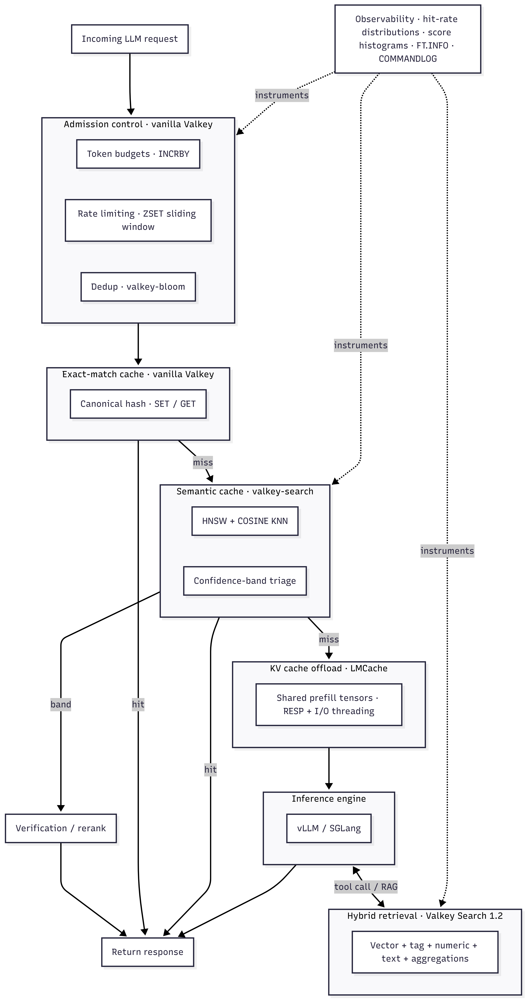

+++
title = "How modern AI workloads map to Valkey primitives"
date = 2026-06-10
description = "A horizontal tour of the AI inference stack - semantic caching, KV cache offload, hybrid retrieval, admission control, and observability - and the Valkey primitives each layer maps to."
authors = ["kivanow"]

[taxonomies]
blog_type = ["Technical Deep Dive"]
[extra]
featured = false
featured_image = "/assets/media/featured/random-02.webp"
+++

Modern AI inference stacks have split into layers, and each layer needs memory-speed access to something. Semantic caching needs [vector similarity](https://valkey.io/topics/search/) over recent prompts. Inference engines need a place to park KV tensors between requests. Retrieval-augmented generation (RAG) pipelines need filtered retrieval in a single round trip. The layer in front of all of it needs counters and rate limits that hold up under concurrent load.

Valkey 8.x and [Valkey Search 1.2](https://valkey.io/blog/valkey-search-1_2/) cover all of these natively, but the coverage usually gets discussed one vertical at a time. A recent post on this blog walked through [agent memory with Mem0](https://valkey.io/blog/ai-agent-memory-with-valkey-and-mem0/) in depth - one workload, end to end. This post is the horizontal tour. Each section describes a workload, why it needs memory-speed access, and which Valkey primitive maps to it. The goal is a mental map of where Valkey fits across the AI stack, not a tutorial for any single piece.

Here is the whole map, which the rest of the post walks through one layer at a time:



## Response caching: exact-match and semantic on the same substrate

Response caching for LLM applications gets framed as a choice between two systems. It is better understood as two points on a spectrum, and both run on the same Valkey instance.

**Exact-match caching** applies when the request is deterministic: temperature 0, fixed model, identical inputs. Tool results are the cleanest case - a weather lookup for the same city within a five-minute window does not need a second API call, and an LLM call with `temperature: 0` and byte-identical messages does not need a second inference. The pattern is canonical serialization of the request parameters, a hash, and vanilla [`SET`](https://valkey.io/commands/set/) / [`GET`](https://valkey.io/commands/get/) with a TTL:

```python
import hashlib, json

def cache_key(params: dict) -> str:
    canonical = json.dumps(params, sort_keys=True, separators=(",", ":"))
    return "llm:" + hashlib.sha256(canonical.encode()).hexdigest()
```

```text
SET llm:9f86d08... "{\"response\": \"...\"}" EX 3600
GET llm:9f86d08...
```

The only subtlety is the canonicalization. Key order, float formatting, and tool schema serialization all have to be deterministic, or two semantically identical requests hash to different keys and your hit rate quietly halves. Tool definitions belong in the hash - a request with different available tools is a different request, even if the messages match.

**Semantic caching** applies when the inputs are near-duplicates rather than duplicates: "What's the capital of France?" and "Capital city of France?" should hit the same cached answer. This is a vector similarity problem, and it runs on the [`valkey-search`](https://valkey.io/topics/search/) module. The index is HNSW over the prompt embedding with COSINE distance:

```text
FT.CREATE semcache ON HASH PREFIX 1 semcache: SCHEMA
    prompt TEXT
    response TEXT NOINDEX
    category TAG
    embedding VECTOR HNSW 6 TYPE FLOAT32 DIM 1536 DISTANCE_METRIC COSINE
```

A lookup embeds the incoming prompt and runs a KNN query:

```text
FT.SEARCH semcache "*=>[KNN 1 @embedding $vec AS score]"
    PARAMS 2 vec <float32 bytes> DIALECT 2
```

If the best candidate's distance is below a threshold, serve the cached response. That sentence hides the hard part. In practice, a single global threshold is the primary production failure mode. A threshold tight enough to avoid wrong answers on paraphrase-sensitive content (legal, pricing, anything with negation) is loose enough to miss obvious near-duplicates on chatty content, and vice versa. Two techniques help. First, per-category thresholds: tag entries at store time and tune the threshold per category instead of globally. Second, confidence bands: below a tight threshold, serve directly; above a loose threshold, miss; in the band between, escalate to a cheaper verification step such as a rerank over the top-k candidates or a small-model judge call. The band turns a binary decision into a triage, and it is the difference between a cache you can trust and one you disable after the first incident.

When to reach for which: exact-match for tool results, deterministic completions, and anything where a false positive is unacceptable - provided the traffic actually contains exact repetition, since byte-identical requests are what the hash matches on; semantic for user-facing prompts where near-duplicate traffic is high and a verification band is in place. Most production systems want both, checked in that order - exact first because it is a single `GET`, semantic second because it costs an embedding call.

## KV cache offload for inference engines

One layer below response caching sits a different kind of cache entirely. When a transformer processes a prompt, it builds key/value tensors for every token during prefill. For long contexts, prefill dominates time-to-first-token - and a large fraction of that work is redundant, because production traffic shares prefixes. The same system prompt, the same retrieved documents, the same few-shot examples appear across thousands of requests.

Inference engines such as vLLM and SGLang already reuse KV for shared prefixes within a single instance's GPU memory. The problem is capacity and locality. GPU HBM (high-bandwidth memory) is small, so KV gets evicted under load, and a prefix computed on one replica is invisible to the others. KV cache offload solves this by treating the KV tensors as cacheable data with a storage hierarchy behind them: GPU memory, then local CPU memory, then a remote tier shared across the fleet.

[LMCache](https://github.com/LMCache/LMCache) is a popular connector layer that implements this for vLLM and SGLang, and it supports RESP-compatible backends as the remote tier - which means Valkey works as the shared KV store across inference replicas. The configuration is a storage URL, not application code:

```yaml
# lmcache configuration (illustrative)
chunk_size: 256
local_cpu: true
remote_url: "redis://valkey-host:6379"
remote_serde: "naive"
```

The workload profile is unusual by Valkey standards: values are large binary blobs (serialized tensors, often hundreds of KB to MB per chunk), reads and writes are bursty, and the access pattern is sequential within a request. What makes it viable is RESP throughput and Valkey 8's I/O threading - moving tensor chunks is a bandwidth problem, and the [multi-threaded I/O path introduced in 8.0](https://valkey.io/blog/unlock-one-million-rps/) is what lets a single instance saturate the network link rather than a single core.

The framing worth keeping: Valkey is not competing with GPU memory here. It is the memory tier between the inference engine and slower storage - fast enough that fetching a cached prefix beats recomputing it, shared so that one replica's prefill work benefits the whole fleet. For long-context workloads with prefix reuse, this is frequently the largest single TTFT win available without touching the model.

## Hybrid retrieval beyond agent memory

Retrieval runs during inference, after a cache miss has fallen through to the model and the model needs to fetch context or tool results to answer. The Mem0 post on this blog covered one instance of a general pattern: scoped vector retrieval, where a query combines semantic similarity with hard filters in a single round trip. Agent memory scopes by `user_id` and `run_id`. The general shape applies far more broadly, and [Valkey Search 1.2](https://valkey.io/blog/valkey-search-1_2/) widened what fits in that single round trip: vector similarity, tag filters, numeric ranges, full-text matching, and aggregations.

Consider RAG with multi-tenant data and freshness requirements. The index carries the filterable attributes alongside the vector:

```text
FT.CREATE docs ON HASH PREFIX 1 doc: SCHEMA
    content TEXT
    tenant TAG
    published NUMERIC
    embedding VECTOR HNSW 6 TYPE FLOAT32 DIM 1536 DISTANCE_METRIC COSINE
```

And the retrieval is one query, not three systems stitched together in application code:

```text
FT.SEARCH docs
    "@tenant:{acme} @published:[1717200000 +inf] =>[KNN 10 @embedding $vec AS score]"
    PARAMS 2 vec <float32 bytes> DIALECT 2
```

The same shape covers recommendation queries with business constraints (vector similarity over product embeddings, tag filter on availability, numeric range on price) and hybrid search where lexical and semantic signals combine - full-text matching narrows the candidate set, KNN ranks it, or the application blends both scores.

Why this matters architecturally: the common alternative is a vector database for similarity, a relational store for the filters, and application code that over-fetches from one and post-filters against the other. That pattern has two failure modes. Over-fetching wastes the latency budget, and post-filtering after a fixed-k ANN search silently degrades recall - if you fetch 10 nearest neighbors and 9 belong to the wrong tenant, the user gets one result. Pushing the filter into the search engine, which selects an execution strategy based on filter selectivity, keeps recall intact and the round trip singular. The Mem0 post's storage-layer analysis covers why this matters under mutation-heavy load; the point here is that the same property serves every retrieval workload in the stack, not just memory.

Aggregations close the loop for analytics-shaped questions over the same index - distribution of retrieval scores by tenant, document counts by category and recency bucket - without exporting the corpus to a separate analytical store.

## Admission control: token budgets, rate limiting, dedup

In front of the LLM sits the layer that decides which requests are allowed to spend tokens at all - the least glamorous layer of the stack, and it runs entirely on primitives that predate the AI workload by a decade. It applies to any team managing token cost across its own tenants or users against a provider API, not only inference providers. It earns a section anyway, because "AI infrastructure" is not only the exotic new stuff, and because token-denominated cost makes admission control a correctness problem rather than a politeness problem.

Token budgets are atomic counters, and the unit is tokens rather than requests. The subtlety is ordering. If you check the budget before dispatch but only increment after the response, concurrent in-flight requests all clear the same check and blow past the cap together - the counter is atomic, but admission is not. The fix is to reserve an estimated cost before dispatch, then reconcile against actual usage once the response returns. Because [`INCRBY`](https://valkey.io/commands/incrby/) returns the post-increment total, the reservation and the check are a single atomic step:

```text
# before dispatch: reserve an estimated cost and read the running total in one step
INCRBY budget:org_42:2026-06 2000
EXPIRE budget:org_42:2026-06 2678400 NX
# if the returned total is over the cap, reject and hand the reservation back:
DECRBY budget:org_42:2026-06 2000
# after the response: reconcile the estimate against actual usage (the delta may be negative)
INCRBY budget:org_42:2026-06 -146
```

Every concurrent request sees its own reservation reflected in the total the reserve returns, so no two can clear the same check, and the `NX` flag on [`EXPIRE`](https://valkey.io/commands/expire/) pins the window without a read-modify-write.

Sliding-window rate limits handle the per-minute shape that LLM providers enforce and that you likely want to mirror per tenant. A sorted set keyed by timestamp, trimmed, written, and counted in one [`MULTI`](https://valkey.io/commands/multi/) block:

```text
MULTI
ZREMRANGEBYSCORE rl:user_7 0 <now_ms - 60000>
ZADD rl:user_7 <now_ms> <request_id>
ZCARD rl:user_7
PEXPIRE rl:user_7 60000
EXEC
```

The block records the request and returns the window count atomically; the application reads the `ZCARD` reply after `EXEC` and rejects when it exceeds the limit. Note that a rejected request still occupies a slot until it ages out of the window - usually acceptable, and arguably desirable under a retry storm, since hammering a saturated limit keeps it saturated. If rejected requests must not consume the window, the check has to happen server-side before the add, which is what a short Lua script via [`EVAL`](https://valkey.io/commands/eval/) is for.

Deduplication covers the retry storm case: a client times out waiting on a slow completion, retries, and now two identical expensive requests are in flight. A Bloom filter via the [`valkey-bloom`](https://valkey.io/blog/introducing-bloom-filters/) module answers "have we seen this request hash recently" in constant space:

```text
BF.ADD inflight 9f86d08...
```

[`BF.ADD`](https://valkey.io/commands/bf.add/) returns 1 when the hash is new and 0 when it has (probably) been seen, so a single round trip both checks and registers the request - no separate `BF.EXISTS` needed. A false positive means one request gets needlessly deduplicated against the exact-match cache from the response caching section; a false negative cannot happen. For workloads where that asymmetry is acceptable, the memory savings over a plain set are substantial at high request volumes.

None of this is novel, and that is the point. The admission layer for AI workloads is well-understood primitives applied to a new cost model, and it shares an instance with the caching layers above it.

## Operational observability for AI query shapes

These workloads come with query shapes that existing dashboards were not built around, and the monitoring primitives exist because the workload primitives do.

Hit rate needs to be a distribution, not a number. A semantic cache reporting 40% aggregate hits may be running 85% on FAQ-shaped traffic and 5% on long-tail prompts, and the aggregate hides which threshold needs tuning. Counters per category (a [`HINCRBY`](https://valkey.io/commands/hincrby/) per lookup outcome into a stats hash) cost almost nothing and make the breakdown queryable.

Similarity score histograms are the leading indicator for threshold drift. Recording the KNN distance of every lookup's best candidate, hit or miss, shows the distribution shifting before the hit rate moves - a new traffic pattern, a changed embedding model, or accumulating stale entries all show up as the histogram's shape changing. This is the single most useful signal for operating the confidence bands from the response caching section.

[`FT.SEARCH`](https://valkey.io/commands/ft.search/) latency and indexing health need separate eyes. Query latency tells you about the read path; [`FT.INFO`](https://valkey.io/commands/ft.info/) exposes index state, and under mutation-heavy load (the agent memory pattern, or a semantic cache with aggressive TTLs) the indexing backlog is what degrades first. A growing mutation queue precedes recall problems and read-after-write surprises.

Slowlog patterns shift for vector and hybrid workloads. The entries worth watching are not always the slow ones - embedding payloads make `FT.SEARCH` requests and `HSET` writes large, and slowlog's execution-time threshold misses them entirely. This is exactly the gap [`COMMANDLOG`](https://valkey.io/commands/commandlog-get/) (8.1+) closes: alongside slow execution it tracks large request and large reply payloads, so the bandwidth problems surface as loggable events rather than unexplained tail latency. A [previous post on this blog](https://valkey.io/blog/valkey-tooling-primitives/) covers COMMANDLOG and its sibling primitives in depth. KNN queries with low-selectivity filters are the other recurring signature, usually fixable by reordering the query or tagging the data better.

## The map, briefly

Following the request path, the stack looks like this. Admission control gates traffic with counters, windows, and Bloom filters - vanilla Valkey. Exact-match response caching catches deterministic repeats with `SET` / `GET` and careful hashing - vanilla Valkey. Semantic caching catches near-duplicates with HNSW vector search and threshold triage - `valkey-search`. KV cache offload reuses prefill work across an inference fleet - RESP throughput and I/O threading, via LMCache. Retrieval combines vectors with filters, text, and aggregations in one round trip - Valkey Search 1.2. And all of it generates operational signals that the observability surface can capture.

The primitives these AI workloads need already exist in Valkey; the work is knowing which primitive maps to which layer. None of these layers is exotic individually. The useful realization is that they share a substrate. A team running Valkey for session storage already operates the infrastructure that the admission and exact-match layers need; adding `valkey-search` extends the same instance to the semantic and retrieval layers. For agent memory specifically, the [Mem0 deep dive](https://valkey.io/blog/ai-agent-memory-with-valkey-and-mem0/) covers one vertical of this map end to end. The rest of the map is shorter to traverse than it looks.
