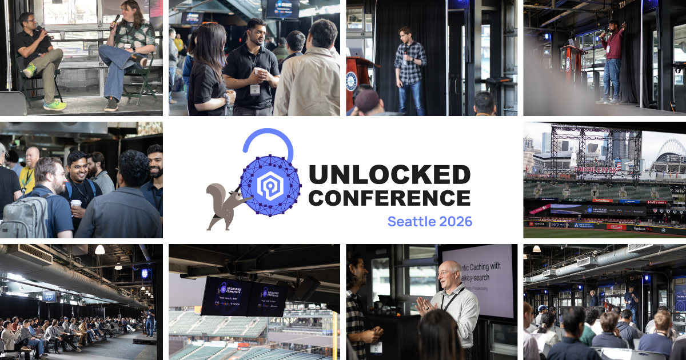
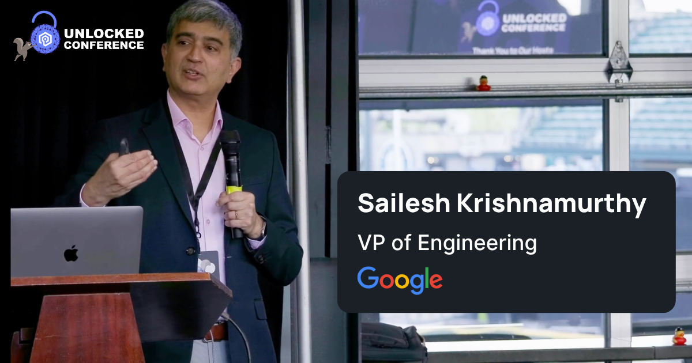
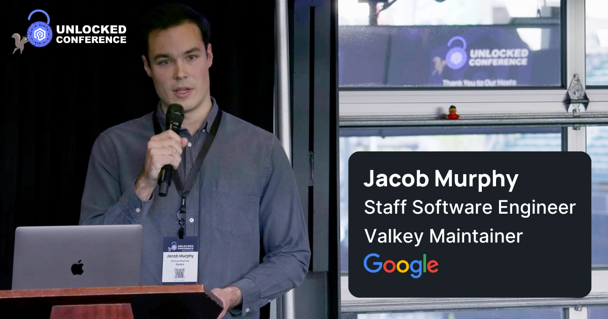
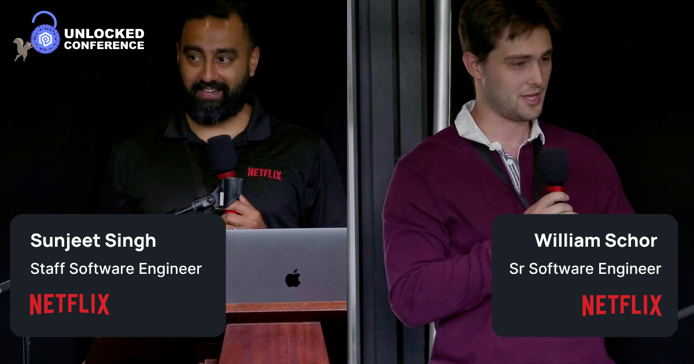
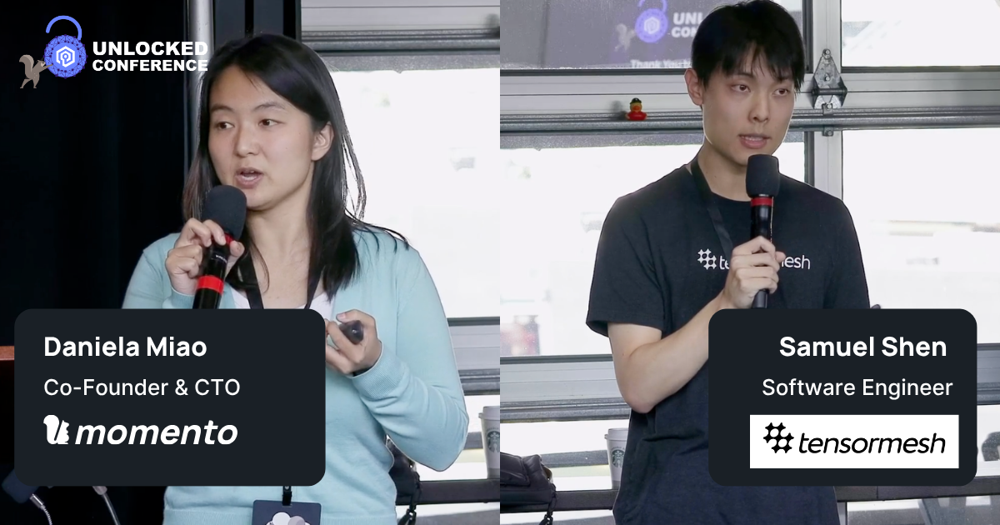
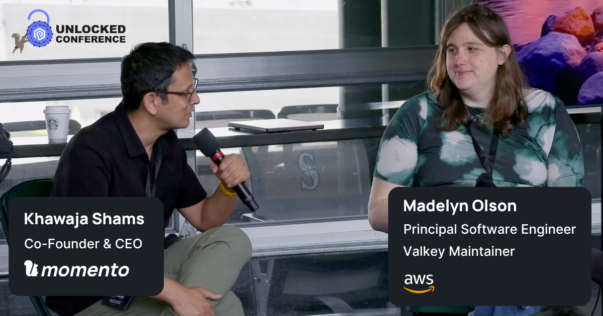

+++
title = "Unlocked Seattle: The Best Systems Let You Sleep At Night "
date = 2026-06-11
description = "Unlocked Seattle brought together the engineers behind some of the world’s largest systems to share the hard-earned lessons that keep infrastructure reliable at 3AM."
authors = ["madolson","mikecallahan"]
[taxonomies]
blog_type = ["Community Highlight"]
[extra]
+++

The best systems are often the boring ones. Boring because they continue working predictably when traffic spikes, dependencies drift, workloads evolve, or failures start cascading across systems at 3AM.

That idea was constant at [Unlocked Conference](https://www.unlockedconf.io/) in Seattle.

More than **140 engineers** representing over **50 companies** gathered at T-Mobile Park for a full day of **20 technical** talks and production-earned lessons building systems that hold up under pressure. Across sessions from Netflix, Snap, Reddit, Google, AWS, Apple  and more, the focus stayed consistent: reliability over hype, predictability over peak benchmarks, and operational lessons learned the hard way.

## The Power of Community

The conference opened with [Sailesh Krishnamurthy](https://www.linkedin.com/in/saileshkrishnamurthy/) from Google highlighting *The Power of Community*. He focused on the momentum behind Valkey and the importance of open collaboration across companies working to solve shared infrastructure challenges together. That spirit carried throughout the day. Engineers openly shared tradeoffs and lessons learned from running some of the largest distributed systems in the world.

[Jacob Murphy’s](https://www.linkedin.com/in/jacob-murphy-801078127/) keynote, *The 3AM Test: Why Boring Systems Let You Sleep At Night*, was the defining theme of the conference. He focused on the simple yet powerful idea that engineers desire systems that behave predictably focusing on reliable performance over hype.

Discussions around Atomic Slot Migration, Forkless Sync, operational predictability, and reliability resurfaced throughout the day as engineers compared approaches to scaling infrastructure while approaching what Jacob describes as the “boring asymptote” of system design. The pursuit of a 100% reliable system.

## Design Patterns Emerge from Running Systems at Scale

Across the sessions, several patterns emerged:

* Tail latency as a leading indicator of instability
* Hidden bottlenecks caused by connection management at scale
* Large payloads quietly degrading performance
* The importance of realistic production benchmarking
* Systems behaving correctly in isolation but unpredictably together
* Reliability engineering as an operational discipline, not a feature

Apple engineers delivered several standout sessions throughout the day focused on geo-replication, secure-by-default infrastructure, and the realities of maintaining predictable performance across globally distributed systems.

Netflix showed the breadth and depth of their caching solutions in *Thinking Beyond Demand-Filled Caching*, where [Sunjeet Singh](https://www.linkedin.com/in/sunjeet-singh/) and [William Schor](https://www.linkedin.com/in/william-schor/) shared how Netflix approaches versioned caches at scale. They challenged traditional assumptions around cache invalidation and consistency while showing how architectural decisions can eliminate operational problems before they happen.

Another strong theme throughout the day was how infrastructure engineering is evolving alongside AI workloads. In [Daniela Miao](https://www.linkedin.com/in/danielamiao/) and [Samuel Shen’s](https://www.linkedin.com/in/samuel-shen-b51585172/) session, *Towards Faster Inference: With KV Cache and Beyond*, they  explored how modern LLM inference systems are increasingly becoming distributed systems problems themselves, especially around KV cache coordination and data movement.

The talk connected familiar distributed systems methods with a new generation of workloads. Discussions around cache reuse, inference bottlenecks, and orchestration continued long after the session ended.

The talks were deeply technical, but they also reflected a shift towards optimizing for systems that remain understandable and predictable under production level stress.

## Closing with “The 3AM Page”

Unlocked Seattle closed with a fireside chat about 3AM Pages featuring [Madelyn Olson](https://www.linkedin.com/in/madelyn-olson-valkey/) and [Khawaja Shams](https://www.linkedin.com/in/kshams/).

The chat focused on the realities of operating distributed systems at scale, like making sure your KPIs reflect the customer requirements, request cascades, infrastructure blind spots, and the operational decisions that separate manageable incidents from catastrophic outages.

More importantly, it reinforced the central idea behind Unlocked itself, that great infrastructure engineering is not about avoiding failure entirely. It’s about designing systems that fail predictably and recover gracefully.

## The Future of Reliable Systems

This Unlocked event showed the enormous momentum behind the community building the future of reliable distributed systems. The openness of the engineers willing to share their hard-earned lessons, deployment patterns, and product requests  was truly a one-of-a-kind experience.

Thank you to all of the speakers, attendees, sponsors, volunteers, and organizers who helped make Unlocked Seattle possible. And thank you to the engineers building the systems that let the rest of us sleep at night.
