+++
title = "Reducing Memory Overhead in Valkey 9.1"
date = 2026-06-24
description = "With Valkey 9.1, per-key memory overhead is quietly cut by up to 20% for strings and 7 bytes per sorted set member, without changing a single command or configuration."
authors = ["dragosandriciuc"]
[taxonomies]
blog_type = ["Technical Deep Dive"]
[extra]
featured = true
+++

Valkey 9.1 introduces two behind the scenes optimizations that reduce the per-key memory overhead without requiring any new commands or configuration changes.

The two conceptual changes delivered across three PR's below happen deep within Valkey's C data structures, reducing the memory required to store strings and sorted sets, by up to 20% overhead for string keys and 7 bytes for every sorted set member. These changes compound quickly when millions of keys are in use.

This blog explores these changes, and what they mean for your real-world deployments.

## The Cost of Internal Recordkeeping

In Valkey, the values live inside `robj`, a ref-counted object. This structure represents not only your data, but also metadata, flags, reference counts and a pointer to the actual value. In the case of `embstr` encoding, the optimized memory encoding for small strings, the string data is immediately allocated after the `robj` header under the form of a contiguous block of memory instead of having two separate memory allocations for metadata and string value. The simplified layout before Valkey 9.1:


The `ptr` field pointed to the string data that followed the header, however the pointer's value was always deterministic due to the `embstr` encoding guaranteeing that the string is always adjacent to the header, so storing this data was redundant.

### Eliminating the Redundant Pointer

After the changes in Valkey 9.1, the `ptr` field is removed from the embedded string layout by reusing its 8-byte slot to store the beginning of the embedded string itself. Because the string's location is deterministic, Valkey now computes its address on demand using pointer arithmetic instead of storing an explicit pointer. The new layout looks like this:



The practical result is that every value stored with `embstr` encoding now saves 8 bytes of overhead. For a workload using 16-byte keys and 16-byte values, this represents roughly a 20% reduction in per-item memory overhead.

### Raising the `embstr` Threshold from 64 to 128 Bytes

Removing this redundant pointer reduced the size of every embedded string object. Because the `robj` header itself got smaller, this means the same total allocation budget now accommodates more actual string content.

Raising this threshold to 128 bytes (including key, expiry metadata, and value) means more string sizes now qualify for the more compact `embstr` layout instead of falling through the `raw` encoding.

You can check which encoding a given key is using with `OBJECT ENCODING`:

```bash
> OBJECT ENCODING key
"embstr"
```

Any key returning `embstr` benefits from both of the above optimizations with no extra configuration required.

The saving per key is not a flat number. Because Valkey allocates memory through jemalloc, requests are rounded up to fixed size classes rather than granting the exact byte count requested. In practice this produces overhead reductions ranging from roughly 17% to 44%, averaging around 26%.

 _Note: Measured across a range of key+value sizes (16-byte keys), 5 million items per test, Valkey 9.0 compared to 9.1._

The exact saving depends on where your key+value sizes fall relative to jemalloc's size class boundaries.

### Optimizing Sorted Sets to Reduce Overhead

The final improvement in Valkey 9.1 targets Sorted Sets (`ZSET`), where the sets also received a memory reduction for workloads that use the `skiplist` encoding representation.

In the default configuration, once a sorted set grows beyond 128 elements, Valkey stores it internally as a `skiplist` encoding. Before Valkey 9.1, each `skiplist` node contained a pointer to a separately allocated SDS string representing the member:

```txt
+------------------+-------+------------------+---------+-----+---------+
| element pointer  | score | backward pointer | level-0 | ... | level-N |
+------------------+-------+------------------+---------+-----+---------+
        |
        +-------> element SDS
```

_Note: SDS (Simple Dynamic String) is Valkey's internal  dynamic string implementation. Most keys, string values, and many internal data structures are stored as SDS objects._

In Valkey 9.1 however, the SDS representation is embedded directly inside the `skiplist` node instead of being stored as a separate pointer:

```txt
+-------+------------------+---------+-----+---------+--------------+
| score | backward pointer | level-0 | ... | level-N | embedded SDS |
+-------+------------------+---------+-----+---------+--------------+
```

For sorted sets with thousands or millions of members, this compounds significantly. A `ZSET` with 100,000 members saves roughly 700KB of memory from this change alone. This change produces a net saving of 7 bytes per sorted set member by removing the pointer.

## Quantifying the Impact

The above improvements effectiveness vary by workload, key sizes and data type mixes. However, as a practical reference:

| Change | Affected encoding | Saving per item |
|--------|--------------------|----------------:|
| Remove `robj->ptr` | `embstr` strings | 8 bytes |
| Raise `embstr` threshold to 128 bytes | Strings with lengths of 65–128 bytes (newly eligible for `embstr`) | 8 bytes (newly applies) |
| Embed element SDS inside skiplist node | `ZSET` members (skiplist encoding) | 7 bytes |

## What This Means for Production

These improvements are transparent and you do not need to change your configuration, commands, or application code. The savings activate automatically on upgrade to Valkey 9.1.

For clusters that are operating near memory limits, these no configuration required reductions may bring you back into having a comfortable headroom. However the impact is most pronounced for workloads dominated by small strings or large sorted sets.

If you are utilizing Valkey as a dedicated cache running near full capacity with an eviction policy such as `allkeys-lru`, these memory savings effectively increase your cache capacity. With more data fitting into the same amount of memory, your cache will achieve a higher hit rate without requiring any changes.

## Try This Against Your Own Workload

None of the above matters until you check it against real keys. Here's how to find out what Valkey 9.1 is worth to you specifically.

Pick a handful of representative keys from your production deployment and run `MEMORY USAGE` on a 9.0 instance versus a 9.1 instance:

```bash
> MEMORY USAGE session:abc123
> OBJECT ENCODING session:abc123
```

If a string key that used to report `raw` now reports `embstr`, that key just got cheaper to store. No code change, no config change, just a straight upgrade. Multiply the byte difference by your key count and you have the real number, not just an estimate.

For sorted sets, the math is even more direct: 7 bytes times the number of members stored across your skiplist-backed sorted sets gives you a concrete memory reclaim figure. On a sorted set workload with 500K members, that's roughly 3.5MB back. On a cluster running thousands of sorted sets, it adds up to real headroom, allowing you to defer a scale-up or right-size to a smaller node depending on your needs.

The memory you get back by simply moving to 9.1 and measuring what has changed is the real upgrade.

## Reference PRs

- [PR 2516 — Remove redundant robj->ptr for embstr encoding](https://github.com/valkey-io/valkey/pull/2516)
- [PR 3397 — Raise embstr threshold from 64 to 128 bytes](https://github.com/valkey-io/valkey/pull/3397)
- [PR 2508 — Embed ele in skiplist node for `ZSET` members](https://github.com/valkey-io/valkey/pull/2508)
