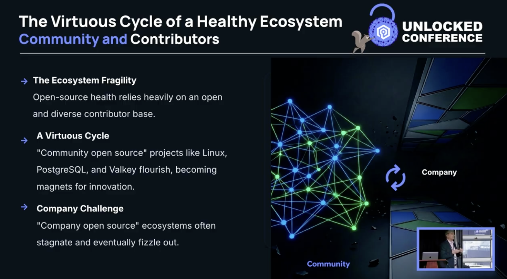

+++
title = "The Power of Community: Driving Innovation across the Valkey Ecosystem"
date = 2026-07-16
description = "The community gathered at the Valkey Unlocked Conference to celebrate two years of innovation and ecosystem growth. In a keynote titled, *The Power of Community*, Sailesh Krishnamurthy (VP of Engineering at Google)"
authors = ["crystalpham"]
[taxonomies]
blog_type = ["Community Highlight"]
[extra]
+++

The community gathered at the Valkey Unlocked Conference to celebrate two years of innovation and ecosystem growth. In a keynote titled, "The Power of Community," Sailesh Krishnamurthy (VP of Engineering at Google) shared core insights on what it takes to build a thriving, resilient open source project and where the technology goes from here.

{{ youtube(id="oAAVULuODtI", class="unlocked-healthy-opps-video") }}

Here is a recap of the key themes, design philosophies, and technological advancements discussed during the session.

## 1. The Open Source Ecosystem: Contributors vs. Users
Open source projects thrive on a delicate balance, operating much like a natural ecological community. They are highly fragile and can easily stall or fizzle out if company or vendor dynamics take over and fracture the community.
A healthy ecosystem relies on two independent but deeply connected pillars:
* **The Contributor Community:** The engine that drives code development, detailed reviews, and active community engagement.
* **The User Community:** The consumer base whose adoption and feedback justify the project’s growth.

When the contributor base is open, diverse, and robust, the user community naturally flourishes. This creates a virtuous cycle, similar to what we see in projects like Linux and PostgreSQL turning the project into a magnet for long-term innovation.

## 2. The Architectural Goal: Making Caching "Boring" Again
In data infrastructure, "excitement" is rarely a positive thing. For systems engineering teams, excitement usually translates to unexpected latency spikes, data corruption, or emergency pages in the middle of the night.
A primary focus for the community is **resilience**, leading to a shared development goal: **make operating Valkey as boring as possible.**

Infrastructure stability relies on three deeply connected metrics:
* Performance
* Availability
* Durability

If a system experiences severe latency excursions, it practically becomes an availability problem. If users cannot reliably access the system over long periods, it turns into a durability problem. By prioritizing code quality, correctness, and meticulous peer review, the ecosystem aims to prevent site outages and keep operations completely predictable.

## 3. Valkey 9: Community-Driven Innovations
While operations should remain quiet and "boring," the underlying features must push technical boundaries to meet enterprise demands. Driven directly by user requirements, recent community contributions are paving the way for massive performance improvements and next-generation workloads.

Key technical milestones highlighted from the Valkey 9 release include:

* **Billion QPS Scaling:** Pioneering high-throughput caching environments capable of handling billions of queries per second.
* **Atomic Slot Migration:** Enabling smooth, live data migrations across infrastructure nodes without application disruption.
* **Per-Field TTL:** Providing granular control over data expiration to optimize memory usage.
* **Advanced Vector Search:** Integrating native vector capabilities to support modern AI-driven workloads and full-text search.

## 4. Modern Use Cases
The session concluded by highlighting how companies are leveraging a vibrant client library ecosystem to move past old, restrictive APIs that previously cramped engineering innovation.

A major testament to this open source momentum is Snap Inc. Over time, maintaining a long-lived repository fork introduces heavy operational trade-offs and strains development cycles. Rather than continuing to support its standalone fork (KeyDB) under massive data demands, Snapchat is actively migrating its high-throughput, low-latency, internet-scale caching fleets directly to mainstream Valkey. Operating through storage abstractions and proxy layers, Snap is safely moving hundreds of millions of QPS into production under the unified Valkey standard. 

With improved observability and client-side metrics, engineers can easily track down exactly where bottlenecks live—whether in the server, the network, or the client connection. This extensibility allows developers to confidently deploy Valkey across an array of core data patterns:

* **High-Throughput Caching**
* **Real-Time Analytics & Ingestion**
* **Distributed Session Stores**
* **Real-Time Leaderboards**
* **Asynchronous Jobs & Queues**

By keeping the community collaborative and the core technology stable, Valkey ensures that internet-scale systems can scale seamlessly while keeping production environments safely "boring".

## ValkeyConf 2026 CFP
If you run Valkey in production, contribute code, or work on real-time data infrastructure, ValkeyConf 2026 wants your session. 

The CFP is open for sessions and lightning talks on: architecture and performance, use cases and adoption stories, integrations and tooling, and more. First-time speakers are encouraged to submit. The audience is practitioners: developers, SREs, DBAs, and platform engineers doing the actual work.

ValkeyConf 2026 is October 5 in Prague. CFP closes August 2 at 11:59 PM GMT+2.

[Submit your session now >>](https://sessionize.com/valkeyconf-2026/)

