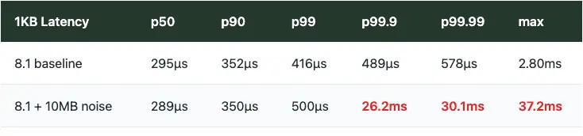
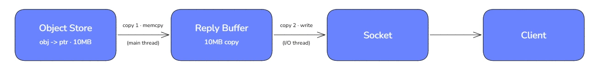
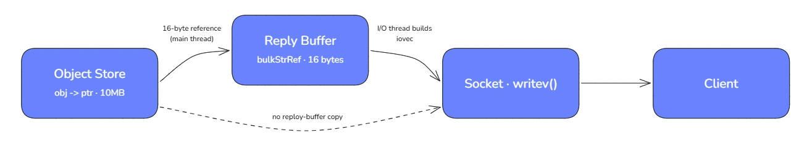
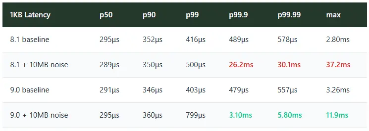
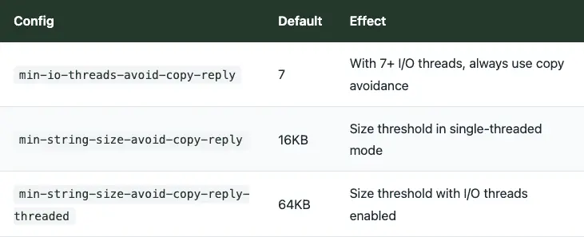

+++
title = "Large objects ruin the party - Valkey 9 tames them"
date = 2026-08-17
description = "Tail latencies are where promises break. You can have a system that's fast 99% of the time, but that 1% is what users remember."
authors = ["khawaja"]

[taxonomies]
blog_type = ["Technical Deep Dive"]
[extra]
featured = false
featured_image = "/assets/media/featured/random-05.webp"
+++

We had a Valkey cluster humming along at 100K requests/second serving 1KB objects. Latency was tight. Then someone started fetching a few 10MB blobs. Ten requests per second. The small object workload fell apart.

10MB items are common in media use cases. Momento as a live origin, caching video segments. Tail latencies really matter here. A p99 spike means buffering. Buffering means users leaving. This is especially problematic in [multi-tenant systems](https://gomomento.com/blog/the-dark-art-of-multi-tenancy/) where one workflow's large items can ruin the experience for everyone else.

## The Problem

Our baseline: 100K req/s total of 1KB GETs distributed across 256 connections, each pipelining 32 requests. Then we introduced 10 req/s of 10MB GETs as background traffic. Just 10 requests per second of large objects.

Here's what happened to the 1KB request latency on Valkey 8.1:

p50, p90, and p99 barely moved. But tail latencies exploded. p99.9 went from 489μs to 26.2ms. That's 53x worse. A handful of large object fetches were destroying the experience for everyone else.

But wait. Valkey has I/O threads. We saw [throughput scale nearly linearly](https://gomomento.com/blog/valkey-turns-one-how-the-community-fork-left-redis-in-the-dust/) with I/O thread count. Shouldn't they handle the network traffic without blocking the main thread?

## The Hypothesis

We knew Valkey 9.0 shipped with [reply copy avoidance](https://github.com/valkey-io/valkey/pull/2078). The idea: instead of memcpy'ing large objects into reply buffers on the main thread, just pass a pointer reference and let the I/O threads handle the actual data transfer.

If the main thread was blocking on 10MB memcpy operations, that would explain why small requests were getting stuck. Remove the copy, remove the block, problem solved. That was the theory.

## How Copy Avoidance Works

Prior to 9.0, returning a large string meant the main thread memcpy'd the entire object into a reply buffer before moving on. Two copies per GET:

**BEFORE (Valkey 8.1)**

*Total memory bandwidth: 20MB per GET.*

Valkey 9.0 flips the script. Instead of copying 10MB, the main thread writes a 16-byte reference and moves on:

**AFTER (Valkey 9.0)**

*Main-thread copy bandwidth: ~0 — just pointer/reference management.*

The I/O thread builds an iovec pointing directly to `obj->ptr` and calls `writev()`. The heavy lifting happens in parallel with command execution.

## Back to the Party

Would copy avoidance fix the noisy neighbor problem? We ran the mixed workload test on both versions:

In 9.0, the large object traffic has essentially no impact on the small object workload. p99 stays at 8ms. The main thread isn't blocking on memcpy, so small requests keep flowing even when large ones are in flight.

The party crashers got kicked out. Well, not really. They were ushered to the dance floor where they now play nicely with everyone else.

## The Secret Menu

You don't need to tune anything to get these gains. The optimization is controlled by three configs that aren't in the default config file. The [secret menu](https://github.com/valkey-io/valkey/blob/fa5964312801ec435147ecd0667da03aad229434/src/config.c#L3319), if you will. The defaults are sane:

The defaults work for most use-cases. But now you know where to look if you want to tune for your specific workload.

This is one of many community-driven optimizations in Valkey. Individually, they're incremental. Together, they compound. I'm excited about upcoming changes like [PR #2976](https://github.com/valkey-io/valkey/pull/2976), which offloads read commands to worker threads entirely, removing the main thread from the read path.

Large objects are not going away. If anything, they are becoming the common case. A 10MB blob looked like an outlier when we designed this benchmark, but now it describes an inference workload. Teams moving KV cache off the GPU and onto a shared tier will run this same experiment in production, with small reads and multi-megabyte blocks competing for the same main thread. Valkey 9.0 means they get to keep both. The party crashers can stay, and everybody keeps dancing. 🕺

*Special thanks to [Madelyn Olson](https://www.linkedin.com/in/madelyn-olson-valkey/) for guidance on how parameters work and for technical feedback on benchmark methodology.*
