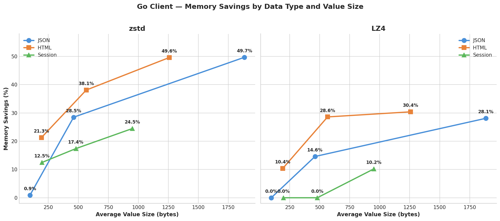
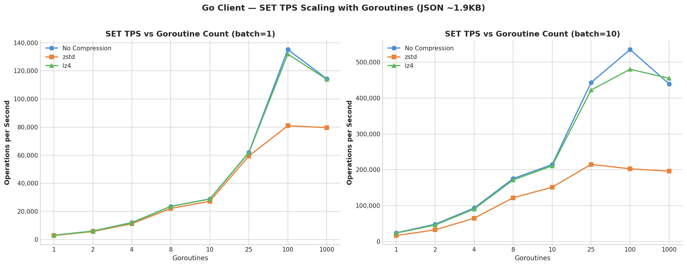
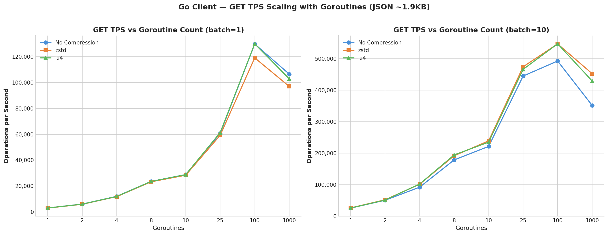
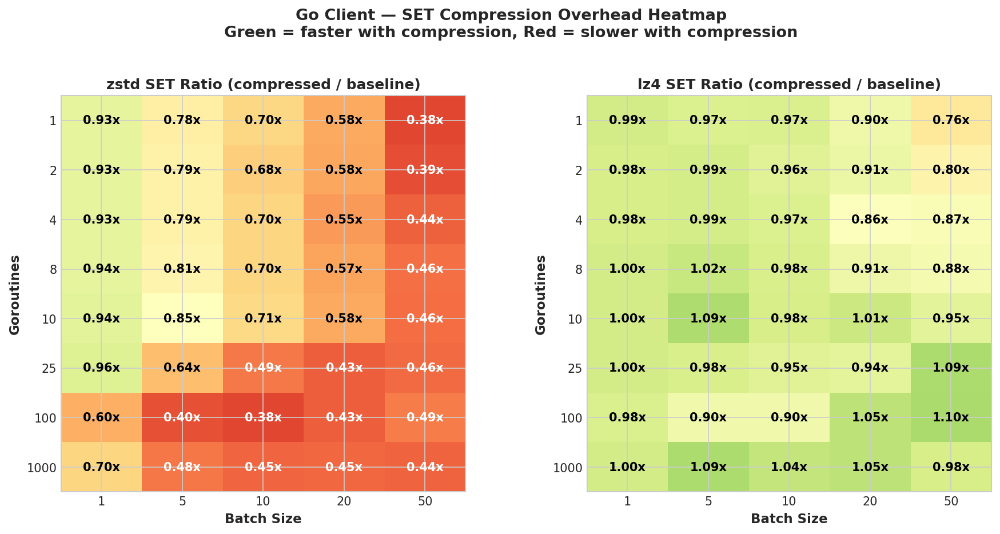
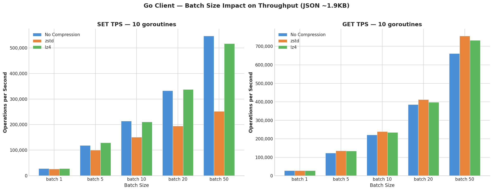
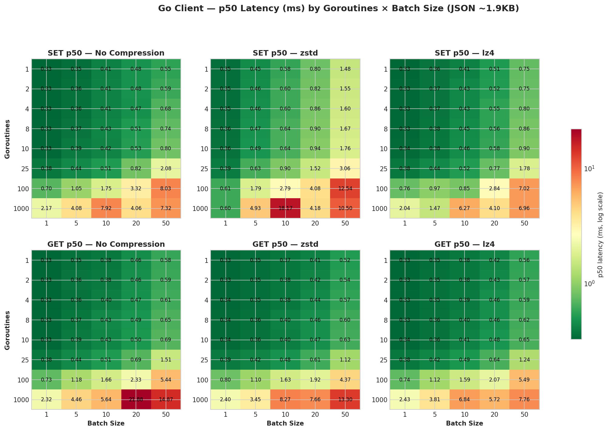
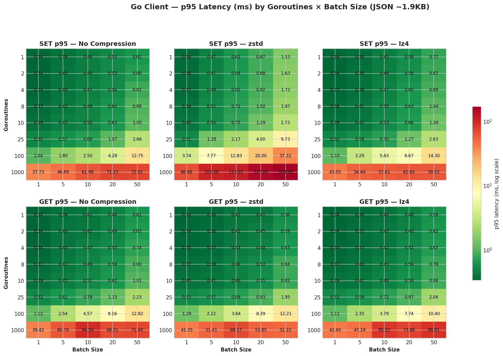

+++
title= "Transparent Compression in Valkey GLIDE: Reduce Memory With a Single Line of Code"
description= "Learn how to enable automatic compression in Valkey GLIDE to reduce memory usage by up to 49% without modifying your application code."
date= 2026-08-26 01:01:01
authors= ["dknowles"]

[taxonomies]
blog_type = ["Technical Deep Dive"]
[extra]
featured = false
featured_image = "/assets/media/featured/random-03.webp"
+++

If you're caching JSON API responses, storing user sessions, or buffering HTML fragments in Valkey, there's a good chance your data is highly compressible while you're still paying full price to store every byte. Even if your overall cache footprint is small, networking fees can still drive up your costs. Many of these cached values contain redundant data that compression can reduce by up to 49%, directly reducing costs by a similar factor. Implementing compression within your application means pulling in new dependencies and modifying application logic. What if your Valkey client could just do it for you?

Transparent compression in [Valkey GLIDE](https://github.com/valkey-io/valkey-glide) is available for all GLIDE-supported languages and offers a seamless solution to reducing Valkey's storage and bandwidth requirements for compatible workloads. When you write data with a `SET` command, GLIDE compresses it before sending it to the server. When you read it back with `GET`, GLIDE decompresses it automatically. You can enable the feature with a single flag in your client configuration and no modifications to your application's logic. In this post, you'll learn how to configure [Valkey GLIDE](https://github.com/valkey-io/valkey-glide) using the Go client for transparent client-side compression and deep-dive into how the compression works. The performance benchmarking data and best practices guidance will help you understand if your caching workload is a good fit for compression and how to get started on savings.

The configuration change shown below enables compression with the LZ4 backend and delivers memory savings of 28.1% with minimal throughput and latency impact in our benchmarks — most configurations measured between 0.95x and 1.07x of uncompressed SET throughput on the benchmarked 2KB JSON workload. (The default backend is zstd, which trades some write throughput for roughly double the memory savings — more on choosing between them below.)

```go
cfg := config.NewClientConfiguration().
    WithAddress(&config.NodeAddress{Host: "localhost", Port: 6379}).
    WithCompressionConfiguration(
        config.NewCompressionConfiguration().
            WithBackend(config.LZ4),
    )

client, err := glide.NewClient(cfg)

// Everything else stays exactly the same
client.Set(ctx, "user:1001:profile", string(userDataJSON))
result, _ := client.Get(ctx, "user:1001:profile")
```

## How It Works

When you execute a `SET` command with compression enabled, GLIDE runs through a short decision path on the client side:

1. Is the value larger than the minimum size threshold (default: 64 bytes)? If not, send it uncompressed — the 5-byte header overhead would negate any savings and small values are unlikely to be compressible.
2. Compress the value using the configured algorithm (zstd or LZ4).
3. Is the compressed result actually smaller than the original? If not, send the original instead.
4. Prepend a 5-byte header that identifies the data as GLIDE-compressed, and send it to the server.

On the read path, the process reverses. GLIDE checks for the header, decompresses if present, and returns the original value. If the header isn't there, the value is returned as-is. This allows compression-enabled clients to seamlessly read uncompressed data written by other clients.

GLIDE uses a 5-byte header (`[Magic Prefix: 3 bytes][Version: 1 byte][Backend ID: 1 byte]`) to tag compressed values. You can identify compressed entries when inspecting raw data in Valkey by looking for this header. The backend ID means a zstd-configured client can read LZ4-compressed data and vice versa. All supported GLIDE language bindings share the same header format, so compressed data written from one language can be read from another.

A few safety-by-default choices keep compression from ever getting in the way: if compression fails for any reason, GLIDE silently falls back to uncompressed data. Data that already carries the GLIDE header won't be double-compressed. And after compressing, GLIDE compares sizes — if compression didn't help, the original goes through unchanged.

### Important Note:
Compression is NOT compatible with commands that read or manipulate string data on the server. The server only ever sees the compressed bytes, so these commands operate on the compressed representation rather than your original value. The failure mode depends on the command:

**Unsupported Commands:**

* APPEND, SETRANGE, SETBIT, BITFIELD, BITOP — mutate the compressed bytes in place, corrupting the stored value so it can no longer be decompressed

* INCR, INCRBY, INCRBYFLOAT, DECR, DECRBY — return an error because the compressed bytes are not a valid number

* GETRANGE, STRLEN, LCS, GETBIT, BITCOUNT, BITPOS, BITFIELD_RO — read the compressed bytes and return results that are meaningless for your original value

If you rely on these commands, keep the affected keys uncompressed — for example by splitting them onto a separate client without compression configured (see Best Practices below).


## Memory Savings

The headline memory savings figures are the result of compressing 10,000 ~2KB JSON payloads and measuring Valkey's used_memory metric:

| Backend | Server Memory | Reduction |
|---------|--------------|-----------|
| No compression | 21.2 MB | — |
| zstd (level 3) | 10.7 MB | 49.7% |
| LZ4 (level 0) | 15.3 MB | 28.1% |

Zstd saves nearly twice as much memory as LZ4 on this JSON workload. But ~2KB JSON payloads are just one scenario and not representative of the typical size of data you might be working with. In practice, you're caching all kinds of data at all kinds of sizes. Below are the results for three common data types — JSON, HTML, and session data — across a variety of value sizes to show what savings look like across representative synthetic workloads.

### Memory Savings by Data Type and Value Size

| Data Type | Avg Bytes | zstd Savings | LZ4 Savings |
|-----------|-----------|-------------|------------|
| JSON | 97 | 0.9% | 0.0% |
| JSON | 461 | 28.5% | 14.6% |
| JSON | 1,884 | 49.7% | 28.1% |
| HTML | 193 | 21.3% | 10.4% |
| HTML | 566 | 38.1% | 28.6% |
| HTML | 1,257 | 49.6% | 30.4% |
| Session | 198 | 12.5% | 0.0% |
| Session | 480 | 17.4% | 0.0% |
| Session | 951 | 24.5% | 10.2% |

A few patterns jump out:

**Value size matters more than data type.** Below ~100 bytes, neither algorithm saves meaningful memory — the 5-byte header overhead and Valkey's per-key metadata dominate. Above ~500 bytes, both algorithms deliver substantial savings across all data types.

**Redundant data compresses best** Repeated tags, field names, attributes, delimiters, and structural patterns give compression algorithms plenty to work with. 

**Content type differences** HTML, JSON, and XML tend to contain repeated field names, tags, and structure which leads to higher compression ratios. Session data tends to be more random due to UUIDs, tokens, and timestamps which demands larger value sizes to reap the benefits of compression

**zstd consistently beats LZ4 on compression ratio.** Across every data type and size, zstd saves more memory. The gap is widest on highly compressible data and narrowest on small or low-redundancy data.



## The Core Tradeoff: Memory vs Throughput
### Methodology

Benchmarks were generated using the Go GLIDE client on Amazon EC2 r7g.2xlarge instances (8 ARM vCPUs, 64 GB RAM, AWS Graviton3) with the client and Valkey 9.0.3 server running on separate hosts in the same AWS VPC. The test corpus was JSON payloads averaging ~1,884 bytes per value. This value size was chosen to drive compression to its limits by giving the compression algorithms enough data to work with while still being sensibly-sized. A benchmark script swept a matrix of 80 configurations across goroutine counts (1, 2, 4, 8, 10, 25, 100, 1000) and pipeline batch sizes (1, 5, 10, 20, 50).

Here's how throughput scales with goroutines for batch sizes 1 and 10 for SET and GET operations:




The two algorithms represent a clear tradeoff:

- **LZ4** delivers 28.1% memory savings with minimal throughput impact. Across all 40 LZ4 configurations in the sweep, SET throughput ratio vs uncompressed ranged from 0.76x to 1.10x, with most configurations falling between 0.95x and 1.07x. Some configurations were actually *faster* with LZ4 because smaller payloads reduced network transfer time. Peak throughput with LZ4: 633K SET TPS / 919K GET TPS — matching or exceeding the uncompressed baseline.

- **Zstd** delivers 49.7% memory savings with a moderate CPU cost. SET throughput ratios ranged from 0.38x to 0.96x. The cost is proportional to throughput: at low throughput, zstd costs only 4–7%. At high throughput with batching, the cost grows as compression becomes a larger fraction of total per-operation time.

The heatmap below shows the full picture — SET throughput ratio (compressed / baseline) across every goroutine count and batch size combination tested. Green cells mean compression added no meaningful overhead or was actually faster; red cells indicate where compression CPU cost dominated. LZ4 is green almost everywhere, while zstd shows a clear gradient: low overhead at small batch sizes (where network latency dominates) and increasing cost as batching pushes throughput higher.



## Batching Is the Real Throughput Lever

Going from batch size 1 to 50 at 10 goroutines takes baseline SET throughput from 29K to 547K TPS — a 19x improvement that dwarfs any compression effect. Even with zstd compression, batched operations at batch=50 (252K TPS) outperform unbatched uncompressed operations (29K TPS) by 9x. Optimize your batching strategy first, then choose your compression backend.



## Latency

Compression's latency story is asymmetric: **writes pay, reads gain.**

The cost lives on the write path. Compressing a value takes real CPU time, and with batching that cost is multiplied by the number of values in the batch. At batch=1 the effect is barely visible — all three backends show similar p50 SET latency, around 0.33ms at 10 goroutines. At batch=10 with 10 goroutines, baseline batch latency rises to ~0.42ms, zstd to ~0.64ms, and LZ4 stays at ~0.46ms. The zstd cost scales with the number of values compressed per batch, while LZ4 remains close to baseline throughout.

The read path is the opposite. Decompression is far cheaper than compression, and every GET moves a payload roughly half the size over the network. At low concurrency that saving is small, but as concurrency grows and queueing dominates latency, moving half the bytes wins outright: zstd GET p95 beat the uncompressed baseline in 30 of 40 configurations tested and stayed within 2% in all but two. At 1000 goroutines the gap is dramatic — batch=10 GET p95 drops from ~95ms uncompressed to ~69ms with zstd, and batch=50 from ~71ms to ~51ms.

The heatmaps below show the full picture for p50 and p95 latency across every goroutine count and batch size. Read the SET rows and GET rows separately: zstd's red gradient in the SET panels is the compression cost growing with batch size, while its GET panels track — and at high concurrency beat — the uncompressed baseline. If your workload is read-heavy, zstd's memory savings come with a latency *improvement* at the tail, not a tradeoff.




## Choosing the Right Configuration

**Start with LZ4** if your workload is write-heavy and you want compression to be effectively invisible. Switch to zstd for maximum memory savings — its compression cost lands on the write path, and read-heavy workloads often see tail latency improve rather than degrade. The savings you'll see depend heavily on your data type and value size — HTML compresses best, session data compresses least, and anything under 100 bytes isn't worth compressing. Skip compression entirely for already-compressed data (images, video, pre-compressed content).

**Throughput** can be recovered when using zstd by investing in more compute. Scale your application horizontally or vertically and you can bring zstd throughput up to par with your previously uncompressed workload. While this increases your application's compute costs, the storage savings can completely offset this depending on your throughput vs. storage needs. As an example using on-demand pricing in us-east-1 as of mid-2026: consider a 250GB caching workload running on an AWS r7g.16xlarge ($3.427/hour) served by an application running on a c7g.4xlarge ($0.5781/hour). If zstd can cut your storage requirements by ~40%, you can downgrade your cache instance to an r7g.8xlarge ($1.714/hour) and upgrade your application to a c7g.8xlarge ($1.1562/hour) to make up for the zstd throughput hit for a net savings of $1.1349/hour or a ~28% cost reduction overall.

For value sizes:
- **Under 100 bytes**: Skip compression. Neither algorithm saves meaningful memory at this size — the 5-byte header overhead and Valkey's per-key metadata dominate.
- **100–500 bytes**: Savings vary by data type. HTML compresses well even at ~193 bytes (21.3% zstd / 10.4% LZ4). Worth enabling with zstd; test with LZ4.
- **500–1,000 bytes**: Solid savings across all data types. Expect 17–50% with zstd and 0–29% with LZ4 depending on data type.
- **Over 1,000 bytes**: Strongly recommended. Expect 25–50% with zstd and 10–30% with LZ4.


Here's a complete configuration example:

```go
import (
    glide "github.com/valkey-io/valkey-glide/go/v2"
    "github.com/valkey-io/valkey-glide/go/v2/config"
)

cfg := config.NewClientConfiguration().
    WithAddress(&config.NodeAddress{Host: "localhost", Port: 6379}).
    WithCompressionConfiguration(
        config.NewCompressionConfiguration().
            WithBackend(config.LZ4).          // or config.ZSTD
            WithCompressionLevel(0).          // LZ4 defaults to 0; zstd defaults to 3. Higher = better ratio, more CPU
            WithMinCompressionSize(100),      // Skip values smaller than 100 bytes
    )

client, err := glide.NewClient(cfg)
```

Compression works identically with `ClusterClient` when you pass the same compression configuration to your cluster config. Compression and decompression happen entirely on the client side, so there is no difference in behavior between standalone and cluster modes.

## Gradual Rollout

GLIDE's compression design supports incremental rollout without a data migration. Compression-enabled clients read uncompressed data transparently, and clients configured with zstd can read LZ4-compressed data and vice versa. There is one ordering requirement: every client that reads a keyspace must have compression configured before any client starts writing compressed data to it — a client without compression configured has no decompression path and will return compressed values as raw bytes (see Best Practices below). Once all readers are covered, deploy writers with compression enabled and data naturally migrates to compressed format as keys expire or get updated through normal application flow — no migration scripts required.

## Best Practices

**Enable compression on readers before writers.** A client with compression configured reads everything — uncompressed values, and compressed values from either backend. A client *without* compression configured has no decompression path and will return compressed values as raw bytes. Roll out the configuration to every client that reads a keyspace before any client starts writing compressed data to it. The same applies to one-off consumers people forget about: debugging scripts, CLI inspection, batch jobs, and analytics readers.

**Audit for server-side string manipulation first.** Before enabling compression, scan your codebase for the unsupported commands listed above (APPEND, INCR-family, SETRANGE, bit operations). If a keyspace mixes compressible payloads with server-mutated strings, split them across two clients — one with compression, one without — rather than giving up on compression entirely.

**Measure on your own data before fleet-wide rollout.** The data-type table above is a guide, not a promise — savings ranged from 0% to 50% depending on content and size. Write a representative sample of your real values through a compression-enabled client and compare Valkey's `used_memory` against an uncompressed baseline. The [interactive compression session](https://github.com/valkey-io/valkey-glide/blob/main/examples/python/interactive_compression_session.py) example makes this a five-minute exercise: paste in your own values and its `compare_compression()` helper stores each one compressed and uncompressed side by side, reporting per-key memory and percent saved. An hour of measurement beats a capacity plan built on someone else's corpus.

**Tune `MinCompressionSize` to your value distribution.** The 64-byte default is conservative. If your small values are UUIDs, tokens, or counters — high-entropy data that won't compress — raise the threshold to skip them entirely and spend compression CPU only where it pays.

**Expect savings to ramp, not jump.** Existing data stays uncompressed until it's rewritten. `used_memory` declines as keys expire or get updated through normal churn, so a cache with 24-hour TTLs reaches full savings in about a day. If you need the memory back sooner, rewrite your largest keys explicitly.

**Benchmark zstd writes at your production batch size.** Compression cost scales with the number of values per batch — near-invisible at batch=1, meaningful at batch=50. If you pipeline heavily on the write path, check SET p95 at your real batch size before and after enabling zstd; with LZ4 this is rarely worth the effort.

## Conclusion

Transparent compression gives you a meaningful reduction in memory usage with minimal effort. LZ4 delivered 28% savings with low overhead in our benchmarks (0.76x–1.10x SET throughput vs uncompressed, with most configurations between 0.95x and 1.07x); zstd nearly halves memory at a moderate write throughput cost. The feature is available today across all GLIDE language bindings and requires only a single configuration change.

We'd love to hear about your experience with compression — what data types you're compressing, what savings you're seeing, and what would make the feature more useful. Join the conversation on [GitHub Discussions](https://github.com/valkey-io/valkey-glide/discussions).

To get started:
- [Valkey GLIDE GitHub Repository](https://github.com/valkey-io/valkey-glide)
- [Valkey GLIDE Go Client Documentation](https://github.com/valkey-io/valkey-glide/tree/main/go)
- [Compression Configuration API Reference](https://pkg.go.dev/github.com/valkey-io/valkey-glide/go/v2/config)