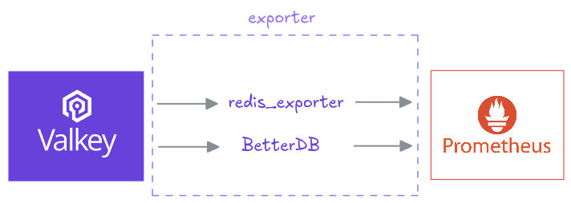

+++
title = "Valkey Metrics in Prometheus: redis_exporter and BetterDB"
date = 2026-09-03
description = "A starting point for monitoring Valkey with Prometheus: two exporters, per-pod and cluster-wide metrics."
authors = ["edithpuclla", "kivanow"]
[taxonomies]
blog_type = ["How-to"]
+++

Everything you need to monitor **Valkey** is already in the **Prometheus ecosystem**. This post is about how [kube-prometheus](https://github.com/prometheus-operator/kube-prometheus), [redis_exporter](https://github.com/oliver006/redis_exporter), and [BetterDB](https://github.com/BetterDB-inc/monitor) Monitor come together to give you a complete picture of a running Valkey cluster, one tool per observability dimension.

A Valkey cluster has two distinct observability dimensions: what's happening inside each individual pod, and what's happening across the cluster as a whole. That's where running two complementary exporters side by side makes sense.

## Two Exporters and One Prometheus

**redis_exporter** is the established Prometheus exporter for Valkey and Redis. In **Kubernetes**, the Valkey Operator runs it as a sidecar in every Valkey pod, so you get per-pod metrics on port `9121` at the standard `/metrics` path: memory, connected clients, command throughput, uptime. Because it runs alongside each instance, you can see exactly which shard is under pressure. Prometheus discovers it via a PodMonitor, not a ServiceMonitor, since the sidecar has no Kubernetes Service of its own.

**BetterDB** takes a different approach. It connects to the Valkey headless service, auto-detects cluster mode, and discovers the cluster topology automatically, exposing a single metrics endpoint at `/api/prometheus/metrics`  with cluster-level and per-slot statistics. 

Together, they give you both dimensions, pod-level detail from redis_exporter, cluster-level operational insight from BetterDB, flowing into a single Prometheus instance.

## What You Can Query

Once both exporters are running, you query them side by side in Prometheus using PromQL.

From **redis_exporter**, one series per pod:                                                                             
- redis_memory_used_bytes                   
- redis_connected_clients               
- redis_commands_processed_total

One flag is worth knowing about: `--append-instance-role-label` adds an `instance_role` label of master or replica, making it easy to separate primaries from replicas in a query or alert.

From **BetterDB**, cluster-wide: 
- betterdb_commandlog_large_request
- betterdb_commandlog_large_reply
- betterdb_slowlog_pattern_count
- betterdb_acl_denied
- betterdb_cluster_slot_keys
- betterdb_cluster_slot_reads_total, and 
- betterdb_cluster_slot_writes_total, per-slot statistics from `CLUSTER SLOT-STATS` that redis_exporter has no equivalent for. Finding your hottest slot is one query: topk(10, rate(betterdb_cluster_slot_writes_total[5m]))

The **commandlog** metrics require Valkey 8.1+ (they have no Redis equivalent), slot statistics require Valkey 8.0+ with cluster-slot-stats-enabled, and betterdb_acl_denied requires ACL LOG (available since version 6, though some managed providers block it).

## Licensing

Prometheus, kube-prometheus-stack, redis_exporter, and the Valkey operator are all open source. BetterDB Monitor is open core: the  Prometheus endpoint used here is MIT-licensed and free to use. Advanced features: anomaly detection, key analytics, and alerting, sit under a source-available license and require a commercial agreement for production use. 

Valkey is growing fast and the open source ecosystem around it is already there. Follow along as we explore more of what's possible, and let us know in the comments what you're monitoring in your stack. 

This post is a starting point, for the full configuration and a closer look at each exporter, see [Monitoring Valkey with Prometheus](https://valkey.io/blog/monitoring-valkey-with-prometheus/) by Dragos Andriciuc.

Check this one minute on Valkey with redis_exporter and BetterDB, how to export metrics into Prometheus.

  <iframe
    src="https://www.youtube.com/embed/0lPlmuK-aTw"
    title="Exporting Valkey metrics to Prometheus"
    style="width: 100%; aspect-ratio: 9 / 16; border: 0;"
    allow="accelerometer; autoplay; clipboard-write; encrypted-media; gyroscope; picture-in-picture; web-share"
    allowfullscreen></iframe>

