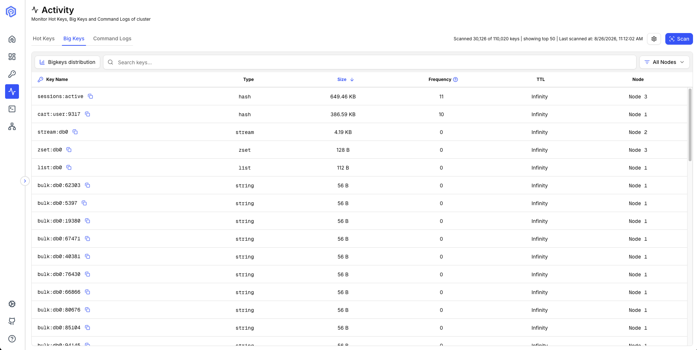
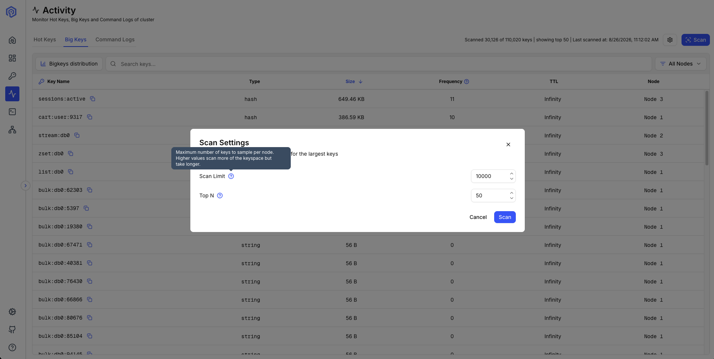
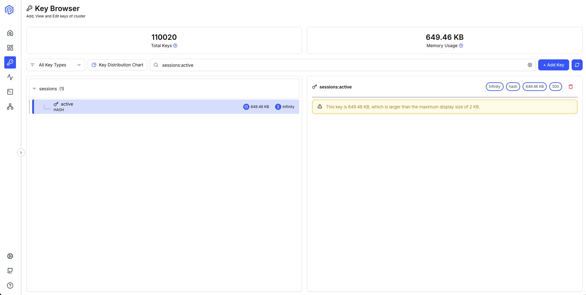

+++
title= "Finding big keys in a running Valkey cluster with Valkey Admin"
description = "Valkey Admin 1.1 adds big key detection, so you can find the largest keys across every shard of a running cluster from a single view, without parsing an RDB file offline or writing your own SCAN loop. Valkey Admin 1.1.1 cuts the time to sample 250,000 keys on a 25-shard cluster from 41.86 seconds to 2.01 seconds."
date= 2026-09-01
draft = true
authors= ["bblan0803", "nassery318"]

[taxonomies]
blog_type = ["Announcements"]
[extra]
featured = true
featured_image = "/assets/media/featured/valkey-admin-key-size-distribution.webp"
+++

When Valkey Admin 1.0 shipped in May, we named big key detection as one of three features we were exploring.
Big key detection landed in 1.1 on July 31, so you can now find the largest keys across every shard of a running cluster from a single view, without parsing an RDB file offline or writing your own SCAN loop.
Valkey Admin 1.1.1 cuts the time to sample 250,000 keys on a 25-shard cluster from 41.86 seconds to 2.01 seconds.

In this post, we'll walk through why oversized keys are hard to find, how the scan works across shards, and what to do once you have the results.

## Why big keys are hard to find

Nobody goes looking for a big key until something else breaks.
A multi-megabyte hash reads fast, so the first symptom shows up somewhere else.
One shard hits its memory limit while the others are half idle, or p99 goes up with no change in traffic.
Command Logs, which shipped in 1.0 and needs Valkey 8.1 or later, surfaces those large replies once they cross your threshold.

Parsing an RDB file offline tells you what the keyspace looked like when the file was written, not now.
`valkey-cli --bigkeys` covers only the node you point it at and only the database you select, and it reports one key per type and sizes collections by element count, so you never get a list ranked by bytes.
`--memkeys` calls `MEMORY USAGE` for every type, so it compares more directly.
Big Keys ranks the largest keys across every primary in one pass, and it complements these tools rather than replacing them.

## How the scan works

Valkey Admin runs `SCAN` on every primary, collects `MEMORY USAGE`, `TYPE` and `TTL` for each key it samples, ranks those by size, and shows you the largest along with the node each one sits on.
It samples 10,000 keys per primary by default and returns the top 50 of that sample by bytes.

The ranking covers the sample, not the keyspace.
A key larger than all 10,000 sampled on a node stays hidden, so the default tells you where your outliers are rather than which key is biggest.
Nothing caps the limit, so raising it above a node key count lets `SCAN` reach every key that node holds.
Since 1.1.1 that full pass is fast: 2 million keys across 25 shards took 10.34 seconds.
It is not cheap, the scan sends hundreds of thousands of commands to your servers inside that window.
Start at the default to catch the obvious offenders, and raise the limit when you need the definitive answer.

### Faster scans in 1.1.1

Valkey Admin 1.1.0 issued three commands for every sampled key, one key at a time, or 30,000 round trips per primary at the default limit and 750,000 across a 25-shard cluster.
Valkey Admin 1.1.1 pipelines the per-key commands into one batch per `SCAN` iteration.
We measured this on a 25-shard Amazon ElastiCache for Valkey 9.1.0 cluster with TLS and AWS Identity and Access Management (IAM) authentication enabled.
The keyspace held 2 million string keys of 10 to 5,000 bytes.
We also manually seeded 50 outliers, ranging from 100 KB to 1 MB, to test discovery.

| Keys sampled | Before | After |
|---|---|---|
| 250,000 | 41.86s | 2.01s |
| 500,000 | 79.78s | 2.98s |
| 1,250,000 | 198.01s | 6.74s |
| 1,750,000 | 273.81s | 9.13s |
| 2,000,000 | not recorded | 10.34s |

Pipelining removes round trips, so larger keys, mixed types, or higher network latency will not improve by the same factor.
At high scan limits the volume of in-flight commands can crash the per-primary metrics server processes ([#450](https://github.com/valkey-io/valkey-admin/issues/450)).

Note: if you are running 1.1.0, upgrade to 1.1.1 before scanning at a high limit.

## What to do once you have the results

Each row carries the key name, its type, its size, its TTL and the node it lives on, and clicking a row copies the key name.
Valkey Admin does not render a value that large anyway: above a configurable threshold, 2 KB by default, the Key Browser shows the memory footprint and, for collection types, the element count, and does not pull the contents over the wire.
We plan to add paging through large collections in a later release ([#454](https://github.com/valkey-io/valkey-admin/issues/454)).

`OBJECT ENCODING` reports whether a hash or list has outgrown its compact `listpack` encoding.
That conversion is a common reason a key grows faster than the data inside it.
Check whether the key has a TTL.
Data you never meant to keep usually just needs one.
You can also split a single collection across several keys, but decide first whether to spread the pieces across slots to balance memory or hold them together with a hash tag so related reads stay on one node.
Splitting also costs you the atomicity of `HGETALL` and friends.

## Join the community

Valkey Admin gives Valkey users a single place to monitor, inspect, and troubleshoot Valkey clusters, and 1.1 adds finding the keys that cost you memory and tail latency.
We invite you to try it out.
You can download desktop builds for macOS and Linux from the releases page, and pull container images from GitHub Container Registry, Docker Hub and the Amazon Elastic Container Registry (ECR) Public Gallery.
Learn more about what else is in 1.1.0 and 1.1.1 (numbered databases, command autocomplete, and persisted state across refresh etc) in the [release notes](https://github.com/valkey-io/valkey-admin/releases).

The project lives at [github.com/valkey-io/valkey-admin](https://github.com/valkey-io/valkey-admin) under the Apache 2.0 license.
To propose new features or significant changes, open a GitHub Issue with the `[RFC]` prefix.
The maintainers review RFCs and guide them through design and implementation.
We welcome bug reports, documentation improvements, and pull requests of all sizes.

[@nassery318](https://github.com/nassery318) built Big Keys.
[@ravjotbrar](https://github.com/ravjotbrar) traced the scan cost to round trips and pipelined the per-key commands, and [@ArgusLi](https://github.com/ArgusLi) replaced the numbered database dropdown.
Thank you to everyone who filed issues and tested pre-release builds.
We are exploring slot heat maps that visualize hot-slot distribution across the cluster and Prometheus integration, and we look forward to building them together.
