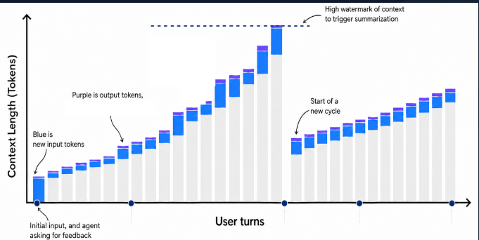
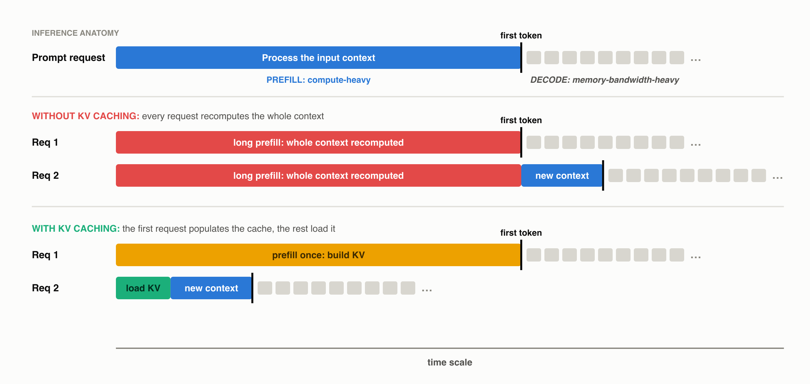
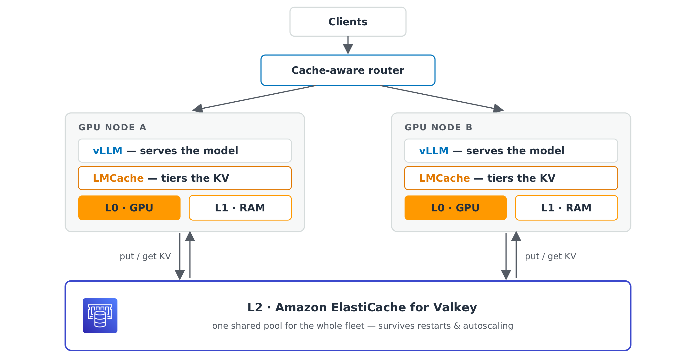

+++
title = "KV caching on Valkey: 2× faster replies and 25% more requests"
date = 2026-09-03
description = "Your GPUs spend part of every request re-reading context they already processed. We moved the KV cache to Valkey, and the same two GPU nodes served 25% more requests with replies streaming twice as fast."
authors = ["omerrubi", "cnuthalapati", "jaduffy"]
draft = true

[taxonomies]
blog_type = ["Technical Deep Dive"]

[extra]
featured = false
featured_image = "/assets/media/featured/random-03.webp"
+++

Open-weight large language models (LLMs) now match frontier quality at a fraction of the per-token cost.
You can self-host open-weight LLMs on GPUs for better cost economics, accuracy, control, or data privacy.
Unlike traditional applications that benefit from scaling economies, LLM inference costs scale directly with your application, and the biggest line item is the GPU bill.

A surprising share of that bill is spent on work the model has already done, reprocessing prompt instructions, tool definitions, and conversation history on every call.
KV caching eliminates that redundant work.
This post introduces the fundamentals of KV caching and how it helps you use GPU resources well.
You will learn how to set up a KV cache with Valkey to serve about 25% more requests on the same GPUs and stream responses about 2× faster.

We presented this work at Percona Live 2026, in a session on improving LLM inference inside agentic workflows.
You can watch the recording, [Supercharging LLM Inference: KV Caching with Valkey](https://www.youtube.com/watch?v=vgX-I53PGqU).

## The problem: your GPUs keep re-processing old context

Context provided to LLMs in agentic applications contains tool definitions, Model Context Protocol (MCP) servers, skills, prompt instructions, and ever-growing conversation history.
A coding assistant carries repository files and prior edits, a support chatbot carries the whole conversation history, and a retrieval-augmented generation (RAG) assistant carries retrieved documents.
The inference engine must process the entire context every turn before producing a single word of a reply.
For a simplified analogy, imagine re-reading a whole book from page one every time someone asks about the next page.



The inference engine takes all input tokens and projects them into Key (K), Value (V), and Query (Q) tensors.
This phase, called prefill, is compute-heavy, consumes the most GPU time, and grows super-linearly with context length.
On a 70B-class model it can take several seconds of GPU time before the first new word appears, which breaks the user's flow of thought and leads to lower engagement and abandonment.

KV caching lets inference engines store and reuse the intermediate KV tensors for repeated context, which removes that redundant work.
Think of it as a checkpoint of the model's reading.
Save it, and the next turn resumes from the checkpoint instead of re-reading from page one.
KV caching cuts both cost and latency by letting the model skip recomputing context it has already processed, which frees GPU capacity and shortens prefill.
Every response is still generated fresh, so answers stay accurate.



The figure above puts every request on one shared time scale.
Without a cache, request 2 recomputes the whole conversation before it prefills the genuinely new tokens, so its first token lands last.
With a cache, request 2 loads the stored KV and prefills only the new tokens, so its first token arrives far earlier on the same scale.
The first request still pays a full prefill either way, because it is the one that populates the cache.

## Valkey as a KV cache

KV caching is already available in your serving stack, inside inference engines such as vLLM, SGLang, and TensorRT.
You can build a KV cache on your existing stack using GPU memory (the L0 tier) and the CPU host's memory (the L1 tier).
The catch is how much of that capacity is available to serve real traffic, and two problems limit it.

First, the capacity of both tiers is insufficient, because KV states are big.
A single long-running conversation of 20K to 30K tokens on Llama-3.1-70B carries 6.5 to 10 GB of KV data.
Contexts today keep growing.
Paste one document into a chat and that single conversation can jump into the hundreds of thousands of tokens, displacing a dozen or more others from the cache.
Even a generous half-terabyte of storage holds only 55 to 75 long conversations.
Turns take time, because a person types, a tool call runs, and an agent waits, and reasoning and agent patterns fork several contexts per task.
By the time a conversation returns, enough others have passed through the cache that it has often been evicted, so it gets recomputed from scratch at full price.

Second, the L0 and L1 tier KV cache is host-limited.
Real fleets load-balance, autoscale, and restart, so a returning user often lands on a server that never saw their conversation.
The checkpoint exists, but on the wrong machine.
Eviction is about unique contexts over time, not just concurrent users.
Could the nodes just share caches peer-to-peer?
It helps less than you would hope, because every node has the same finite RAM, so pooling raises the hit rate only marginally, and capacity stays welded to your GPU count.
Worse, serving cache traffic for peers burns the CPU, bandwidth, and network you bought for inference.

A dedicated L2 tier cache with Valkey provides capacity that scales independently of your GPU hosts and is shared across every GPU server.
Valkey gives you a distributed, scalable external cache that holds everything the local tiers evict, so a returning session is loaded, not recomputed.
Any GPU node can load any conversation's KV, so load balancing, scale-out, and restarts stop costing you recomputes.
The L2 cache sits on the live path of the application and directly affects the first token, so how fast the cache serves a checkpoint shapes how long every user stares at a blank screen.
A returning 20K-token conversation means fetching gigabytes of KV in under a second, in parallel.
That takes sub-millisecond operations and read bandwidth that grows as you add shards, which is exactly what a Valkey cluster provides.
Object and file storage have their place, but not on the first-token path.

We benchmarked Valkey to quantify the impact.
The **same two GPU nodes served about 25% more requests and produced about 28% more output tokens**, with replies streaming **about 2× faster**, once we added a shared KV cache on Valkey.
First tokens arrived in **0.13 s instead of 8.5 s** for conversations under about 16K tokens of context, while the fleet still had capacity headroom.
The extra capacity cost about **15% on top of the GPU bill**, so you spend a little more to get a lot more.

## Should you add a shared L2?

You will benefit from a shared L2 KV cache if any of the following describes your workload.

- Your users return to conversations that grow, such as a support or website chatbot where the history piles up turn after turn.
- Your assistant carries large repeated context, such as a coding assistant re-sending repository files, or an internal knowledge-base RAG assistant re-sending retrieved documents and a big shared system prompt.
- Your GPUs are busy re-reading instead of generating, and long first-token waits under load are the telltale sign.

**Where it will not help.**

- If your whole working set fits in GPU and CPU memory, you do not need an L2 yet. Little is evicted, so there is little to reload. Come back when traffic grows.
- A cache cannot create GPU capacity. In our run, once conversations outgrew what two nodes could prefill (about 16K tokens of context at this arrival rate), first-token latency became GPU-bound in every configuration. The fix there is more nodes, not more cache. The streaming-speed and throughput gains held across the whole run regardless.
- Low-reuse workloads gain less. One-shot requests with nothing returning, meaning no growing history and no shared prefix, evict little worth reloading.

## Follow along: set up a KV cache

Adding the shared KV cache is a configuration change on the open-source stack you already run, which is vLLM, SGLang, or TensorRT plus LMCache, pointed at a Valkey cache.
Five steps get you there.

**Prerequisites.**
A GPU host with vLLM installed and an LLM served.
Follow the steps below or the [vLLM installation guide](https://docs.vllm.ai/en/latest/getting_started/installation.html).

```bash
pip install vllm
vllm serve <your-model>
```

For an ungated model that runs on a single GPU, use `vllm serve Qwen/Qwen2.5-7B-Instruct`.
You can use the `tensor-parallel-size` parameter to shard a larger model across multiple GPUs.

**Step 1. Create a Valkey cache.**
Start a Valkey server with the command below.
For more storage capacity or read bandwidth, run Valkey in cluster mode and add shards.

```bash
docker run -d -p 6379:6379 valkey/valkey --maxmemory 100gb --maxmemory-policy allkeys-lru
```

Place the Valkey cache close to your GPU hosts for the lowest latency.
For production traffic, use a managed cluster-mode cache, and see the best practices below for sizing, instance family, and placement.

**Step 2. Set up LMCache and the Valkey GLIDE client.**
The open-source [LMCache](https://github.com/LMCache/LMCache) framework integrates with your inference engine and ships a `ValkeyConnector` built on the [Valkey GLIDE](https://github.com/valkey-io/valkey-glide) client.
LMCache manages the cache tiers, keeping active sessions in GPU and host memory and moving colder ones to the remote cache.
Valkey GLIDE carries optimizations that move KV-cache-sized payloads efficiently, which matters for the multi-gigabyte transfers between your GPU and the cache.

```bash
pip install "lmcache>=0.5.1" "valkey-glide-sync>=2.5.1"
```

**Step 3. Point LMCache at your Valkey cache.**
Create an `lmcache.yaml` file that points LMCache at your Valkey endpoint.
The file also sets how much host memory to use for the local tier.

```yaml
chunk_size: 256
local_cpu: true
max_local_cpu_size: 1000            # GB of host RAM for the local tier
remote_url: "valkey://<your-valkey-endpoint>:6379"
remote_serde: "naive"               # raw KV on the wire, no compression
extra_config:
  valkey_mode: cluster              # set to cluster if running Valkey in cluster mode
  valkey_num_workers: 16            # connector threads on the L2 path
  valkey_enable_ttl: true
  valkey_ttl_sec: 86400             # long TTL, keeps keys evictable and outlasts the reuse window
```

See the best practices section below for sizing and tuning guidance.
For the full configuration reference, visit the LMCache [Valkey backend docs](https://docs.lmcache.ai/kv_cache/storage_backends/valkey.html).

**Step 4. Launch vLLM with the LMCache connector.**

```bash
LMCACHE_CONFIG_FILE=lmcache.yaml vllm serve <your-model> \
  --kv-transfer-config '{"kv_connector":"LMCacheConnectorV1","kv_role":"kv_both"}'
```

That is it.
Returning conversations now load their KV from Valkey instead of recomputing it on the GPU.
vLLM exposes an OpenAI-compatible API, so point any OpenAI client or a plain curl call at your inference host and port.

```bash
curl http://<your-inference-host>:<port>/v1/chat/completions \
  -H "Content-Type: application/json" \
  -d '{
    "model": "<your-model>",
    "messages": [{"role": "user", "content": "Explain distributed KV caching!"}]
  }'
```

**Step 5. Confirm the cache is being used.**
A reply proves the model works, not that the cache is engaged, and a misconfigured L2 fails silently and simply recomputes every prompt.
Check the worker logs for both the write and the read path, and check vLLM for a non-zero external hit rate.

```text
LMCache INFO: Stored 256 out of total 256 tokens ...
LMCache INFO: Retrieved 256 out of 256 required tokens ...
External prefix cache hit rate: 0.9%
```

A repeated `LMCache is unhealthy, skipping store operation` means the connector cannot reach the cache, so check the endpoint, the security group, and `valkey_mode`.
From the cache side, watch the key count grow as requests flow with `valkey-cli -h <your-valkey-endpoint> -p 6379 DBSIZE`.

## Performance and results

We recreated what a busy production fleet looks like.
**100 concurrent conversations that keep growing** (12K to 28K tokens of context) arrived at 8 requests per second across **two GPU nodes** (8 H100 each) serving **Llama-3.1-70B** with vLLM plus LMCache.
The only difference between the two arms was whether a shared L2 on Valkey, a right-sized three-shard cluster in the same Availability Zone, was attached.
The traffic is synthetic but shaped like production multi-turn chat, so every turn appends to the history and nothing is truncated.
The three-shard cluster sustained about 7.4 GB/s of reads, peaking near 9.4 GB/s, without a single throttled command, and with headroom to scale by adding shards.



The architecture is two vLLM nodes, each with its own GPU and host memory tiers, both pointed at one Valkey cluster over the same-AZ network.
A cache-aware router sits in front of the two nodes and directs each request toward the node most likely to hold its prefix.

Four numbers tell the story, and each is something your users or your finance team would notice.
**Requests served** is how much traffic the same fleet handles.
**Time to first token** is how long a user stares at a blank screen.
**Reply streaming speed** is how quickly words appear once a reply starts.
**Recompute share** is how much of the GPUs' prompt work went to re-reading old context.

| What you would notice | Without L2 (L0 and L1 only) | With Valkey L2 |
| --- | --- | --- |
| Requests served in 20 min, same 2 nodes | 3,692 | **4,631 (+25%)** |
| Output tokens produced | baseline | **+28%** |
| Reply streaming speed | 11.9 tok/s | **24.8 tok/s (about 2.1×)** |
| First token, while the fleet has headroom (context under 16K) | 8.5 s | **0.13 s** |
| GPU time spent re-reading old context | about 10% of prompt tokens | **about 1%** |

That last row, recompute dropping from about 10% to about 1%, is what unlocks the rest.
The win is outsized because eviction hits hard.
A single returning conversation re-reads thousands of tokens on the GPU, which blocks every other request on that node for seconds.
The shared cache removes those blockages, and the whole fleet breathes.

## Best practices

**Size the cache to your KV working set.**
The KV footprint per token is `layers × KV heads × head_dim × bytes per element × 2`.
For [Llama-3.1-70B](https://huggingface.co/meta-llama/Llama-3.1-70B) in bf16 that is 80 × 8 × 128 × 2 B × 2, or about **0.33 MB per token**, and [FP8 KV](https://docs.vllm.ai/en/latest/features/quantization/quantized_kvcache.html) halves it by using 1 byte per element instead of 2.
Multiply by context length and by the number of conversations concurrently inside your reuse window, then add about 30% headroom.
In our run, 100 conversations growing to about 28K tokens peaked near 900 GB, which matched the 880 GB we measured, so we provisioned about 1.3 times that.
Check the flip side first, because if the whole working set already fits in GPU and host memory you do not need an L2 yet.

**Scale shards for read bandwidth.**
Provision shards for aggregate read throughput, because a returning conversation pulls its whole KV history before the first new token, and a 20K-token chat is about 6.6 GB at 0.33 MB per token.
Each 16xlarge memory-optimized shard in our test added about 30 Gbps of network bandwidth and about 420 GB of memory.
Our three-shard cluster sustained **about 7.4 GB/s** of reads, peaking near 9.4 GB/s, against a ceiling near 11.25 GB/s, with zero throttled commands.
When your peaks approach the ceiling, add a shard.

**Pick the instance family, the placement, and the transport.**
Prefer a **memory-optimized instance family**, because the L2 exists precisely because local memory is not enough, so RAM is the resource you are buying.
When we compared a memory-optimized family against a network-optimized one, the extra RAM per node won end to end, because fewer evictions and a higher hit rate beat faster per-fetch transfers.
Keep the cache in the **same Availability Zone** as the GPU fleet, because the L2 sits on the first-token path, so same-zone placement trims round-trip latency on every fetch.
Crossing zones adds latency and, on most clouds, a per-GB transfer charge in each direction.
The connector supports **TLS** (`tls_enable: true`).
KV chunks derive from user conversations, so turn TLS on when your security or compliance requirements call for encrypting them in transit, and budget for the CPU on both ends and the added per-fetch latency of encrypting multi-megabyte transfers.

**Make sure every key is evictable, so either set the connector TTL or switch the eviction policy to all keys.**
A `volatile-lru` eviction policy evicts only keys that carry a TTL, and LMCache's key TTL is **off by default**, so an untouched setup fills to `maxmemory` and starts rejecting writes with out-of-memory errors.
Turn on the connector TTL (`valkey_enable_ttl: true`, see the settings table below), or on a cache dedicated to KV switch the policy to `allkeys-lru`, which is what we ran.

**Route cache-aware.**
Pair the shared L2 with cache-aware routing so a returning conversation lands on the node that already holds its KV.
We run the open-source [vLLM Router](https://github.com/vllm-project/router) with `--policy cache_aware`.
It routes by prefix with no session ID required, and when a node runs hot it re-routes traffic away, which spreads load better than strict affinity and stays cheap, because the shared L2 loads the KV on the new node instead of recomputing it.
The same property helps when you scale the fleet, because a node you add or replace warms up from the L2 rather than recomputing every conversation.

**Tune four connector knobs, because the rest of the defaults are fine.**

| Setting | Value | Why |
| --- | --- | --- |
| `chunk_size` | `256` | A value of 512 nearly doubled recompute, from 12% to 20%, because KV is reused only in whole chunks, so coarser chunks lose more tokens at conversation boundaries. It is bounded above too, so keep the per-stored-value size (`chunk × KV-bytes/token ÷ TP`) well under about 32 MiB. Past glibc's mmap threshold, every retrieve page-faults its whole buffer and runs about 3 times slower |
| `valkey_num_workers` | `16` | Values of 16, 32, and 64 swept flat, and too small a pool starves under load |
| `remote_serde` | `naive` | The working serializer on 70B. To shrink KV, set the vLLM flag `--kv-cache-dtype fp8` instead, which halves the bytes per cached token at the same 97% to 98% hit rate |
| `valkey_enable_ttl` and `valkey_ttl_sec` | `true` and `86400` | Makes every key evictable, in LMCache 0.5.1 and later. Set the TTL to comfortably outlast your conversation reuse window |

## Conclusion

A returning conversation should be loaded, not recomputed.
GPU and host memory tiers always have a ceiling and evict under real traffic, so a shared Valkey L2 catches everything above that ceiling and serves it to any node in the fleet.
Measured on Llama-3.1-70B, the same two GPU nodes produced 28% more output tokens with replies streaming about 2× faster.
Getting there takes a handful of steps on the open-source stack you already run.

**Get involved.**
If you are interested in open-weight LLMs, inference, or caching, contribute on the [Valkey](https://github.com/valkey-io/valkey) and [LMCache](https://github.com/LMCache/LMCache) repos.
Making Valkey a first-class KV cache means work to improve the LMCache connector, handle large KV objects, and improve the network transport.
