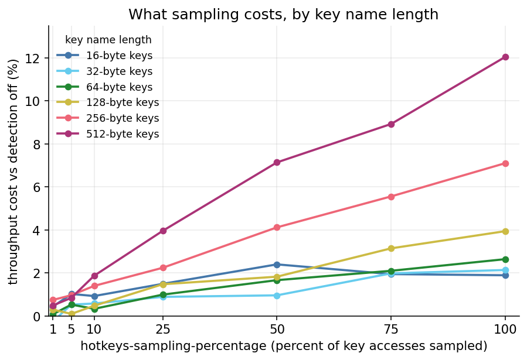
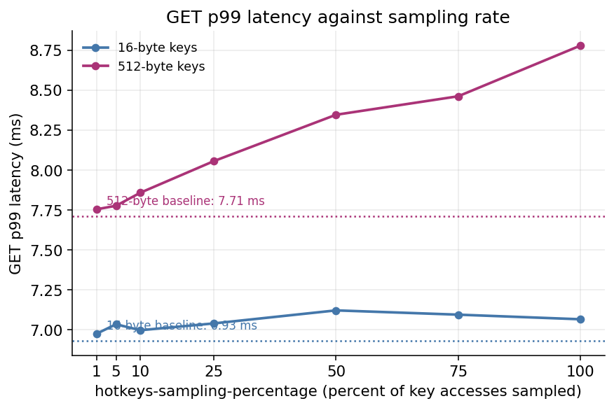

+++
title = "The Hot Key I Could Not Name"
date = 2026-09-14

description = "One server at 98% CPU, its neighbours bored, and every dashboard insisting nothing was wrong. Finding the key took hours. The tool that would have taken minutes is now in Valkey, and this is what it costs to run."
authors = ["alonare"]
[taxonomies]
blog_type = ["Technical Deep Dive"]

[extra]
featured = false
featured_image = "/assets/media/featured/random-03.webp"
+++

The alert is never *"`product:8fd21a` is taking 48,000 requests per second."*

Instead you get one server pinned at 98% CPU while its neighbours coast at 30% — and because the dashboards average across all of them, the graph everyone watches insists nothing is wrong.

So you add capacity, and nothing improves, which is the moment the diagnosis arrives.
A key lives in one slot and a slot lives on one shard, so no number of new shards can split a single key.
Scaling up buys headroom rather than a fix, and in standalone mode there is nowhere to spread the load at all.
By now you are certain you have a hot key; you just cannot name it, and three hours of an incident go into that gap.

*(A composite rather than one night's postmortem, but a shape I have seen more than once.)*

## Why hot keys are hard to find

The frustrating part is that Valkey already tells you plenty about your workload — just not this.

My first instinct was `valkey-cli --hotkeys`.
Its real problem is not precision, it is waiting: the answer is a full keyspace walk calling [`OBJECT FREQ`](https://valkey.io/commands/object-freq/) on every key, and on a large cluster you are watching an incident burn while that walk runs.

You can shorten the walk instead of abandoning it.
[`CLUSTER SLOT-STATS`](https://valkey.io/commands/cluster-slot-stats/) points at the hot slot first, so only that slot needs scanning — and slot statistics are the right tool in their own right for judging whether data is unevenly distributed and whether resharding will help.
But a single slot can hold a great many keys, so you may still be running `OBJECT FREQ` across all of them, and still waiting.

Two smaller catches sit on top of that.
The walk reads the least-frequently-used (LFU) counters, so it needs an `*lfu` `maxmemory-policy` to report anything at all.
And those counters measure long-run popularity with decay, which is the right input for eviction decisions and a different question from what is taking traffic *right now*.

[`MONITOR`](https://valkey.io/commands/monitor/) had that truth in real time, but it streams every command to a client, and the documentation measures a single `MONITOR` client cutting throughput by more than 50% [^4].
A statistically meaningful sample means leaving it running on the node I was trying to rescue, while grepping a firehose for a key I could not name.

Client-side sampling would have nailed it had every client already been instrumented; instrumenting them mid-incident is a second incident rather than a plan.
And every one of these except `MONITOR` shares a blind spot: a key that does not exist leaves nothing to scan, so a client hammering a missing key is invisible to anything inspecting stored data.

I found the key in the end by correlating that hot slot against a deploy from earlier in the day, which had changed a cache key template.
It worked because somebody remembered the deploy, and that is luck wearing a method's clothes.

## Balancing memory efficiency with accuracy

Afterwards, what stood out was how much smaller the question was than the traffic behind it.
That node served around 200,000 requests per second across millions of keys, and all I wanted was a list of ten — so what was needed was a compact list of the heavy hitters, kept by the server and cheap enough to leave running *before* the next incident.

Exact counting is the obvious approach and the first to fail: a counter per key adds several bytes to every key you store, and across billions of keys that overhead dwarfs the question it answers.

The instinct to do this on the server was not new — the first proposal came from [li-benson](https://github.com/li-benson) in [#2965](https://github.com/valkey-io/valkey/pull/2965), using a Count-Min Sketch (CMS).
A CMS estimates how often a given key was seen and cannot rank on its own: ranking needs a companion structure and an admission rule, and in #2965 that rule was an absolute, operator-configured requests-per-second threshold — a knob with no right value across shards of different size.

There was a cost question too, since a CMS requires several hashes on the hot path.

Space-Saving, which is what shipped [^1], folds the ranking into one bounded structure instead.
Picture sixteen slots, each holding a key name, its database, a count, and an error bound.
On each observed access you increment the key if it holds a slot, take a free one if there is one, and otherwise displace the smallest-count slot, handing the new key that count plus one.
That is one hash on the hot path, not one per row.

That last step is the whole trick.
Because a new key inherits the score of the one it displaced, it arrives on probation rather than at zero: a genuinely hot key shrugs that off, while a key touched once lands in the weakest slot and is gone by the next arrival needing the room.
(This displacement happens inside the summary and is unrelated to keyspace eviction or `maxmemory` policy.)

The ranking therefore falls out of the algorithm rather than being bolted on beside it, and there is exactly one knob — worth stating plainly rather than calling the structure self-tuning.
That knob is `K`, the number of slots, and it sets both how long your list is and how tight: any key above `N/K` of the sampled traffic is guaranteed to be tracked, where `N` is the number of samples in the window.
More slots buy a longer list *and* a tighter bound, and each entry reports its own, so accuracy belongs to the entry rather than the structure.

In contrast with the alternatives considered, rates come from a window that completes and freezes rather than a running counter: cumulative counters never forget, letting yesterday's hot key outrank today's, and exponential decay would need a clock read on every sampled access plus a half-life to tune.

## What changes for you

Cheap enough to leave on is what changes the night: the answer is already waiting when you go looking.
You notice one server is hot, ask what it is busy with, and read it:

```text
127.0.0.1:6379> CONFIG SET hotkeys-top-k 16
OK
127.0.0.1:6379> HOTKEYS GET
1) 1) "key"
   2) "product:8fd21a"
   3) "db"
   4) (integer) 0
   5) "qps"
   6) (integer) 48200
```

Each entry names the key, the database it was accessed in, and its estimated rate in requests per second, sorted highest first [^3].
Tracking is per database, so the same key name in two databases occupies two slots and can appear twice, and detection is per-node, so you ask each node and combine the answers yourself.

`HOTKEYS` reports load whether or not the key exists: that afternoon's bad key template — a key that was never written — shows up here, where a keyspace walk could never find it.

Three parameters control it, all settable at runtime:

| Parameter | Default | Range | Meaning |
| --- | ---: | ---: | --- |
| `hotkeys-top-k` | 0 | 0–1000 | How many keys to track. Setting it to `0` disables tracking |
| `hotkeys-sampling-percentage` | 1 | 1–100 | Percentage of key accesses sampled |
| `hotkeys-window-seconds` | 1 | 1–300 | Length of the reporting window |

Read `INFO hotkeys` next to the list, because it tells you how much evidence is behind it:

```text
127.0.0.1:6379> INFO hotkeys
# Hotkeys
hotkeys_last_window_samples:211833
hotkeys_last_window_duration_ms:1022
```

That sample count is the `N` in the `N/K` bound: at 211,833 samples across 16 slots, anything above roughly 13,000 sampled accesses is guaranteed to be listed, so the top entries are trustworthy.
When the count is small — a quiet server, or low sampling over a short window — the guarantee weakens with it, and the ordering of the lower entries stops meaning much even though the list still comes back.

## Benchmarks

Elegant is not the same as affordable, and a server at 98% CPU is where you can least afford a heavy diagnostic — so I measured it.

| Property | Value |
| --- | --- |
| Instances | 2 × `c7g.16xlarge`, same availability zone, client and server on separate machines |
| Valkey | `unstable` at the commit that merged the feature [^1] |
| Dataset | 3,000,000 keys, 512-byte values |
| Workload | 20% `SET` / 80% `GET`, uniform random key selection, 800 connections |
| Disabled | TLS, replicas, cluster mode, I/O threads |
| Per run | 20s warm-up (excluded), then 60s measured |
| Repetitions | 5 per configuration, order reshuffled between repetitions |
| Total | 270 measured runs |

With detection off the impact on throughput is zero, since nothing on the access path runs. Every figure below is the reduction in total throughput against that baseline.

**Note:** Keys were drawn uniformly at random, so almost every sampled access displaces a slot and copies a key name — closer to a worst case for the algorithm than a typical workload.

### Throughput impact



| Key name length | 1% sampling | 10% | 50% | 100% |
|---|---:|---:|---:|---:|
| 16 B | +0.43% | +0.92% | +2.40% | +1.89% |
| 32 B | −0.25% | +0.57% | +0.96% | +2.13% |
| 64 B | +0.08% | +0.33% | +1.66% | +2.64% |
| 128 B | +0.29% | +0.47% | +1.82% | +3.94% |
| 256 B | +0.74% | +1.39% | +4.12% | +7.10% |
| 512 B | +0.49% | +1.87% | +7.14% | **+12.05%** |

The surprise is the spread between those lines.
Sampling rate alone does not set the impact — the length of your key *names* scales it, because the key copy on displacement gets more expensive the longer the name is.
At the 1% default the reduction stays below **0.75%** at every key size tested, inside the benchmark's own run-to-run variation.
Sample every access and it costs about 1.9% with 16-byte names, rising to around **12% at 512**.

**Note:** The 16-byte row is not monotonic, and the −0.25% at 32 B is not a speed-up. At short key names the whole effect is close to the run-to-run variation, which reached 2% for the 16-byte configuration. Read those two rows as "inside the noise" rather than as an ordering.

Tracking more keys, by contrast, is nearly free: at full sampling with 16-byte names, every `hotkeys-top-k` from 1 to 64 landed between 1.2% and 2.1%.
So widen the list rather than the sampling rate — it costs less and tightens the `N/K` bound at once.
Leaving detection on at the default costs less than the noise floor whatever your key names look like, while 100% sampling is affordable with short names and a deliberate trade at 256 bytes and above.

### Latency



Latency tells the same story from the other side, as it must when the bottleneck is one saturated thread — server CPU measured 1.00 core in all 270 runs, baseline included.
With 512-byte key names, `GET` p99 drifts from 7.71 ms to 8.78 ms as sampling goes from off to 100%; with 16-byte names it barely moves, 6.93 ms to 7.07 ms.
No cliff appears anywhere in that sweep, which is what makes the setting safe to raise on a server already in trouble.

## Known limitations

All of that describes one workload on one machine type, with the bias in a known direction: a skewed workload — where a hot key genuinely exists — should cost less, since hot keys hold their slots and most sampled accesses become a plain increment. I measured the uniform case.

The limits of the list itself are worth knowing before you lean on it at 3am.
`HOTKEYS` consumes only a few kilobytes regardless of keyspace size, holding one fixed summary of `hotkeys-top-k` entries per window — and that bound has consequences.
With no real heavy hitters you still get sixteen entries, because the slots always hold something, and their rates describe slot churn rather than your traffic.
The reply also gives a rate without the error bound behind it, which is why the sample count matters: check it before trusting the ordering.
Reads and writes share one summary today, so a write-hot and a read-hot key look identical, and aggregating across a cluster belongs in tooling above the server.

## Try it

None of this retires the tools I used that night: `MONITOR` is still right when you need every command, `CLUSTER SLOT-STATS` is still how you judge slot distribution and resharding, and the LFU counters are still the right input for eviction.
What changed is narrow, and it is the part that cost the hours: getting from *"one server is unhappy"* to *"this key is responsible"* no longer depends on somebody remembering a deploy.

To watch it work, enable it on a server you are curious about, point skewed traffic at it, then read the list:

```bash
valkey-cli CONFIG SET hotkeys-top-k 16
valkey-cli CONFIG SET hotkeys-sampling-percentage 100
# send skewed traffic, wait at least one window, then:
valkey-cli HOTKEYS GET
valkey-cli INFO hotkeys
```

If hot keys are a recurring shape of incident for you, the more useful step is to leave `hotkeys-top-k 16` on at the default sampling percentage, so the answer is waiting the next time one server runs hot.

Two of the limitations above are open work and both would make good first contributions: separating read-hot from write-hot keys, and exposing the per-entry error bound so an operator can see the confidence rather than infer it.
To pick one up — or if the answer you get is not the one you needed — [open an issue](https://github.com/valkey-io/valkey/issues) with your version and configuration.
Knowing which key is hot is only the first question, and I would like to know what you ask next.

## References

[^1]: [PR #3708 — Server-side hot key detection](https://github.com/valkey-io/valkey/pull/3708)
[^2]: [PR #2965 — The earlier Count-Min Sketch proposal](https://github.com/valkey-io/valkey/pull/2965)
[^3]: [`HOTKEYS GET` command reference](https://valkey.io/commands/hotkeys-get/)
[^4]: [`MONITOR` command reference — cost of running MONITOR](https://valkey.io/commands/monitor/)
