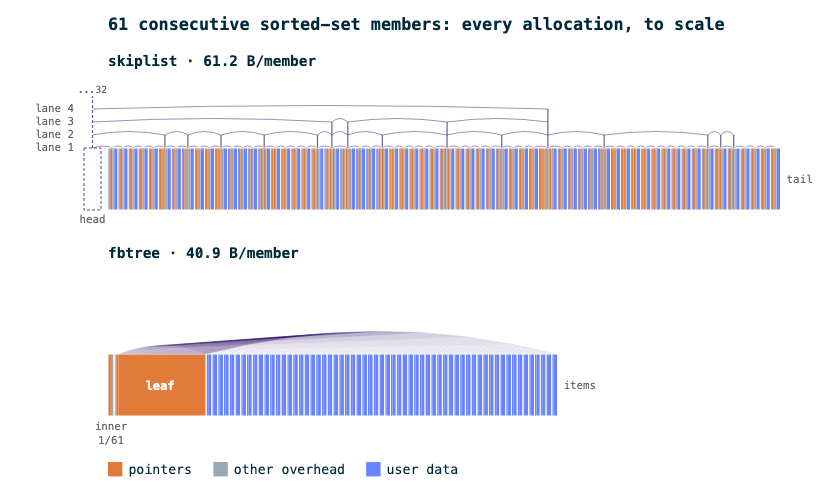
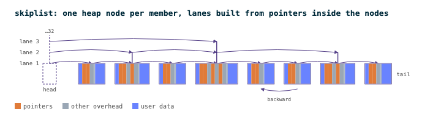
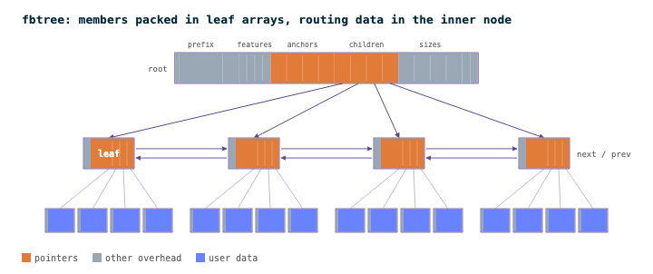
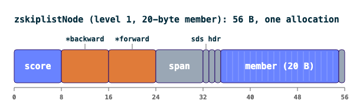
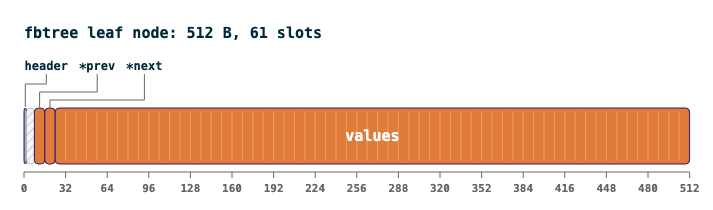
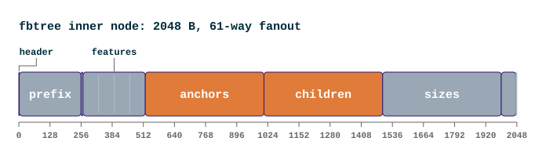

+++
title = "From Skiplists to B+ Trees: Making Valkey Sorted Sets More Memory Efficient"
date = 2026-09-16
description = "How Valkey 9.2 replaces the skiplist used by large sorted sets with a cache-friendly B+ tree, reducing memory overhead while improving several ordered-set operations." 
authors =  ["dragosandriciuc","rainvalentine"]
[taxonomies]
blog_type = ["Technical Deep Dive"]
+++

A [sorted set](https://valkey.io/topics/sorted-sets/) can spend more memory describing how its elements are ordered than storing the elements themselves.

In Valkey 9.2, however, that changes: the skiplist is replaced by a high-fanout B+ tree variant called **fbtree**.

fbtree combines the high fanout and contiguous storage of a conventional B+ tree with several optimizations designed for Valkey's workload and memory allocator, including feature-based lookups, SIMD searches, linked leaves, and fast paths for sequential inserts and pops.

Let's take a look at why this change happened, how it works, and why it's important for memory optimization moving forward.
A benchmarking example is also provided, to get a clearer view of the amount saved if you update to Valkey 9.2.

## Why replace the skiplist?

Large sorted sets that exceed the [listpack threshold](https://valkey.io/blog/secret-life-of-data/) are backed by a skiplist paired with a hashtable (smaller sorted sets use a compact listpack representation that stores elements sequentially in contiguous memory).
The hashtable gives O(1) lookups by member, while the skiplist gives O(log n) ordered lookups by rank or score.
That pairing has worked well for years, but the skiplist carries a hidden cost that is often overlooked.
It stores exactly one element per node, scattered across memory as separate allocations connected by pointers.

That's not a Valkey-specific problem.
Modern CPUs use a hierarchy of hardware caches (L1, L2, and L3) to keep frequently accessed data close to the processor.
These caches are much smaller and faster than main memory (RAM), so when the CPU cannot find the data it needs in its cache, it must fetch it from a slower level of the memory hierarchy.
A 2025 study comparing fully concurrent in-memory index implementations found that, on its tested workloads, traditional skiplists experienced roughly 2.4–4.8× more cache misses than a comparable B-tree, with 2–8× lower throughput [^1].

**Note:** These figures come from the study's benchmark environment and should not be interpreted as measurements of Valkey's skiplist.

The mechanical reason is straightforward: a modern CPU can fetch several adjacent cache lines efficiently when the data is laid out contiguously, thanks in part to the way memory is accessed and to hardware prefetching [^5].
A B+ tree node that spans a few cache lines can therefore be read efficiently as the CPU scans its contents.
A skiplist has no such luck: each node is a separate allocation, potentially scattered wherever the heap happened to place it, so following the structure can require repeatedly fetching data from unrelated memory locations.

Valkey's skiplist pays for this in raw memory too.
Every node carries a backward pointer (8B), plus an expected 1.33 levels of forward pointers and span values.
Each level costs 8B for the pointer plus 8B for the span value, giving around 29B of pointer and span overhead per node.
Add the 8B score, and the total reaches roughly 37B per node before accounting for the member string [^2].

There's a cleaner way to think about that 25%-per-level rule: it gives the skiplist an effective branching factor of about 4.
A B+ tree with a fanout of 61 (each node can hold up to 61 entries or child pointers) searches a much larger portion of the dataset at each level.
Both structures retain O(log n) search complexity, but the B+ tree has substantially fewer levels to traverse and therefore fewer opportunities for expensive memory fetches.

This also isn't the first time sorted set memory has gotten smaller.
An earlier release folded Valkey's `dict` into the newer `hashtable` implementation, reducing the overhead of the hash table used alongside the ordered index.
Another optimization embedded the member string directly into the skiplist node, eliminating an 8B pointer per item.
The B+ tree change builds on these earlier improvements, further reducing the memory overhead of the ordered index rather than replacing those savings [^3].

## What replaced it: fbtree

fbtree, short for FB+ Tree or Feature B+ Tree, has inner nodes that store a small “feature” for each child.

Because the anchors often share a common prefix, fbtree stores that shared prefix separately and uses the four feature bytes to distinguish the children.
The implementation can then compare those features in parallel using SIMD, often identifying the correct child before fetching the child node itself.
If the features uniquely identify a child, the search can descend immediately; otherwise, they still narrow the range that needs a full binary search.

Structurally, the tree uses a 61-way fanout, with leaf and inner nodes sized to fit jemalloc allocation classes without wasting space.

A 512-byte leaf can hold up to 61 values, packing many sorted set members into a single allocation instead of giving every member its own node.
Leaf nodes (which hold the actual scored elements) are linked together in a doubly-linked list, so range operations like `ZRANGE` can walk forward without climbing back up the tree at every step.
Several targeted optimizations round it out, including a fast path for pushing and popping at either end of the set.
This preserves the O(1) behavior that the skiplist naturally provides for end operations, allowing commands such as `ZPOPMIN` to maintain parity rather than regress to O(log n).
fbtree also provides an efficient way to delete a contiguous range of elements without rebuilding the surrounding structure.

The payoff shows up in how the CPU reads it.
A 512-byte leaf spans eight typical 64-byte cache lines, but those lines are adjacent.
Hardware prefetching can therefore bring much of the node into cache as the CPU scans it.
The skiplist has the opposite access pattern: each node is a separate allocation, so following the structure means chasing pointers to unrelated memory locations. Same O(log n) complexity, much smaller constant factor.

Another change happens at the leaf level.
Instead of storing the score and member separately, fbtree stores them together as a single packed value: the normalized 8-byte score followed by the member bytes.
This keeps the data needed for comparisons together and removes another level of pointer indirection.

## What actually changed for you

**Functionally, nothing changes.**

The change is internal: `ZSET` commands and their behavior remain unchanged.
The one visible difference is that `OBJECT ENCODING` returns `btree` instead of `skiplist` for a large sorted set.
If you have monitoring, tests, or tooling that checks for the literal string `skiplist`, that's one place to update.
Small sorted sets under the listpack threshold are unaffected either way, since they never used the skiplist encoding to begin with.

## Benchmarks

### Memory efficiency

The fbtree change is the latest step in a series of memory-efficiency improvements to sorted sets in Valkey.
Since Valkey 7, these changes have progressively reduced the memory overhead of sorted sets by nearly half.

The transition from `dict` to `hashtable`, embedding the member string into the skiplist node, and now replacing the skiplist with fbtree each contribute to that reduction.

Inserting 5 million 20-byte members sequentially reduced per-member memory overhead, excluding the member data itself, from 50.3B to 28.5B, a **43% reduction**.
The same 5 million members inserted in random order reduced per-member overhead from 50.3B to 32.0B, a **36% reduction**.

The smaller reduction comes from random insertion leaving more partially filled nodes than sequential insertion.

### Command performance

The benchmarks below are from the [merged implementation](https://github.com/valkey-io/valkey/pull/4359).
They were run on a Graviton3 c7g.metal system with 64 cores, nine I/O threads, a pipeline depth of 10, and a 3-million-member sorted set.
Each test was repeated five times; the reported confidence intervals were ≤2% for all commands except `ZRANDMEMBER`.

The same underlying design changes also improve throughput for several sorted set operations:

**Note:** `ZSCORE` and `ZRANDMEMBER` barely move because they use the companion hashtable rather than the ordered index.

| Command | Throughput improvement |
|---|---:|
| `ZADD` | +105% |
| `ZREM` | +76% |
| `ZCOUNT` | +27% |
| `ZRANK` | +19% |
| `ZRANGE` | +6% |
| `ZRANDMEMBER` | +2% |
| `ZSCORE` | +2% |
| `ZRANGEBYSCORE` | +1% |
| `ZPOPMIN` | ~0% |

The pattern makes sense once you look at what each command actually does: `ZADD` and `ZREM` reposition elements in the tree, so they benefit most directly from fbtree's shallower structure and fewer pointer updates.
Range operations see smaller gains because once the index traversal becomes cheap, producing and returning the requested elements becomes a larger part of the total cost.

## How the migration was validated

Replacing a core data structure in a mature database is less about implementing the new structure than proving that it behaves exactly like the old one.

An OrderedIndex interface was first introduced between `ZSET` operations and the underlying data structure. The existing behavior was then captured in a shared test suite, allowing the skiplist and fbtree implementations to be tested against the same contract.

[PR #3840](https://github.com/valkey-io/valkey/pull/3840) introduced this abstraction and migrated the `ZSET` call sites before the fbtree implementation replaced the skiplist.

The final implementation was then validated with unit tests, integration tests, property-based and fuzz testing, and full-server benchmarks, 302 new unit tests plus 21 new integration tests covering the new encoding [^4].

## Known limitations

One gap worth knowing about if you run delete-heavy sorted set workloads: fbtree doesn't yet merge or rebalance nodes on delete.
If your workload adds and removes elements at similar rates over a long period, leaf nodes can end up sparse, which is technically correct, but no longer packed as tightly as a fresh insert would be.

Background compaction is planned as a follow-up.
If you're running a workload with heavy churn, it's worth watching `MEMORY USAGE` over time rather than assuming the benchmarks above hold indefinitely.

## Test in Valkey 9.2

The important takeaway is simple: **the commands didn't change**, but the cost of keeping them fast did.

The goal wasn't simply to make the data structure faster in isolation: the implementation was repeatedly benchmarked against the existing skiplist through the full Valkey server, with optimizations added until fbtree matched or exceeded the skiplist across the tested sorted set commands.

If large sorted sets are a significant part of your Valkey workload, test Valkey 9.2 against your real workload, particularly if you're dominated by `ZADD`, `ZREM`, `ZRANK`, or `ZCOUNT`.

## References

[^1]: [Bridging Cache-Friendliness and Concurrency: A Locality-Optimized In-Memory B-Skiplist](https://arxiv.org/abs/2507.21492)
[^2]: [Issue #3166](https://github.com/valkey-io/valkey/issues/3166)
[^3]: [A new hash table: Technical Deep Dive](https://valkey.io/blog/new-hash-table/)
[^4]: [PR #4359](https://github.com/valkey-io/valkey/pull/4359)
[^5]: [What Every Programmer Should Know About Memory](https://cgvr.cs.uni-bremen.de/teaching/mpar_literatur/What%20Every%20Programmer%20Should%20Know%20About%20Memory%20-%20Ulrich%20Drepper,%202007.pdf)
