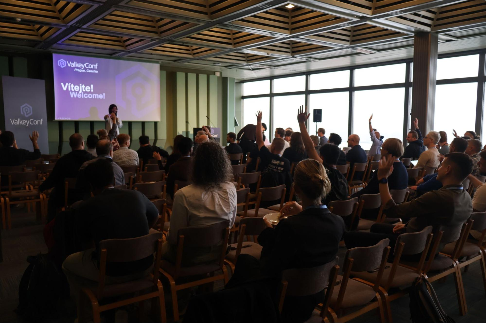
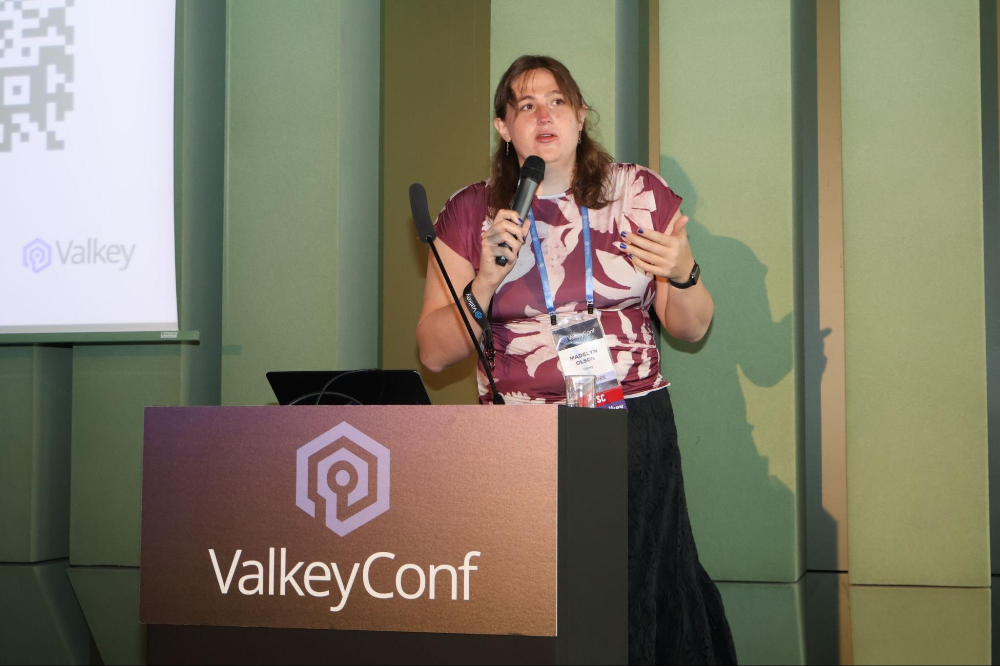
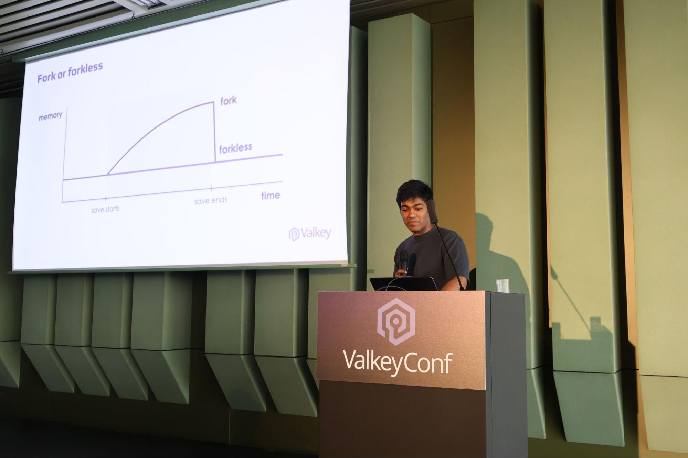
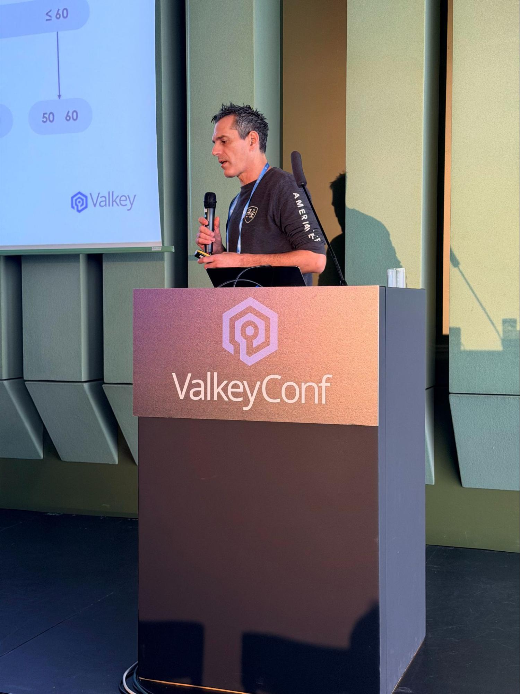
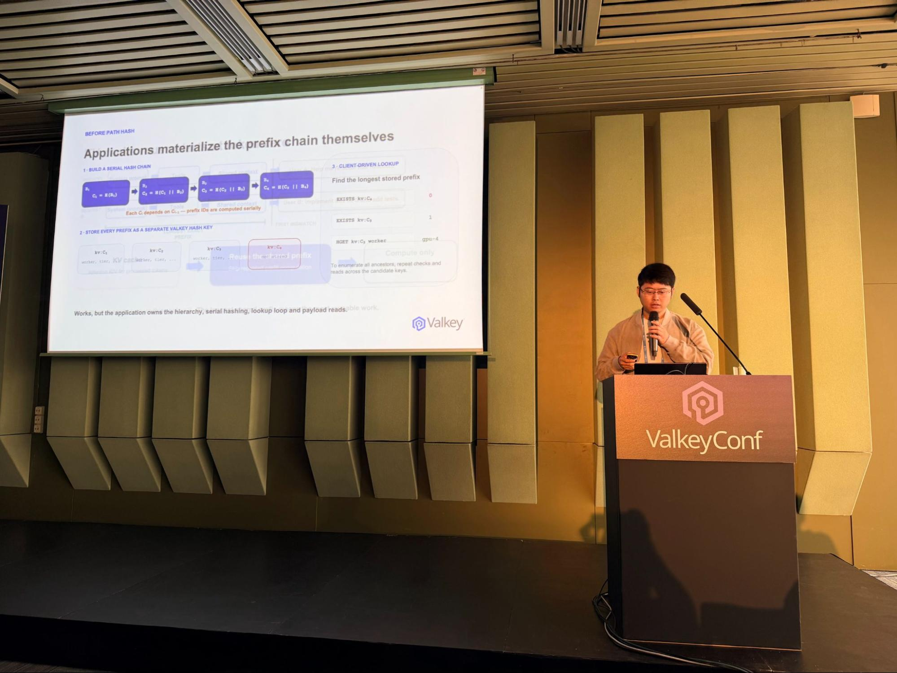
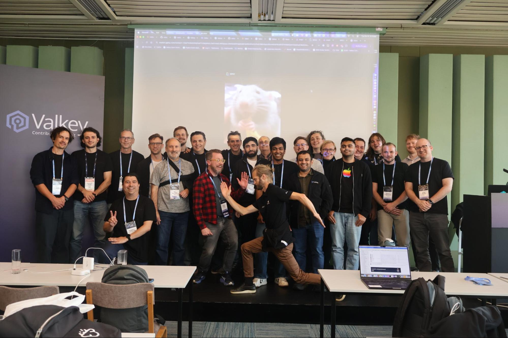

+++
title = "ValkeyConf 2026: Nobody Owns Valkey. Apparently, That’s Working."
date = 2026-10-13
description = "ValkeyConf 2026 brought the community to Prague to explore Valkey 9.2, performance improvements, AI infrastructure, and open governance."
authors = ["crystalpham"]

[taxonomies]
blog_type = ["Community Highlight"]

[extra]
featured = true
featured_image = "/assets/media/featured/banner.png"
+++

<strong>TL;DR</strong>

ValkeyConf 2026 brought the community to Prague for a look at Valkey 9.2, from replication and memory improvements to a new data type for AI infrastructure. The bigger story was how a Linux Foundation-hosted project with no single vendor in charge is managing to ship faster without losing the open governance that makes it possible.

## Valkey Is Bigger Than Its Database Now

[ValkeyConf](https://events.linuxfoundation.org/valkeyconf/) opened with [Masataka Kubo](https://www.linkedin.com/in/mas-kubo/), Valkey contributor and a member of [ValkeyConf’s program committee](https://events.linuxfoundation.org/valkeyconf/program/program-committee/), before the ***"What's New in Valkey"*** keynote brought together Valkey maintainers and Technical Steering Committee (TSC) members [Madelyn Olson](https://www.linkedin.com/in/madelyn-olson-valkey/), [Ran Shidlansik](https://www.linkedin.com/in/ran-shidlansik-b83b1011/), and [Zhao Zhao](https://github.com/soloestoy), alongside Valkey committer [Sarthak Aggarwal](https://www.linkedin.com/in/sarthakaggarwal97/).

Madelyn started with what is happening beyond the core database. The Valkey Operator is maturing for Kubernetes deployments, including zonal awareness and atomic slot migration. [Valkey Search 1.2](https://valkey.io/blog/valkey-search-1_2/) now supports full-text and hybrid search alongside vector similarity, while [Valkey Admin 1.0](https://valkey.io/blog/introducing-valkey-admin-1-0-visual-cluster-management-for-valkey/) brings cluster visibility, troubleshooting, and key management into one interface. GLIDE continues adding language support and capabilities such as client-side caching.

Together, these tools and capabilities are making Valkey easier to build with, manage, and scale without developers having to piece everything together themselves. Madelyn also highlighted Valkey's most active quarter for contributions yet, with AI-assisted development accelerating the pace of new code. The catch? Someone still has to review it all which we’ll come back to later.

## Why Send Bytes You Don't Need?
Sarthak Aggarwal focused on what happens when Valkey has to move data between instances, particularly across regions. Compressing individual values has limited benefits when the values are small or contain too little repetition. Valkey 9.2's streaming compression works across larger data streams instead, improving compression for replication and snapshots.

In the keynote, Sarthak showed workloads sending roughly 50–60% fewer bytes, with support for codecs including LZ4 and ZSTD. Less data moving over the network can mean faster transfers and lower cross-region costs, without asking applications to change how they use Valkey. The work is documented in [GitHub issue(#3195)](https://github.com/valkey-io/valkey/issues/3195).

It's not the kind of change most developers will notice in a command. It is the kind their infrastructure bill might notice.

## Skiplists Had a Good 15-Year Run

Ran Shidlansik turned to sorted sets, which have relied on skiplists for roughly fifteen years. Skiplists are useful, but their pointers and allocations become expensive at scale. Valkey 9.2 reworks larger sorted sets around optimized B+ trees with tightly packed leaves, improving memory locality and reducing overhead. The keynote showed substantial memory savings and up to roughly 2× faster mutations in certain workloads. The details, including 512-byte leaves, are in [GitHub issue(#3166)](https://github.com/valkey-io/valkey/issues/3166).

Ran also covered work that becomes important when production is not cooperating: replication throttling when replicas fall behind, reserved connections for administrators, priority handling for cluster traffic, and hot-key observability. ACL roles, conditional transactions, and smaller memory footprints for hashes also made the list. 

None of these features individually reinvent the database, but together they make it less costly and less frustrating to operate.

## AI Has a Prefix Problem. Valkey Has Path Hash.

Zhao Zhao introduced Path Hash, a new data type for hierarchical lookups. Its immediate use case is KV caching for LLM inference, where requests sharing the same token prefix can reuse previously computed attention state. Finding the longest matching cached prefix previously meant applications had to coordinate multiple keys, chained hashes, and lookups themselves.

Path Hash brings prefix-aware indexing into Valkey. The database can find matching paths while the large KV tensors stay in GPU or host memory; Valkey holds the index, not the tensors. The implementation is in [GitHub PR(#4506)](https://github.com/valkey-io/valkey/pull/4506). And while AI created the immediate demand, the same structure can serve IP prefixes, file paths, and other hierarchical data.

That is more interesting than adding a feature useful only to one kind of AI application.

## Nobody Owns Valkey. That's by Design.

[Valkey was forked from Redis in 2024]((https://www.linuxfoundation.org/press/linux-foundation-launches-open-source-valkey-community)). What started as an effort to preserve a permissively licensed, open source alternative became a project hosted by The Linux Foundation, giving Valkey a neutral home where no single company controls its future. But keeping the code open is only part of the equation. The harder question is how you actually build software when no single organization gets the final say.

That was the focus of [Jacob Murphy](https://www.linkedin.com/in/jacob-murphy-801078127/)'s keynote, ***"Evolving Valkey Together: Building Fast Without Central Control."*** As a Valkey maintainer and TSC member, Jacob explained how the project makes decisions and why decentralization is worth the extra coordination.

He compared governance to a distributed system. Centralized decision-making is faster because fewer people need to agree, but it also creates a single point of failure. Distributed governance takes more coordination, yet allows Valkey to keep moving even if one company changes its priorities or business strategy.

Of course, consensus has its own performance problems. The Valkey community addresses them through weekly TSC meetings, a regular release schedule, and a faster approval process for smaller decisions. Subprojects like Valkey Search and the Kubernetes Operator also manage much of their own development instead of routing every decision through the core TSC. The rules are documented in Valkey's [governance framework](https://github.com/valkey-io/valkey/blob/unstable/GOVERNANCE.md).

Jacob pointed to atomic slot migration and Valkey Search as examples of how competing technical approaches from different organizations ultimately produced stronger implementations. The point isn't that decentralized governance makes every decision faster. It's that no single company gets to determine the outcome, and the resulting software can benefit from more perspectives.

That approach has helped Valkey grow, but AI-assisted development is now testing how well it scales.

## AI Can Open More PRs. Who's Reviewing Them?

Jacob said Valkey saw roughly 2.2× more PRs opened, about 3× more lines of code in those PRs, and nearly double the number of unique contributors in 2026. That is a lot of new capacity for writing code, but maintainer review time does not scale automatically.

The project is using AI-assisted review to catch routine problems before humans get involved and AI tools to help backport fixes across release branches. More responsibility is also going to committers and other reviewers. The idea is to give maintainers time for the questions that take judgment: whether a feature belongs in Valkey, whether it preserves compatibility, and whether the project wants to maintain it for years.

More code is not automatically better software. It’s making sure the code is worth shipping. 

## The Next Chapter Isn't Decided on Stage

The next day at the [Valkey Contributor Summit](https://events.linuxfoundation.org/valkey-contributor-summit/), maintainers and contributors turned to what's next: supporting AI workloads, deciding which features belong in core versus modules, and keeping development moving as contributions grow.

More contributions, more ideas, and more code to review. A good problem to have, but one that takes a community to solve. Valkey's next chapter is still being written, and you can be part of it.

## Made it this far and have opinions? 

Great. Valkey is built by the community and there’s always room for someone ready to turn those opinions into contributions. So, don’t keep it cached. Bring it to the [Valkey Community](https://valkey.io/community/).