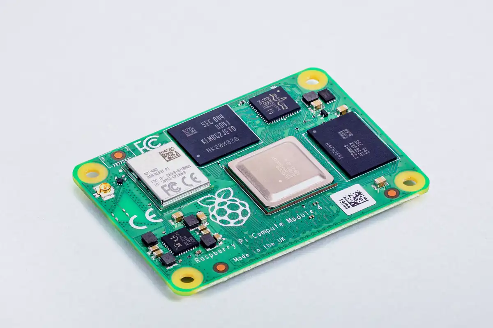
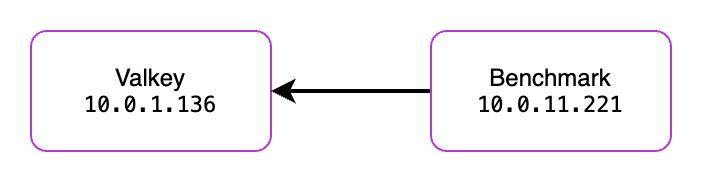
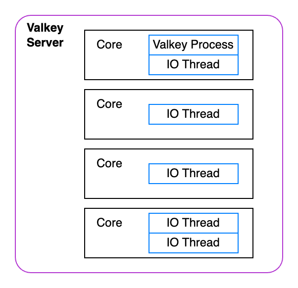
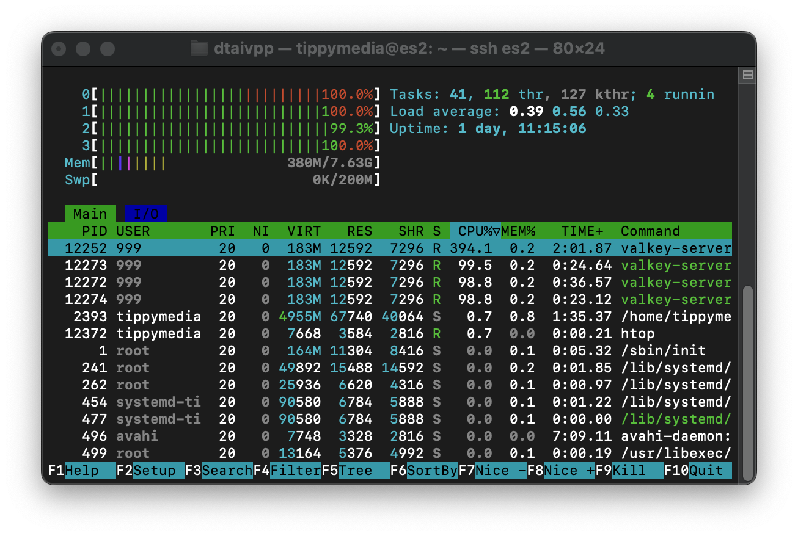
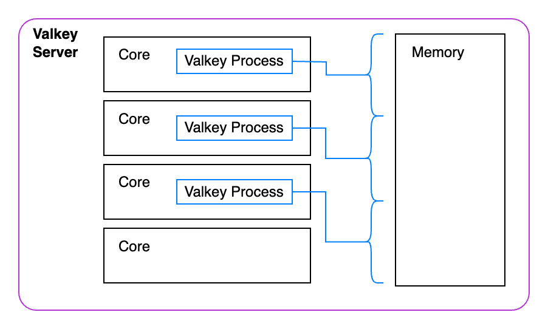

+++
title = "Pushing the limits of Valkey on a Raspberry Pi"
description = "While most people won't go to production on a Raspberry Pi, we'll cover how to thoroughly performance test Valkey to understand how it works in production."
date= 2024-11-21 01:01:01
authors= ["dtaivpp"]
+++

While doing extensive performance testing on a Raspberry Pi is silly, it's made me realize the complexity of performance testing. For example, in some of the tests below I ended up managing to use all of the resources of the Raspberry Pi and achieved terrible performance. Every application has different performance characteristics so we'll walk through what factors to consider when it comes to deploying Valkey. 

## The test environment



For hardware we are going to be using a Raspberry Pi [Compute Module 4 (CM4)](https://www.raspberrypi.com/products/compute-module-4/?variant=raspberry-pi-cm4001000). It's a single board computer (SBC) that comes with a tiny 1.5Ghz 4-core Broadcomm CPU and 8GB of system memory. This is hardly the first device someone would pick when deciding on a production system. Using the CM4 makes it easy to showcase how to optimize Valkey depending on your different hardware constraints.

Our operating system will be a 64-bit Debian based operating system (OS) called [Rasbian](https://www.raspbian.org/). This distribution is specifically modified to perform well on the CM4. Valkey will run in a docker container orchestrated with docker compose. I like deploying in containers as it simplifies operations. If you'd like to follow along here is [a guide for installing Docker](https://docs.docker.com/engine/install/debian/). Make sure to continue to the [second page of the installation process](https://docs.docker.com/engine/install/linux-postinstall/) as well. It's easy to miss and skipping it could make it harder to follow along. 

We'll be using two CM4s for testing. The first will host Valkey and the second will host the benchmarking software. This setup probably better reflects how most people will run in production. Benchmarking is being done with redis-benchmark because it can be installed with `sudo apt install redis-tools`. Valkey does have its own benchmark utility that comes installed with Valkey. To use valkey-benchmark instead you would need to install Valkey on the benchmarking server or spin up a container and connect into it. Functionally, they both operate nearly the same as of the writing of this article. 



## Setting up our environment

Below is a straightforward docker compose file that will start a single Valkey container. This container will bind Valkey to port 6379 on the host device. This means that is exposed to anyone with access to your network! This is important for us to access it from the benchmarking server. 

```yaml
# valkey.yaml
services:
  valkey-1:
    image: valkey/valkey:latest
    hostname: valkey1
    command: valkey-server --port 6379 --requirepass ${VALKEY_PASSWORD} --io-threads ${IO_THREADS} --save ""
    volumes:
      - ./data:/data
    network_mode: host

volumes:
  data:
    driver: local
```

Since we are exposing this to our internal network we will create a password for our default user. I used `head -16 /dev/urandom | openssl sha1` to generate a random password. Because of how fast Valkey can process requests a brute force attack could try hundreds of thousands of passwords per second. After generating that password, I put it in a `.env` file in the same directory as our docker compose. 

```bash
#.env
VALKEY_PASSWORD=e41fb9818502071d592b36b99f63003019861dad
NODE_IP=<VALKEY SERVER IP>
IO_THREADS=1
```

Now by running `docker compose -f valkey.yaml up -d` Valkey server will start with password we set! 

## Baseline test

Now we are ready to do some baseline testing. We will log into the benchmarking server. If you haven't installed redis-benchmark yet you can do so with `sudo apt install redis-tools`.  

```bash
redis-benchmark -n 1000000 -t set,get -P 16 -q -a <PASSWORD FROM .env> --threads 5 -h 10.0.1.136
```

Test breakdown:
- `-n` - this will run 1,000,000 operations using the commands in -t
- `-t` - will run the set and get tests
- `-P` - this specifies that we would like the tests to use 16 pipelines (send 16 operations per request). 
- `-q` - silences the output to show only the final results
- `-a` - use the specified password
- `-h` - run the test against the specified host
- `--threads` - how many threads to generate test data from

Honestly, I was astonished by the first set of results I got. Sure, I expected Valkey to be fast but this speed from a single board computer?? ON A SINGLE THREAD?? It's amazing. 

```bash
redis-benchmark -n 1000000 -t set,get -P 16 -q -a e41fb9818502071d592b36b99f63003019861dad --threads 5 -h 10.0.1.136
SET: 173040.33 requests per second, p50=4.503 msec                    
GET: 307031.00 requests per second, p50=2.455 msec
```

Between the two tests we averaged 240,000 requests per second.  

## Raising the CPU clock speed

Since Valkey is a single threaded application, it makes sense that higher clock speeds would lead to more performance. I don't expect most people will overclock their servers in production. Different servers may be available with different CPU clock speeds. 

**Note:** Clock speeds generally are only comparable between CPU's with a similar architecture. For example, you could reasonably compare clock speeds between an 12th generation Intel i5 and a 12th generation Intel i7. If the 12th gen i7 had a max clock speed of 5Ghz that doesn't necessarily mean it will be slower than a AMD Ryzen 9 9900X clocked at 5.6Ghz. 

If you're following along on a Pi of your own I've outlined the steps to overclock your CM4 below. Otherwise you can skip to the results section below.

**Warning** Just a reminder overclocking your device can cause damage to your device. Please use caution and do your own research for settings that are safe. 

1. Open the below file
    - `sudo nano /boot/firmware/config.txt`
2. At the end of the file add this section below the `[all]` tag
    ```
    [all]
    over_voltage=8
    arm_freq=2200
    ```
3. Restart the Pi and log back in `sudo restart now`

We've just increased the speed of the Pi by 47% by raising the clock speed from 1.5Ghz to 2.2Ghz. Now lets re-run our test and see how things look!

```bash 
redis-benchmark -n 1000000 -t set,get -P 16 -q -a e41fb9818502071d592b36b99f63003019861dad --threads 5 -h 10.0.1.136
SET: 394368.41 requests per second, p50=1.223 msec                    
GET: 438058.53 requests per second, p50=1.135 msec 
```

We're up to 416,000 requests per second (reminder this is the average between the two operations). The mathmaticians out there might notice that this speed up is a lot more than the expected 47% increase. It's a 73% increase in requests per second. What's happening?!

## Adding IO Threading

With all these gains I was super excited to try the new [IO threading available](https://valkey.io/blog/unlock-one-million-rps/) in Valkey 8. First we will take down the previous running docker instance with `docker compose -f valkey.yaml down`. Then we will modify the `.env` file's `IO_THREADS` parameter to 5. 

```bash
#.env
VALKEY_PASSWORD=e41fb9818502071d592b36b99f63003019861dad
NODE_IP=<VALKEY SERVER IP>
IO_THREADS=5

```

Then we can `docker compose -f valkey.yaml up -d` to start it again. Remote into the benchmarking server to start the test and...?

```bash 
redis-benchmark -n 10000000 -t set,get -P 16 -q -a e41fb9818502071d592b36b99f63003019861dad --threads 5 -h 10.0.1.136
SET: 345494.75 requests per second, p50=0.911 msec                    
GET: 327858.09 requests per second, p50=0.879 msec  
```

Wait a second... These results are worse than the ones before? We went from 416k requests per second to 336k.... What's happening?



We have over-subscribed our CPU. This means we've created more worker threads than CPU cores. When a thread is under constant load it is competing with other threads on that core for resources. Not to mention, they are also competing with the Valkey process for resources. 

That's why [Valkey recommends](https://github.com/valkey-io/valkey/blob/a62d1f177b7888ec88035a0a1ce600fbc2280ce7/valkey.conf#L1337-L1341) setting the number of threads to be a value less than the number of cores you have. For our little 4 core server lets change the `IO_THREADS` parameter to be 2 threads in the `.env` file and try again.

```bash
redis-benchmark -n 10000000 -t set,get -P 16 -q -a e41fb9818502071d592b36b99f63003019861dad --threads 5 -h 10.0.1.136
SET: 609050.44 requests per second, p50=0.831 msec                    
GET: 521186.22 requests per second, p50=0.719 msec
```

Much better! Now we are seeing around 565,000 requests per second. Thats a 35% increase in performance across both metrics! Not to mention in the picture below you can see that we have 100% utilization across all of our CPU's which means there's no more room for improvement! 



Right? Well believe it or not we can squeeze even more performance out of our little CM4! 


Above is a representitive outline of what's happening on the server. The Valkey process has to take up valuble cycles managing the IO Threads. Not only that it has to perform a lot of work to manage all the memory assigned to it. That's a lot of work for a single process.

Now there is actually one more optimization we can use to make single threaded Valkey even faster. Valkey recently has done a substantial amount of work to support speculative execution. This work allows Valkey to predict which values will be needed from memory in future processing steps. This way Valkey server doesn't have to wait for memory access which is an order of magnitude slower than L1 caches. While I won't go through the details of how this works as there's already a [great blog that describes how to take advantage of these optimizations](https://valkey.io/blog/unlock-one-million-rps-part2/). Here are the results: 

```bash
redis-benchmark -n 10000000 -t set,get -P 16 -q -a e41fb9818502071d592b36b99f63003019861dad --threads 5 -h 10.0.1.136
SET: 632791.25 requests per second, p50=1.191 msec
GET: 888573.00 requests per second, p50=0.695 msec
```

While these results are better they are a bit confusing. After talking with some of Valkey's maintainers it seems there may be something different in the way that Rasbian is configured when it comes to memory writes. In their testing the `GET/SET` requests were nearly identical but in my testing so far the write speed seems to always be behind read speed. If you think you know why please reach out!

## Clustered Valkey



For our last step we are going to spin up a Valkey cluster. This cluster will have individual instances of Valkey running that each will be responsible for managing their own keys. This way each instance can execute operations in parallel much more easily.  

I am not going into detail with how the keyspaces work but [here is a good 101 guide](https://valkey.io/topics/cluster-tutorial/) for understanding clustering in Valkey. 

First we'll stop our previous Valkey container `docker compose -f valkey.yaml down`. Now we can create our docker compose file for the cluster. Because each of these are exposed on the host they will all need to be using different ports. Additionally, all of them need to be aware they are started in cluster mode so they can redirect requests to the appropriate instance. 

```yaml
# valkey-cluster.yaml
services:
  valkey-node-1:
    hostname: valkey1
    image: valkey/valkey:latest
    command: valkey-server --port 6379 --cluster-enabled yes --cluster-config-file nodes.conf --cluster-node-timeout 5000 --requirepass ${VALKEY_PASSWORD} --save ""
    volumes:
      - ./data1:/data
    network_mode: host
  valkey-node-2:
    hostname: valkey2
    image: valkey/valkey:latest
    command: valkey-server --port 6380 --cluster-enabled yes --cluster-config-file nodes.conf --cluster-node-timeout 5000 --requirepass ${VALKEY_PASSWORD} --save ""
    volumes:
      - ./data2:/data
    network_mode: host
  valkey-node-3:
    hostname: valkey3
    image: valkey/valkey:latest
    command: valkey-server --port 6381 --cluster-enabled yes --cluster-config-file nodes.conf --cluster-node-timeout 5000 --requirepass ${VALKEY_PASSWORD} --save ""
    volumes:
      - ./data3:/data
    network_mode: host

volumes:
  data1:
    driver: local
  data3:
    driver: local
  data2:
    driver: local
```
Run `docker compose -f valkey-cluster.yaml up -d` to start the cluster. There is one more step to get the cluster running. Find the name of one of your nodes with `docker ps --format '{{.Names}}'`. 

```bash
docker ps --format '{{.Names}}
kvtest-valkey-node-1-1
kvtest-valkey-node-3-1
kvtest-valkey-node-2-1
```

I'll use the first container to finish the cluster creation. Once the containers have started up we have to tell them the details they need to use for the cluster. Below I am using the IP of the host and the port configurations of all the containers to create the cluster. This is because these addresses need to be accessible from the benchmarking server. 

```bash
docker exec -it kvtest-valkey-node-1-1 valkey-cli --cluster create 10.0.1.136:6379 10.0.1.136:6380 10.0.1.136:6381 -a e41fb9818502071d592b36b99f63003019861dad
```

Now we can run our benchmark! We need to add the `--cluster` flag to our benchmarking command. Also, because this is so fast I ended up moving from 1 million requests to 10 million requests. That way we can make sure Valkey has time to fully utilize all it's resources. 

```bash
redis-benchmark -n 10000000 -t set,get -P 16 -q --threads 10 --cluster -a e41fb9818502071d592b36b99f63003019861dad --threads 5 -h 10.0.1.136 
Cluster has 3 master nodes:

Master 0: 219294612b44226fa32482871cf21025ff531875 10.0.1.136:6380
Master 1: e5d85b970551c27065f1552f5358f4add6114d98 10.0.1.136:6381
Master 2: 1faf3d0dd22e518eec11fd46c0de6ce18cd15cfe 10.0.1.136:6379

SET: 1122838.50 requests per second, p50=0.575 msec                     
GET: 1188071.75 requests per second, p50=0.511 msec  
```

**1,155,000 requests per second**. We've managed to double our requests per second. All this on a single board computer that's the size of a credit card. 

While this is far from what I would recommend for a production server these are the same steps I'd recommend to someone evaluating Valkey. It's important test with a single instance to start finding the optimal settings. Then you can begin to scale up your test by adding either more IO Threads or Valkey instances. 

Testing should mirror your production workload as best it can. This test is using synthetic data. That's why I'd recommend checking out the documentation to find what other settings you may need to test with. For example, we tested with the default settings of 50 client connections and 3 byte payloads. Your production workload may look different so explore all the settings! You may find that IO threading works better for your use case than I did in this case.

If you enjoyed this read make sure to check out my blog [TippyBits.com](https://tippybits.com) where I post content like this on a regular basis. Stay curious my friends!
